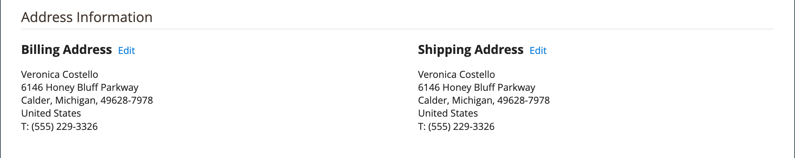
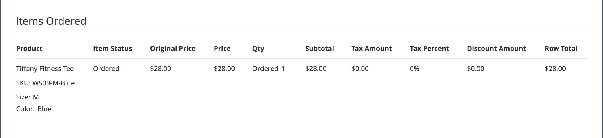

# Beställningsarbetsflöde och -bearbetning

När en kund gör en beställning skapas en försäljningsorder som en tillfällig post för transaktionen. I orderrutnätet har försäljningsorder till att börja med statusen &quot;Väntande&quot; och kan annulleras när som helst tills betalningen har bearbetats. När betalningen har bekräftats kan ordern faktureras och skickas.

**Steg 1: Beställ** - Utcheckningsprocessen börjar när kunden klickar **[!UICONTROL Go to Checkout]** på kundvagnssidan eller [omdirigering](reorders-allow.md) direkt från kundkontot.

**Steg 2: Väntande beställning** - Den initiala försäljningsorderstatusen är `Pending`. I det här läget har betalningen inte bearbetats och ordern kan fortfarande redigeras eller annulleras. Det här läget inträffar när betalningsmetoden har konfigurerats för auktoriseringsläge.

**Steg 3: Ta emot betalning** - Orderstatusen ändras till `Processing` när betalning tas emot eller auktoriseras. Beroende på betalningsmetoden kan du få ett meddelande när transaktionen har auktoriserats eller bearbetats. Det här läget inträffar automatiskt när betalningsmetoden är konfigurerad för inspelning eller försäljning av återgivning.

**Steg 4: Fakturaorder** - En order faktureras vanligtvis efter att betalningen har tagits emot. Betalningsmetoden avgör vilka faktureringsalternativ som behövs för ordern. När fakturan har skapats och skickats skickas en kopia till kunden. Om betalningsmetoden har konfigurerats med `capture` eller `intent sale` betalningsåtgärd, genereras en faktura automatiskt när betalningen auktoriseras och hämtas.

>[!NOTE]
>
>Fakturor skapas inte automatiskt för order som läggs med `Gift Card`, `Store Credit`, `Reward Points`eller andra offlinebetalningsmetoder.

**Steg 5: Bokför en enstaka leverans** - Orderstatusen ändras till `Complete` När leveransinformationen är klar bokförs leveransen och leveransen ställs in. Leveransbehovet uppfylls med en utskriven följesedel och leveransetikett eller med _Meddela Klar för hämtning_ är valt (leveransmetod i butik). Kunden får ett meddelande och paketet levereras. Om spårningsnummer används kan leveransen spåras från kundens konto.

>[!NOTE]
>
>Mer information om orderstatus och alternativ för konfiguration av betalningsmetoder finns i [Orderstatus](order-status.md) och [Betalningar](payments.md).

## Visa en order

1. På _Administratör_ sidebar, gå till **[!UICONTROL Sales]** > _[!UICONTROL Operations]_>**[!UICONTROL Orders]**.

1. Hitta ordningen i rutnätet.

1. I _[!UICONTROL Action]_kolumn, klicka **[!UICONTROL View]**.

1. Kontrollera orderstatus:

   - A `Pending` beställningen kan ändras, spärras, annulleras eller faktureras och skickas.

   - A `Processing` beställningen kan inte längre ändras eller annulleras, men fakturerings- och leveransadressen kan ändras.

   - A `Completed` beställningen kan sorteras om.

Kundens mejl kan redigeras när som helst i orderarbetsflödet genom att kunden redigeras. E-postmeddelandet kan inte redigeras om ordern har placerats av en gäst.

Den vänstra panelen för en öppen order ger åtkomst till olika typer av information som är relaterad till ordningen.

{width="700" zoomable="yes"}

## Bearbeta en order

När en kund gör en beställning skapas en försäljningsorder som en tillfällig post för transaktionen. Försäljningsordern har statusen `Pending` tills betalningen har tagits emot. När du är `Pending` status, kan order redigeras eller annulleras tills den tidpunkt då betalningen tas emot och en faktura genereras. Ett enkelt sätt att tänka på det är att beställningar blir fakturor och fakturor blir leveranser. Orderstödrastret visar alla order, oavsett var de finns i arbetsflödet. Om du vill veta hur du kan hjälpa kunder med en beställning kan du gå till [Uppdatera en order](order-update.md).

{width="700" zoomable="yes"}

Öppna en `Pending` beställa, klicka **[!UICONTROL Edit]** längst upp till höger.

>[!NOTE]
>
>Beställningar kan bara redigeras i `Pending` status. Knappen Redigera visas inte för order med en annan status eller för order som baseras på en [förhandlad offert](../b2b/quotes.md).

{width="600" zoomable="yes"}

Granska följande avsnitt i försäljningsordern med fältbeskrivningarna som referens.

### Beskrivningar av ordervyn

| Tabb | Beskrivning |
|--- |--- |
| [!UICONTROL Information] | Visa detaljerad information om order och konto, inklusive fakturerings- och leveransadresser, betalnings- och leveransmetoder, artikelorder, summor och noteringar. |
| [!UICONTROL Invoices] | Visar varje faktura som är associerad med ordern. |
| [!UICONTROL Credit Memos] | Visar varje kreditnota som är kopplad till ordern. |
| [!UICONTROL Shipments] | Visar varje försändelsepost som är associerad med ordern. |
| [!UICONTROL Comments History] | Visar alla anteckningar som är relaterade till ordern. |

{style="table-layout:auto"}

>[!NOTE]
>
>En administratör måste ha **[!UICONTROL Sales / Archive]** [behörigheter](../systems/permissions-user-roles.md) för deras rollomfång att se _Fakturor_, _Kreditnotor_ och _Leveranser_ ordningsflikar.

### Knappfält

| Knapp | Beskrivning |
|--- |--- |
| **[!UICONTROL Back]** | Återgår till sidan Beställningar utan att spara ändringarna. |
| **[!UICONTROL Cancel]** | Avbryter försäljningsordern. |
| **[!UICONTROL Send Email]** | Skickar ett e-postmeddelande om ordern till kunden. |
| **[!UICONTROL Hold]** / **[!UICONTROL Unhold]** | Ändrar försäljningsorderns status till `On Hold`. Om du vill spärra försäljningsordern väljer du **[!UICONTROL Unhold]**. |
| **[!UICONTROL Invoice]** | Skapar en faktura från försäljningsordern genom att konvertera ordern till en faktura. |
| **[!UICONTROL Ship]** | Skapar en försändelsepost för ordern. |
| **[!UICONTROL Notify Order is Ready for Pickup]** | Visas bara när en beställning placeras som en leverans i butik. Meddelar kunden att beställningen är klar för hämtning. |
| **[!UICONTROL Reorder]** | Skapar en försäljningsorder baserat på den aktuella ordern. |
| **[!UICONTROL Edit]** | Öppnar en väntande ordning i redigeringsläge. Knappen Redigera visas inte för order med statusen `Processing`eller order som baseras på förhandlade offerter. |

{style="table-layout:auto"}

### Avbryt en beställning

Du kan [avbryt](order-update.md) order som ännu inte fakturerats. A [kreditnota](credit-memos.md) måste utfärdas om en kund vill annullera en order efter att den har fakturerats (betalningen registreras).

Om en order är `Pending` eller `Processing` och betalningen inte är inhämtad eller helt inhämtad kan du [annullera ordern](#void-an-order) istället för att avbryta det.

Om du vill återställa en annullerad ordning klickar du på **[!UICONTROL Reorder]** och en ny order skapas med statusen `Pending`.

>[!NOTE]
>
>Om du avbryter en order skapas också en void, men om du annullerar en order utlöses ingen annullering.

### Annullera en order

Endast försäljningsorder som inte har fakturerats har statusen `Processing`och en [betalningsintegrationsinställning för `Authorize`](../configuration-reference/sales/payment-methods.md#payment-actions), kan [annullerad](order-update.md#void-a-processing-order). När du har annullerat en order kan du avbryta den.

### [!UICONTROL Order and Account Information]

{width="600" zoomable="yes"}

#### Beställningsinformation

| Fält | Beskrivning |
|--- |--- |
| [!UICONTROL Order Number] | Ordernumret visas högst upp i försäljningsordern, följt av en anteckning som anger om bekräftelsemeddelandet skickades. |
| [!UICONTROL Order Date] | Datum och tid då ordern lades. |
| [!UICONTROL Purchased From] | Anger webbplatsen, butiken och butiksvyn där beställningen placerades. |
| [!UICONTROL Placed from IP] | Anger IP-adressen till datorn som beställningen gjordes från. |
| [!UICONTROL Order Placed from Quote] |  (Tillgängligt med Adobe Commerce B2B) Visar [citat](../b2b/quotes.md) varifrån ordern genererades, om tillämpligt. Offertnamnet är länkat till offerten. |

{style="table-layout:auto"}

#### Kontoinformation

| Fält | Beskrivning |
|--- |--- |
| [!UICONTROL Customer Name] | Namnet på den kund eller köpare som lade ordern. Kundnamnet är kopplat till kundprofilen. |
| [!UICONTROL Email] | Kundens eller köparens e-postadress. E-postadressen är länkad för att öppna ett nytt e-postmeddelande. |
| [!UICONTROL Customer Group] | Namnet på den kundgrupp eller delade katalog som kunden är tilldelad till. |
| [!UICONTROL Company Name] |  (Tillgängligt för Adobe Commerce B2B) Namnet på det företag som köparen är associerad med och för vars räkning beställningen görs. Företagsnamnet är länkat till [företagsprofil](../b2b/account-companies.md). |

{style="table-layout:auto"}

### [!UICONTROL Address Information]

{width="600" zoomable="yes"}

| Fält | Beskrivning |
|--- |--- |
| [!UICONTROL Billing Address] | Namnet på den kund eller köpare som lade ordern, följt av faktureringsadressen, telefonnumret och [moms](vat.md), om tillämpligt. Telefonnumret är kopplat till automatisk uppringning på en mobil enhet. |
| [!UICONTROL Shipping Address] | Namnet på den person som ordern ska skickas till, följt av leveransadress och telefonnummer. Telefonnumret är kopplat till automatisk uppringning på en mobil enhet. |

{style="table-layout:auto"}

### [!UICONTROL Payment & Shipping Method]

{width="600" zoomable="yes"}

| Fält | Beskrivning |
|--- |--- |
| [!UICONTROL Payment Information] | Betalningsmetoden som ska användas för ordern och inköpsordernumret, om tillämpligt, följt av valutan som användes för att placera ordern. Om ordern debiteras företagskrediter med [Betalning à conto](../b2b/enable-basic-features.md#configure-payment-on-account), det belopp som debiteras kontot anges. |
| [!UICONTROL Shipping & Handling Information] | Den leveransmetod som ska användas och eventuella hanteringsavgifter som är tillämpliga. |

{style="table-layout:auto"}

### Granska beställda artiklar

{width="600" zoomable="yes"}

I **[!UICONTROL Order Total]** gör du följande:

1. Ange en **[!UICONTROL Comment]** som ska ingå i ordern.

1. Om du vill skicka kommentaren via e-post till kunden väljer du **[!UICONTROL Notify Customer by Email]** kryssrutan.

1. Om du vill att kommentaren ska visas på kundkontot väljer du **[!UICONTROL Visible on Storefront]** kryssrutan.

   {width="600" zoomable="yes"}

1. Om du är redo att fakturera ordern klickar du **[!UICONTROL Invoice]** och följ instruktionerna för att [skapa en faktura](invoices.md#create-an-invoice).

#### [!UICONTROL Items Ordered]

| Fält | Beskrivning |
|--- |--- |
| [!UICONTROL Product] | Produktnamn, SKU och alternativ om tillämpligt. |
| [!UICONTROL Item Status] | Anger artikelns status. Värde: `Ordered` |
| [!UICONTROL Original Price] | Artikelns ursprungliga katalogpris före rabatt. |
| [!UICONTROL Price] | Artikelns inköpspris. Detta värde återspeglar eventuell rabatt som tillämpas på objektet från den delade katalogen, om tillämpligt. |
| [!UICONTROL Qty] | Beställd kvantitet. |
| [!UICONTROL Subtotal] | Delsumman är inköpspriset multiplicerat med kvantiteten. |
| [!UICONTROL Tax Amount] | Momsbeloppet som gäller för artikeln som ett decimalvärde. |
| [!UICONTROL Tax Percent] | Procentandel av moms som används för den här artikeln som en procentandel. |
| [!UICONTROL Discount Amount] | Rabatten som gäller för den här artikeln. Rabattvärdet är noll om ordern baseras på en offert. |
| [!UICONTROL Row Total] | Radartikelsumman, inklusive tillämpliga skatter som ska betalas på produktnivå, minus rabatter. |

{style="table-layout:auto"}

#### [!UICONTROL Notes for this Order]

| Fält | Beskrivning |
|--- |--- |
| [!UICONTROL Status] | Visar försäljningsorderns status. |
| [!UICONTROL Comment] | En textruta som används för att ange en kommentar till kunden som medföljer ordern.  **[!UICONTROL Notify Customer by Email]**- Markera kryssrutan om du vill skicka kommentaren till kunden som ett separat e-postmeddelande. **[!UICONTROL Visible on Storefront]** - Markera kryssrutan om du vill att kommentaren ska vara synlig från kundens konto.  **[!UICONTROL Submit Comment]**- Skickar kommentaren och skickar den via e-post, om tillämpligt. |

{style="table-layout:auto"}

#### [!UICONTROL Order Totals]

| Fält | Beskrivning |
|--- |--- |
| [!UICONTROL Shipping & Handling] | Det belopp som debiteras för frakt- och expeditionsavgifter. |
| [!UICONTROL Tax] | Momsbelopp som tillämpas på ordern, om tillämpligt. |
| [!UICONTROL Grand Total] | Ordersumman. |
| [!UICONTROL Total Paid] | Det totala belopp som betalats till ordern, om tillämpligt. |
| [!UICONTROL Total Refunded] | Det totala belopp som återbetalas från ordern, om tillämpligt. |
| [!UICONTROL Total Due] | Det totala beloppet som förfaller. |
| [!UICONTROL Store Credit] |  (Endast Adobe Commerce) Det belopp som, i förekommande fall, tillämpas på den tillgängliga butikskrediten för ordern. |
| [!UICONTROL Catalog Total Price] |  (Tillgängligt för Adobe Commerce B2B) Det totala priset på objekten i offerten utan moms, enligt priset i den delade katalogen eller standardkatalogen som används som bas för offerten. Om visningsvalutan för butiken skiljer sig från basvalutan visas värdet i båda valutorna, med butiken inom hakparenteser. |
| [!UICONTROL Negotiated Discount] |  (Tillgängligt för Adobe Commerce B2B) Rabatten som är resultatet av en offert som förhandlats fram mellan köpare och säljare. Om visningsvalutan för butiken skiljer sig från basvalutan visas värdet i båda valutorna, med butiken inom hakparenteser. |
| [!UICONTROL Subtotal] |  (Tillgängligt för Adobe Commerce B2B) Katalogens totalpris minus rabatten. |

{style="table-layout:auto"}

## Film om orderbehandling

Titta på den här videon och läs mer om orderhantering och status:

>[!VIDEO](https://video.tv.adobe.com/v/343935/?quality=12)
