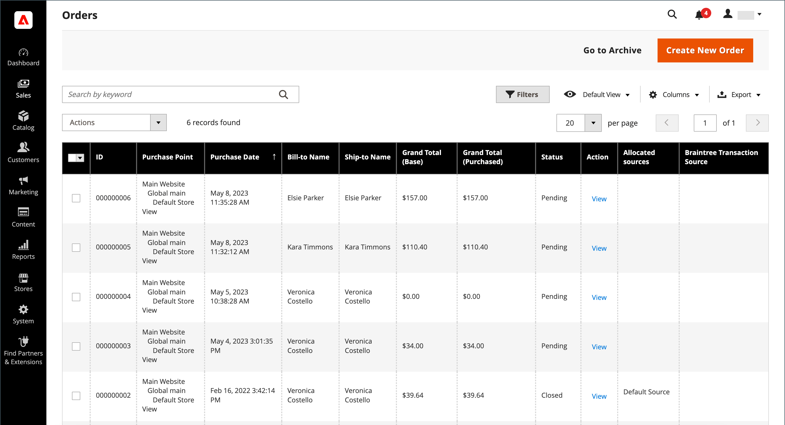

# Schemalagda orderåtgärder

Använd [Cron](../systems/cron.md)-jobb för att schemalägga följande orderbearbetningsåtgärder:

{width="700" zoomable="yes"}

## Ange livslängd för väntande betalningsorder

Livslängden för order med väntande betalningar bestäms av konfigurationen för _Kroniinställningar_ för beställningar. Standardvärdet är 480 minuter, vilket är åtta timmar.

1. Gå till **[!UICONTROL Stores]** > _[!UICONTROL Settings]_>**[!UICONTROL Configuration]**&#x200B;på sidofältet_ Admin _.

1. Expandera avsnittet **[!UICONTROL Sales]** i den vänstra panelen och välj **[!UICONTROL Sales]** under.

1. Expandera  i avsnittet **[!UICONTROL Orders Cron Settings]**.

   {width="600" zoomable="yes"}

1. För **[!UICONTROL Pending Payment Order Lifetime (minutes)]** anger du antalet minuter innan en väntande betalning förfaller.

1. Klicka på **[!UICONTROL Save Config]**.

## Aktivera schemalagda stödrasteruppdateringar och omindexering

Konfigurationen av stödrasterinställningar schemalägger uppdateringar av följande rutnät för orderhantering och indexerar om data enligt schemat av [Cron](../systems/cron.md):

- [Beställningar](orders.md#orders-workspace)
- [Fakturor](invoices.md)
- [Leveranser](shipments.md)
- [Kreditnotor](credit-memos.md)

Genom att schemalägga dessa uppgifter kan du undvika de lås som uppstår när data sparas och minska bearbetningstiden. När det här alternativet är aktiverat utförs uppdateringar endast under det schemalagda kron-jobbet. För bästa resultat bör Cron konfigureras att köras en gång i minuten.

**_Så här aktiverar du uppdateringar och omindexering:_**

[!BADGE PaaS endast]{type=Informative url="https://experienceleague.adobe.com/sv/docs/commerce/user-guides/product-solutions" tooltip="Gäller endast Adobe Commerce i molnprojekt (Adobe-hanterad PaaS-infrastruktur) och lokala projekt."} När [produktionsläget &#x200B;](https://experienceleague.adobe.com/docs/commerce-operations/configuration-guide/setup/application-modes.html?lang=sv-SE#production-mode) (standardläget i Adobe Commerce i molninfrastrukturen) är aktiverat kör du följande kommando:

`bin/magento config:set dev/grid/async_indexing 1`

När [Standardläge](https://experienceleague.adobe.com/docs/commerce-operations/configuration-guide/setup/application-modes.html?lang=sv-SE#default-mode) är aktiverat utför du följande steg:

1. Gå till **[!UICONTROL Stores]** > _[!UICONTROL Settings]_>**[!UICONTROL Configuration]**&#x200B;på sidofältet_ Admin _.

1. Expandera avsnittet **[!UICONTROL Advanced]** i den vänstra panelen och välj **[!UICONTROL Developer]**.

1. Expandera  i avsnittet **[!UICONTROL Grid Settings]**.

1. Ange **[!UICONTROL Asynchronous Indexing]** till `Enable`.

   {width="600" zoomable="yes"}

1. Klicka på **[!UICONTROL Save Config]**.
