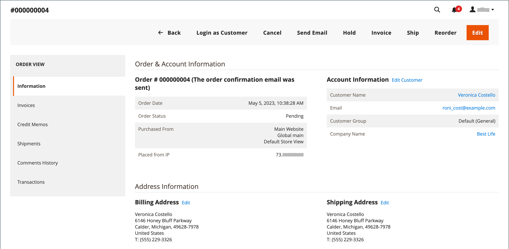

# Uppdatera en order

När du hjälper en kund som har lagt en order måste du fastställa orderns status. De tillgängliga alternativen för en `Pending` ordningen skiljer sig från alternativen för en `Processing` beställa. Mer information finns i [Bearbeta en order](order-processing.md).

## Väntande order

När en kund har gjort en beställning, men innan betalningen tas emot, är beställningen `Pending` status. Du kan redigera beställningen, placera den i vänteläge eller avbryta den helt. Knappfältet för en väntande order visar tillgängliga åtgärder för en order.

{width="600" zoomable="yes"}

Om du ändrar väsentliga delar av en order annulleras den ursprungliga ordern och en ny order genereras. Du kan dock ändra fakturerings- eller leveransadressen utan att skapa en ny order.

| Knapp | Beskrivning |
|--- |--- |
| **[!UICONTROL Back]** | Återgår till sidan Beställningar utan att spara ändringarna. |
| **[!UICONTROL Login as Customer]** | Gör att en administratörsanvändare kan hjälpa kunderna med deras beställningar. |
| **[!UICONTROL Cancel]** | Avbryter väntande ordning. |
| **[!UICONTROL Send Email]** | Skickar ett e-postmeddelande om den väntande ordern till kunden. |
| **[!UICONTROL Hold]** / **[!UICONTROL Unhold]** | Ändrar status för väntande order till `On Hold`. Om du vill släppa spärren väljer du _[!UICONTROL Unhold]_. |
| **[!UICONTROL Invoice]** | Skapar en [faktura](invoices.md#create-an-invoice) från väntande order genom att konvertera ordern till en faktura och ändra orderstatus till `processing`. |
| **[!UICONTROL Ship]** | Skapar en [försändelse](shipments.md#create-a-shipment) för ordern. |
| **[!UICONTROL Reorder]** | Skapar en ny väntande order som är en dubblett av den aktuella väntande ordern. |
| **[!UICONTROL Edit]** | Öppnar en väntande ordning i redigeringsläge. Knappen Redigera är bara tillgänglig för väntande order eller för order som baseras på förhandlade order [citattecken](../b2b/quotes.md). |

{style="table-layout:auto"}

## Bearbetningsorder

En order anger `Processing` lägen när:

* Betalningen för en order tas emot/hämtas och fakturan genereras - när betalningsåtgärden är inställd på `Authorize and Capture`.
* En ordertransaktion har auktoriserats, men betalningen har ännu inte registrerats - när betalningsåtgärden är inställd på `Authorize`.

The [konfiguration av betalningsåtgärd](../configuration-reference/sales/payment-methods.md#payment-actions) avgör vilka orderåtgärder som är tillgängliga efter att en order har skapats.

Du kan inte ändra en `Processing` beställa, men du kan redigera fakturerings- och leveransadressen.

{width="600" zoomable="yes"}

>[!NOTE]
>
>När betalningsåtgärden för betalningsmetoden är inställd på `Authorize and Capture`skapas en faktura automatiskt när kunden gör en beställning. I det här fallet kan du återbetala pengar med en [kreditnota](credit-memo-create.md), men inte [avbryt](#cancel-a-pending-order) eller [void](#void-a-processing-order) beställningen.

| Knapp | Beskrivning |
|--- |--- |
| **[!UICONTROL Back]** | Återgår till sidan Beställningar utan att spara ändringarna. |
| **[!UICONTROL Send Email]** | Skickar ett e-postmeddelande om ordern till kunden. |
| **[!UICONTROL Void]** | [Voids](#void-a-processing-order) en ordertransaktion eller en partiell ordertransaktion. |
| **[!UICONTROL Credit Memo]** | Startar processen för att skapa en [kreditnota](credit-memo-create.md). |
| **[!UICONTROL Hold]** / **[!UICONTROL Unhold]** | Ändrar försäljningsorderns status till `On Hold`. Om du vill spärra försäljningsordern väljer du _[!UICONTROL Unhold]_. |
| **[!UICONTROL Reorder]** | Skapar en ny väntande order baserat på den aktuella ordern. |
| **[!UICONTROL Create Returns]** |  (Endast Adobe Commerce) Initierar processen till [return](returns.md) en eller flera artiklar från ordern. |

{style="table-layout:auto"}

## Annullera en bearbetningsorder

När en order fortfarande finns i `Processing` status och betalningsintegreringen är inställd på `Authorize` (inte `Authorize and Capture`) kan du bara annullera en transaktion eller annullera en order. [Avbryta en order](#cancel-a-pending-order) också ogiltigförklarar tillståndet.

När en order placeras med en betalningsmetod med betalningsåtgärden inställd på `Authorize and Capture` Du kan återbetala medel via kreditnota, men kan inte annullera det eftersom det faktureras och betalningen registreras.

Betalningsmetoden avgör vilka betalningsåtgärder som är tillgängliga. Se [Betalningsåtgärder](../configuration-reference/sales/payment-methods.md#payment-actions) för mer information.

**_Så här annullerar du en order:_**

1. På _Administratör_ sidebar, gå till **[!UICONTROL Sales]** > _[!UICONTROL Operations]_>**[!UICONTROL Orders]**.

1. I **[!UICONTROL Action]** kolumn för den ordning som ska redigeras, klicka **[!UICONTROL View]**.

1. Klicka **[!UICONTROL Void]** för att annullera ordern.

1. Klicka på **[!UICONTROL OK]** för att annullera ordern.

Du kan skicka ut alla återbetalningar som behövs med en [kreditnota](credit-memo-create.md) efter att medel har samlats in. Du kan också skapa en [return merchandise authentication (RMA)](returns.md) som utfärdats för produktreturer. Mer information finns på [Bearbeta en beställning](order-processing.md).

## Redigera en väntande order

1. På _Administratör_ sidebar, gå till **[!UICONTROL Sales]** > _[!UICONTROL Operations]_>**[!UICONTROL Orders]**.

1. I **[!UICONTROL Action]** kolumn för den ordning som ska redigeras, klicka **[!UICONTROL View]**.

1. Klicka på **[!UICONTROL Edit]**.

   {width="600" zoomable="yes"}

1. Klicka på **[!UICONTROL OK]** för att fortsätta redigera.

1. Uppdatera ordern efter behov.

1. Använd ändringarna:
   * Om du vill spara ändringar i fakturerings- eller leveransadressen klickar du på **[!UICONTROL Save]**.
   * Om du vill spara ändringar som gjorts i radobjekt och bearbeta om ordningen klickar du på **[!UICONTROL Submit Order]**.

## Parkera en order

Om kundens betalningsmetod inte är tillgänglig eller om artikeln tillfälligt är ur lager, kan du spärra ordern.

1. I _Beställningar_ rutnät, hitta `Pending` som du vill spärra.

1. I _Åtgärd_ kolumn, klicka **[!UICONTROL View]**.

1. Klicka **[!UICONTROL Hold]** om du vill spärra beställningen.

Om du vill ta bort spärren för en order redigerar du ordningen igen och klickar på **[!UICONTROL Unhold]**.

## Avbryt en väntande order

Om du avbryter en order ändras dess status från `Pending` till `Canceled`.

1. I _[!UICONTROL Orders]_rutnät, hitta väntande order som ska annulleras.

1. I _[!UICONTROL Action]_kolumn, klicka **[!UICONTROL View]**.

1. Klicka **[!UICONTROL Cancel]** om du vill avbryta beställningen.

Beställningens status är nu `Canceled`.
