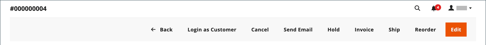

# Uppdatera en order

När du hjälper en kund som har lagt en order måste du fastställa orderns status. De tillgängliga alternativen för en `Pending`-ordning skiljer sig från alternativen för en `Processing`-ordning. Mer information finns i [Bearbeta en order](order-processing.md).

## Väntande order

När en kund har gjort en beställning, men innan betalningen har tagits emot, har ordern statusen `Pending`. Du kan redigera beställningen, placera den i vänteläge eller avbryta den helt. Knappfältet för en väntande order visar tillgängliga åtgärder för en order.

{width="600" zoomable="yes"}

Om du ändrar väsentliga delar av en order annulleras den ursprungliga ordern och en ny order genereras. Du kan dock ändra fakturerings- eller leveransadressen utan att skapa en ny order.

| Knapp | Beskrivning |
|--- |--- |
| **[!UICONTROL Back]** | Återgår till sidan Beställningar utan att spara ändringarna. |
| **[!UICONTROL Login as Customer]** | Gör att en administratörsanvändare kan hjälpa kunderna med deras beställningar. |
| **[!UICONTROL Cancel]** | Avbryter väntande ordning. |
| **[!UICONTROL Send Email]** | Skickar ett e-postmeddelande om den väntande ordern till kunden. |
| **[!UICONTROL Hold]** / **[!UICONTROL Unhold]** | Ändrar status för väntande order till `On Hold`. Välj _[!UICONTROL Unhold]_om du vill släppa undantaget. |
| **[!UICONTROL Invoice]** | Skapar en [faktura](invoices.md#create-an-invoice) från den väntande ordern genom att konvertera ordern till en faktura och ändra orderstatusen till `processing`. |
| **[!UICONTROL Ship]** | Skapar en [försändelse](shipments.md#create-a-shipment)-post för ordern. |
| **[!UICONTROL Reorder]** | Skapar en ny väntande order som är en dubblett av den aktuella väntande ordern. |
| **[!UICONTROL Edit]** | Öppnar en väntande ordning i redigeringsläge. Knappen Redigera är bara tillgänglig för väntande order eller för order som baseras på förhandlade [offerter](../b2b/quotes.md). |

{style="table-layout:auto"}

## Bearbetningsorder

En order försätts i läget `Processing` när:

* Betalningen för en order tas emot/hämtas och fakturan genereras när betalningsåtgärden är inställd på `Authorize and Capture`.
* En ordertransaktion har auktoriserats, men betalningen har ännu inte hämtats - när betalningsåtgärden är inställd på `Authorize`.

[Betalningsåtgärdskonfigurationen](../configuration-reference/sales/payment-methods.md#payment-actions) avgör vilka orderåtgärder som är tillgängliga efter att en order har skapats.

Du kan inte ändra en `Processing`-beställning avsevärt, men du kan redigera fakturerings- och leveransadressen.

{width="600" zoomable="yes"}

>[!NOTE]
>
>När betalningsåtgärden för betalningsmetoden är inställd på `Authorize and Capture` skapas en faktura automatiskt när kunden gör en beställning. I det här fallet kan du återbetala medel med en [kreditnota](credit-memo-create.md), men inte [avbryta](#cancel-a-pending-order) eller [void](#void-a-processing-order) ordern.

| Knapp | Beskrivning |
|--- |--- |
| **[!UICONTROL Back]** | Återgår till sidan Beställningar utan att spara ändringarna. |
| **[!UICONTROL Send Email]** | Skickar ett e-postmeddelande om ordern till kunden. |
| **[!UICONTROL Void]** | [Annullerar](#void-a-processing-order) en ordertransaktion eller en partiell ordertransaktion. |
| **[!UICONTROL Credit Memo]** | Initierar processen att skapa en [kreditnota](credit-memo-create.md). |
| **[!UICONTROL Hold]** / **[!UICONTROL Unhold]** | Ändrar försäljningsorderns status till `On Hold`. Välj _[!UICONTROL Unhold]_om du vill släppa spärren på försäljningsordern. |
| **[!UICONTROL Reorder]** | Skapar en ny väntande order baserat på den aktuella ordern. |
| **[!UICONTROL Create Returns]** |  (endast Adobe Commerce) Initierar processen att [returnera](returns.md) ett eller flera objekt från ordningen. |

{style="table-layout:auto"}

## Annullera en bearbetningsorder

När en order fortfarande har statusen `Processing` och betalningsintegreringen är inställd på `Authorize` (inte `Authorize and Capture`) kan du bara annullera en transaktion eller avbryta en order. [Om du avbryter en order](#cancel-a-pending-order) annulleras även auktoriseringen.

När en order placeras med en betalningsmetod med betalningsåtgärden inställd på `Authorize and Capture` kan du återbetala medel via kreditnota, men kan inte annullera den eftersom den faktureras och betalningen hämtas.

Betalningsmetoden avgör vilka betalningsåtgärder som är tillgängliga. Mer information finns i [Betalningsåtgärder](../configuration-reference/sales/payment-methods.md#payment-actions).

**_Så här annullerar du en order:_**

1. Gå till **[!UICONTROL Sales]** > _[!UICONTROL Operations]_>**[!UICONTROL Orders]**på sidofältet_ Admin _.

1. Klicka på **[!UICONTROL View]** i kolumnen **[!UICONTROL Action]** för den ordning som ska redigeras.

1. Klicka på **[!UICONTROL Void]** om du vill annullera ordningen.

1. Klicka på **[!UICONTROL OK]** när du uppmanas att annullera ordningen.

Du kan utfärda alla återbetalningar som behövs med hjälp av en [kreditnota](credit-memo-create.md) efter att medel har samlats in. Du kan också skapa en [returförsäljningsauktorisering (RMA)](returns.md) som utfärdats för produktreturer. Mer information finns i [Bearbeta en beställning](order-processing.md).

## Redigera en väntande order

1. Gå till **[!UICONTROL Sales]** > _[!UICONTROL Operations]_>**[!UICONTROL Orders]**på sidofältet_ Admin _.

1. Klicka på **[!UICONTROL View]** i kolumnen **[!UICONTROL Action]** för den ordning som ska redigeras.

1. Klicka på **[!UICONTROL Edit]**.

   {width="600" zoomable="yes"}

1. Klicka på **[!UICONTROL OK]** när du uppmanas att fortsätta redigera.

1. Uppdatera ordern efter behov.

1. Använd ändringarna:
   * Klicka på **[!UICONTROL Save]** om du vill spara ändringar i fakturerings- eller leveransadressen.
   * Om du vill spara ändringar som gjorts i radobjekt och bearbeta om ordningen klickar du på **[!UICONTROL Submit Order]**.

## Parkera en order

Om kundens betalningsmetod inte är tillgänglig eller om artikeln tillfälligt är ur lager, kan du spärra ordern.

1. I rutnätet _Beställningar_ söker du efter den `Pending`-ordning som du vill spärra.

1. Klicka på **[!UICONTROL View]** i kolumnen _Åtgärd_.

1. Klicka på **[!UICONTROL Hold]** om du vill spärra ordern.

Om du vill ta bort spärren för en order redigerar du ordningen igen och klickar på **[!UICONTROL Unhold]**.

## Avbryt en väntande order

Om du avbryter en order ändras dess status från `Pending` till `Canceled`.

1. I rutnätet _[!UICONTROL Orders]_hittar du den väntande ordern som ska annulleras.

1. Klicka på **[!UICONTROL View]** i kolumnen _[!UICONTROL Action]_.

1. Klicka på **[!UICONTROL Cancel]** om du vill avbryta beställningen.

Orderns status är nu `Canceled`.
