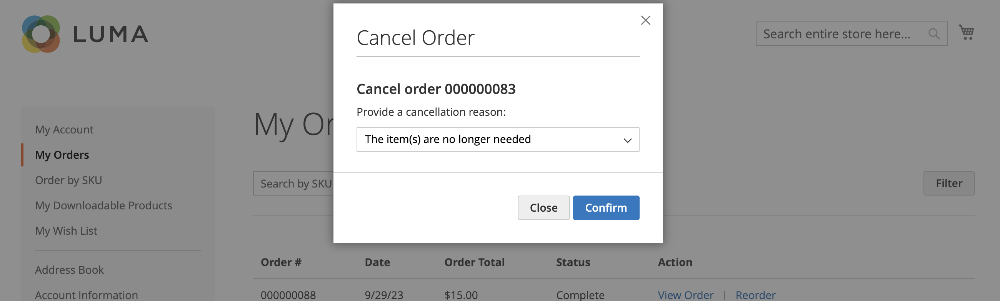
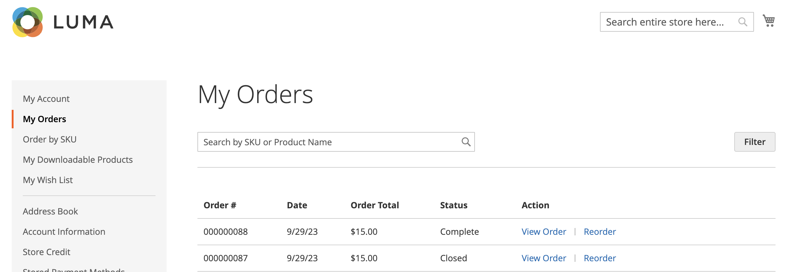

# Beställningshantering i lager

Kunderna har tillgång till alla sina beställningar från sitt konto. Beställningar kan visas, filtreras, spåras och skickas som nya order. Beroende på orderns status kan kunderna skriva ut sina order-, faktura-, leverans- och återbetalningsregister.

## Filterorder

{{b2b-feature}}

Dina ursprungliga _[!UICONTROL My Orders]_-resultat innehåller även matchande order från underordnade användare från alla webbplatser i handelsinstansen. En kund som är associerad med ett företagskonto kan filtrera orderlistan för att snabbt hitta poster i resultaten. Om du vill visa filteralternativen klickar kunden på&#x200B;**[!UICONTROL Filter]**&#x200B;och klickar på&#x200B;**[!UICONTROL Close]**&#x200B;för att dölja filtren.

{width="700" zoomable="yes"}

| Filter | Beskrivning |
| ------ | ----------- |
| [!UICONTROL SKU or Product Name] | Anger antingen SKU eller produktnamn. |
| [!UICONTROL Order Number] | Kan vara ett fullständigt eller partiellt ordernummer. |
| [!UICONTROL Order Status] | Väljer ett värde i listrutan som ska filtreras efter status. |
| [!UICONTROL Invoice Number] | Anger antingen ett fullständigt eller partiellt fakturanummer. |
| [!UICONTROL Order Date] | Anger ett eller båda datumfält som ska filtreras efter orderdatum. |
| [!UICONTROL Created by] | Filtrerar företagsorder efter den som har skapat ordern. |
| [!UICONTROL Order Total] | Anger min-, max- eller båda-värden som ska filtreras efter ordersumma. |

## Visa en order

En kund hittar ordern i listan och klickar på **[!UICONTROL View Order]**. I den öppna ordningen kan de göra något av följande:

{width="700" zoomable="yes"}

### Visa nyligen beställda produkter

Blocket **[!UICONTROL Recent Orders]** visas i sidofältet och på sidan **[!UICONTROL My Account]** för kunder som är inloggade efter att ha gjort en beställning. Här visas fem produkter från det senaste köpet.

Kunden kan läsa produkter i kundvagnen genom att välja produkterna och klicka på **[!UICONTROL Add to Cart]**. De kan även visa den sista ordningen genom att klicka på **[!UICONTROL View all]**, som dirigerar om till sidan _[!UICONTROL My Account]_&#x200B;och **[!UICONTROL Recent Orders]**-blocket.

### Skriv ut order

1. Kunden klickar på **[!UICONTROL Print Order]**.

1. Följ instruktionerna i dialogrutan Skriv ut för att slutföra utskriften.

### Skriv ut fakturor

1. På fliken **[!UICONTROL Invoices]** klickar kunden på något av följande:

   - **[!UICONTROL Print All Invoices]**

   - **[!UICONTROL Print Invoice]**

   {width="700" zoomable="yes"}

1. Använder dialogrutan Skriv ut för att slutföra utskriften.

### Skriv ut försändelser

1. På fliken **[!UICONTROL Order Shipments]** klickar kunden på något av följande:

   - **[!UICONTROL Print All Shipments]**

   - **[!UICONTROL Print Shipment]**

   {width="700" zoomable="yes"}

1. Använder dialogrutan Skriv ut för att slutföra utskriften.

### Spåra en leverans

1. Klicka på **[!UICONTROL Track this Shipment]** på fliken **[!UICONTROL Order Shipments]**.

   All spårningsinformation som är tillgänglig visas i ett popup-fönster.

1. När det är klart klickar kunden på **[!UICONTROL Close Window]**.

### Skriv ut återbetalningar

1. På fliken **Återbetalningar** klickar kunden på något av följande:

   - **Skriv ut alla återbetalningar**

   - **Återbetalning för utskrift**

   {width="700" zoomable="yes"}

1. Använder dialogrutan Skriv ut för att slutföra utskriften.

Kunder kan ändra ordning när konfigurationsalternativet [_Tillåt ändring_](reorders-allow.md) är aktiverat.

Kunden kan initiera omsorteringsfunktionen för en viss order från två sidor:

- Sidan Mina beställningar
- Sidan Ordervy

## Beställningar

Länken _[!UICONTROL Reorder]_&#x200B;visas i listan med order nära länken&#x200B;_[!UICONTROL View]_.

{width="700" zoomable="yes"}

**Fall 1.** Alla produkter från ordern är tillgängliga för ombeställning

Kunden dirigeras om till kundvagnen och alla produkter läggs i kundvagnen.

**Fall 2.** Vissa produkter från beställningen är inte tillgängliga för omsortering

>[!NOTE]
>
>Det går att ordna om `Not Visible Individually` produkter.

Länken _[!UICONTROL Reorder]_&#x200B;visas inte på sidorna&#x200B;_[!UICONTROL My Orders]_ och _[!UICONTROL View Order]_.

{width="700" zoomable="yes"}

>[!TIP]
>
>Om kundvagnen inte är tom och kunden klickar på **[!UICONTROL Reorder]** (från sidan [!UICONTROL My Orders] eller [!UICONTROL Order View]) finns de befintliga produkterna kvar i kundvagnen med de tillagda ombeställningsprodukterna.

## Avbryt beställningar

Avbryt är tillgängligt för kunder när konfigurationsalternativet [_Tillåt Avbryt_](cancel-allow.md) är aktiverat.

Kunden kan initiera avbeställningsfunktionen för en viss order från tre sidor:

- Sidan Mina beställningar
- Sidan Ordervy
- Sidan Mitt konto

Länken _[!UICONTROL Cancel Order]_&#x200B;visas nära länken&#x200B;_[!UICONTROL Reorder]_. Om beställningen inte kan avbrytas visas inte länken.

{width="700" zoomable="yes"}

Så här utför du avbeställningen:

1. Klicka på **[!UICONTROL Cancel Order]**

1. Anger en orsak till annullering

   {width="700" zoomable="yes"}

   Du kan anpassa orsaken till annulleringen på sidan [_Tillåt Avbryt_](cancel-allow.md).

1. Klicka på **[!UICONTROL Confirm]**

   {width="700" zoomable="yes"}

   Efter annulleringen kommer de order som hade statusen _[!UICONTROL Pending]_&#x200B;att ändras till status&#x200B;_[!UICONTROL Canceled]_, de order som hade statusen _[!UICONTROL Processing]_&#x200B;att bearbetas, ändras till status&#x200B;_[!UICONTROL Closed]_ och en återbetalning kommer att bearbetas.

   När avbeställningen är klar skickas ett e-postmeddelande till kunden.

   {width="700" zoomable="yes"}

   Information om annullering läggs till i kundens orderhistorik. Det visas i kommentarerna till ordningen och på fliken Kommentarshistorik.

   {width="700" zoomable="yes"}

   {width="700" zoomable="yes"}

   Om beställningen av någon anledning har ändrats till en status som inte kan avbrytas och kunden inte har uppdaterat sidan, visas fortfarande länken för att avbryta beställningen. När de försöker avbryta visas dock ett felmeddelande.

   {width="700" zoomable="yes"}

   När du har uppdaterat sidan kan du se att ordningen redan är slutförd, vilket är orsaken till att annulleringen inte fungerade.

   {width="700" zoomable="yes"}
