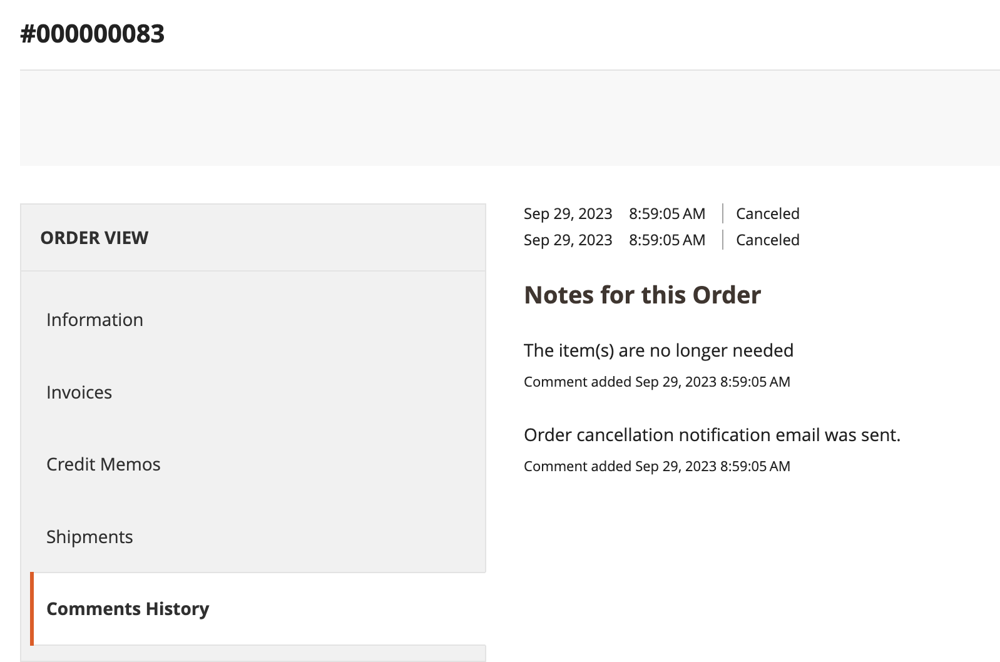

# Beställningshantering i lager

Kunderna har tillgång till alla sina beställningar från sitt konto. Beställningar kan visas, filtreras, spåras och skickas som nya order. Beroende på orderns status kan kunderna skriva ut sina order-, faktura-, leverans- och återbetalningsregister.

## Filterorder

{{b2b-feature}}

Din initiala _[!UICONTROL My Orders]_resultaten innehåller också matchande order från underordnade användare från alla webbplatser i handelsinstansen. En kund som är associerad med ett företagskonto kan filtrera orderlistan för att snabbt hitta poster i resultaten. För att visa filteralternativen klickar kunden på&#x200B;**[!UICONTROL Filter]**och klicka **[!UICONTROL Close]**om du vill dölja filtren.

{width="700" zoomable="yes"}

| Filter | Beskrivning |
| ------ | ----------- |
| [!UICONTROL SKU or Product Name] | Anger antingen SKU eller produktnamn. |
| [!UICONTROL Order Number] | Kan vara ett fullständigt eller partiellt ordernummer. |
| [!UICONTROL Order Status] | Väljer ett värde i listrutan som ska filtreras efter status. |
| [!UICONTROL Invoice Number] | Anger antingen ett fullständigt eller partiellt fakturanummer. |
| [!UICONTROL Order Date] | Anger ett eller båda datumfält som ska filtreras efter orderdatum. |
| [!UICONTROL Created by] | Filtrerar företagsorder efter den som har skapat ordern. |
| [!UICONTROL Order Total] | Anger min-, max- eller båda-värden som ska filtreras efter ordersumma. |

## Visa en order

Kunden hittar ordern i listan och klickar **[!UICONTROL View Order]**. I den öppna ordningen kan de göra något av följande:

{width="700" zoomable="yes"}

### Visa nyligen beställda produkter

The **[!UICONTROL Recent Orders]** -blocket visas i sidlisten och på **[!UICONTROL My Account]** för kunder som är inloggade efter att ha gjort en beställning. Här visas fem produkter från det senaste köpet.

Kunden kan läsa produkterna i kundvagnen genom att välja produkterna och klicka på **[!UICONTROL Add to Cart]**. De kan också visa den sista ordningen genom att klicka **[!UICONTROL View all]**, som dirigeras om till _[!UICONTROL My Account]_sidan och **[!UICONTROL Recent Orders]**-block.

### Skriv ut order

1. Kunden klickar **[!UICONTROL Print Order]**.

1. Följ instruktionerna i dialogrutan Skriv ut för att slutföra utskriften.

### Skriv ut fakturor

1. På **[!UICONTROL Invoices]** klickar kunden på något av följande:

   - **[!UICONTROL Print All Invoices]**

   - **[!UICONTROL Print Invoice]**

   {width="700" zoomable="yes"}

1. Använder dialogrutan Skriv ut för att slutföra utskriften.

### Skriv ut försändelser

1. På **[!UICONTROL Order Shipments]** klickar kunden på något av följande:

   - **[!UICONTROL Print All Shipments]**

   - **[!UICONTROL Print Shipment]**

   {width="700" zoomable="yes"}

1. Använder dialogrutan Skriv ut för att slutföra utskriften.

### Spåra en leverans

1. På **[!UICONTROL Order Shipments]** flik, klicka **[!UICONTROL Track this Shipment]**.

   All spårningsinformation som är tillgänglig visas i ett popup-fönster.

1. När det är klart klickar kunden **[!UICONTROL Close Window]**.

### Skriv ut återbetalningar

1. På **Återbetalningar** klickar kunden på något av följande:

   - **Skriv ut alla återbetalningar**

   - **Skriv ut återbetalning**

   {width="700" zoomable="yes"}

1. Använder dialogrutan Skriv ut för att slutföra utskriften.

Beställningar är tillgängliga för kunder när [_Tillåt ombeställning_](reorders-allow.md) konfigurationsalternativet är aktiverat.

Kunden kan initiera omsorteringsfunktionen för en viss order från två sidor:

- Sidan Mina beställningar
- Sidan Ordervy

## Beställningar

The _[!UICONTROL Reorder]_-länken visas i listan med order nära_[!UICONTROL View]_ länk.

{width="700" zoomable="yes"}

**Fall 1.** Alla produkter från ordern är tillgängliga för ombeställning

Kunden dirigeras om till kundvagnen och alla produkter läggs i kundvagnen.

**Fall 2.** Vissa produkter från beställningen kan inte beställas

>[!NOTE]
>
>Det går att ändra ordning `Not Visible Individually` produkter.

The _[!UICONTROL Reorder]_länken visas inte på_[!UICONTROL My Orders]_ och _[!UICONTROL View Order]_sidor.

{width="700" zoomable="yes"}

>[!TIP]
>
>Om kundvagnen inte är tom och kunden klickar **[!UICONTROL Reorder]** (från [!UICONTROL My Orders] eller [!UICONTROL Order View] sida) finns produkterna kvar i varukorgen med de nya beställningsprodukterna.

## Avbryt beställningar

Avbryt är tillgängligt för kunder när [_Tillåt Avbryt_](cancel-allow.md) konfigurationsalternativet är aktiverat.

Kunden kan initiera avbeställningsfunktionen för en viss order från tre sidor:

- Sidan Mina beställningar
- Sidan Ordervy
- Sidan Mitt konto

The _[!UICONTROL Cancel Order]_länk visas nära_[!UICONTROL Reorder]_ länk. Om beställningen inte kan avbrytas visas inte länken.

{width="700" zoomable="yes"}

Så här utför du avbeställningen:

1. Klickningar **[!UICONTROL Cancel Order]**

1. Anger en orsak till annullering

   {width="700" zoomable="yes"}

   Du kan anpassa orsaken till annulleringen på [_Tillåt Avbryt_](cancel-allow.md) sida.

1. Klickningar **[!UICONTROL Confirm]**

   {width="700" zoomable="yes"}

   Efter annulleringen fanns de order som fanns i _[!UICONTROL Pending]_status, ändra till_[!UICONTROL Canceled]_ status, de order som fanns i _[!UICONTROL Processing]_status, ändra till_[!UICONTROL Closed]_ status och en återbetalning kommer att behandlas.

   När avbeställningen är klar skickas ett e-postmeddelande till kunden.

   {width="700" zoomable="yes"}

   Information om annullering läggs till i kundens orderhistorik. Det visas i kommentarerna till ordningen och på fliken Kommentarshistorik.

   {width="700" zoomable="yes"}

   {width="700" zoomable="yes"}

   Om beställningen av någon anledning har ändrats till en status som inte kan avbrytas och kunden inte har uppdaterat sidan, visas fortfarande länken för att avbryta beställningen. När de försöker avbryta visas dock ett felmeddelande.

   {width="700" zoomable="yes"}

   När du har uppdaterat sidan kan du se att ordningen redan är slutförd, vilket är orsaken till att annulleringen inte fungerade.

   {width="700" zoomable="yes"}
