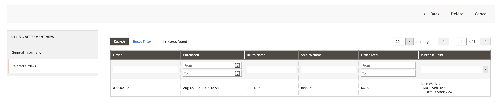
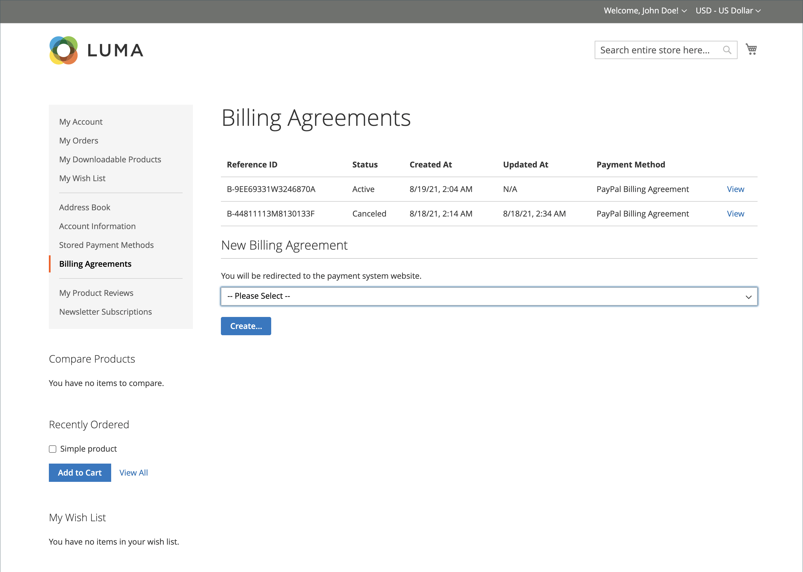

# PayPal-faktureringsavtal

För att förenkla utcheckningsprocessen kan kunderna ingå ett faktureringsavtal med PayPal som betaltjänstleverantör. Vid utcheckning väljer kunden faktureringsavtalet som betalningsmetod. Betalningssystemet verifierar faktureringsavtalet med dess unika nummer och debiterar kundkontot. Med ett faktureringsavtal på plats behöver kunden inte längre ange betalningsinformation för varje köp. Kunderna kan hantera sina faktureringsavtal via kontrollpanelen för sina kundkonton, där statusen för varje avtal visas som _Aktiv_ eller _Avbruten_. När ett faktureringsavtal annulleras kan det inte återaktiveras.

## Arbetsflöde för faktureringsavtal

1. **Kunden registrerar sig för ett faktureringsavtal**. När ett faktureringsavtal har upprättats kan ytterligare faktureringsavtal bara läggas till från kundkontot. Det finns ingen gräns för hur många faktureringsavtal en kund kan skapa. Kunder kan registrera sig för faktureringsavtal på något av följande sätt:

   - **Registrera dig på kundkonto** - Kunder kan registrera sig för ett faktureringsavtal från sina kundkonton.
   - **Registrera dig i kassan** - Kunder som betalar för ett köp med PayPal Express Checkout kan markera en kryssruta för att skapa ett faktureringsavtal. Även om faktureringsavtalet inte används för den aktuella ordern, blir det tillgängligt som betalningsmetod nästa gång kunden gör en beställning.
   - **Registrera dig hos butiksadministratör** - På kundens begäran kan butiksadministratören skapa en försäljningsorder med kundfaktureringsavtalet.

1. **PayPal verifierar och registrerar avtal**. När kunden beställer med betalning via faktureringsavtal överförs faktureringsavtalets referens-ID och betalningsinformation för försäljningsorder till PayPal och registreras på kundkontot tillsammans med referensinformation. Om betalningen är auktoriserad skapas en order i Commerce. Referens-ID för faktureringsavtal skickas till kunden och till butiken.

## Hantera faktureringsavtal

The _[!UICONTROL Billing Agreements]_visas alla faktureringsavtal mellan din butik och dess kunder. Affärsmännen kan filtrera posterna efter kund- eller faktureringsavtalsinformation, inklusive referens-ID för faktureringsavtal, status och skapandedatum. Varje post innehåller allmän information om faktureringsavtalet och alla försäljningsorder som har använt det som betalningsmetod. Du kan visa, avbryta eller ta bort kundfaktureringsavtal. Ett annullerat faktureringsavtal kan bara tas bort av butiksadministratören.

### Visa ett faktureringsavtal

1. På _Administratör_ sidebar, gå till **[!UICONTROL Sales]** > _[!UICONTROL Operations]_>**[!UICONTROL Billing Agreements]**.

1. Leta upp faktureringsavtalet i listan och klicka för att öppna det.

Varje faktureringsavtalssida består av två flikar: _[!UICONTROL General Information]_och_[!UICONTROL Related Orders]_.

#### Allmän information

Fliken innehåller allmän information om faktureringsavtalet:

- [!UICONTROL Reference ID]: En unik numerisk identifierare som tilldelas det aktuella faktureringsavtalet.
- [!UICONTROL Customer]: Kundens konto som tilldelats aktuellt faktureringsavtal.
- [!UICONTROL Status]: Status för betalningsavtal.
- [!UICONTROL Created At]: Skapad den.
- [!UICONTROL Updated At]: Uppdateringsdatum.

{width="600" zoomable="yes"}

#### Relaterade order

På den här fliken visas en lista med de beställningar som har gjorts med det aktuella faktureringsavtalet.

{width="600" zoomable="yes"}

### Avbryta ett faktureringsavtal

1. På _Administratör_ sidebar, gå till **[!UICONTROL Sales]** > _[!UICONTROL Operations]_>**[!UICONTROL Billing Agreements]**.

1. Leta upp faktureringsavtalet i listan och klicka för att öppna det.

1. Klicka på i det övre högra hörnet **[!UICONTROL Cancel]**.

1. Bekräfta åtgärden genom att klicka **[!UICONTROL OK]**.

### Ta bort ett faktureringsavtal

1. På _Administratör_ sidebar, gå till **[!UICONTROL Sales]** > _[!UICONTROL Operations]_>**[!UICONTROL Billing Agreements]**.

1. Leta upp faktureringsavtalet i listan och klicka för att öppna det.

1. Klicka på i det övre högra hörnet **[!UICONTROL Delete]**.

1. Bekräfta åtgärden genom att klicka **[!UICONTROL OK]**.

### Kolumnbeskrivningar

| Kolumn | Beskrivning |
|--- |--- |
| [!UICONTROL ID] | En unik numerisk identifierare som tilldelas varje faktureringsavtal |
| [!UICONTROL Email] | En kunds e-postadress till kontaktperson |
| [!UICONTROL First Name] | En kunds förnamn |
| [!UICONTROL Last Name] | En kunds efternamn |
| [!UICONTROL Reference ID] | En unik numerisk referens-ID som tilldelas varje faktureringsavtal |
| [!UICONTROL Status] | Status för betalningsavtal. Alternativ: `Active` eller `Canceled` |
| [!UICONTROL Created] | Skapad den |
| [!UICONTROL Updated] | Uppdateringsdatum |

{style="table-layout:auto"}

## StoreFront

Kunder som ingår ett faktureringsavtal med en betalningsleverantör kan göra inköp nu och betala för dem senare, enligt avtalet. The

{width="700" zoomable="yes"}

| Kolumn | Beskrivning |
|--- |--- |
| [!UICONTROL Reference ID] | En unik numerisk referens-ID som tilldelas varje faktureringsavtal |
| [!UICONTROL Status] | Status för betalningsavtal. Alternativ: `Active` eller `Canceled` |
| [!UICONTROL Created At] | Skapad den |
| [!UICONTROL Updated At] | Uppdateringsdatum |
| [!UICONTROL Payment Method] | En betalningsleverantör för ett faktureringsavtal |
| [!UICONTROL View] | Knapp som används för att visa faktureringsavtal |

{style="table-layout:auto"}

### Skapa ett faktureringsavtal

1. Från kontouppsättningen väljer kunden **[!UICONTROL Billing Agreements]**.

1. Under **[!UICONTROL New Billing Agreement]**, väljer en betalningsleverantör.

1. Klicka på **[!UICONTROL Create]**.

Den här åtgärden dirigerar om kunden till betalningssystemets webbplats.

{width="700" zoomable="yes"}

### Visa ett faktureringsavtal

1. Från kontouppsättningen väljer kunden **[!UICONTROL Billing Agreements]**.

1. Väljer faktureringsavtal och klickar **[!UICONTROL View]**.

{width="700" zoomable="yes"}

### Avbryta ett faktureringsavtal

1. Från kontouppsättningen väljer kunden **[!UICONTROL Billing Agreements]**.

1. Väljer faktureringsavtal och klickar **[!UICONTROL View]**.

1. Klicka i det övre högra hörnet **[!UICONTROL Cancel]** och sedan **[!UICONTROL OK]** för att bekräfta.

>[!NOTE]
>
>Om en Admin-användare (handlare) avbryter faktureringsavtalet kan det inte avbrytas i butiken. The _Avbruten_ status visas för det här avtalet.
