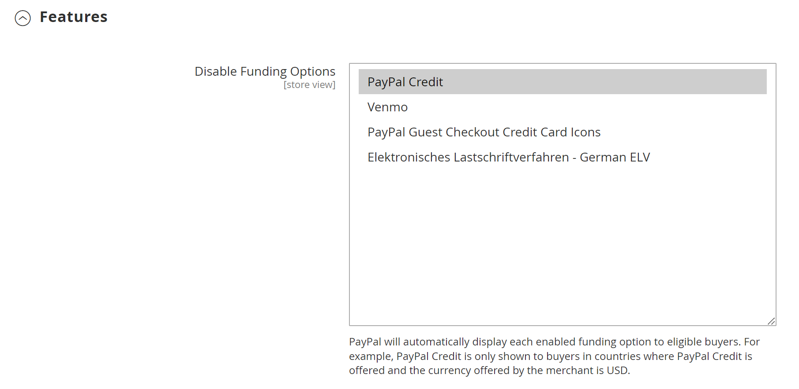

# PayPal Express-kassan

PayPal Express Checkout hjälper till att öka försäljningen genom att ge dina kunder möjlighet att betala med kreditkort eller genom att skydda sina personliga PayPal-konton. Under utcheckningen omdirigeras kunden till den säkra PayPal-webbplatsen för att slutföra betalningsinformationen. Kunden skickas sedan tillbaka till butiken för att slutföra utcheckningsprocessen. Om du väljer Express Checkout läggs den välbekanta PayPal-knappen till i din butik, som har rapporterats öka försäljningen.

>[!IMPORTANT]
>
>**PSD2-krav:**  
>Från och med den 14 september 2019 kan europeiska banker avböja betalningar som inte uppfyller kraven för [PSD2](../getting-started/compliance-payment-services-directive.md). Ingen åtgärd krävs för att PayPal Express Checkout ska uppfylla PSD2 eftersom alla krav hanteras av PayPal.

Kunder med aktuella PayPal-konton kan göra ett köp i ett enda steg genom att klicka på knappen _[!UICONTROL Check out with PayPal]_. Express Checkout kan användas som fristående eller med en allt-i-ett-lösning för PayPal. Om du redan godkänner kreditkort online kan du erbjuda Express Checkout som ett extra alternativ för att locka nya kunder som föredrar att betala med PayPal.

>[!NOTE]
>
>PayPal har ersatt stödet för försäljning av digitala varor via PayPal Express Checkout och rekommenderar att du använder antingen [PayPal Payments Standard](paypal-payments-standard.md) eller en annan PayPal-betalningsgateway för att bearbeta beställningar som innehåller [virtuella produkter](../catalog/product-create-virtual.md).

## Krav

- Merchant: [Business PayPal-konto][1]
- Kund: [Personal PayPal-konto][2]

## Arbetsflöde för Express Chout

Till skillnad från andra betalningsmetoder gör PayPal Express Checkout det möjligt för kunden att checka ut i början av det vanliga arbetsflödet för utcheckning från produktsidan, minivagnen och kundvagnen.

1. **Kunden beställer** - Kunden klickar/trycker på knappen _[!UICONTROL Check out with PayPal]_.
1. **Kunden omdirigeras till PayPal-platsen** - Kunden omdirigeras till PayPal-platsen för att slutföra transaktionen.
1. **Kunden loggar in på sitt PayPal-konto** - Kunden måste logga in på sitt PayPal-konto för att slutföra transaktionen. Betalningssystemet använder fakturerings- och leveransinformationen från PayPal-kontot.
1. **Kunden återgår till utcheckningssidan** - Kunden omdirigeras tillbaka till utcheckningssidan i din butik för att granska ordern.
1. **Kunden beställer** - Kunden beställer och beställningsinformationen skickas till PayPal.
1. **PayPal kvittar transaktionen** - PayPal tar emot ordern och kvittar transaktionen.

>[!NOTE]
>
>PayPal Express Checkout stöder inte order med flera adresser.

## Kontextutcheckning

PayPals _In-Context Checkout_ gör det enklare än någonsin att betala online. Kunderna förlorar aldrig ur sikte under den här förenklade enkla enklicksutcheckningen. Kontextutcheckning fungerar lika bra på Mac och PC och ger en enhetlig upplevelse på stationära datorer, surfplattor och mobila enheter. Mer information finns i [Kontextutcheckning i Express Checkout][5].

{width="700" zoomable="yes"}

[_PayPal - demo av kontextutcheckning_][6]

När du konfigurerar din butik för [!DNL PayPal Express Checkout] kan du aktivera det här alternativet.

## Konfigurera ditt PayPal-konto

Innan du konfigurerar PayPal Express Checkout i Commerce Admin måste du konfigurera ditt handlarkonto på PayPals webbplats.

1. Logga in på ditt avancerade PayPal-konto på [manager.paypal.com][3].

1. Gå till **[!UICONTROL Service Settings]** > **[!UICONTROL Hosted Checkout Pages]** > **[!UICONTROL Set Up]** och gör följande inställningar:

   - **[!UICONTROL AVS]**: `No`
   - **[!UICONTROL CSC]**: `No`
   - **[!UICONTROL Enable Secure Token]**: `Yes`

1. Klicka på **[!UICONTROL Save Changes]**.

1. Konfigurera en annan användare (rekommenderas av PayPal):

   - Gå till [manager.paypal.com][3] och logga in på ditt konto.

   - Följ instruktionerna för att konfigurera en annan användare.

   - Klicka på **[!UICONTROL Update]**.

## Ställ in PayPal Express-utcheckning i Commerce

Du kan ha två PayPal-lösningar aktiva samtidigt: PayPal Express Checkout plus en allt-i-ett-lösning. Om du aktiverar en annan lösning inaktiveras den som användes tidigare automatiskt.

>[!NOTE]
>
>Klicka på **[!UICONTROL Save Config]** när du vill spara förloppet.

### Steg 1: Påbörja konfigurationen

1. Gå till **[!UICONTROL Stores]** > _[!UICONTROL Settings]_>**[!UICONTROL Configuration]**&#x200B;på sidofältet_ Admin _.

1. Expandera **[!UICONTROL Sales]** i den vänstra panelen och välj **[!UICONTROL Payment Methods]**.

1. Om din installation har flera webbplatser, butiker eller vyer anger du **[!UICONTROL Store View]** till den butiksvy där du vill använda den här konfigurationen.

1. I avsnittet _[!UICONTROL Merchant Location]_&#x200B;väljer du **[!UICONTROL Merchant Country]**&#x200B;där ditt företag finns.

   Den här inställningen bestämmer valet av PayPal-lösningar som visas i konfigurationen.

   {width="600" zoomable="yes"}

1. Klicka **[!UICONTROL Configure]** för **[!UICONTROL PayPal Express Checkout]** under _[!UICONTROL Recommended Solutions]_.

   {width="600"}

### Steg 2: Aktivera och ansluta ditt PayPal-konto

1. Expandera  i avsnittet **[!UICONTROL Required PayPal Settings]** om det behövs.

   {width="600" zoomable="yes"}

1. Koppla ditt konto för test eller produktion:

   - Klicka på **[!UICONTROL Sandbox Credentials]** och ange dina autentiseringsuppgifter för [PayPal-sandlådan][7] för testning (utvecklingsläge).
   - Klicka på **[!UICONTROL Connect with PayPal]** för produktionsläget och ange autentiseringsuppgifter för produktionskontot.

   När anslutningen har verifierats kan du fortsätta.

1. Ange **[!UICONTROL Enable this Solution]** till `Yes`.

1. Så här aktiverar du [kontextutcheckning för PayPal](#in-context-checkout):

   - Ange **[!UICONTROL Enable In-Context Checkout Experience]** till `Yes`.

   - Ange din PayPal **[!UICONTROL Merchant Account ID]**.

     Ditt handelskonto-ID finns i din PayPal-företagskontoprofil.

>[!NOTE]
>
>[PayPal-kredit](paypal.md#paypal-credit-and-pay-later) är aktiverat som standard för det här betalningsalternativet.

### Steg 3: Slutför de obligatoriska PayPal-inställningarna

1. Expandera  i avsnittet **[!UICONTROL Express Checkout]** om det behövs.

   {width="600" zoomable="yes"}

1. (Valfritt) Ange **[!UICONTROL Email Associated with PayPal Merchant Account]**.

   >[!IMPORTANT]
   >
   >E-postadresser är skiftlägeskänsliga. För att kunna ta emot betalning måste den e-postadress du anger motsvara den e-postadress som har angetts i PayPal-handelskontot.

   Om du inte har något PayPal-konto klickar du på **[!UICONTROL Start accepting payments via PayPal]**.

1. Ange **[!UICONTROL API Authentication Methods]** till något av följande:

   - `API Signature` - Den här PayPal-autentiseringsmetoden är enklast att implementera och baseras på ditt användarnamn, lösenord och en unik sträng med tecken och siffror som identifierar ditt konto. API-signaturens autentiseringsuppgifter upphör inte att gälla.
   - `API Certificate` - Den här PayPal-autentiseringsmetoden är säkrare och baseras på ditt användarnamn, lösenord och ett hämtningsbart certifikat. API-autentiseringsuppgifterna går ut efter tre år och måste förnyas.

   Fyll i följande om det behövs:

   - **[!UICONTROL API Username]**
   - **[!UICONTROL API Password]**
   - **[!UICONTROL API Signature]**

1. Om du använder autentiseringsuppgifter från ditt sandlådekonto anger du **[!UICONTROL Sandbox Mode]** till `Yes`.

   När du testar konfigurationen i en sandlåda ska du bara använda [kreditkortsnummer][4] som rekommenderas av PayPal. När du är redo att börja producera återgår du till konfigurationen och anger sandlådeläget till `No` och ansluter till ditt PayPal-produktionskonto.

1. Om systemet använder en proxyserver för att upprätta anslutningen mellan Commerce och PayPal-betalningssystemet anger du **[!UICONTROL API Uses Proxy]** till `Yes` och slutför följande:

   - **[!UICONTROL Proxy Host]**
   - **[!UICONTROL Proxy Port]**

I slutet av den här stegsekvensen är de PayPal-inställningar som krävs fullständiga. Du kan fortsätta med de grundläggande och avancerade inställningarna eller klicka på **[!UICONTROL Save Config]** och gå tillbaka senare för att justera konfigurationen

### Steg 4: Ställa in annonsering för PayPal-kredit/Adverise PayPal PayLater (valfritt)

Från och med version 2.4.3 stöds PayPal PayLater i distributioner som inkluderar PayPal. Med den här funktionen kan kunderna betala för en beställning varannan vecka i stället för att betala hela beloppet vid köptillfället. PayPal-kreditupplevelsen är föråldrad.

Ange **[!UICONTROL Enable PayPal PayLater Experience]** till något av följande:

- `Yes` - Om du vill konfigurera annonser för PayPal PayLater
- `No` - För att konfigurera annonsering för PayPal-kredit

>[!NOTE]
>
>Inställningen **[!UICONTROL Enable PayPal PayLater Experience]** inaktiverar inte funktionen [!DNL PayPal PayLater] och tar inte bort **_[!UICONTROL PayPal PayLater]_**-knappar från butiken. Om du vill inaktivera både **_[!UICONTROL PayPal PayLater]_**- och **_[!UICONTROL PayPal Credit]_**-knapparna i butiken måste du välja `PayPal Credit`-värdet för **[!UICONTROL Disable Funding Options]**-inställningen ([!UICONTROL Advanced Settings] under [!UICONTROL Frontend Experience Settings]).

#### Annonsera PayPal Credit

1. Expandera  i avsnittet **[!UICONTROL Advertise PayPal Credit]**.

1. Om du vill hämta din kontoinformation klickar du på **[!UICONTROL Get Publisher ID from PayPal]** och följer instruktionerna.

1. Ange din **[!UICONTROL Publisher ID]**.

   {width="600" zoomable="yes"}

1. Expandera  i avsnittet **[!UICONTROL Home Page]**.

1. Om du vill placera en banderoll på sidan anger du **[!UICONTROL Display]** till `Yes`.

1. Ange **[!UICONTROL Position]** till något av följande:

   - `Header (center)`
   - `Sidebar (right)`

1. Ange **[!UICONTROL Size]** till något av följande:

   - `190 x 100`
   - `234 x 60`
   - `300 x 50`
   - `468 x 60`
   - `728 x 90`
   - `800 x 66`

   {width="600" zoomable="yes"}

1. Expandera  för de återstående avsnitten och upprepa föregående steg:

   - [!UICONTROL Catalog Category Page]
   - [!UICONTROL Catalog Product Page]
   - [!UICONTROL Checkout Cart Page]

#### Annonsera PayPal PayLater

1. Expandera  i avsnittet **[!UICONTROL Advertise PayPal PayLater]**.

1. Ange **[!UICONTROL Enable PayPal PayLater]** till `Yes`.

1. Expandera  i avsnittet **[!UICONTROL Home Page]**.

1. Om du vill placera en banderoll på sidan anger du **[!UICONTROL Display]** till `Yes`.

1. Ange **[!UICONTROL Position]** till något av följande:

   - `Header (center)`
   - `Sidebar`

1. Ange **[!UICONTROL Style Layout]** till något av följande:

   - `Text`
   - `Flex`

1. För [!UICONTROL Style Layout] **[!UICONTROL Text]** anger du **[!UICONTROL Logo Type]** till något av följande:

   - `Primary`
   - `Alternative`
   - `Inline`
   - `None`

1. För [!UICONTROL Style Layout] **[!UICONTROL Text]** anger du **[!UICONTROL Logo Position]** till något av följande:

   - `Left`
   - `Right`
   - `Top`

1. För [!UICONTROL Style Layout] **[!UICONTROL Text]** anger du **[!UICONTROL Text Color]** till något av följande:

   - `Black`
   - `White`
   - `Monochrome`
   - `Grayscale`

1. För [!UICONTROL Style Layout] **[!UICONTROL Text]** anger du **[!UICONTROL Text Size]** till något av följande:

   - `10px`
   - `11px`
   - `12px`
   - `13px`
   - `14px`
   - `15px`
   - `16px`

1. För [!UICONTROL Style Layout] **[!UICONTROL Flex]** anger du **[!UICONTROL Ratio]** till något av följande:

   - `1x1`
   - `1x4`
   - `8x1`
   - `20x1`

1. För [!UICONTROL Style Layout] **[!UICONTROL Flex]** anger du **[!UICONTROL Color]** till något av följande:

   - `Blue`
   - `Black`
   - `White`
   - `White No Border`
   - `Gray`
   - `Monochrome`
   - `Grayscale`

   {width="600" zoomable="yes"}

1. Expandera  för de återstående avsnitten och upprepa föregående steg:

   - [!UICONTROL Catalog Product Page]
   - [!UICONTROL Checkout Cart Page]
   - [!UICONTROL Checkout Payment Step]
   - [!UICONTROL Catalog Category Page]

### Steg 5: Slutför de grundläggande inställningarna

1. Expandera  i avsnittet **[!UICONTROL Basic Settings - PayPal Express Checkout]**.

   {width="600" zoomable="yes"}

1. För **[!UICONTROL Title]** anger du en titel som identifierar betalningsmetoden vid utcheckning.

   Vi rekommenderar att du använder titeln _PayPal_ för alla butiksvyer.

1. Om du erbjuder flera betalningsmetoder anger du ett nummer för **[!UICONTROL Sort Order]** för att bestämma i vilken ordning som PayPal Express Checkout ska visas när den visas tillsammans med andra betalningsmetoder.

   Det här talet är relativt till de andra betalningsmetoderna. (`0` = först, `1` = sekund, `2` = tredje o.s.v.)

1. Ange **[!UICONTROL Payment Action]** till något av följande:

   - `Authorization` - Godkänner köpet och spärrar pengarna. Beloppet dras inte tillbaka förrän det _har hämtats_ av handlaren.
   - `Sale` - Köpbeloppet är auktoriserat och dras omedelbart tillbaka från kundens konto.
   - `Order` - Orderbeloppet hämtas eller auktoriseras inte i kundsaldot, bankkontot eller kreditkortet på PayPal. Orderbetalningsåtgärden representerar ett avtal mellan betalningssystemet PayPal och handlaren. Det gör det möjligt för handlaren att samla in ett eller flera belopp upp till den beställda summan från kundens köparkonto under en period på upp till 29 dagar. Efter beställningen kan handlaren när som helst samla in pengarna under den följande 29-dagarsperioden. Beställningsbeloppet kan bara hämtas från Commerce Admin genom att en eller flera fakturor skapas.

1. Om du vill visa knappen _[!UICONTROL Check out with PayPal]_&#x200B;på produktsidan anger du **[!UICONTROL Display on Product Details Page]**&#x200B;till `Yes`.

1. Om betalningsåtgärden är inställd på `Order` utför du följande

   - **[!UICONTROL Authorization Honor Period (days)]** - Anger hur länge den primära auktoriseringen ska vara giltig. Värdet ska vara lika med motsvarande värde i PayPal-handelskontot. Standardvärdet i ditt PayPal-handelskonto är `3`. Om du vill öka det här numret måste du kontakta PayPal. Behörigheten blir ogiltig kl. 23.49 (USA:s Pacific Time) förra dagen.

   - **[!UICONTROL Order Valid Period (days)]** - Avgör hur länge ordern är giltig. När ordern blir ogiltig kan du inte längre skapa fakturor för den. Ange värdet som är lika med värdet för Order Valid Period i PayPal-handelskontot. Standardvärdet i ditt PayPal-handelskonto är `29`. Om du vill ändra det här numret måste du kontakta PayPal.

   - **[!UICONTROL Number of Child Authorizations]** - Anger det maximala antalet auktoriseringar för en enskild order, vilket avgör det maximala antalet delfakturor online som du kan skapa för en order. Detta värde ska vara lika med motsvarande inställning i PayPal-handelskontot. Standardantalet underordnade auktoriseringar i ditt PayPal-konto är `1`. Om du vill öka det här numret måste du kontakta PayPal.

### Steg 6: Slutför de avancerade inställningarna

1. Expandera  i avsnittet **[!UICONTROL Advanced Settings]**.

   {width="600" zoomable="yes"}

1. Ange **[!UICONTROL Display on Shopping Cart]** till `Yes`.

1. Ange **[!UICONTROL Payment Applicable From]** till något av följande:

   - `All Allowed Countries` - Kunder från alla länder som anges i din butikskonfiguration kan använda den här betalningsmetoden.
   - `Specific Countries` - När du har valt det här alternativet visas listan _[!UICONTROL Payment from Specific Countries]_. Om du vill markera flera länder håller du ned Ctrl (PC) eller Kommando (Mac) och klickar på varje objekt.

1. Om du vill skriva kommunikation med betalningssystemet till loggfilen anger du **[!UICONTROL Debug Mode]** till `Yes`.

   Loggfilen för Avancerade PayPal-betalningar är `_payflow_advanced.log`.

   >[!NOTE]
   >
   >I enlighet med PCI-datasäkerhetsstandarder registreras inte kreditkortsinformation i loggfilen.

1. Ange **[!UICONTROL Enable SSL Verification]** till `Yes` om du vill aktivera verifiering av värdautenticitet.

1. Om du vill visa en fullständig sammanfattning av kundorder per radobjekt från PayPal-webbplatsen anger du **[!UICONTROL Transfer Cart Line Items]** till `Yes`.

1. Om du vill inkludera upp till tio leveransalternativ i sammanfattningen anger du **[!UICONTROL Transfer Shipping Options]** till `Yes`. (Det här alternativet visas bara om radobjekten är inställda på överföring.)

1. Om du vill ta reda på vilken typ av bild som används för PayPal-accepteringsknappen anger du **[!UICONTROL Shortcut Buttons Flavor]** till något av följande:

   - `Dynamic` - (rekommenderas) Visar en bild som kan ändras dynamiskt från PayPal-servern.
   - `Static` - Visar en specifik bild som inte kan ändras dynamiskt.

1. Om du vill att kunder utan PayPal-konton ska kunna göra ett köp med den här metoden anger du **[!UICONTROL Enable PayPal Guest Checkout]** till `Yes`.

1. Ange **[!UICONTROL Require Customer's Billing Address]** till något av följande:

   - `Yes` - Kräver kundens faktureringsadress för alla inköp.
   - `No` - Kräver inte kundens faktureringsadress för några köp.
   - `For Virtual Quotes Only` - Kräver endast kundens faktureringsadress för virtuella offerter.

   >[!NOTE]
   >
   >Den här funktionen måste aktiveras för handlarkontot via teknisk support för PayPal.

1. (Valfritt) Ange att **[!UICONTROL Billing Agreement Signup]** ska tillåta kunderna att signera ett [faktureringsavtal](paypal-billing-agreements.md) med din butik i betalningssystemet PayPal när det inte finns några aktiva faktureringsavtal tillgängliga i kundkontot:

   - `Auto` - Kunden kan antingen signera ett faktureringsavtal under Express Checkout-flödet eller använda en annan betalningsmetod.
   - `Ask Customer` - Kunden kan bestämma sig för att underteckna ett faktureringsavtal under Express Checkout-flödet.
   - `Never` - Kunden kan inte signera ett faktureringsavtal under Express Checkout-flödet.

   >[!NOTE]
   >
   >Handlarna måste be [PayPal Merchant Technical Support](https://developer.paypal.com/support/) om att aktivera faktureringsavtal i sina konton. Parametern _Registrering av faktureringsavtal_ är bara aktiverad när PayPal har bekräftat att faktureringsavtal är aktiverade för ditt handlarkonto.

1. Om du vill att kunden ska kunna slutföra transaktionen från PayPal-webbplatsen utan att gå tillbaka till din butik för ordergranskning anger du **[!UICONTROL Skip Order Review Step]** till `Yes`.

1. Fyll i ytterligare avsnitt efter behov för din butik:

   - [Inställningar för PayPall-faktureringsavtal](#paypal-billing-agreement-settings)
   - [Inställningar för kvittningsrapport](#settlement-report-settings)
   - [Frontend Experience Settings](#frontend-experience-settings)
   - [Anpassa smarta knappar](#customize-smart-buttons)
   - [Funktioner](#features)

1. Klicka på **[!UICONTROL Save Config]** när du är klar.

#### Inställningar för PayPal-faktureringsavtal

Ett [faktureringsavtal](paypal-billing-agreements.md) är ett försäljningsavtal mellan handlaren och kunden som har auktoriserats av PayPal för användning med flera order. Under utcheckningsprocessen visas betalningsalternativet Faktureringsavtal endast för kunder som redan har tecknat ett faktureringsavtal med ditt företag. När PayPal har godkänt avtalet utfärdar betalningssystemet ett unikt referens-ID för att identifiera varje order som är kopplad till avtalet. På samma sätt som en inköpsorder finns det ingen gräns för hur många faktureringsavtal en kund kan ställa in hos ditt företag.

1. Expandera  i avsnittet **[!UICONTROL PayPal Billing Agreement Settings]**.

   {width="600" zoomable="yes"}

1. Ange **[!UICONTROL Enabled]** till `Yes`.

1. För **[!UICONTROL Title]** anger du en titel som identifierar PayPal-faktureringsavtalsmetoden under utcheckningen.

1. Om du erbjuder flera betalningsmetoder anger du ett nummer i fältet **[!UICONTROL Sort Order]** för att avgöra i vilken ordning faktureringsavtalet visas när det visas med andra betalningsmetoder vid utcheckning.

1. Ange **[!UICONTROL Payment Action]** till något av följande:

   - `Authorization` - Godkänner köpet och spärrar pengarna. Beloppet dras inte tillbaka förrän handlaren&quot;fångar&quot; det.
   - `Sale` - Köpbeloppet är auktoriserat och dras omedelbart tillbaka från kundens konto.

1. Ange **[!UICONTROL Payment Applicable From]** till något av följande:

   - `All Allowed Countries` - Kunder från alla länder som anges i din butikskonfiguration kan använda den här betalningsmetoden.
   - `Specific Countries` - När du har valt det här alternativet visas listan _[!UICONTROL Payment from Specific Countries]_. Om du vill markera flera länder håller du ned Ctrl (PC) eller Kommando (Mac) och klickar på vart och ett av dem.

1. Om du vill spela in kommunikation med betalningssystemet i loggfilen anger du **[!UICONTROL Debug Mode]** till `Yes`.

   >[!NOTE]
   >
   >Loggfilen lagras på servern och är bara tillgänglig för utvecklare. I enlighet med PCI-datasäkerhetsstandarder registreras inte kreditkortsinformation i loggfilen.

1. Om du vill aktivera SSL-verifiering anger du **[!UICONTROL Enable SSL Verification]** till `Yes`.

1. Om du vill visa en sammanfattning av varje radobjekt i kundens order på din PayPal-betalningssida anger du **[!UICONTROL Transfer Cart Line Items]** till `Yes`.

1. Om du vill tillåta kunderna att initiera ett faktureringsavtal från instrumentpanelen för sina kundkonton anger du **[!UICONTROL Allow in Billing Agreement Wizard]** till `Yes`.

#### Inställningar för kvittningsrapport

1. Expandera  i avsnittet **[!UICONTROL Settlement Report Settings]**.

   {width="600" zoomable="yes"}

1. Gör följande för **[!UICONTROL SFTP Credentials]**:

   - Om du har registrerat dig för PayPal Secure FTP-servern anger du följande inloggningsuppgifter för SFTP:

      - Inloggning
      - Lösenord

   - Om du vill köra testrapporter innan _live_ med Express Checkout på din webbplats anger du **[!UICONTROL Sandbox Mode]** till `Yes`.

   - Ange **[!UICONTROL Custom Endpoint Hostname or IP Address]**.

     Som standard är värdet: `reports.paypal.com`

   - Ange **[!UICONTROL Custom Path]** där rapporter sparas.

     Som standard är värdet: `/ppreports/outgoing`

1. Om du vill generera rapporter enligt ett schema, fyll i inställningarna för **[!UICONTROL Scheduled Fetching]**:

   - Ange **[!UICONTROL Enable Automatic Fetching]** till `Yes`.

   - Ange **[!UICONTROL Schedule]** till något av följande:

      - `Daily`
      - `Every 3 Days`
      - `Every 7 Days`
      - `Every 10 Days`
      - `Every 14 Days`
      - `Every 30 Days`
      - `Every 40 Days`

     PayPal bevarar varje rapport i 45 dagar.

   - Ange **[!UICONTROL Time of Day]** till timma, minut och sekund när du vill att rapporterna ska genereras.

#### Frontend Experience Settings

Använd Frontend Experience Settings för att välja vilka PayPal-logotyper som ska visas på er webbplats och för att anpassa utseendet på PayPals handlarsidor.

1. Expandera  i avsnittet **[!UICONTROL Frontend Experience Settings]**.

   {width="600" zoomable="yes"}

1. Markera **[!UICONTROL PayPal Product Logo]** som du vill ska visas i PayPal-blocket i din butik.

   PayPal-logotyperna finns i fyra format och två storlekar:

   - `No Logo`
   - `We Prefer PayPal (150 x 60 or 150 x 40)`
   - `Now Accepting PayPal (150 x 60 or 150 x 40)`
   - `Payments by PayPal (150 x 60 or 150 x 40)`
   - `Shop Now Using PayPal (150 x 60 or 150 x 40)`

1. Så här anpassar du utseendet på PayPal-handlarsidorna:

   - Ange namnet på **[!UICONTROL Page Style]** som du vill tillämpa på dina PayPal-handlarsidor:

      - `paypal` - Använder sidformatet PayPal.
      - `primary` - Använder det sidformat som du identifierade som _primär_-format i din kontoprofil.
      - `your_custom_value` - Använder ett anpassat betalningssidformat som anges i din kontoprofil.

   - För **[!UICONTROL Header Image URL]** anger du URL-adressen till bilden som du vill ska visas i det övre vänstra hörnet på betalningssidan. Den maximala filstorleken är 750 pixlar bred och 90 pixlar hög.

     >[!NOTE]
     >
     >PayPal rekommenderar att bilden finns på en säker server (https). Annars kan en webbläsare varna för att _sidan innehåller både säkra och osäkra objekt_.

   - Om du vill ange färg för sidorna anger du hexadecimalkoden på sex tecken, utan symbolen `#`, för vart och ett av följande:

      - **[!UICONTROL Header Background Color]** - Bakgrundsfärg för sidhuvudet i kassan.
      - **[!UICONTROL Header Border Color]** - Färg för en kant på två pixlar runt huvudet.
      - **[!UICONTROL Page Background Color]** - Bakgrundsfärg för utcheckningssidan och runt rubriken och betalningsformuläret.

#### Anpassa smarta knappar

Med funktionen _Smarta betalningsknappar_ kan du anpassa PayPal-knappen, som kan visas på sidorna Kassa, Produktinformation, Kundvagn och Mini Cart. PayPals interna forskning tyder på att standardalternativen är mycket identifierbara och kan leda till högre inköpstakt, men deras standardinställningar kanske inte matchar din butiksstil. Du kan välja:

- Storlek, färg och form på PayPal-knappen
- Texten som visas på PayPal-knappen
- Layouten, när flera knappar visas (vågrät eller lodrät)

Om du vill anpassa knappar expanderar du  i följande avsnitt och justerar inställningarna:

- **[!UICONTROL Checkout Page]**
- **[!UICONTROL Product Pages]**
- **[!UICONTROL Cart Page]**
- **[!UICONTROL Mini Cart]**

{width="600" zoomable="yes"}

**_Så här konfigurerar du knappvisning för varje sidtyp:_**

1. Expandera avsnittet .

1. Ange **[!UICONTROL Customize Button]** till `Yes`.

1. Om du vill ange texten som PayPal ska visa på knappen för smart betalning anger du **[!UICONTROL Label]** till något av följande:

   - `Checkout` - PayPal-utcheckning
   - `Pay` - PayPal-utcheckning
   - `Buy Now` - Köp nu med PayPal
   - `PayPal` - PayPal
   - `Installment` - PayPal
   - `Credit` - PayPal-kredit

1. Ange **[!UICONTROL Layout]** till något av följande:

   - `Vertical` - (standard) Visar smarta PayPal-knappar lodrätt. Köparen måste antingen logga in på PayPal eller skapa ett PayPal-konto oavsett om **[!UICONTROL Enable Guest Checkout]** har valts eller inte.
   - `Horizontal` - Visar smarta PayPal-knappar vågrätt. När **[!UICONTROL Enable Guest Checkout]** är markerat visas knappen **[!UICONTROL Pay with Debit Card or Credit Card]** i popup-fönstret PayPal. Annars måste köparen antingen logga in på PayPal eller skapa ett PayPal-konto.

1. Ange **[!UICONTROL Size]** till något av följande:

   - `Medium` - 250 x 35 pixlar.
   - `Large` - 350 x 40 pixlar.
   - `Responsive` - (Standard) Justerar behållarens bredd. Den minsta bredden är 100 pixlar och den största bredden är 500 pixlar. Höjden justeras dynamiskt baserat på bredden.

1. Ange **[!UICONTROL Shape]** till något av följande:

   - `Pill` - (Standard) Knappen är formad som ett piller (långt i mitten och böjt i ändarna).
   - `Rectangle` - Fyrkantig form, utan kurvor, i en rektangel.

1. Ange **[!UICONTROL Color]** till något av följande:

   - `Gold` (standard)
   - `Blue`
   - `Silver`
   - `Black`

#### Funktioner

Med funktionsinställningarna kan du inaktivera vissa funktioner som hör till den här PayPal-lösningen.

1. Expandera  i avsnittet **[!UICONTROL Features]**.

   {width="600" zoomable="yes"}

1. Ange **[!UICONTROL Disable Funding Options]** för att avgöra vilka andra PayPal-finansieringsalternativ som visas på sidan _Utcheckning_.

   Markerade alternativ visas inte på sidan _Utcheckning_. De omarkerade alternativen visas bara om PayPal har stöd för butiksvalutan och köparplatsen. Alternativen är:

   - PayPal Credit
   - Venmo
   - Kreditkortsikoner för PayPal-gästutcheckning
   - Elektronisches Lastschriftverfahren - German ELV

[1]: https://www.paypal.com/webapps/mpp/how-to-sell-online
[2]: https://www.paypal.com/webapps/mpp/buying-online
[3]: https://manager.paypal.com/
[4]: https://www.paypalobjects.com/en_AU/vhelp/paypalmanager_help/credit_card_numbers.htm
[5]: https://www.paypal.com/rs/webapps/mpp/express-checkout
[6]: https://demo.paypal.com/us/demo/navigation?merchant=bigbox&amp;page=incontextProductCheckout
[7]: https://developer.paypal.com/docs/api-basics/sandbox/
