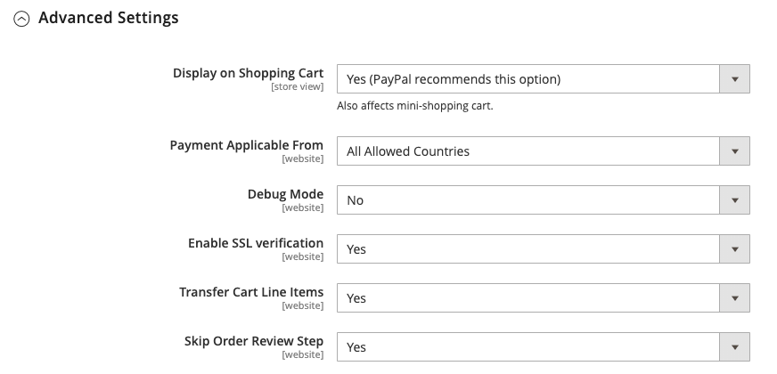

# PayPal Payments Pro

[PayPal Payments Pro](https://developer.paypal.com/docs/paypal-payments-pro/) ger dig alla fördelar med ett handlarkonto och en betalningstjänst i ett paket, plus möjligheten att skapa en egen, helt anpassad utcheckningsupplevelse. PayPal Express Checkout aktiveras automatiskt med PayPal Payments Pro, så du kan utnyttja mer än 110 miljoner aktiva PayPal-användare.

{width="700" zoomable="yes"}

>[!IMPORTANT]
>
>**PSD2-krav:**  
>Från och med den 14 september 2019 kan europeiska banker avböja betalningar som inte uppfyller kraven för [PSD2](../getting-started/compliance-payment-services-directive.md). För att uppfylla kraven i PSD2 måste PayPal Payments Pro integreras med ett plugin-program från en annan leverantör.

>[!NOTE]
>
>För närvarande finns PayPal Payments Pro i USA, Storbritannien och Kanada.

## Krav

- [PayPal Merchant-konto](https://www.paypal.com/webapps/mpp/how-to-sell-online) (med direktbetalningar aktiverade)

## Arbetsflöde för kassor

1. **Kunden går till kassan** - Kunden lägger till produkter i kundvagnen och klickar/trycker _Fortsätt till kassan_.|
1. **Kunden väljer betalningsmetod** - Vid utcheckning väljer kunden alternativet _Direktbetalning för PayPal_ och anger kreditkortsinformationen.
   - Om kunden betalar med PayPal Payments Pro stannar kunden kvar på er webbplats under utcheckningsprocessen.
   - Om kunden betalar med PayPal Express Checkout dirigeras kunden om till PayPal-webbplatsen för att slutföra transaktionen.

På kundens begäran kan butiksadministratören också skapa en order från administratören och bearbeta transaktionen med PayPal Payments Pro.

## Arbetsflöde för orderbehandling

1. **Beställning placerad** - Beställningen kan behandlas antingen av administratören för din butik eller av ditt PayPal-handlarkonto.

1. **[!UICONTROL Payment Action]** - Betalningsåtgärden som anges i konfigurationen tillämpas på ordern. Alternativen är:

   - **Auktorisera** - Commerce skapar en försäljningsorder med statusen _Bearbetning_. I det här fallet väntar det belopp som ska godkännas på godkännande.
   - **Försäljning** - Commerce skapar både en försäljningsorder och en faktura.
   - **Capture** - PayPal överför orderbeloppet från kundsaldot, bankkontot eller kreditkortet till handlarkontot.

1. **Fakturering** - En faktura skapas i Commerce när PayPal skickar ett snabbbetalningsmeddelande till Commerce.

   Kontrollera att snabbbetalningsmeddelanden är aktiverade i PayPal-handelskontot.

   >[!NOTE]
   >
   >Vid behov kan en order faktureras delvis för en viss produktkvantitet. För varje partiell faktura som skickas blir en separat Capture-transaktion med ett unikt ID tillgänglig och en separat faktura genereras.

   Betalningstransaktioner som bara är auktoriserade stängs först när hela orderbeloppet har hämtats.

   En order kan annulleras online när som helst tills orderbeloppet är helt fakturerat.

1. **Returnerar** - Om kunden returnerar de köpta produkterna och begär en återbetalning, som med orderregistrering och fakturaskapande, kan du skapa en onlineåterbetalning antingen från Admin eller från ditt PayPal-handlarkonto.

## Konfigurera ditt PayPal-konto

Innan du konfigurerar PayPal Payments Pro i Commerce måste du konfigurera ditt handlarkonto på PayPals webbplats.

1. Logga in på ditt [PayPal-företagskonto](https://manager.paypal.com/).

1. Välj **[!UICONTROL Service Settings]** på PayPal Manager-menyn.

1. Klicka på **[!UICONTROL Hosted Checkout Pages]** under **[!UICONTROL Set Up]**.

1. Under **[!UICONTROL Choose your settings]** anger du **[!UICONTROL Transaction Process Mode]** till `Live`.

1. Under **[!UICONTROL Display options on payment page]** anger du **[!UICONTROL Cancel URL Method]** till `POST`.

1. Under **[!UICONTROL Billing Information]** markerar du kryssrutorna **[!UICONTROL CSC]** för kortets säkerhetskod för både obligatoriska och redigerbara fält.

1. Under **[!UICONTROL Payment Confirmation]** anger du **[!UICONTROL Return URL Method]** till `POST`.

1. Konfigurera följande under **[!UICONTROL Security Options]**:

   - **[!UICONTROL AVS]**: `No`
   - **[!UICONTROL CSC]**: `No`
   - **[!UICONTROL Enable Secure Token]**: `Yes`

1. Klicka på **[!UICONTROL Save Changes]**.

1. Välj _på menyn_ PayPal Manager **[!UICONTROL Service Settings]** och välj _under_ Hosted Checkout Pages **[!UICONTROL Customize]**.

1. Välj **[!UICONTROL Layout C]**.

   Layout C visar endast kredit- och betalkortsfält och kan antingen ramas in på din webbplats eller användas som ett fristående popup-fönster. Storleken är fast på 490 x 565 pixlar, med extra utrymme för felmeddelanden. I vissa system åtgärdar den här inställningen ett problem med genomskinlig omdirigering.

1. Klicka på **[!UICONTROL Save and Publish]**.

1. Välj **[!UICONTROL Account Administration]** på PayPal Manager-menyn. Klicka på **[!UICONTROL Manage Security]** under **[!UICONTROL Transaction Settings]**.

1. Ange **[!UICONTROL Allow reference transactions]** till `Yes`.

1. Klicka på **[!UICONTROL Confirm]**.

   >[!NOTE]
   >
   >Om du har flera Commerce-webbplatser måste du skapa ett separat PayPal Payments Pro-konto för varje.

1. Konfigurera en annan användare (rekommenderas av PayPal):

   - Klicka på **[!UICONTROL Manage Users]** på den andra raden i huvudmenyn.

   - Klicka på **[!UICONTROL Add User]** om du vill lägga till en annan användare till kontot. Länken finns precis ovanför rubriken Hantera användare.

   - Fyll i de obligatoriska fälten i följande avsnitt i formuläret _[!UICONTROL Add User]_:

      - [!UICONTROL Admin Confirmation]
      - [!UICONTROL User Information]
      - [!UICONTROL User Login Information]
      - [!UICONTROL Assign Privilege to User]

   - Klicka på **[!UICONTROL Update]**.

1. Logga ut från ditt PayPal-konto.

## Ställ in PayPal Payments Pro i Commerce

>[!NOTE]
>
>Du kan ha två PayPal-lösningar aktiva samtidigt: [PayPal Express Checkout](paypal-express-checkout.md), plus någon av [allt-i-ett-lösningarna](paypal.md#paypal-all-in-one-payment-solutions). Om du ändrar betalningslösningar inaktiveras den som användes tidigare automatiskt.

>[!TIP]
>
>Klicka på **[!UICONTROL Save Config]** när du vill spara förloppet.

### Steg 1: Påbörja konfigurationen

1. Gå till _>_ > **[!UICONTROL Stores]** på sidofältet _[!UICONTROL Settings]_&#x200B;Admin **[!UICONTROL Configuration]**.

1. Expandera **[!UICONTROL Sales]** i den vänstra panelen och välj **[!UICONTROL Payment Methods]**.

1. Om din Commerce-installation har flera webbplatser, butiker eller vyer anger du **[!UICONTROL Store View]** i butiksvyn där du vill använda den här konfigurationen.

1. I avsnittet _[!UICONTROL Merchant Location]_&#x200B;väljer du **[!UICONTROL Merchant Country]**&#x200B;där ditt företag finns.

   Den här inställningen bestämmer valet av PayPal-lösningar som visas i konfigurationen.

   {width="600" zoomable="yes"}

1. Expandera **[!UICONTROL PayPal All-in-One Payment Solution]** och klicka på **[!UICONTROL Configure]** för **[!UICONTROL Payments Pro]**.

   {width="600" zoomable="yes"}

### Steg 2: Slutför de obligatoriska PayPal-inställningarna

1. Expandera  i avsnittet **[!UICONTROL Payments Pro and Express Checkout]**.

   {width="600" zoomable="yes"}

1. (Valfritt) Ange **[!UICONTROL Email Associated with your PayPal Merchant Account]**.

   >[!IMPORTANT]
   >
   >E-postadresser är skiftlägeskänsliga. För att kunna ta emot betalning måste e-postadressen matcha den e-postadress som har angetts i PayPal-handelskontot.

   Om du inte har något PayPal-konto klickar du på **[!UICONTROL Start accepting payments via PayPal]**.

1. Ange en av följande autentiseringsuppgifter som du använder för att logga in på ditt PayPal-handelskonto:

   - **[!UICONTROL Partner]** - Ditt PayPal Partner-ID.
   - **[!UICONTROL Vendor]** - Ditt PayPal-användarnamn.
   - **[!UICONTROL User]** - ID:t för en annan användare som är konfigurerad för ditt PayPal-konto.

1. Ange **[!UICONTROL Password]** som är associerad med ditt PayPal-konto.

1. Om du vill köra testtransaktioner anger du **[!UICONTROL Test Mode]** till `Yes`.

   När du testar konfigurationen i en sandlåda ska du bara använda [kreditkortsnummer](https://www.paypalobjects.com/en_AU/vhelp/paypalmanager_help/credit_card_numbers.htm) som rekommenderas av PayPal. När du är redo att börja producera återgår du till konfigurationen och ställer in testläget på `No`.

1. Om systemet använder en proxyserver för att upprätta anslutningen till PayPal-systemet anger du **[!UICONTROL Use Proxy]** till `Yes` och gör följande:

   - Ange IP-adressen för **[!UICONTROL Proxy Host]**.

   - Ange portnumret för **[!UICONTROL Proxy Port]**.

   En proxy används när serverns brandvägg förhindrar direktåtkomst till PayPal-servern. I så fall används en tredjepartsserver för att vidarebefordra trafik.

1. Ange **[!UICONTROL Enable this Solution]** till `Yes`.

1. Om du vill erbjuda dina kunder [PayPal-kredit](paypal.md#paypal-credit-and-pay-later) anger du **[!UICONTROL Enable PayPal Credit]** till `Yes`.

1. Om du vill lagra information om kundbetalningar/kreditkort på ett säkert sätt, så att kunderna inte behöver ange betalningsinformation igen varje gång, anger du **[!UICONTROL Vault Enabled]** till `Yes`.

### Steg 3: Ställa in annonsering för PayPal-kredit/Adverise PayPal PayLater (valfritt)

Från och med version 2.4.3 stöds PayPal PayLater i distributioner som inkluderar PayPal. Med den här funktionen kan kunderna betala för en beställning varannan vecka i stället för att betala hela beloppet vid köptillfället. PayPal-kreditupplevelsen är föråldrad.

Ange **[!UICONTROL Enable PayPal PayLater Experience]** till något av följande:

- `Yes` - Om du vill konfigurera annonser för PayPal PayLater
- `No` - För att konfigurera annonsering för PayPal-kredit

#### Annonsera PayPal Credit

1. Expandera  i avsnittet **[!UICONTROL Advertise PayPal Credit]**.

   {width="600" zoomable="yes"}

1. Om du vill hämta din kontoinformation klickar du på **[!UICONTROL Get Publisher ID from PayPal]** och följer instruktionerna.

1. Ange din **[!UICONTROL Publisher ID]**.

1. Expandera  i avsnittet **[!UICONTROL Home Page]**.

   {width="600" zoomable="yes"}

1. Om du vill placera en banderoll på sidan anger du **[!UICONTROL Display]** till `Yes`.

1. Ange **[!UICONTROL Position]** till något av följande:

   - `Header (center)`
   - `Sidebar (right)`

1. Ange **[!UICONTROL Size]** till något av följande:

   - `190 x 100`
   - `234 x 60`
   - `300 x 50`
   - `468 x 60`
   - `728 x 90`
   - `800 x 66`

1. Expandera  för de återstående avsnitten och upprepa föregående steg:

   - **[!UICONTROL Catalog Category Page]**
   - **[!UICONTROL Catalog Product Page]**
   - **[!UICONTROL Checkout Cart Page]**

#### Annonsera PayPal PayLater

1. Expandera  i avsnittet **[!UICONTROL Advertise PayPal PayLater]**.

1. Ange **[!UICONTROL Enable PayPal PayLater]** till `Yes`.

1. Expandera  i avsnittet **[!UICONTROL Home Page]**.

   {width="600" zoomable="yes"}

1. Om du vill placera en banderoll på sidan anger du **[!UICONTROL Display]** till `Yes`.

1. Ange **[!UICONTROL Position]** till något av följande:

   - `Header (center)`
   - `Sidebar`

1. Ange **[!UICONTROL Style Layout]** till något av följande:

   - `Text`
   - `Flex`

1. För [!UICONTROL Style Layout] **[!UICONTROL Text]** anger du **[!UICONTROL Logo Type]** till något av följande:

   - `Primary`
   - `Alternative`
   - `Inline`
   - `None`

1. För [!UICONTROL Style Layout] **[!UICONTROL Text]** anger du **[!UICONTROL Logo Position]** till något av följande:

   - `Left`
   - `Right`
   - `Top`

1. För [!UICONTROL Style Layout] **[!UICONTROL Text]** anger du **[!UICONTROL Text Color]** till något av följande:

   - `Black`
   - `White`
   - `Monochrome`
   - `Grayscale`

1. För [!UICONTROL Style Layout] **[!UICONTROL Text]** anger du **[!UICONTROL Text Size]** till något av följande:

   - `10px`
   - `11px`
   - `12px`
   - `13px`
   - `14px`
   - `15px`
   - `16px`

1. För [!UICONTROL Style Layout] **[!UICONTROL Flex]** anger du **[!UICONTROL Ratio]** till något av följande:

   - `1x1`
   - `1x4`
   - `8x1`
   - `20x1`

1. För [!UICONTROL Style Layout] **[!UICONTROL Flex]** anger du **[!UICONTROL Color]** till något av följande:

   - `Blue`
   - `Black`
   - `White`
   - `White No Border`
   - `Gray`
   - `Monochrome`
   - `Grayscale`

1. Expandera  för de återstående avsnitten och upprepa föregående steg:

   - **[!UICONTROL Catalog Product Page]**
   - **[!UICONTROL Checkout Cart Page]**
   - **[!UICONTROL Checkout Payment Step]**
   - **[!UICONTROL Catalog Category Page]**

### Steg 4: Slutför de grundläggande inställningarna

1. Expandera  i avsnittet **[!UICONTROL Basic Settings - PayPal Payments Pro]**.

   {width="600" zoomable="yes"}

1. För **[!UICONTROL Title]** anger du en titel som identifierar PayPal Payments Pro under utcheckningen.

   Vi rekommenderar att du använder titeln _Debit eller Credit Card_.

1. Om du erbjuder flera betalningsmetoder anger du ett nummer för **[!UICONTROL Sort Order]** för att bestämma i vilken ordning PayPal Payments Pro ska visas när det visas med andra betalningsmetoder under utcheckning.

   Det här talet är relativt till de andra betalningsmetoderna. (`0` = först, `1` = sekund, `2` = tredje o.s.v.)

1. Ange **[!UICONTROL Payment Action]** till något av följande:

   - `Authorization` - Godkänn köpet, men spärrar pengarna. Beloppet dras inte tillbaka förrän det _har hämtats_ av handlaren.
   - `Sale` - Köpbeloppet är auktoriserat och dras omedelbart tillbaka från kundkontot.

1. För **[!UICONTROL Credit Card Settings]** väljer du de kreditkort som du godkänner för betalning i din butik.

   Om du vill markera flera kort håller du ned Ctrl (PC) eller Kommando (Mac) och klickar på vart och ett av dem.

   >[!NOTE]
   >
   >American Express kräver ett extra avtal.

### Steg 5: Slutför de avancerade inställningarna

1. Expandera  i avsnittet **[!UICONTROL Advanced Settings]**.

   {width="600" zoomable="yes"}

1. Ange **[!UICONTROL Payment Applicable From]** till något av följande:

   - `All Allowed Countries` - Kunder från alla [länder](../getting-started/store-details.md#country-options) som anges i din butikskonfiguration kan använda den här betalningsmetoden.
   - `Specific Countries` - När du har valt det här alternativet visas listan _[!UICONTROL Payment from Specific Countries]_. Håll ned Ctrl-tangenten (PC) eller Kommando-tangenten (Mac) och markera varje land i listan där kunderna kan göra inköp från din butik.

1. Om du vill skriva kommunikation med betalningssystemet till loggfilen anger du **[!UICONTROL Debug Mode]** till `Yes`.

   >[!NOTE]
   >
   >I enlighet med PCI-datasäkerhetsstandarder registreras inte kreditkortsinformation i loggfilen.

1. Ange **[!UICONTROL Enable SSL Verification]** till `Yes` om du vill aktivera verifiering av värdautenticitet.

1. Ange **[!UICONTROL Require CVV Entry]** till `Yes` om du vill att kunderna ska ange en CVV-kod.

1. Expandera  i avsnittet **[!UICONTROL CVV and AVS Settings]**.

1. Om du vill avgöra när en transaktion ska avvisas när adressverifieringssystemet identifierar en avvikelse anger du hur du ska hantera följande scenarier:

   - Ange **[!UICONTROL AVS Street Does Not Match]** till `Yes` om du vill avvisa en transaktion som baseras på en felmatchad gatufelmatchning.

   - Om du vill avvisa en transaktion baserat på ett felaktigt matchat postnummer anger du **[!UICONTROL AVS Zip Does Not Match]** till `Yes`.

   - Om du vill avvisa en transaktion baserat på en felaktig matchning av en lands-ID anger du **[!UICONTROL International AVS Indicator Does Not Match]** till `Yes`.

   - Om du vill avvisa en transaktion baserat på en felaktig CVV-kod anger du **[!UICONTROL International Card Security Code Does Not Match]** till `Yes`.

   {width="600" zoomable="yes"}

1. Fyll i följande avsnitt efter behov:

   - [Inställningar för kvittningsrapport](#settlement-report-settings)
   - [Frontend Experience Settings](#frontend-experience-settings)

#### Inställningar för kvittningsrapport

1. Expandera  i avsnittet **[!UICONTROL Settlement Report Settings]**.

   {width="600" zoomable="yes"}

1. Gör följande för **[!UICONTROL SFTP Credentials]**:

   - Om du har registrerat dig för PayPals säkra FTP-server anger du följande inloggningsuppgifter för SFTP:

      - Inloggning
      - Lösenord

   - Om du vill köra testrapporter innan du publicerar med Payments Pro på din webbplats anger du **[!UICONTROL Sandbox Mode]** till `Yes`.

   - Ange **[!UICONTROL Custom Endpoint Hostname or IP Address]**.

     Som standard är värdet `reports.paypal.com`.

   - Ange **[!UICONTROL Custom Path]** där rapporter sparas.

     Som standard är värdet `/ppreports/outgoing`.

1. Om du vill generera rapporter enligt ett schema, fyll i inställningarna för **[!UICONTROL Scheduled Fetching]**:

   - Ange **[!UICONTROL Enable Automatic Fetching]** till `Yes`.

   - Ange **[!UICONTROL Schedule]** till något av följande:

      - `Daily`
      - `Every 3 Days`
      - `Every 7 Days`
      - `Every 10 Days`
      - `Every 14 Days`
      - `Every 30 Days`
      - `Every 40 Days`

     PayPal bevarar varje rapport i 45 dagar.

   - Ange **[!UICONTROL Time of Day]** till timma, minut och sekund när du vill att rapporterna ska genereras.

#### Frontend Experience Settings

Använd _[!UICONTROL Frontend Experience Settings]_&#x200B;för att välja vilka PayPal-logotyper som ska visas på din webbplats och för att anpassa utseendet på PayPal-handlarsidorna.

1. Expandera  i avsnittet **[!UICONTROL Frontend Experience Settings]**.

   {width="600" zoomable="yes"}

1. Markera **[!UICONTROL PayPal Product Logo]** som du vill ska visas i PayPal-blocket i din butik.

   PayPal-logotyperna finns i fyra format och två storlekar:

   - `No Logo`
   - `We Prefer PayPal (150 x 60 or 150 x 40)`
   - `Now Accepting PayPal (150 x 60 or 150 x 40)`
   - `Payments by PayPal (150 x 60 or 150 x 40)`
   - `Shop Now Using PayPal (150 x 60 or 150 x 40)`

1. Så här anpassar du utseendet på PayPal-handlarsidorna:

   - Ange namnet på **[!UICONTROL Page Style]** som du vill tillämpa på dina PayPal-handlarsidor:

      - `paypal` - Använder sidformatet PayPal.
      - `primary` - Använder det sidformat som du identifierade som _primär_-format i din kontoprofil.
      - `your_custom_value` - Använder ett anpassat betalningssidformat som anges i din kontoprofil.

   - För **[!UICONTROL Header Image URL]** anger du URL-adressen till bilden som du vill ska visas i det övre vänstra hörnet på betalningssidan. Den maximala filstorleken är 750 pixlar bred och 90 pixlar hög.

     >[!NOTE]
     >
     >PayPal rekommenderar att bilden finns på en säker server (https). Annars kan en webbläsare varna för att _sidan innehåller både säkra och osäkra objekt_.

   - Om du vill ange färg för sidorna anger du hexadecimalkoden på sex tecken, utan symbolen `#`, för vart och ett av följande:

      - **[!UICONTROL Header Background Color]** - Bakgrundsfärg för sidhuvudet i kassan.
      - **[!UICONTROL Header Border Color]** - Färg för en kant på två pixlar runt huvudet.
      - **[!UICONTROL Page Background Color]** - Bakgrundsfärg för utcheckningssidan och runt rubriken och betalningsformuläret.

### Steg 6: Slutför de grundläggande inställningarna för PayPal Express Checkout

1. Expandera  i avsnittet **[!UICONTROL Basic Settings - PayPal Express Checkout]**.

   {width="600" zoomable="yes"}

1. För **[!UICONTROL Title]** anger du en titel som identifierar betalningsmetoden vid utcheckning.

   Du bör ange titeln till _PayPal_ för varje butiksvy.

1. Om du erbjuder flera betalningsmetoder anger du ett nummer för **[!UICONTROL Sort Order]** för att bestämma i vilken ordning som PayPal Express Checkout ska visas när den visas tillsammans med andra betalningsmetoder.

   Det här talet är relativt till de andra betalningsmetoderna. (`0` = först, `1` = sekund, `2` = tredje o.s.v.)

1. Ange **[!UICONTROL Payment Action]** till något av följande:

   - `Authorization` - Godkänner köpet och spärrar pengarna. Beloppet dras inte tillbaka förrän det _har hämtats_ av handlaren.
   - `Sale` - Köpbeloppet är auktoriserat och dras omedelbart tillbaka från kundens konto.

1. Om du vill visa knappen _[!UICONTROL Check out with PayPal]_&#x200B;på produktsidan anger du **[!UICONTROL Display on Product Details Page]**&#x200B;till `Yes`.

### Steg 7: Slutför de avancerade inställningarna för PayPal Express Checkout

1. Expandera  i avsnittet **[!UICONTROL Advanced Settings]**.

   {width="600" zoomable="yes"}

1. Ange **[!UICONTROL Display on Shopping Cart]** till `Yes`.

1. Ange **[!UICONTROL Payment Applicable From]** till något av följande:

   - `All Allowed Countries` - Kunder från alla [länder](../getting-started/store-details.md#country-options) som anges i din butikskonfiguration kan använda den här betalningsmetoden.
   - `Specific Countries` - När du har valt det här alternativet visas listan _[!UICONTROL Payment from Specific Countries]_. Om du vill markera flera länder håller du ned Ctrl (PC) eller Kommando (Mac) och klickar på varje objekt.

1. Om du vill skriva kommunikation med betalningssystemet till loggfilen anger du **[!UICONTROL Debug Mode]** till `Yes`.

   >[!NOTE]
   >
   >I enlighet med PCI-datasäkerhetsstandarder registreras inte kreditkortsinformation i loggfilen.

1. Ange **[!UICONTROL Enable SSL Verification]** till `Yes` om du vill aktivera verifiering av värdautenticitet.

1. Om du vill visa en fullständig sammanfattning av kundorder per radobjekt från PayPal-webbplatsen anger du **[!UICONTROL Transfer Cart Line Items]** till `Yes`.

1. Om du vill att kunden ska kunna slutföra transaktionen från PayPal-webbplatsen utan att gå tillbaka till din butik för ordergranskning anger du **[!UICONTROL Skip Order Review Step]** till `Yes`.

1. Klicka på **[!UICONTROL Save Config]** när du är klar.
