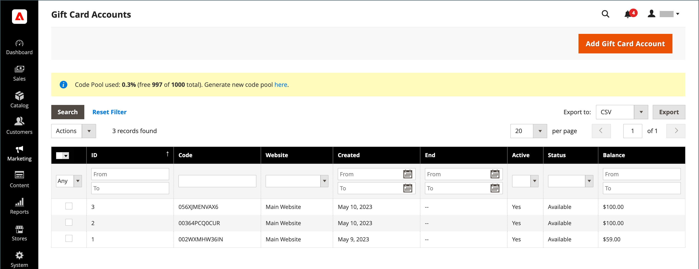

# Presentkortskonton

Ett presentkortskonto skapas automatiskt för varje presentkort som köpts. Värdet på presentkortet kan sedan användas vid köpet av en produkt i din butik. Du kan också skapa presentkortskonton från administratören som en kampanj eller tjänst för kunder. Presentkortets kontonummer motsvarar presentkortets kod.

{width="700" zoomable="yes"}

## Konfigurera presentkortskonton

Presentkortskonfigurationen fastställer standardinställningarna för alla presentkort för butiksvyn och hanterar kodpoolen. Kodpoolen är en uppsättning unika presentkortskoder i ett visst format. Koder från poolen används varje gång ett presentkortskonto skapas. Butiksadministratören måste se till att det finns tillräckligt med koder för presentkortsförsäljning. Se till att generera en kodpool innan du erbjuder presentkort för försäljning. Som standard genererar Adobe Commerce 1 000 koder. En ny kodpool genereras inte förrän det inte finns några fler koder tillgängliga i den aktuella poolen.

### Steg 1: Konfigurera e-postmeddelanden

1. Gå till **[!UICONTROL Stores]** > _[!UICONTROL Settings]_>**[!UICONTROL Configuration]**&#x200B;på sidofältet_ Admin _.

1. Expandera **[!UICONTROL Sales]** i den vänstra panelen och välj **[!UICONTROL Gift Cards]**.

1. Expandera  i avsnittet _[!UICONTROL Gift Card Email Settings]_&#x200B;och gör följande:

   - Ange **[!UICONTROL Gift Card Notification Email Sender]** till den butiksidentitet som visas som avsändare av presentkortsmeddelanden.

   - Ange **[!UICONTROL Gift Card Notification Email Template]** till mallen som används för meddelandet.

   {width="600" zoomable="yes"}

1. Expandera  i avsnittet _[!UICONTROL Email Sent from Gift Card Account Management]_&#x200B;och gör följande:

   - Ange **[!UICONTROL Gift Card Email Sender]** till butiksidentiteten så att den visas som avsändare av presentkorten.

   - Ange **[!UICONTROL Gift Card Template]** till den mall som du vill använda för presentkortet.

Se [Lagra e-postadresser](../configuration-reference/general/store-email-addresses.md) för specifika konfigurationsfält och alternativ.

### Steg 2: Slutför de allmänna inställningarna

1. Expandera  i avsnittet _[!UICONTROL Gift Card General Settings]_.

1. Om du vill tillåta kunden att lösa in värdet på kortet för kontanter anger du **[!UICONTROL Redeemable]** till `Yes`.

1. För **[!UICONTROL Lifetime (days)]** anger du antalet dagar innan kortet förfaller.

   Om det inte finns något förfallodatum lämnar du fältet tomt.

   >[!NOTE]
   >
   >Beroende på var du befinner dig kan det vara olagligt att ett presentkort upphör att gälla. Kontrollera de lokala lagarna innan du anger en livstid för dina presentkort.

1. Om du vill att kunderna ska kunna ange ett meddelande som medföljer presentkortet anger du **[!UICONTROL Allow Gift Message]** till `Yes` och anger antalet tecken som är tillgängliga för meddelandet för **[!UICONTROL Gift Message Maximum Length]**.

1. Ange **[!UICONTROL Generate Gift Card Account when Orders Item is]** till något av följande:

   - `Ordered` - Presentkortskontot skapas när ordern placeras.
   - `Invoiced` - Presentkortskontot skapas när betalningen har hämtats och ordern har fakturerats.

   {width="600" zoomable="yes"}

### Steg 3: Upprätta poolen med presentkortskoder

1. Expandera  i avsnittet _[!UICONTROL Gift Card Account General Settings]_&#x200B;och gör följande:

   {width="600" zoomable="yes"}

   - Om du vill anpassa koden fyller du i följande:

      - Kodlängd
      - Kodformat
      - Kodprefix
      - Kodsuffix
      - Streck var X tecken

   - Ange **[!UICONTROL New Pool Size]** om du vill avgöra hur många koder som ska genereras.

   - Ange **[!UICONTROL Low Code Pool Threshold]** om du vill ange när du får ett meddelande om att återställa kodpoolen.

1. Klicka på **[!UICONTROL Save Config]** innan du genererar kodpoolen.

1. Klicka på **[!UICONTROL Generate]**.

1. Klicka på **[!UICONTROL Save Config]** när du är klar.

## Granska ett befintligt presentkortskonto

1. Så här hittar du numret på presentkortskontot för en aktuell order:

   - Gå till **[!UICONTROL Sales]** > _[!UICONTROL Operations]_>**[!UICONTROL Orders]**&#x200B;på sidofältet_ Admin _.

   - Leta reda på ordningen i listan och klicka på **[!UICONTROL View]** i kolumnen _[!UICONTROL Action]_.

   - Bläddra ned till avsnittet _[!UICONTROL Items Ordered]_.

   Talet finns i kolumnen _[!UICONTROL Product]_, under **[!UICONTROL Gift Card Accounts]**.

1. Gå till **[!UICONTROL Marketing]** > _[!UICONTROL Promotions]_>**[!UICONTROL Gift Card Accounts]**&#x200B;på sidofältet_ Admin _.

1. Hitta presentkortskontot i rutnätet och öppna det i redigeringsläge.

   Presentkortskoden visas högst upp i avsnittet _Information_.

   {width="600" zoomable="yes"}

## Skapa ett presentkortskonto

1. Gå till **[!UICONTROL Marketing]** > _[!UICONTROL Promotions]_>**[!UICONTROL Gift Card Accounts]**&#x200B;på sidofältet_ Admin _.

1. Klicka på **[!UICONTROL Add Gift Card Account]** i det övre högra hörnet.

1. I avsnittet _[!UICONTROL Information]_&#x200B;anger du **[!UICONTROL Active]**&#x200B;till `Yes` och gör följande:

   - Om du vill att kortsaldot ska kunna lösas in vid utcheckning eller överföras till kundens butikskrediter anger du **[!UICONTROL Redeemable]** till `Yes`.

   - Välj **[!UICONTROL Website]** där presentkortskontot kan användas.

   - Ange den första **[!UICONTROL Balance]** på presentkortet.

   - _(Valfritt)_ Om du vill ange ett **[!UICONTROL Expiration Date]** för presentkortet väljer du datumet i kalenderns .

     Om inget anges går presentkortskontot inte ut.

     {width="600" zoomable="yes"}

1. Välj **[!UICONTROL Send Gift Card]** i den vänstra panelen och gör följande:

   - Ange **[!UICONTROL Recipient Email]**-adressen.

   - Ange **[!UICONTROL Recipient Name]**.

   - Ange **[!UICONTROL Send Email from the Following Store View]** till butiksvyn som visas som avsändare av presentkortsmeddelandet.

   {width="600" zoomable="yes"}

1. Spara det nya kontot genom att göra något av följande:

   - Om du inte är redo att skicka presentkortet klickar du på **[!UICONTROL Save]**.

   - Om du vill spara ändringarna och skicka presentkortet via e-post till mottagaren klickar du på **Spara och skicka e-post**.

## Visa presentkortets kontohistorik

1. Gå till **[!UICONTROL Marketing]** > _[!UICONTROL Promotions]_>**[!UICONTROL Gift Card Accounts]**.

1. Öppna presentkortet i redigeringsläge.

1. **[!UICONTROL History]** av presentkortet visas.

   {width="600" zoomable="yes"}

| Kolumn | Beskrivning |
|--- |--- |
| [!UICONTROL ID] | Ett unikt nummer av handling med presentkort. |
| [!UICONTROL Date] | Datum för åtgärd. |
| [!UICONTROL Action] | Avgör alla möjliga åtgärder med ett presentkort. Alternativ: `Created` / `Updated` / `Sent` / `Used` / `Redeemed` / `Expired` |
| [!UICONTROL Balance Change] | Visar det belopp med vilket presentkortets saldo har ändrats. |
| [!UICONTROL Balance] | Anger tillgängligt saldo. |
| [!UICONTROL More Information] | Visar information om vem som har ändrat saldot på presentkortet. |

{style="table-layout:auto"}

## Ta bort ett presentkortskonto

1. Gå till **[!UICONTROL Marketing]** > _[!UICONTROL Promotions]_>**[!UICONTROL Gift Card Accounts]**&#x200B;på sidofältet_ Admin _.

1. Markera presentkortskontot som ska tas bort och öppna det i redigeringsläge.

1. Klicka på **[!UICONTROL Delete]** på menyraden.

1. Bekräfta åtgärden genom att klicka på **[!UICONTROL OK]**.

## Kolumnbeskrivningar

| Kolumn | Beskrivning |
|--- |--- |
| [!UICONTROL ID] | En unik numerisk identifierare som tilldelas presentkortskontot. |
| [!UICONTROL Code] | Koden som måste anges för att ett presentkort ska kunna användas. |
| [!UICONTROL Website] | Anger de webbplatser där presentkortskontot är tillgängligt. |
| [!UICONTROL Created] | Skapad den. |
| [!UICONTROL End] | Förfallodatum för presentkort, om det är schemalagt. |
| [!UICONTROL Active] | Anger om presentkortet är aktivt. |
| [!UICONTROL Status] | Avgör om presentkortet löses in i kundens konto eller är tillgängligt. Alternativ: `Used` / `Redeemed` / `Expired` |
| [!UICONTROL Balance] | Anger tillgängligt saldo. |

{style="table-layout:auto"}
