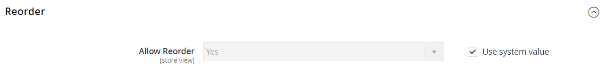

# Tillåt ombeställningar

När det här alternativet är aktiverat kan ombeställningar göras direkt från kundkontot eller från den ursprungliga ordern i _Admin_. Ordna om är aktiverat som standard.

{width="700" zoomable="yes"}

## Villkor för att ändra ordning ska aktiveras för en order

- Konfigurationsalternativet _Tillåt omsortering_ måste vara aktiverat.

- Om ordningen har statusen `Hold` eller `Payment Review` inaktiveras alternativet för omsortering.

- Om något av objekten i ordningen inte är tillgängligt, inte finns i lager eller är inaktiverat, är alternativet för omsortering inaktiverat i butiken.

- En _administratör_ kan ändra ordningen även om något av objekten inte finns i lager eller är inaktiverat.

## Konfigurera för att tillåta kundombeställningar

1. Gå till **[!UICONTROL Stores]** > _[!UICONTROL Settings]_>**[!UICONTROL Configuration]**&#x200B;på sidofältet_ Admin _.

1. Expandera **[!UICONTROL Sales]** i den vänstra panelen och välj **[!UICONTROL Sales]** under.

1. Expandera  i avsnittet **[!UICONTROL Reorder]**.

   {width="600" zoomable="yes"}

1. Ange **[!UICONTROL Allow Reorder]** till `Yes`.

   Den här inställningen aktiverar funktionen för omsortering från kundkontot i listan över butiker eller order i Admin.

1. Klicka på **[!UICONTROL Save Config]**.

## Sortera om från butiken

Kunden kan initiera omsorteringsfunktionen för en viss order från två sidor:

- _Sidan Mina beställningar_

- _Ordervy_ sida

### Mina beställningar

Knappen _Ändra ordning_ visas alltid i listan med beställningar (även om alla produkter i beställningen inte är tillgängliga för omsortering).

{width="700" zoomable="yes"}

**Fall 1.** Alla produkter i beställningen är **tillgängliga** för omsortering

Användaren dirigeras om till kundvagnen och alla produkter läggs till i kundvagnen

{width="700" zoomable="yes"}

**Fall 2.** Vissa produkter i beställningen är **inte tillgängliga** för omsortering

>[!NOTE]
>
>Det går att ordna om `Not Visible Individually` produkter.

Knappen _Ändra ordning_ visas inte på sidorna _Mina beställningar_ och _Visa ordning_.

{width="700" zoomable="yes"}

### Sidan Ordervy

**Fall 1.** Alla produkter från ordern är tillgängliga för ombeställning

Användaren dirigeras om till kundvagnen och alla produkter läggs till i kundvagnen

**Fall 2.** Vissa produkter i beställningen är **inte tillgängliga** för omsortering

>[!NOTE]
>
>Det går att ordna om `Not Visible Individually` produkter.

Knappen _Ändra ordning_ visas inte på sidorna _Mina beställningar_ och _Visa ordning_.

{width="700" zoomable="yes"}

### Kundvagnen är inte tom

Om kundvagnen inte är tom och användaren klickar på **[!UICONTROL Reorder]** (från sidan _Mina beställningar_ eller _Ordervyn_) finns produkterna kvar i kundvagnen med de nya beställningsprodukterna.

{width="700" zoomable="yes"}

## Ändra ordning från administratören

1. Gå till **[!UICONTROL Sales]** > **[!UICONTROL Orders]** på sidofältet _Admin_.

1. Leta reda på ordningen och öppna i **[!UICONTROL View]**-läge.

1. Klicka på **[!UICONTROL Reorder]** som visas i det övre knappfältet.

   {width="600" zoomable="yes"}

   När du har klickat på **[!UICONTROL Reorder]** öppnas sidan _Skapa ny ordning_ med sorteringsprodukter.

   {width="600" zoomable="yes"}

1. Fyll i alla obligatoriska fält efter behov.

1. Klicka på **[!UICONTROL Submit Order]** om du vill skicka ordern.
