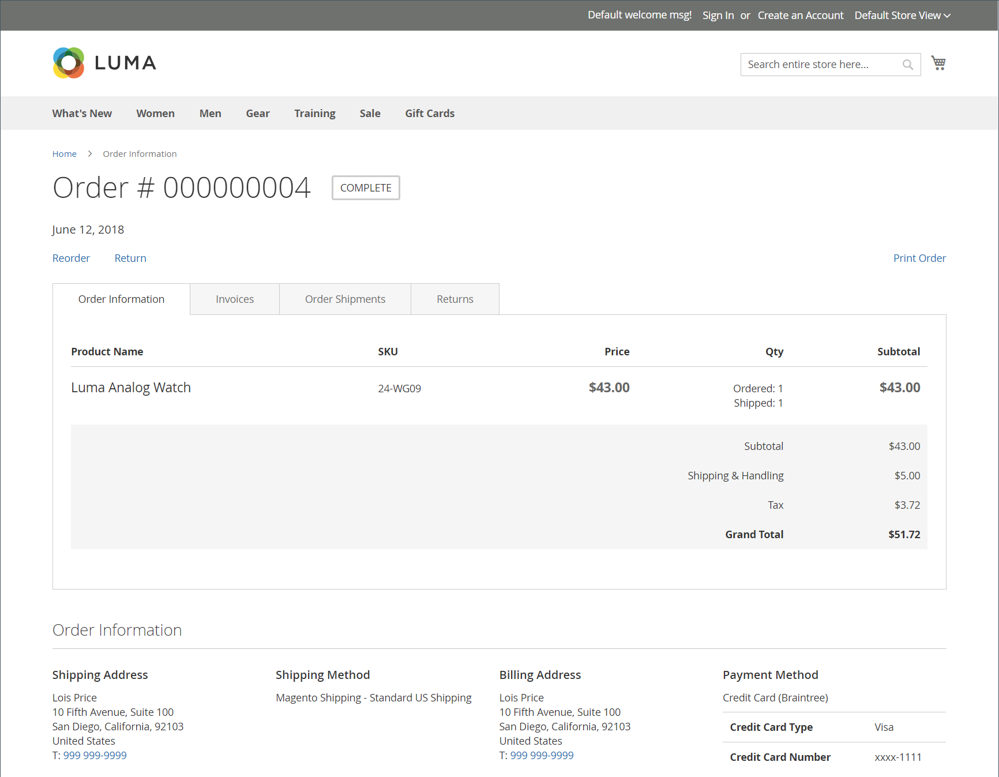

# Returnerar butiksupplevelsen

{{ee-feature}}

Kunder kan använda något av följande för att begära en RMA från butiken:

- [Beställningar och returwidget](../content-design/widget-orders-returns.md) i sidofältet
- Länken _Beställningar och returnering_ i sidfoten

Det bästa är att du tar med en beskrivning av dina RMA-krav och RMA-processer i kundtjänstens policy.

>[!NOTE]
>
>Om du vill samla in ytterligare information om returer kan du lägga till egna [returer](attributes-returns.md)-attribut.

All kundens RMA-information visas på sidan **[!UICONTROL My Returns]** på kontrollpanelen för kundkonton.

{width="700" zoomable="yes"}

## Begär en RMA

Kunden utför följande steg i butiken för att skicka in en RMA:

1. Klicka på **[!UICONTROL Orders and Returns]** i sidfoten.

1. Anger orderinformationen:

   - Order-ID
   - Efternamn för fakturering
   - E-post

1. Klicka på **[!UICONTROL Continue]**.

   {width="700" zoomable="yes"}

1. Under orderdatumet klickar du på **[!UICONTROL Return]**.

   {width="700" zoomable="yes"}

1. Väljer vilket objekt som ska returneras och anges i **[!UICONTROL Quantity to Return]**.

1. Anger **[!UICONTROL Resolution]** till något av följande:

   - Exchange
   - [Återbetalning](../customers/refunds-customer-account.md)
   - [Butikskrediter](../customers/store-credit-using.md)

1. Anger **[!UICONTROL Item Condition]** till något av följande:

   - `Unopened`
   - `Opened`
   - `Damaged`

1. Anger **[!UICONTROL Reason to Return]** till något av följande:

   - `Wrong Color`
   - `Wrong Size`
   - `Out of Service`
   - `Other`

   {width="700" zoomable="yes"}

1. Anger **[!UICONTROL Contact Email Address]** och **[!UICONTROL Comments]** om det behövs.

   >[!NOTE]
   >
   >Om ordern innehåller flera artiklar och kunden vill returnera ett till objekt, kan de klicka på **[!UICONTROL Add Item To Return]**, markera objektet och sedan ange alla angivna alternativ.

1. Klicka på **[!UICONTROL Submit]**.
