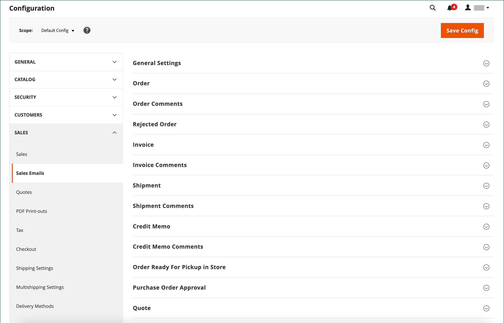

# E-post

Flera e-postmeddelanden utlöses av händelser som är relaterade till en ordning och konfigurationen är liknande. Se till att du identifierar den butikskontakt som visas som avsändare av meddelandet, den e-postmall som ska användas och alla andra som ska få en kopia av meddelandet. Försäljningsmeddelanden kan skickas när de aktiveras av en händelse eller med ett förbestämt intervall.

{width="600" zoomable="yes"}

## Steg 1. Uppdatera e-postmallarna

Glöm inte att uppdatera mallen [email header](../systems/email-template-custom.md#header-template) så att den speglar ditt varumärke och de andra e-postmallarna efter behov. En fullständig lista över mallar finns i [E-postmallar](../systems/email-templates.md).

## Steg 2. Välj typ av överföring

1. Gå till **[!UICONTROL Stores]** > _[!UICONTROL Settings]_>**[!UICONTROL Configuration]**&#x200B;på sidofältet_ Admin _.

1. Expandera **[!UICONTROL Sales]** i den vänstra panelen och välj **[!UICONTROL Sales Emails]**.

1. Expandera  i avsnittet **[!UICONTROL General Settings]** om det behövs.

   {width="600" zoomable="yes"}

   Som standard är asynkron sändning inställd på `Disable`. Om du vill ändra systeminställningen avmarkerar du kryssrutan **[!UICONTROL Use system value]** och anger **[!UICONTROL Asynchronous sending]** till något av följande:

   - `Disable` - Skickar e-post för försäljning när den aktiveras av en händelse.
   - `Enable` - Skickar e-post med förbestämda, regelbundna intervall.

   Adobe Commerce Support rekommenderar att asynkron sändning aktiveras för att förbättra orderplaceringens prestanda. Se [Bästa praxis för konfiguration av beställningsbearbetning](https://experienceleague.adobe.com/docs/commerce-operations/implementation-playbook/best-practices/maintenance/order-processing-configuration.html?lang=sv-SE) i Adobe Commerce Support Knowledge Base.

## Steg 3. Fyll i informationen för varje e-postmeddelande

1. Expandera  i avsnittet **[!UICONTROL Order]** om det behövs.

   {width="600" zoomable="yes"}

1. Kontrollera att **[!UICONTROL Enabled]** är inställt på `Yes` (standard).

1. Ange **[!UICONTROL New Order Confirmation Email]** till den butikskontakt som visas som meddelandets avsändare.

1. Ange **[!UICONTROL New Order Confirmation Template]** till mallen som används för e-postmeddelandet som skickas till registrerade kunder.

1. Ange **[!UICONTROL New Order Confirmation Template for Guest]** till mallen som används för e-postmeddelandet som skickas till gäster som inte har något konto hos din butik.

1. För **[!UICONTROL Send Order Email Copy To]** anger du e-postadressen till alla som ska få en kopia av det nya e-postmeddelandet med beställningen.

   Om du skickar en kopia till flera mottagare avgränsar du varje adress med ett kommatecken.

1. Ange **[!UICONTROL Send Order Email Copy Method]** till något av följande:

   - `Bcc` - Skickar en _kopia med blindhet_ genom att inkludera mottagaren i huvudet i samma e-postmeddelande som skickas till kunden. Mottagaren av hemlig kopia är inte synlig för kunden.
   - `Separate Email` - Skickar kopian som ett separat e-postmeddelande.

1. Expandera  i avsnittet **[!UICONTROL Order Comments]** och upprepa de här stegen.

   {width="600" zoomable="yes"}

1. Slutför konfigurationen för de återstående e-posttyperna för försäljning:

   - **[!UICONTROL Invoice]** / **[!UICONTROL Invoice Comments]**
   - **[!UICONTROL Shipment]** / **[!UICONTROL Shipment Comments]**
   - **[!UICONTROL Credit Memo]** / **[!UICONTROL Credit Memo Comments]**

1. Klicka på **[!UICONTROL Save Config]** när du är klar.

   När du uppmanas till det klickar du på länken [Cachehantering](../systems/cache-management.md) i meddelandet längst upp på arbetsytan och tar bort alla ogiltiga cacheminnen.
