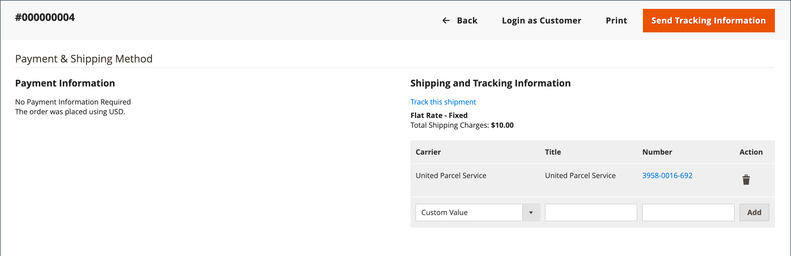

# Leveranser

I rutnätet _[!UICONTROL Shipments]_&#x200B;visas försändelseposten för alla fakturor som har förberetts för leverans. En försändelsepost kan genereras när en order är [fakturerad](invoices.md) eller senare.

Adobe Commerce och Magento Open Source har stöd för partiell och fullständig orderleverans, med ytterligare alternativ tillgängliga från [Inventory management](../inventory-management/introduction.md) och tredjepartstillägg.

{width="600" zoomable="yes"}

## Kolumnbeskrivningar

| Kolumn eller kontroll | Beskrivning |
|--- |--- |
| [!UICONTROL Select] | Markera kryssrutan för varje citat som ska bli föremål för en åtgärd, eller använd markeringskontrollen i kolumnrubriken. Alternativ: `Select All` / `Deselect All` |
| [!UICONTROL Shipment] | Ett unikt sekventiellt nummer som tilldelas när en ny leverans sparas för första gången |
| [!UICONTROL Ship Date] | Leveransdatum |
| [!UICONTROL Order] | Unikt nummer för ordern |
| [!UICONTROL Order Date] | Datum och tid då ordern lades |
| [!UICONTROL Ship-to Name] | Namnet på den person som ordern skickas till |
| [!UICONTROL Total Quantity] | Total kvantitet artiklar att leverera |
| [!UICONTROL Action] | Visa öppnar leveransen i redigeringsläge |

{style="table-layout:auto"}

Ytterligare kolumner:

| Kolumn | Beskrivning |
|--- |--- |
| [!UICONTROL Order Status] | Anger orderstatus |
| [!UICONTROL Purchased From] | Anger webbplatsen, butiken och butiksvyn där beställningen placerades |
| [!UICONTROL Customer Name] | Namnet på den kund eller köpare som lade ordern |
| [!UICONTROL Email] | E-postadressen till en registrerad kund |
| [!UICONTROL Customer Group] | Namnet på den kundgrupp eller delade katalog som kunden är tilldelad till |
| [!UICONTROL Billing Address] | Namnet på den kund eller köpare som lade ordern |
| [!UICONTROL Shipping Address] | Namnet på den person som ordern skickas till |
| [!UICONTROL Payment Method] | Betalningsmetoden som ska användas för ordern |
| [!UICONTROL Shipping Information] | Den metod som ska användas för att skicka ordern |

{style="table-layout:auto"}

## Skapa en leverans

Följ instruktionerna nedan om du vill skapa en leverans i Adobe Commerce eller Magento Open Source. Om du har aktiverat Inventory management kanske du vill granska [Skapa flera Source-leveranser](../inventory-management/shipments-create.md) och välja en källa (eller plats) och ett antal som ska skickas per radobjekt.

1. Gå till **[!UICONTROL Sales]** > **[!UICONTROL Orders]** på sidofältet _Admin_.

1. Leta reda på ordningen i rutnätet och öppna den.

1. Om ordern har betalats, fakturerats och är klar att skickas klickar du på **[!UICONTROL Ship]**.

   Avsnitten högst upp i leveransen innehåller namn, adress och betalningsinformation från försäljningsordern.

1. Fyll i varje avsnitt i leveransformuläret enligt instruktionerna i följande avsnitt.

### [!UICONTROL Items to Ship]

Ändra **[!UICONTROL Qty to Ship]** efter behov för varje radobjekt i ordningen.

### [!UICONTROL Shipping Information]

**Metod 1:** Använda ordersidan

1. Gå till **[!UICONTROL Sales]** > **[!UICONTROL Orders]** på sidofältet _Admin_.

1. Klicka på **[!UICONTROL View]** i kolumnen **[!UICONTROL Action]** för den markerade ordningen.

1. Klicka på **[!UICONTROL Ship]**.

1. Bläddra ned till blocket _[!UICONTROL Payment & Shipping Method]_&#x200B;och klicka på&#x200B;**[!UICONTROL Add Tracking Number]**.

1. Ange **[!UICONTROL Carrier]**:

   - `Custom Value`
   - `DHL`
   - `Federal Express`
   - `United Parcel Service`
   - `United States Postal Service`

1. Om du vill spåra leveransen anger du **[!UICONTROL Title]** och **[!UICONTROL Number]** .

**Metod 2:** Använda leveranssidan

Den här metoden tillåts bara om orderleveransen redan har skapats från ordersidan.
Du kan ändra frakt- och spårningsinformation efter behov med hjälp av direktutleveranssidan:

1. Gå till **[!UICONTROL Sales]** > **[!UICONTROL Shipments]** på sidofältet _Admin_.

1. Hitta och öppna leveransen i redigeringsläge.

1. Bläddra ned till blocket _[!UICONTROL Payment & Shipping Method]_.

1. Välj **[!UICONTROL Carrier]**.

1. Ange en **[!UICONTROL Title]** för paketet.

1. Ange spårning **[!UICONTROL Number]**.

1. Klicka på **[!UICONTROL Add]**.

1. Om du vill skicka ett e-postmeddelande med spårningsinformation till kunden klickar du på **[!UICONTROL Send Tracking Information]** och bekräftar åtgärden.

   Om du vill spåra platsen för en leverans öppnar du den önskade leveransen i redigeringsläge och klickar på **[!UICONTROL Track this shipment]**.

   {width="600" zoomable="yes"}

### Knappar

| Knapp | Beskrivning |
|--- |--- |
| **[!UICONTROL Back]** | Stänger formuläret Ny utleverans och återgår till ordern |
| **[!UICONTROL Submit Shipment]** | Lägger till leveransen för ordern. |
| **[!UICONTROL Reset]** | Återställer alla fält till ursprungsvärdena. |

{style="table-layout:auto"}

### Leveranskommentarer

1. Ange **Kommentarer** för leveransen, om det behövs.

1. När leveransen är klar klickar du på **Skicka leverans**.

## Ställ in kommentarer för leveranser

1. Gå till **[!UICONTROL Stores]** > _[!UICONTROL Settings]_>**[!UICONTROL Configuration]**&#x200B;på sidofältet_ Admin _.

1. Välj **[!UICONTROL Sales Email]** under _[!UICONTROL Sales]_.

1. Expandera avsnittet **Leveranskommentarer** och ändra inställningarna efter behov:

   {width="600" zoomable="yes"}

   - Alternativet **[!UICONTROL Enabled]** är inställt på `Yes` som standard, vilket innebär att e-postmeddelandet skickas till en kund när en leveranskommentar anges.

   - För **[!UICONTROL Shipment Comment Email Sender]** väljer du den person från vilken e-postmeddelandet med försändelsekommentarer skickas. Standardinställningen har fem e-postadresser.

   - För **[!UICONTROL Shipment Comment Email Template]** väljer du mallen utifrån dina behov eller väljer standardalternativet.

   - För **[!UICONTROL Shipment Comment Email Template for Guests]** väljer du den mall som används för kunder som inte har något konto i din butik.

   - För **[!UICONTROL Shipment Comment Email Copy To]** anger du e-postadresserna för att skicka en e-postkopia av en försändelsekommentar. Avgränsa flera e-postadresser med komma.

   - För **[!UICONTROL Shipment Comment Email Copy Method]** väljer du metoden `bcc` (blind kopia) eller `separate email copy` utifrån dina önskemål.

1. Klicka på **[!UICONTROL Save Config]**.

## Avbryt en leverans

Innan en försändelse skickas till en transportör kan den avbrytas genom att man öppnar ordern och navigerar till försändelsen, förutsatt att transportören stöder annulleringar. Vissa transportföretag begränsar eller begränsar annulleringar efter en bokning. UPS tillåter till exempel annulleringar, men kräver att du väntar 24 timmar efter att leveransen har bokförts. Om en leverans avbryts kan annulleringen inte återföras. Det enda sättet är att återskapa ordern.

1. Gå till **[!UICONTROL Sales]** > **[!UICONTROL Orders]** på sidofältet _Admin_.

1. Hitta ordningen i rutnätet.

1. Välj **[!UICONTROL View]** i kolumnen _Åtgärd_.

1. Välj **[!UICONTROL Shipments]** på den vänstra panelen.

   Om leveransen kan avbrytas visas _[!UICONTROL Cancel Shipment]_&#x200B;som ett alternativ i det övre knappfältet.

1. Klicka på **[!UICONTROL Cancel Shipment]**.

1. När du uppmanas att bekräfta klickar du på **[!UICONTROL OK]**.

Status för leveransen ändras till `Canceled`. Om transportören inte stöder annulleringar visas ett felmeddelande som förklarar varför leveransen inte kunde avbrytas.

## Beskrivningar av leveransfält

### [!UICONTROL Shipping Information]

| Fält | Beskrivning |
|-----|-----------|
| [!UICONTROL Carrier] | Namnet på den valda transportören |
| [!UICONTROL Title] | Ett beskrivande namn som tilldelats paketet av transportören. |
| [!UICONTROL Number] | Det länkade spårningsnumret som är tilldelat paketet. |
| [!UICONTROL Action] |  - Tar bort paketinformationen från försändelseposten. |
| [!UICONTROL Add] | Lägg till ett annat paket till leveransen. |

{style="table-layout:auto"}

### [!UICONTROL Route Information]

| Fält | Beskrivning |
|-----|-----------|
| [!UICONTROL Origin Location] | Visar en lista över tillgängliga platser. |
| [!UICONTROL International] | Om det här alternativet är markerat identifieras leveransen som en internationell transport. |

{style="table-layout:auto"}

### [!UICONTROL Items Ordered]

| Fält | Beskrivning |
|-----|-----------|
| [!UICONTROL Description] | Beskrivningen av artikeln. |
| [!UICONTROL SKU] | Lagerhållningsenheten för artikeln. |
| [!UICONTROL Weight] | Artikelns vikt. |
| [!UICONTROL Qty Ordered] | Kvantiteten för artikeln som beställts. |
| [!UICONTROL Qty Shipped] | Kvantiteten artiklar som har levererats. |
| [!UICONTROL Qty Packed] | Antalet objekt som ingår i det här paketet. |

{style="table-layout:auto"}

### [!UICONTROL Shipment Comments]

| Fält | Beskrivning |
|-----|-----------|
| [!UICONTROL Comments] | Kommentarer om leveransen är avsedda för internt bruk. |

{style="table-layout:auto"}

### [!UICONTROL Documentation]

| Fält | Beskrivning |
|-----|-----------|
| [!UICONTROL Package Label] | **PNG** - Hämta etiketten för leveranspaketet. Storlek: A6 (105 x 148 mm; 4,1 x 5,6 tum) |

{style="table-layout:auto"}
