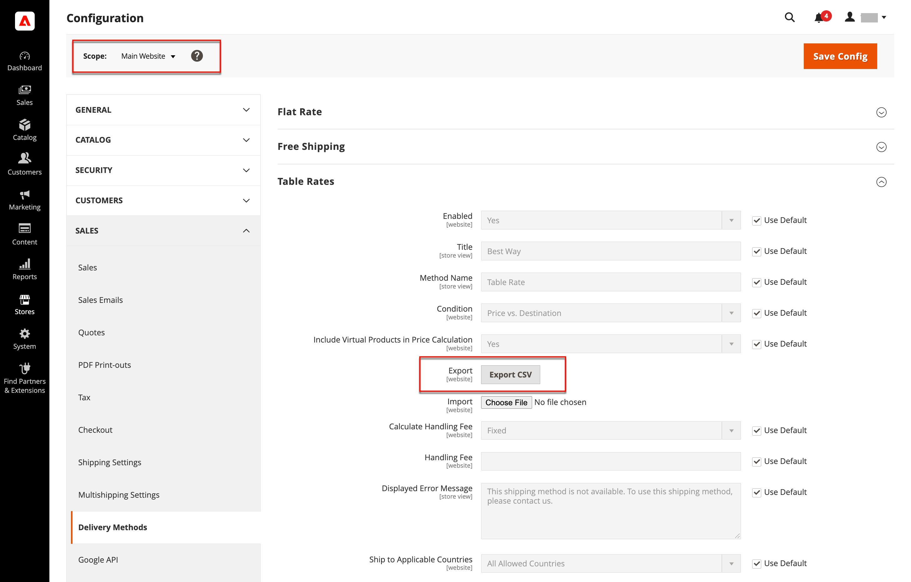

# Fraktkostnad

Leveransmetoden _Table rate_ refererar till en datatabell som beräknar fraktkostnader baserat på en kombination av villkor, inklusive:

- Vikt v. destination
- Pris v. destination
- Antal objekt v. destination

Om ert lager till exempel ligger i Los Angeles kostar det mindre att leverera till San Diego än till Vermont. Du kan använda tabellradsleveranser för att överföra besparingarna till dina kunder.

De data som används för att beräkna tabellfrekvenser förbereds i ett kalkylblad och importeras till din butik. När kunden begär en offert visas resultaten i avsnittet för leveransberäkning i kundvagnen.

>[!NOTE]
>
>Endast en uppsättning tabellhastighetsdata kan vara aktiva åt gången.

{width="700" zoomable="yes"}

## Steg 1: Slutför standardinställningarna

Det första steget är att slutföra standardinställningarna för tabellfrekvenser. Du kan slutföra det här steget utan att ändra konfigurationens omfattning.

1. Gå till **[!UICONTROL Stores]** > _[!UICONTROL Settings]_>**[!UICONTROL Configuration]**på sidofältet_ Admin _.

1. Välj **[!UICONTROL Delivery Methods]** i avsnittet _[!UICONTROL Sales]_på den vänstra panelen.

1. Expandera  i avsnittet **[!UICONTROL Table Rates]**.

   >[!NOTE]
   >
   >Om det behövs avmarkerar du kryssrutan **[!UICONTROL Use system value]** för att ändra följande inställningar enligt beskrivningen.

   {width="600" zoomable="yes"}

1. Ange **[!UICONTROL Enabled]** till `Yes`.

1. Ange den **[!UICONTROL Title]** som du vill ska visas för registertariffavsnittet vid utcheckning.

   Standardtiteln är `Best Way`.

1. Ange den **[!UICONTROL Method Name]** som du vill ska visas som en etikett bredvid den beräknade tariffen i kundvagnen.

1. Ange **[!UICONTROL Condition]** till någon av följande beräkningsmetoder:

   - `Weight v. Destination`
   - `Price v. Destination`
   - `Number of Items v. Destination`

1. För order som innehåller virtuella produkter anger du **[!UICONTROL Include Virtual Products in Price Calculation]** till `Yes` om du vill kunna inkludera de virtuella produkterna i beräkningen.

   >[!NOTE]
   >
   >Eftersom virtuella produkter, t.ex. tjänster, inte har någon vikt kan de inte ändra resultatet av en beräkning som baseras på villkoret Vikt v. destination. Virtuella produkter kan dock ändra resultatet av en beräkning som är baserad på villkoret Pris v. destination eller Antal artiklar vs. mål.

1. Konfigurera alternativ för hanteringsavgift enligt dina behov.

   Hanteringsavgiften är valfri och visas som en extra avgift som läggs till i leveranskostnaden. Om du vill ta med en hanteringskostnad gör du följande:

   - Ange **[!UICONTROL Calculate Handling Fee]**:

      - `Fixed`
      - `Percent`

   - Ange **[!UICONTROL Handling Fee]**-tariffen enligt den metod som används för att beräkna avgiften.

     Om avgiften till exempel baseras på en fast avgift anger du beloppet i decimalform, till exempel `4.90`. Om hanteringsavgiften baseras på en procentandel av ordern anger du beloppet i procent. Om du till exempel debiterar sex procent av ordern anger du värdet som `.06`.

1. Ändra **[!UICONTROL Displayed Error Message]** om det behövs.

   Den här textrutan är förinställd med ett standardmeddelande, men du kan ange ett annat meddelande som du vill ska visas om leveransmetoden inte är tillgänglig.

1. Ange **[!UICONTROL Ship to Applicable Countries]**:

   - `All Allowed Countries` - Kunder från alla [länder](../getting-started/store-details.md#country-options) som anges i din butikskonfiguration kan använda den här leveransmetoden.
   - `Specific Countries` - När du väljer det här alternativet visas listan _[!UICONTROL Ship to Specific Countries]_. Välj varje land i listan där leveransmetoden kan användas.

1. Ange **[!UICONTROL Show Method if Not Applicable]** till `Yes` om du vill visa tabellhastigheter hela tiden

1. För **[!UICONTROL Sort Order]** anger du ett nummer för att bestämma i vilken sekvens leverans av tabellhastighet ska visas när den visas tillsammans med andra leveransmetoder vid utcheckning.

   `0` = först, `1` = sekund, `2` = tredje och så vidare.

1. Klicka på **[!UICONTROL Save Config]**.

## Steg 2: Förbered tabellhastighetsdata

1. I det övre vänstra hörnet anger du **[!UICONTROL Store View]** till `Main Website` eller till någon annan webbplats där konfigurationen gäller.

   >[!NOTE]
   >
   >Om det behövs avmarkerar du kryssrutan **[!UICONTROL Use system value]** för att ändra följande inställningar enligt beskrivningen.

1. Ändra **[!UICONTROL Condition]** efter behov.

1. Klicka på **[!UICONTROL Export CSV]**.

   {width="700" zoomable="yes"}

1. Spara filen `tablerates.csv` på datorn.

1. Öppna filen i ett kalkylprogram.

1. Fyll i tabellen med lämpliga värden för leveransberäkningsvillkoret.

   - Använd en asterisk (*) som jokertecken som representerar alla möjliga värden i alla kategorier.
   - Kolumnen _[!UICONTROL Country]_måste innehålla en [giltig kod med tre tecken ][1] för varje rad.
   - Sortera data efter _[!UICONTROL Region/State]_så att de specifika platserna finns högst upp i listan och jokerteckens platser längst ned. Med den här metoden bearbetas reglerna med de absoluta värdena först och jokertecknen senare.
   - Postnummerintervall stöds inte. Använd en asterisk (*) om du vill tillåta alla koder i regionen/staten, eller ange en enda kod för en viss plats i kolumnen _[!UICONTROL Zip/Postal Code]_.
   - Värden i kolumnen _[!UICONTROL Weight (and above)]_kan ha högst fyra decimaler (till exempel `2.5075`). Om fler decimaler används i data misslyckas importen.

   {width="500"}

1. Spara filen `tablerates.csv`.

## Steg 3: Importera tabelltariffdata

1. Gå tillbaka till avsnittet **[!UICONTROL Table Rates]** i din butikskonfiguration.

1. I det övre vänstra hörnet anger du **[!UICONTROL Store View]** till webbplatsen där metoden används.

1. För **[!UICONTROL Import]** klickar du på **[!UICONTROL Choose File]** och väljer den slutförda `tablerates.csv`-filen för att importera hastigheterna.

   {width="600" zoomable="yes"}

1. Klicka på **[!UICONTROL Save Config]**.

## Steg 4: Verifiera kurserna

För att säkerställa att tabelltariffdata är korrekta går du igenom betalningsprocessen med flera olika adresser för att se till att frakt- och hanteringstaxorna beräknas korrekt.

### Exempel 1: Pris och destination

I det här exemplet används villkoret Price v. Destination för att skapa en uppsättning med tre olika fraktsatser baserat på orderdelsumman för USA:s, Alaskas och Hawaiis fastland. Asterisken (*) är ett jokertecken som representerar alla värden.

| LAND | REGION/STAT | POSTNUMMER | ORDER SUBTOTAL (och högre) | LEVERANSPRIS |
|--- |--- |--- |--- |--- |
| USA | HI | * | 100 | 10 |
| USA | HI | * | 50 | 15 |
| USA | HI | * | 0 | 20 |
| USA | AK | * | 100 | 10 |
| USA | AK | * | 50 | 15 |
| USA | AK | * | 0 | 20 |
| USA | * | * | 100 | 5 |
| USA | * | * | 50 | 10 |
| USA | * | * | 0 | 15 |

{style="table-layout:auto"}

### Exempel 2: Vikt och mål

I det här exemplet används villkoret Vikt v. Mål för att skapa olika fraktsatser baserat på orderns vikt.

| LAND | REGION/STAT | POSTNUMMER | VIKT (och högre) | LEVERANSPRIS |
|--- |--- |--- |--- |--- |
| AUS | NT | * | 9 | 39,95 |
| AUS | NT | * | 0 | 19,95 |
| AUS | VIC | * | 9 | 19,95 |
| AUS | VIC | * | 0 | 5,95 |
| AUS | WA | * | 9 | 39,95 |
| AUS | WA | * | 0 | 19,95 |
| AUS | * | * | 9 | 29,95 |
| AUS | * | * | 0 | 9,95 |

{style="table-layout:auto"}

### Exempel 3: Begränsa fri frakt till USA:s fastland

1. Skapa en `tablerates.csv`-fil som innehåller alla tillståndsplatser som du är villig att tillhandahålla fri frakt till.

1. Slutför konfigurationen av registerhastigheten med följande inställningar:

   | Inställning | Värde |
   |----------|-------|
   | [!UICONTROL Condition] | `Price v. Destination` |
   | [!UICONTROL Method Name] | `Free Shipping` |
   | [!UICONTROL Ship to Applicable Countries] | `Specific Countries` |
   | [!UICONTROL Ship to Specific Countries] | `Select only United States` |
   | [!UICONTROL Show method if not applicable] | `No` |

   {style="table-layout:auto"}

1. I det övre vänstra hörnet anger du **[!UICONTROL Store View]** till `Main Website` eller till någon annan webbplats där konfigurationen gäller.

1. För **[!UICONTROL Import]** klickar du på **[!UICONTROL Choose File]** och väljer den slutförda `tablerates.csv`-filen för att importera hastigheterna.

[1]: https://en.wikipedia.org/wiki/ISO_3166-1_alpha-3
