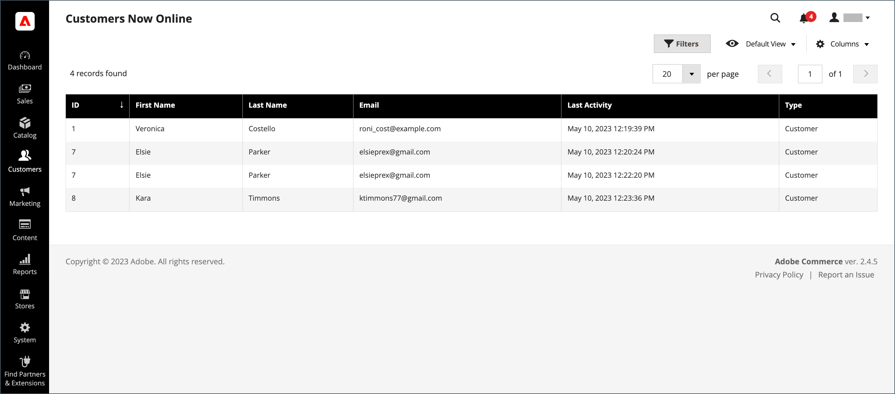

# Hantera en kundvagn

{{ee-feature}}

För att kunna starta en assisterad shoppingsession måste kunden vara inloggad på sitt konto från butiken för att göra informationen tillgänglig. Om kunden inte har något konto kan du [skapa en](../customers/account-create.md).

{width="600" zoomable="yes"}

## Åtgärdskontroll

| Alternativ | Beskrivning |
|--- |--- |
| [!UICONTROL Remove] | Tar bort artiklar från den aktuella kundvagnen |
| [!UICONTROL Move to Wish List] | Flyttar objekt till den valda kundens önskelista |

{style="table-layout:auto"}

## Kontrollknappar

| Knapp | Beskrivning |
|--- |--- |
| [!UICONTROL Clear my shopping cart] | Rensar den aktuella kundvagnen från alla produkter. |
| [!UICONTROL Update Items and Quantities|]Ange önskad kvantitet i **[!UICONTROL Qty]** och uppdatera antalet artiklar i kundvagnen. |
| [!UICONTROL Add selections to my cart] | Lägger till produkter från alla avsnitt i kundvagnen. |

{style="table-layout:auto"}

## Verifiera att kunden är inloggad

1. På _Administratör_ sidebar, gå till **[!UICONTROL Customers]** > **[!UICONTROL Now Online]**.

   Alla besökare i butiken och inloggade kunder visas i listan.

   {width="700" zoomable="yes"}

## Erbjud assisterad butik

1. På _Administratör_ sidebar, gå till **[!UICONTROL Customers]** > **[!UICONTROL All Customers]**.

1. Öppna kundposten i redigeringsläge i listan.

   >[!TIP]
   >
   >Om du snabbt vill hitta kundposten använder du [Filter](../getting-started/admin-grid-controls.md) kontroll.

   I kundprofilen under _[!UICONTROL Personal Information]_,_[!UICONTROL Last Logged In]_ datum och tid visar att kunden är online.

   {width="600" zoomable="yes"}

1. Om du vill gå till assisterat shoppingläge klickar du på **[!UICONTROL Manage Shopping Cart]** i det övre knappfältet.

   {width="600" zoomable="yes"}

## Lägg produkter i kundvagn efter attribut

1. Expandera  den **[!UICONTROL Products]** -avsnitt.

1. Hitta en produkt med hjälp av något av filtren längst upp i varje kolumn.

1. Klicka på **[!UICONTROL Search]**.

1. Använd någon av följande stegserier beroende på produkttyp:

### Lägg till en enkel produkt

1. Klicka på den produkt du vill beställa.

   Den här åtgärden markerar posten och ställer in **[!UICONTROL Quantity]** till standardvärdet för `1`.

1. Uppdatera beställd kvantitet om det behövs.

1. Klicka på till vänster ovanför stödrastret **[!UICONTROL Add selections to my cart]**.

   {width="600" zoomable="yes"}

   Radartikeln läggs till i kundvagnen högst upp på sidan.

   {width="600" zoomable="yes"}

### Lägg till en produkt med konfiguration

Det finns tre typer av produkter som måste konfigureras innan de läggs till i kundvagnen: `Bundle Product`, `Configurable Product`och `Grouped Product`.

1. Klicka på i rutnätet **[!UICONTROL Configure]** bredvid produktnamnet.

   {width="600" zoomable="yes"}

1. I _Associerade produkter_ väljer du varje produktalternativ för att beskriva artikeln som ska beställas, anger **[!UICONTROL Quantity]** och klicka **[!UICONTROL OK]**.

   Produkten markeras med en bock och den beställda kvantiteten visas i rutnätet.

1. Om du vill lägga produkten i kundvagnen klickar du på **[!UICONTROL Add selections to my cart]**.

   {width="600" zoomable="yes"}

1. Uppdatera produktalternativ i kundvagnen om det behövs:

   - Klicka på **[!UICONTROL Configure]**.

   - Uppdatera alternativen och klicka sedan på **[!UICONTROL OK]**.

## Lägg till produkt efter SKU

1. Expandera  den **[!UICONTROL Add to Shopping Cart by SKU]** -avsnitt.

1. Lägg till produkter individuellt efter **[!UICONTROL SKU]** eller lägga till produkter genom att överföra en CSV-fil.

### Lägg till artiklar individuellt efter SKU

1. Ange **[!UICONTROL SKU]** och **[!UICONTROL Qty]** av artikeln som ska beställas.

1. Om du vill beställa en annan produkt klickar du **[!UICONTROL Add another]**.

   {width="600" zoomable="yes"}

1. Klicka på **[!UICONTROL Add selections to my cart]**.

1. Om artikeln är en konfigurerbar produkt väljer du produktalternativen när du uppmanas till det och klickar sedan på **[!UICONTROL Add to Shopping Cart]**.

### Lägga till produkter genom att överföra en CSV-fil

1. Förbered en [csv-fil](../systems/data-csv.md) med de artiklar som ska läggas till i vagnen.

   Filen får bara innehålla två kolumner, med `sku` och `qty` i sidhuvudet.

1. Överför den förberedda filen:

   - Klicka på **[!UICONTROL Choose File]**.

   - Välj den fil som ska överföras från din katalog.

## Överför en artikel

Du kan överföra artiklar till kundvagnen från kundens önskelista och nyligen visade, jämförda eller beställda artiklar. Antalet objekt i varje avsnitt visas inom parentes efter avsnittshuvudet.

1. Expandera  något av följande avsnitt:

   - [!UICONTROL Wish List]
   - [!UICONTROL Products in the Comparison List]
   - [!UICONTROL Recently Compared Products]
   - [!UICONTROL Recently Viewed Products]
   - [!UICONTROL Last Ordered Items]

1. I rutnätet väljer du varje produkt som ska beställas och anger **[!UICONTROL Quantity]**.

1. Ange alternativ för en konfigurerbar produkt genom att klicka på **[!UICONTROL Configure]** och ange produktalternativ efter behov.

1. Klicka på **[!UICONTROL Add selections to my cart]**.

1. Använd en eller flera kupongkoder om sådana finns:

   - För **[!UICONTROL Apply Coupon Code]**, ange en giltig kupongkod.

   - Klicka på _Använd_ (  ).

1. Justera beställd kvantitet efter behov:

   - I **[!UICONTROL Qty]** för den produkt som ska justeras, ange korrekt belopp.

   - Klicka på **[!UICONTROL Update Items and Quantities]**.

## Skapa ordern

1. Klicka på **[!UICONTROL Create Order]**.

   The _[!UICONTROL Create New Order]_visas artiklarna i kundvagnen följt av frakt- och betalningsinformation.

1. Fyll i information om frakt och betalning.

1. Klicka på **[!UICONTROL Submit Order]**.

Mer information finns på [Skapa en order](customer-account-create-order.md).
