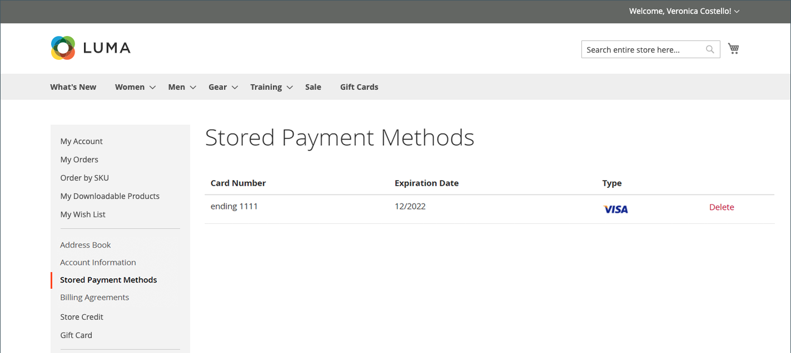

# Lagrade betalningsmetoder

Kunder som har tillgång till ett säkert valv för att lagra betalningsinformation kan gå snabbare genom utcheckning utan att behöva ange sin kreditkortsinformation varje gång. Om [Direktköp](checkout-instant-purchase.md) är aktiverat kan kunderna kringgå den tvåstegsbaserade utcheckningsprocessen och lägga ordern från produktsidan.

En betalningsmetod som stöder ett säkert valv, som [Braintree](braintree.md), krävs. När ett säkert valv är aktiverat i betalningsmetodkonfigurationen kan kunderna under utcheckningen välja att spara sin kreditkortsinformation som en lagrad betalningsmetod. Kunder kan hantera lagrade betalningsmetoder via sin kontokontrollpanel.

{width="700" zoomable="yes"}

## Lägg till lagrad betalningsmetod i kassan

1. Från butiken går kunden till detaljsidan för produkten.

1. Lägger till produkten i kundvagnen.

1. Går till utcheckningssidan.

1. Slutför steget _Leverans_.

1. Väljer betalningsmetod **[!UICONTROL Braintree Credit Card]**.

1. Fyller i kreditkortsdata.

1. Markerar kryssrutan **[!UICONTROL Save for later use]**.

1. Klicka på **[!UICONTROL Place Order]**.

Den sparade betalningsmetoden visas sedan på fliken _[!UICONTROL Stored Payment Methods]_&#x200B;på kundkontrollpanelen.

## Ta bort en lagrad betalningsmetod

Eventuella tidigare tillagda, lagrade betalningsmetoder kan inte redigeras av kunden, de kan bara tas bort. Det går inte att ångra den här åtgärden.

1. I sidofältet för deras konto väljer kunden **[!UICONTROL Stored Payment Methods]**.

1. Söker efter betalningsmetodposten som ska tas bort.

1. Klicka på **[!UICONTROL Delete]**.

1. Bekräfta åtgärden genom att klicka på **[!UICONTROL OK]**.
