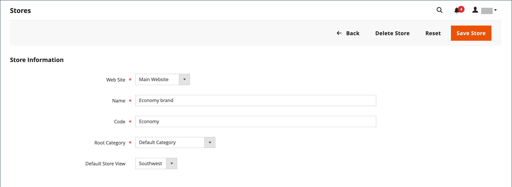

# Lagring och webbplatsstruktur

När Adobe Commerce eller Magento Open Source är installerat skapas en hierarki som innehåller en huvudwebbplats-, butiks- och butiksvy. Du kan skapa ytterligare webbplatser, butiker och butiksvyer efter behov. Förutom huvudwebbplatsen kan du till exempel ha ytterligare webbplatser med en annan domän. På varje webbplats kan du ha flera butiker och olika butiksvyer. Många installationer har en webbplats och en butik, men med flera butiksvyer för olika språk.

Innan du börjar ska du planera arkivkatalogshierarkin i förväg eftersom den refereras till under hela konfigurationen. Varje butik kan ha en separat [rotkategori](../catalog/category-root.md), vilket gör det möjligt att ha helt olika huvudmenyalternativ för varje butik.

{width="550"}

## Lägg till butiker

En installation av Adobe Commerce eller Magento Open Source kan ha flera butiker som delar en administratör. Lager som finns under samma webbplats har samma IP-adress och domän, använder samma säkerhetscertifikat och delar en enda utcheckningsprocess.

Det viktiga att förstå är att butikerna använder samma kod och delar en administratör. Varje butik kan ha en separat katalog eller så kan butikerna dela en katalog. Varje butik kan ha en separat [rotkategori](../catalog/category-root.md), vilket gör det möjligt att ha olika huvudmenyer för varje butik. Man kan också ha olika varumärken, presentationer och innehåll. Ta dig tid att planera din butikshierarki med framtida tillväxt i åtanke innan du börjar, eftersom den används i hela konfigurationen.

{width="550"}

Här är några exempel på hur URL:er kan konfigureras för flera butiker:

| URL | Beskrivning |
| --- | ----------- |
| `yourdomain.com/store1` `yourdomain.com/store2` | Varje butik har en egen sökväg, men delar en domän. |
| `store1.yourdomain.com` `store2.yourdomain.com` | Varje butik har en egen underdomän till den primära domänen. |

Installationer av Adobe Commerce i flera butiker måste konfigureras från Admin och från serverns kommandorad. Adobe Commerce [Konfigurationshandbok](https://experienceleague.adobe.com/docs/commerce-operations/configuration-guide/multi-sites/ms-overview.html) innehåller detaljerade anvisningar för hur du konfigurerar servermiljön.

### Steg 1: Välj butiksdomän

Det första steget är att välja hur du vill placera butiken. Ska butikerna dela en domän, ha en underdomän eller ha olika domäner? Gör något av följande för varje butik:

- Om du vill placera arkivet en nivå under den primära domänen behöver du inte göra något.
- Konfigurera en underdomän till din primära domän.
- Konfigurera en annan primär domän.

### Steg 2: Skapa butiken

1. På _Administratör_ sidebar, gå till **[!UICONTROL Stores]** > _[!UICONTROL Settings]_>**[!UICONTROL All Stores]**.

1. Klicka **[!UICONTROL Create Store]** och ange alternativ för den nya butiken:

   - **[!UICONTROL Web Site]** — Välj en webbplats som ska vara överordnad den nya butiken. Om installationen bara har en webbplats accepterar du standardinställningen (`Main Website`).

   - **[!UICONTROL Name]** — Ange ett namn för den nya butiken. Namnet är bara till för intern referens.

   - **[!UICONTROL Code]** — Ange en kod med gemener för att identifiera butiken. Exempel: `mainstore`.

   - **[!UICONTROL Root Category]** — Ange [rotkategori](../catalog/category-root.md) som definierar kategoristrukturen för den nya butikens huvudmeny. Om du redan har skapat en viss rotkategori för arkivet markerar du den. Annars väljer du `Default Category`. Du kan komma tillbaka senare och uppdatera inställningen.

   {width="600" zoomable="yes"}

1. Klicka på **[!UICONTROL Save Store]**.

### Steg 3: Skapa en standardbutiksvy

1. Klicka **[!UICONTROL Create Store View]** och ange alternativ för butiksvyn:

   - **[!UICONTROL Store]** — Ange till den nya butiken du skapade.

   - **[!UICONTROL Name]** — Ange ett namn för vyn. Exempel, `English`.

   - **[!UICONTROL Code]** — Ange en kod för vyn med gemener.

   - **[!UICONTROL Status]** — Ställ in på `Enabled`.

   - **[!UICONTROL Sort Order]** — Ange ett nummer som avgör butikens position när den anges med andra butiker.

1. Klicka på **[!UICONTROL Save Store View]**.

   Om du öppnar din butik i redigeringsläge ser du att den nu har en standardvy.

   {width="600" zoomable="yes"}

### Steg 4: Konfigurera butikens URL

1. På _Administratör_ sidlist, klicka **[!UICONTROL Stores]** > _[!UICONTROL Settings]_>**[!UICONTROL Configuration]**.

1. Under _[!UICONTROL General]_i den vänstra panelen till vänster väljer **[!UICONTROL Web]**.

1. I det övre vänstra hörnet anger du **[!UICONTROL Store View]** till den vy som du skapade för den nya butiken.

1. När du uppmanas att bekräfta [omfång](../getting-started/websites-stores-views.md#scope-settings) växla, klicka **[!UICONTROL OK]**.

   {width="600" zoomable="yes"}

1. Expandera  den **[!UICONTROL Base URLs]** och ange butikens bas-URL.

   Rensa **[!UICONTROL Use system value]** om du vill ändra inställningen.

   {width="600" zoomable="yes"}

1. Expandera  den **[!UICONTROL Secure Base URLs]** och upprepa föregående steg om du vill konfigurera butiken [säker URL](store-urls.md).

1. Klicka på **[!UICONTROL Save Config]**.

### Steg 5: Konfigurera servern

Information om hur du konfigurerar servern för stöd av flera webbplatser finns i [Flera webbplatser eller butiker](https://experienceleague.adobe.com/docs/commerce-operations/configuration-guide/multi-sites/ms-overview.html) i _Konfigurationshandbok_.

Hjälp om hur du konfigurerar webbservern finns i följande resurser:

- [Konfigurera flera webbplatser med NGNX](https://experienceleague.adobe.com/docs/commerce-operations/configuration-guide/multi-sites/ms-nginx.html)
- [Konfigurera flera webbplatser med Apache](https://experienceleague.adobe.com/docs/commerce-operations/configuration-guide/multi-sites/ms-apache.html)

Information om Adobe Commerce molninfrastruktur finns på [Konfigurera flera webbplatser eller butiker](https://experienceleague.adobe.com/docs/commerce-cloud-service/user-guide/configure-store/multiple-sites.html).

## Lägg till webbplatser

Flera webbplatser kan konfigureras från en enda Adobe Commerce- eller Magento Open Source-installation med samma domän eller olika domäner. Som standard har butiker under samma webbplats samma IP-adress och domän, samma säkerhetscertifikat och samma utcheckningsprocess. Om du vill att varje butik ska ha en dedikerad utcheckningsprocess i sin egen domän, måste varje butik ha en distinkt IP-adress och ett separat säkerhetscertifikat.

Installationer av flera webbplatser för Adobe Commerce eller Magento Open Source måste konfigureras från Admin och från serverns kommandorad. Handeln [Konfigurationshandbok](https://experienceleague.adobe.com/docs/commerce-operations/configuration-guide/multi-sites/ms-overview.html) innehåller detaljerade anvisningar för hur du konfigurerar servermiljön.

{width="550"}

### Steg 1: Skapa en webbplats

1. På _Administratör_ sidebar, gå till **[!UICONTROL Stores]** > _[!UICONTROL Settings]_>**[!UICONTROL All Stores]**.

1. Klicka på i det övre högra hörnet **[!UICONTROL Create Website]**.

1. Ange **[!UICONTROL Web Site Information]** alternativ:

   {width="600" zoomable="yes"}

   - **[!UICONTROL Name]** — Ange domänen för den nya webbplatsen. Exempel, `domain.com`.

   - **[!UICONTROL Code]** — Ange en kod som används på servern för att peka mot domänen.

     Koden måste börja med en gemen bokstav (a-z) och kan innehålla en valfri kombination av bokstäver (a-z), siffror (0-9) och understreck (_).

   - **[!UICONTROL Sort Order]** — _(Valfritt)_ Ange ett nummer för att bestämma i vilken ordning den här platsen ska listas med andra platser. Ange en nolla (`0`).

1. Klicka på **[!UICONTROL Save Web Site]**.

1. Konfigurera varje [store](#add-stores) och [butiksvy](store-views.md) som behövs för den nya webbplatsen.

   Du kan sedan öppna webbplatsen i redigeringsläge och ange standardbutiken.

### Steg 2: Konfigurera butikens URL

Konfigurera [lagra URL:er](store-urls.md)följer du instruktionerna.

### Steg 3: Konfigurera servern

Information om hur du konfigurerar servern för stöd av flera webbplatser finns i [Flera webbplatser eller butiker](https://experienceleague.adobe.com/docs/commerce-operations/configuration-guide/multi-sites/ms-overview.html) i _Konfigurationshandbok_.

Hjälp om hur du konfigurerar webbservern finns i följande självstudiekurser:

- [Konfigurera flera webbplatser med NGNX](https://experienceleague.adobe.com/docs/commerce-operations/configuration-guide/multi-sites/ms-nginx.html)
- [Konfigurera flera webbplatser med Apache](https://experienceleague.adobe.com/docs/commerce-operations/configuration-guide/multi-sites/ms-apache.html)

Information om Adobe Commerce molninfrastruktur finns på [Konfigurera flera webbplatser eller butiker](https://experienceleague.adobe.com/docs/commerce-cloud-service/user-guide/configure-store/multiple-sites.html).
