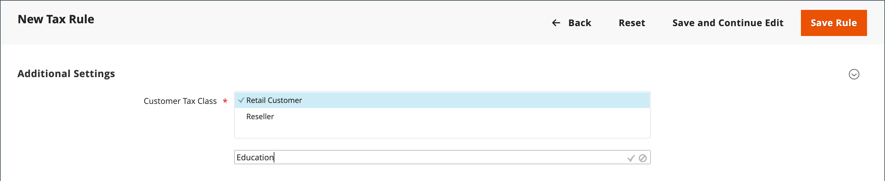
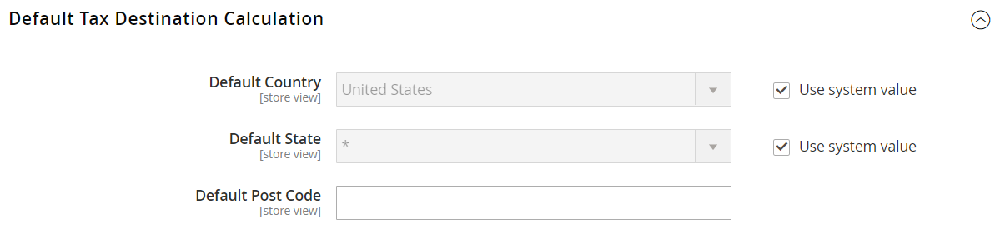

# Skatteklasser

Skatteklasser kan tilldelas kunder, produkter och frakt. Commerce analyserar kundvagnen och beräknar lämplig skatt utifrån kundens klass, produktklassen i kundvagnen och regionen. Regionen bestäms av kundens leveransadress, faktureringsadress eller leveransadress. Nya momsklasser kan skapas när en [momsregel](tax-rules.md) är definierad.

- **Kund** — Du kan skapa så många klasser som du behöver och tilldela dem till [kundgrupper](../customers/customer-groups.md). I vissa jurisdiktioner beskattas till exempel inte partihandelstransaktioner, men detaljhandelstransaktioner beskattas. Du kan associera medlemmar i kundgruppen för grossister med momsklassen för grossistledet.

- **Produkt** — Produktklasser används i beräkningar för att fastställa korrekt momssats i kundvagnen. När du skapar en produkt tilldelas den till en viss momsklass. Till exempel kanske inte maten beskattas eller beskattas i en annan omfattning.

- **Leverans** — Om din butik debiterar en extra fraktkostnad bör du ange en särskild produktskatteklass för frakt. I konfigurationen anger du den sedan som den momsklass som används för leverans.

## Konfigurera momsklasser

Den momsklass som används för leverans och standardmomsklasserna för [produkter och kunder](#add-a-product-tax-class) anges i _[!UICONTROL Sales]_konfiguration.

1. På _Administratör_ sidebar, gå till **[!UICONTROL Stores]** > _[!UICONTROL Settings]_>**[!UICONTROL Configuration]**.

1. Expandera på den vänstra panelen **[!UICONTROL Sales]** och välja **[!UICONTROL Tax]**.

1. Expandera  den **[!UICONTROL Tax Classes]** -avsnitt.

   {width="600" zoomable="yes"}

1. Välj momsklass för följande:

   - **[!UICONTROL Set Tax Class for Shipping]**
   - **[!UICONTROL Tax Class for Gift Options]**
   - **[!UICONTROL Default Tax Class for Product]**
   - **[!UICONTROL Default Tax Class for Customer]**

1. När du är klar klickar du på **[!UICONTROL Save Config]**.

## Lägg till momsklasser

Skatteklasser för kunder och produkter kan enkelt läggas till och sedan tilldelas enskilda kunder och produkter, och användas i skatteregler.

1. På _Administratör_ sidebar, gå till **[!UICONTROL Stores]** > _[!UICONTROL Taxes]_>**[!UICONTROL Tax Rules]**.

1. Klicka på **[!UICONTROL Add New Tax Rule]**.

1. Expandera  den **[!UICONTROL Additional Settings]** -avsnitt.

   {width="600" zoomable="yes"}

1. Under _Kundens skatteklass_, klicka **[!UICONTROL Add New Tax Class]**.

1. Ange **[!UICONTROL Name]** för den nya momsklassen i textrutan.

   {width="600" zoomable="yes"}

1. Om du vill lägga till den nya klassen i listan över tillgängliga kundmomsklasser klickar du på bockmarkeringen.

   {width="600" zoomable="yes"}

## Lägg till en produktskatteklass

1. Under _Produktmomsklass_, klicka **[!UICONTROL Add New Tax Class]**.

1. Ange **[!UICONTROL Name]** för den nya momsklassen i textrutan.

1. Om du vill lägga till den nya klassen i listan över tillgängliga produktskatteklasser klickar du på bockmarkeringen.

1. När du är klar klickar du på **[!UICONTROL Back]** i knappfältet för att gå tillbaka till _Skatteregler_ rutnät.

## Standardmomsmål

Standardinställningarna för skattedestination avgör vilket land, delstat och postnummer som används som underlag för momsberäkningar.

**_Så här konfigurerar du standardmålet för skatt för beräkningar:_**

1. På _Administratör_ sidebar, gå till **[!UICONTROL Stores]** > _[!UICONTROL Settings]_>**[!UICONTROL Configuration]**.

1. Expandera på den vänstra panelen **[!UICONTROL Sales]** och välja **[!UICONTROL Tax]**.

1. Expandera  den **[!UICONTROL Default Tax Destination Calculation]** -avsnitt.

   {width="600" zoomable="yes"}

1. Ange **[!UICONTROL Default Country]** till det land som skatteberäkningarna baseras på.

1. Ange **[!UICONTROL Default State]** till den delstat eller provins som används som grund för skatteberäkningar.

1. Ange **[!UICONTROL Default Post Code]** till postnumret som används som underlag för lokala skatteberäkningar.

1. När du är klar klickar du på **[!UICONTROL Save Config]**.
