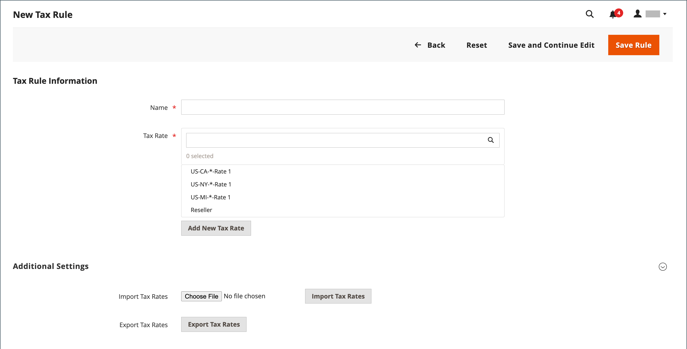

# Skatteregler

Skattereglerna innehåller en kombination av produktklass, kundklass och momssats. Varje kund tilldelas en kundklass och varje produkt tilldelas en produktklass. Commerce analyserar kundvagnen och beräknar momsen utifrån kund- och produktklasserna samt regionen. Regionen baseras på kundens leveransadress, faktureringsadress eller leveransadress.

>[!NOTE]
>
>När du måste definiera flera skattesatser kan du förenkla processen genom att importera dem.

{width="600" zoomable="yes"}

## Steg 1: Fyll i momsregelinformationen

1. Gå till **[!UICONTROL Stores]** > _[!UICONTROL Taxes]_>**[!UICONTROL Tax Rules]**på sidofältet_ Admin _.

1. Klicka på **[!UICONTROL Add New Tax Rule]** i det övre högra hörnet.

1. Under _Information om momsregel_ anger du **[!UICONTROL Name]** för den nya regeln.

   {width="600" zoomable="yes"}

1. Välj det **[!UICONTROL Tax Rate]** som gäller för regeln.

   Så här redigerar du en befintlig skattesats:

   - Håll muspekaren över momssatsen och klicka på ikonen _Redigera_  .

   - Uppdatera formuläret efter behov och klicka på **[!UICONTROL Save]**.

1. Använd någon av följande metoder för att ange skattesatser:

### Metod 1: Ange momssatser manuellt

1. Klicka på **[!UICONTROL Add New Tax Rate]**.

1. Fyll i formuläret efter behov (se [Skattezoner och skattesatser](tax-zones-rates.md)).

1. Klicka på **[!UICONTROL Save]** när du är klar.

   {width="600" zoomable="yes"}

### Metod 2: Importskattesatser

1. Rulla ned till avsnittet längst ned på sidan.

1. Så här importerar du momssatser:

   - Klicka på **[!UICONTROL Choose File]** och navigera till CSV-filen med momssatserna som ska importeras.

   - Klicka på **[!UICONTROL Import Tax Rates]**.

1. Om du vill exportera momssatser klickar du på **[!UICONTROL Export Tax Rates]** (se [Importera/exportera momssatser](../systems/data-transfer-tax-rates.md)).

{width="600" zoomable="yes"}

## Steg 2: Slutför de extra inställningarna

1. Klicka på **[!UICONTROL Additional Settings]** om du vill öppna avsnittet.

   {width="600" zoomable="yes"}

1. Välj den **[!UICONTROL Customer Tax Class]** som regeln gäller för.

   - Om du vill redigera en kundmomsklass klickar du på ikonen _Redigera_  , uppdaterar formuläret efter behov och klickar på **[!UICONTROL Save]**.

   - Om du vill skapa en momsklass klickar du på **[!UICONTROL Add New Tax Class]**, fyller i formuläret efter behov och klickar på **[!UICONTROL Save]**.

1. Välj den **[!UICONTROL Product Tax Class]** som regeln gäller för.

   - Om du vill redigera en produktskatteklass klickar du på ikonen _Redigera_  , uppdaterar formuläret efter behov och klickar på **[!UICONTROL Save]**.

   - Om du vill skapa en momsklass klickar du på **[!UICONTROL Add New Tax Class]**, fyller i formuläret efter behov och klickar på **[!UICONTROL Save]**.

1. När mer än en skatt gäller anger du ett nummer som anger prioriteten för den här skatten för **[!UICONTROL Priority]**.

   Om två momsregler med samma prioritet gäller läggs skatterna till. Om det finns två skatter med olika prioritetsinställningar läggs skatterna samman.

1. Markera kryssrutan **[!UICONTROL Calculate off Subtotal Only]** om du vill att moms ska baseras på orderdelsumman.

1. För **[!UICONTROL Sort Order]** anger du ett nummer som anger ordningen för den här momsregeln när den listas tillsammans med andra.

1. Klicka på **[!UICONTROL Save Rule]** när du är klar.

## Demo av valutor och momsregler

Läs om hur du hanterar valuta- och momsregler i den här videon:

>[!VIDEO](https://video.tv.adobe.com/v/343657/?quality=12&learn=on)
