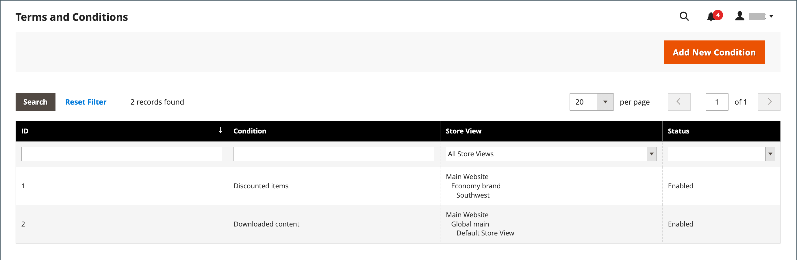

# Villkor för utcheckning

Vid manuell _Villkor_ funktionaliteten är aktiverad måste kunderna godkänna försäljningsvillkoren innan köpet är slutfört. Försäljningsvillkoren innehåller normalt information om offentliggörande som kan krävas enligt lag för B2C- eller B2B-anläggningar och anger köparens och säljarens rättigheter. Meddelandet Villkor visas efter betalningsinformationen, precis före _Montera beställning_ -knappen.

{width="700" zoomable="yes"}

## Steg 1: Aktivera villkor för utcheckning

1. På _Administratör_ sidebar, gå till **[!UICONTROL Stores]** > _[!UICONTROL Settings]_>**[!UICONTROL Configuration]**.

1. Expandera på den vänstra panelen **[!UICONTROL Sales]** och välja **[!UICONTROL Checkout]**.

1. Expandera  den **[!UICONTROL Checkout Options]** -avsnitt.

   {width="600" zoomable="yes"}

1. Verifiera att **[!UICONTROL Enable Onepage Checkout]** är inställd på `Yes`.

1. Ange **[!UICONTROL Enable Terms and Conditions]** till `Yes`.

1. Klicka på **[!UICONTROL Save Config]**.

## Steg 2: Lägg till egen villkorsinformation

1. På _Administratör_ sidebar, gå till **[!UICONTROL Stores]** > _[!UICONTROL Settings]_>**[!UICONTROL Terms and Conditions]**.

   {width="600" zoomable="yes"}

1. Klicka på i det övre högra hörnet **[!UICONTROL Add New Condition]**.

1. Ange **[!UICONTROL Condition Name]** för intern referens.

   {width="600" zoomable="yes"}

1. Ange **[!UICONTROL Status]** till `Enabled`.

1. Ange **[!UICONTROL Applied]** till något av följande:

   - `Automatically` - Villkoren godkänns automatiskt vid utcheckning.
   - `Manually` - Kunder måste acceptera villkoren manuellt för att kunna göra en beställning.

1. Ange **[!UICONTROL Show Content as]** till något av följande:

   - `Text` - Visar termer och villkorsinnehåll som oformaterad text.
   - `HTML` - Visar innehållet som HTML som kan formateras.

1. Markera varje **[!UICONTROL Store View]** där du vill att dessa villkor ska användas.

1. Bläddra nedåt och fyll i informationen som ska visas:

   - Ange **[!UICONTROL Checkbox Text]** som ska användas som text för länken Villkor. Exempel, `I understand and accept the terms and conditions of the sale`.

   - I **[!UICONTROL Content]** Ange den fullständiga texten till försäljningsvillkoren.

1. (Valfritt) Ange **[!UICONTROL Content Height (css)]** i pixlar för att bestämma höjden på textrutan där villkoren visas under utcheckningen.

   Om du till exempel vill göra textrutan 1 tum hög på en 96 dpi-skärm skriver du `96`. En rullningslist visas om innehållet sträcker sig utanför rutans höjd.

1. Klicka på **[!UICONTROL Save Condition]**.
