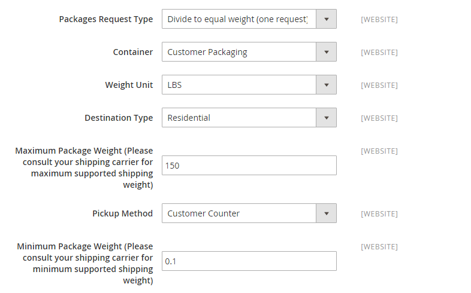
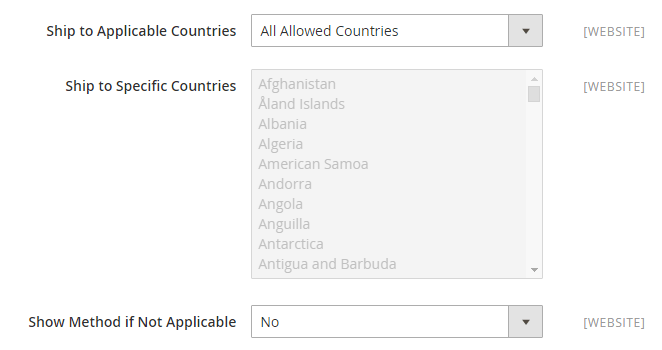
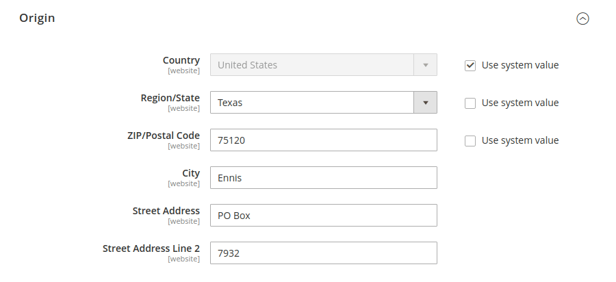

# United Parcel Service (UPS)

United Parcel Service (UPS) erbjuder inrikes och internationell sjöfart på land och flyg till över 220 länder.

{{ups-api}}

>[!NOTE]
>
>UPS kan använda [dimensionell vikt](carriers.md#dimensional-weight) för att fastställa vissa fraktsatser. Adobe Commerce stöder dock endast viktbaserad beräkning av fraktkostnaden.

## Steg 1: Öppna ett UPS-leveranskonto

Om du vill erbjuda dina kunder den här leveransmetoden måste du först öppna ett UPS-konto och slutföra programmet för att få ett Shipper-kontonummer. Se [Öppna ett kostnadsfritt UPS-konto](https://www.ups.com/us/en/business-solutions/open-an-account).

## Steg 2: Hämta UPS OAUTH-autentiseringsuppgifter

Följ stegen i guiden [Komma igång med UPS API:er](https://developer.ups.com/get-started) för att hämta API-autentiseringsuppgifter (klient-ID och klienthemlighet) för att aktivera UPS-integreringen. Du måste skapa ett UPS-program för att få inloggningsuppgifterna.

När du konfigurerar UPS-inställningarna i Admin använder du autentiseringsuppgifter för `username` och `password`.

## Steg 3: Aktivera UPS för din butik

1. Gå till _>_ > **[!UICONTROL Stores]** på sidofältet _[!UICONTROL Settings]_Admin **[!UICONTROL Configuration]**.

1. Välj **[!UICONTROL Sales]** under **[!UICONTROL Delivery Methods]** på panelen till vänster.

1. Expandera  i avsnittet **[!UICONTROL UPS]**.

1. Ange **[!UICONTROL Enabled for Checkout]** till `Yes`.

1. Gör följande för ett UPS REST-konto (standard):

   - Ange dina UPS-autentiseringsuppgifter: UPS ClientID som **[!UICONTROL User ID]**, UPS-klienthemlighet som **[!UICONTROL Password]**.

   - Ange **[!UICONTROL Mode]** till `Live` om du vill skicka data till UPS-leveranssystemet via en säker anslutning. (I utvecklingsläget skickas inga data via en säker anslutning.)

   - Verifiera **[!UICONTROL Gateway URL]** som krävs för att skicka begäranden. Använd en sandbox-URL (`https://wwwcie.ups.com/api/rating/`) för testläge och en produktions-URL för live-begäranden (`https://onlinetools.ups.com/api/rating/`). Se till att använda respektive slutpunkter för varje begäran med den angivna värden.

   - Verifiera **[!UICONTROL Tracking URL]** som krävs för att hämta spårningsinformation. Använd en sandbox-URL (`https://wwwcie.ups.com/api/track/`) för testläge och en produktions-URL för live-begäranden (`https://onlinetools.ups.com/api/track/`). Se till att använda respektive slutpunkter för varje begäran med den angivna värden.

   - Ange **[!UICONTROL Origin of the Shipment]** till den region där leveransen kommer.

   - Om du har specialpriser med UPS anger du **[!UICONTROL Enable Negotiated Rates]** till `Yes` och anger den sexsiffriga **[!UICONTROL Shipper Number]** som tilldelats dig av UPS.

   - Ange **[!UICONTROL Live Account]** till något av följande:

      - `Yes` - Kör UPS i produktionsläge och erbjuder UPS som en leveransmetod för dina kunder. Se till att du använder rätt slutpunkter under URL för gateway och spårning.
      - `No` - Kör UPS i testläge. Se till att du använder rätt slutpunkter under URL för gateway och spårning.

   >[!NOTE]
   >
   >Standardtypen för United Parcel Service är schemalagd för borttagning. Använd standardtypen `United Parcel Service REST` för nya konfigurationer. REST-typen krävs också för att generera [leveransetiketter](shipping-labels.md). 
   >För version 2.4.7 tas **[!UICONTROL UPS Type]** bort eftersom typerna `UPS` och `UPS XML` är schemalagda för borttagning och `UPS REST` är standardtypen. De UPS-API:er (United Parcel Service) som används av den inbyggda Adobe Commerce-integreringen är tillfälligt föråldrade eftersom de för närvarande inte stöder säkerhetsmodellen OAuth 2.0.

   >[!IMPORTANT]
   >
   >UPS upphör med stödet för HTTP, som används i det aktuella standardvärdet (systemvärde). Avmarkera kryssrutan **[!UICONTROL Use system value]** och ändra URL:en så att HTTPS används. Exempel: `https://www.ups.com/using/services/rave/qcostcgi.cgi`

1. För **[!UICONTROL Title]** anger du namnet på det här leveransalternativet så som du vill att det ska visas vid utcheckningen.

   Som standard är fältet inställt på `United Parcel Service`.

   {width="600" zoomable="yes"}

## Steg 3: Slutför behållarbeskrivningen

1. Ange **[!UICONTROL Packages Request Type]** till något av följande:

   - `Use origin weight (few requests)`
   - `Divide to equal weight (one request)`

1. För **[!UICONTROL Container]** anger du den typiska paketeringstypen som används för leverans:

   - `Customer Packaging`
   - `UPS Letter Envelope`
   - `Customer Supplied Package`
   - `UPS Tube`
   - `PAK`
   - `UPS Express Box`
   - `UPS Worldwide 25 kilo`
   - `UPS Worldwide 10 kilo`
   - `Pallet`
   - `Small Express Box`
   - `Medium Express Box`
   - `Large Express Box`

1. Ange **[!UICONTROL Weight Unit]** till det system som du använder för att mäta produktvikt.

   Det viktsystem som stöds av UPS varierar beroende på land. Om du är osäker, fråga UPS vilket viktsystem du ska använda. Alternativen är:

   - `LBS`
   - `KGS`

1. Ange **[!UICONTROL Destination Type]** till något av följande:

   - `Residential` - De flesta av dina leveranser är från företag till kund (B2C).
   - `Commercial` - De flesta av dina leveranser är business to business (B2B).

1. Ange **[!UICONTROL Maximum Package Weight]** som tillåts av transportören.

1. Ange **[!UICONTROL Pickup Method]** till något av följande:

   - `Regular Daily Pickup`
   - `On Call Air`
   - `One Time Pickup`
   - `Letter Center`
   - `Customer Counter`

1. Ange **[!UICONTROL Minimum Package Weight]** som tillåts av transportören.

   {width="600" zoomable="yes"}

## Steg 5: Ställ in hanteringsavgifter

Hanteringsavgiften är valfri och visas som en extra avgift som läggs till i UPS-leveranskostnaden. Om du vill ta med en hanteringskostnad gör du följande:

1. Ange **[!UICONTROL Calculate Handling Fee]** till en av följande metoder:

   - `Fixed`
   - `Percent`

1. Ange **[!UICONTROL Handling Applied]** till något av följande för att avgöra hur hanteringsavgiften tillämpas:

   - `Per Order`
   - `Per Package`

1. Ange beloppet för **[!UICONTROL Handling Fee]** som ska debiteras.

   Om du vill ange ett procenttal använder du decimalformatet. Ange till exempel `0.25` som 25 %.

   {width="600" zoomable="yes"}

## Steg 6: Ange tillåtna metoder och tillämpliga länder

1. För **[!UICONTROL Allowed Methods]** väljer du varje UPS-leveransmetod som är tillgänglig för dina kunder.

   Metoderna visas under UPS vid utcheckning. Om du vill välja flera metoder håller du ned Ctrl (PC) eller Kommando (Mac) och klickar på varje alternativ.

1. Om du vill ange alternativet [Fri frakt](shipping-free.md) via UPS anger du alternativ för fri frakt:

   - Ange **[!UICONTROL Free Method]** till den metod som du vill använda för fri frakt. Om du inte vill erbjuda fri frakt via UPS väljer du `None`.

   - Om du vill kräva ett minimiorderbelopp som berättigar till en order för fri frakt med UPS anger du **[!UICONTROL Enable Free Shipping Threshold]** till `Enable`. Ange sedan det lägsta värdet i **[!UICONTROL Free Shipping Amount Threshold]**.

1. Ändra **[!UICONTROL Displayed Error Message]** om det behövs.

   Den här textrutan är förinställd med ett standardmeddelande, men du kan ange ett annat meddelande som du vill ska visas om UPS inte är tillgängligt.

   {width="600" zoomable="yes"}

1. Ange **[!UICONTROL Ship to Applicable Countries]** till något av följande:

   - `All Allowed Countries` - Kunder från alla [länder](../getting-started/store-details.md#country-options) som anges i din butikskonfiguration kan använda den här leveransmetoden.
   - `Specific Countries` - När du väljer det här alternativet visas listan _Leverera till specifika länder_. Välj varje land i listan där leveransmetoden kan användas.

1. Ange **[!UICONTROL Show Method if Not Applicable]** till något av följande:

   - `Yes` - Visar en lista över alla tillgängliga UPS-leveransmetoder under utcheckning, inklusive metoder som inte gäller för leveransen.
   - `No` - Visar endast UPS-leveransmetoder som kan användas för leveransen.

   {width="600" zoomable="yes"}

1. Om du vill skapa en loggfil med information om UPS-leveranser som gjorts från din butik anger du **[!UICONTROL Debug]** till `Yes`.

1. För **[!UICONTROL Sort Order]** anger du ett nummer som avgör i vilken ordning UPS visas när det visas med andra leveransmetoder vid utcheckning.

   `0` = först, `1` = sekund, `2` = tredje och så vidare.

1. Klicka på **[!UICONTROL Save Config]**.

## Steg 7: Ange leveransadress

1. Kontrollera att din [Store-information](../getting-started/store-details.md#store-information) är fullständig.

1. Gå till _>_ > **[!UICONTROL Stores]** på sidofältet _[!UICONTROL Settings]_Admin **[!UICONTROL Configuration]**.

1. Expandera **[!UICONTROL Sales]** i den vänstra panelen och välj **[!UICONTROL Shipping Settings]**.

1. Utöka  **[!UICONTROL Origin]** på sidan och konfigurera leveransens ursprungliga adress.

   {width="600" zoomable="yes"}

1. Klicka på **[!UICONTROL Save Config]**.

>[!NOTE]
>
>Commerce deklarerar inte det fullständiga orderpriset till UPS vid beräkning av fraktkostnader. Det här beteendet kan inte ändras.
