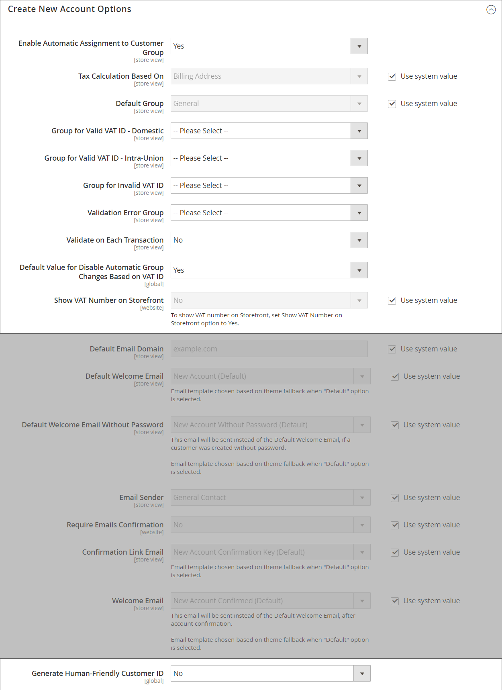

# Moms (moms)

Vissa länder tar ut mervärdesskatt på varor och tjänster. Det kan finnas olika momssatser beroende på vilket stadium i tillverknings- eller distributionsprocessen, material eller tjänster du säljer till dina kunder. Du kan tillämpa mer än en momssats för att korrekt beräkna den skatt som ska betalas.

Handel kan konfigureras för att debitera en mervärdesskatt som baseras på antingen handlarens eller kundens adress, om båda finns i samma land. Momsberäkningarna baseras vanligtvis på försändelsens destination, i stället för dess ursprungsplats. I de flesta fall räcker det med en konfigurationsinställning som beräknar moms baserat på kundens leveransadress.

## Exempel på scenarier

- För en momsregistrerad verksamhet i ett EU-land som levererar varor till en privatperson i ett annat EU-land beräknas momsen som&quot;distansförsäljning&quot; baserad på var handlaren befinner sig.

- Ett företag i Nederländerna som gör ett inköp från en butik i Storbritannien som levererar till en adress i Storbritannien måste betala momssatserna i Storbritannien.

- För försäljning av [nedladdningsbara produkter](../catalog/product-create-downloadable.md), eller _digitala varor_ baseras momssatsen på leveransorten snarare än försäljningsorten. Se [Plats för leverans av digitala varor](taxes.md#place-of-supply-for-digital-goods-eu).

>[!TIP]
>
>Vissa gränsöverskridande leveranser och B2B-leveranser har mer komplexa skattekrav. Om du vill utöka de inbyggda funktionerna i din Commerce-installation kan du lägga till en skattehanteringslösning från [Marketplace](https://marketplace.magento.com/extensions/accounting-finance/taxes.html).

## Konfigurera moms

Följande instruktioner innehåller ett exempel på hur man lägger upp 20 % moms i Storbritannien för försäljning till detaljhandelskunder. För andra skattesatser och länder ska du följa det allmänna förfarandet men ange specifik information som motsvarar ditt land, momssats, kundtyp osv.

>[!NOTE]
>
>Innan du fortsätter måste du ta reda på vilka regler och bestämmelser som gäller för moms i ditt område.

I vissa affärstransaktioner görs ingen uppskattning av moms. Handeln kan validera en kunds moms-ID för att säkerställa att momsen utvärderas (eller inte utvärderas) korrekt. Se [moms-ID-validering](#vat-id-validation).

### Steg 1: Ställ in kundmomsklasser

Processen med att skapa en momsregel börjar med att lägga till en skattesats.

1. På _Administratör_ sidebar, gå till **[!UICONTROL Stores]** > _[!UICONTROL Taxes]_>**[!UICONTROL Tax Zones and Rates]**.

   {width="600" zoomable="yes"}

1. Se till att det finns en lämplig kundskatteklass att använda med momsen.

   I det här exemplet ska du se till att det finns en kundmomsklass med namnet _Butikskund_. Om denna momsklass inte finns klickar du på **[!UICONTROL Add New Tax Rate]**.

1. Ange **[!UICONTROL Tax Identifier]** för den nya klassen tax.

   Alla momssatser visas i _Momssats_ fältet i _Information om momsregel_ när du skapar momsregler.

1. Om du vill ange postnummerintervall (från / till) väljer du **[!UICONTROL Zip/Post is Range]** kryssrutan.

1. Välj **[!UICONTROL Country]** om skattesatsen tillämpas.

1. Ange **[!UICONTROL Rate Percent]** som skulle användas för momsberäkning vid inköp.

1. När du är klar klickar du på **[!UICONTROL Save Rate]**.

Baserat på den inskickade skattesatsen kan du skapa efterföljande momsregler. I avsaknad av skattesatser blir det omöjligt att skapa skatteregler.

### Steg 2: Ange produktskatteklasser

1. På _Administratör_ sidebar, gå till **[!UICONTROL Stores]** >  _[!UICONTROL Taxes]_>**[!UICONTROL Tax Rules]**.

1. Klicka på **[!UICONTROL Add New Tax Rule]**.

1. Expandera  den **[!UICONTROL Additional Settings]** -avsnitt.

   {width="600" zoomable="yes"}

1. Under _Produktmomsklass_, klicka **[!UICONTROL Add New Tax Class]**.

1. Om du vill lägga till den nya klassen i listan över tillgängliga produktskatteklasser och skapa tre nya klasser anger du **[!UICONTROL Name]** för den nya momsklassen och klicka på bockmarkeringen:

   - `VAT Standard`
   - `VAT Reduced`
   - `VAT Zero`

1. Klicka **[!UICONTROL Save Class]** för varje ny klass som du lägger till.

1. Klicka på **[!UICONTROL Save Rule]**.

### Steg 3: Ange momszoner och skattesatser

1. På _Administratör_ sidebar, gå till **[!UICONTROL Stores]** >  _[!UICONTROL Taxes]_>**[!UICONTROL Tax Zones and Rates]**.

   I det här exemplet kan du ta bort amerikanska skattesatser eller låta dem vara som de är.

1. Klicka på **[!UICONTROL Add New Tax Rate]**.

   {width="600" zoomable="yes"}

1. Definiera nya priser enligt följande:

   **Momsstandard**

   - Skatteidentifierare: `VAT Standard`
   - Land och stat: `United Kingdom`
   - Procent av hastighet: `20.00`

   **Moms reducerad**

   - Skatteidentifierare: `VAT Reduced`
   - Land och stat: `United Kingdom`
   - Procent av hastighet: `5.00`

1. Klicka **[!UICONTROL Save Rate]** för varje kurs.

### Steg 4: Ange momsregler

En momsregel är en kombination av en kundskatteklass, en produktskatteklass och en momssats.

1. På _Administratör_ sidebar, gå till **[!UICONTROL Stores]** > _[!UICONTROL Taxes]_>**[!UICONTROL Tax Rules]**.

1. Lägg till nya momsregler enligt följande:

   **Momsstandard**

   - Namn: `VAT Standard`
   - Kundskatteklass: `Retail Customer`
   - Produktskatteklass: `VAT Standard`
   - Momssats: `VAT Standard Rate`

   **Minskad moms**

   - Namn: `VAT Reduced`
   - Kundskatteklass: `Retail Customer`
   - Produktskatteklass: `VAT Reduced`
   - Momssats: `VAT Reduced Rate`

1. Klicka **[!UICONTROL Save Rule]** för varje kurs.

### Steg 5: Använd momsklasser på produkter

1. På _Administratör_ sidebar, gå till **[!UICONTROL Catalog]** > **[!UICONTROL Manage Products]**.

1. Öppna en produkt från katalogen i redigeringsläge.

1. På _Allmänt_ sidan, hitta **[!UICONTROL Tax Class]** och väljer **[!UICONTROL VAT Class]** som gäller för produkten.

1. När du är klar klickar du på **[!UICONTROL Save]**.

   {width="600" zoomable="yes"}

## Fältbeskrivningar

### Butiksinformation

Handel använder följande [Konfigurationsinställningar för butiksinformation](../configuration-reference/general/general.md#store-information) att beräkna moms baserat på handlarinformation.

**[!UICONTROL VAT Number]** - Momsnumret som tilldelas handlaren.

**[!UICONTROL Validate VAT Number]** - [Momsvalidering](#vat-id-validation) bekräftar att momsregistreringsnumret matchar motsvarande post i [Europeiska kommissionen](https://ec.europa.eu/taxation_customs/vies/) databas.

### Kundinformation

Handeln använder följande fält för att beräkna moms baserat på [kundinformation](../customers/account-dashboard-account-information.md)).

#### Kontoinformation

**[!UICONTROL Tax/VAT Number]** - Om tillämpligt, momsregistreringsnumret eller momsregistreringsnumret som tilldelats kunden.

#### Adresser

**[!UICONTROL VAT Number]** - Om tillämpligt, det momsregistreringsnummer som är kopplat till en viss faktura- eller leveransadress för kunden. För försäljning av [digitala varor](taxes.md#place-of-supply-for-digital-goods-eu)) inom EU baseras momsbeloppet på fraktens destination.

### Kundkonto

Handel använder följande [kundkonfigurationsinställningar](../customers/account-options-new.md) för att beräkna moms.

**[!UICONTROL Show VAT Number on Storefront]** - Anger om fältet för kundens momsregistreringsnummer är inkluderat i adressboken som är tillgänglig på kundkontot.

**[!UICONTROL Default Value for Disable Automatic Group Changes Based on VAT ID]** - Moms-ID är en intern identifierare för kundens momsregistreringsnummer när det används vid momsvalidering. Under momsvalideringen bekräftar Commerce att numret matchar [Europeiska kommissionen](https://ec.europa.eu/taxation_customs/vies/) databas. Kunder kan automatiskt tilldelas en av de fyra standardkundgrupperna baserat på valideringsresultaten.

## moms-ID-validering

_moms-ID-validering_ beräknar automatiskt den skatt som krävs för B2B-transaktioner som äger rum inom EU utifrån handlarens och kundens nationella inställningar. Commerce utför moms-ID-validering med hjälp av webbtjänsterna i [Europeiska kommissionen][1] server.

>[!NOTE]
>
>Momsrelaterade skatteregler påverkar inte andra skatteregler och hindrar inte tillämpningen av andra skatteregler. Endast en momsregel kan användas vid en viss tidpunkt.

- moms tas ut om handlaren och kunden befinner sig i samma EU-land.
- Moms debiteras inte om handlaren och kunden befinner sig i olika EU-länder och båda parterna är EU-registrerade affärsenheter.

Butiksadministratören skapar mer än en standardkundgrupp som automatiskt kan tilldelas till kunden när kontot skapas, adressen skapas eller uppdateras samt checkas ut. Resultatet är att olika skatteregler används för försäljning inom landet (inhemska) och inom EU.

>[!IMPORTANT]
>
>Om du säljer virtuella eller nedladdningsbara produkter som inte kräver frakt, ska momssatsen för en kunds land användas för både försäljning inom unionen och för försäljning på den inhemska marknaden. Skapa ytterligare enskilda momsregler för produktskatteklasser som motsvarar de virtuella produkterna.

### Arbetsflöde för kundregistrering

Om moms-ID-validering är aktiverat föreslås varje kund att ange momsregistreringsnumret efter registreringen. Det är dock bara kunder som är registrerade momsregistreringskunder som förväntas fylla i detta fält.

När kunden har angett momsregistreringsnummer och andra adressfält och väljer att spara, sparar systemet adressen och skickar valideringsbegäran om momsregistreringsnummer till Europeiska kommissionens server. Enligt resultatet av valideringen tilldelas en kund en av standardgrupperna. Den här gruppen kan ändras om en kund eller administratör ändrar momsregistreringsnumret för standardadressen eller ändrar hela standardadressen. Ibland kan gruppen ändras tillfälligt (gruppändringen emuleras) vid en sidutcheckning.

Om det här alternativet är aktiverat kan du åsidosätta moms-ID-validering för enskilda kunder genom att markera kryssrutan på _[!UICONTROL Customer Information]_sida.

### Arbetsflöde för kassor

Om en kunds momsvalidering utförs under utcheckningen sparas ID för momsförfrågan och momsförfrågningsdatum i kommentarshistoriken för ordern.

Det systembeteende som gäller för valideringen av moms-ID och kundgruppsändringen under utcheckningen beror på hur inställningarna Validera på varje transaktion och Inaktivera automatisk gruppändring är konfigurerade. I det här avsnittet beskrivs implementeringen av funktionen för validering av moms-ID för utcheckning på klientsidan.

Om kunden använder Google Express Checkout, PayPal Express Checkout eller någon annan extern utcheckningsmetod, utförs utcheckningen helt och hållet på den externa betalningsgatewayens sida. I det här scenariot är _Validera vid varje transaktion_ kan inte användas och kundgruppen kan inte ändras under utcheckning.

{width="550" zoomable="yes"}

### Konfigurera moms-ID-validering

Om du vill konfigurera validering av moms-ID måste du först skapa kundgrupper som behövs och skapa relaterade momsklasser, skattesatser och regler. Aktivera sedan moms-ID-validering för butiken och slutför konfigurationen.

I följande exempel visas hur momsklasser och momssatser används för moms-ID-validering. Granska exemplen och följ sedan instruktionerna för att konfigurera de momsklasser och regler som behövs för din butik.

#### Exempel: Minimala momsregler krävs för validering av moms-ID

| Skatteregel nr 1 |  |
|--- |--- |
| Kundens skatteklass | Kundmomsklasser måste innehålla:  En klass för inhemska kunder.  En klass för kunder med felaktigt formaterade moms-ID. En klass för kunder vars moms-ID-validering misslyckades. |
| Produktmomsklass | Produktmomsklasser måste innehålla en klass för produkter av alla typer, förutom paket och virtuella. |
| Momssats | Skattesatsen måste inkludera momssatsen för handlarens land. |

{style="table-layout:auto"}

| Skatteregel nr 2 |   |
|--- |--- |
| Kundens skatteklass | En klass för fackliga kunder. |
| Produktmomsklass | En klass för produkter av alla typer, förutom virtuella. |
| Momssats | Momssatser för alla EU-länder, utom handlarens land. För närvarande är den här nivån 0 %. |

{style="table-layout:auto"}

| Skatteregel nr 3 | (Krävs för virtuella och nedladdningsbara produkter) |
|--- |--- |
| Kundens skatteklass | Kundmomsklasser måste innehålla:  En klass för inhemska kunder  En klass för kunder med ogiltigt moms-ID En klass för kunder för vilka moms-ID-valideringen misslyckades |
| Produktmomsklass | En klass för virtuella produkter. |
| Momssats | Momssats för handlarens land. |

{style="table-layout:auto"}

| Skatteregel nr 4 | (Krävs för virtuella och nedladdningsbara produkter) |
|--- |--- |
| Kundens skatteklass | En klass för fackliga kunder. |
| Produktmomsklass | En klass för virtuella produkter. |
| Momssats | Momssatser för alla EU-länder, utom handlarens land. För närvarande är den här nivån 0 %. |

{style="table-layout:auto"}

#### Steg 1: Skapa momsrelaterade kundgrupper

moms-ID-validering tilldelar automatiskt en av de fyra standardkundgrupperna till kunder enligt moms-ID-valideringsresultat:

- Hushållsnära
- Intra-EU
- Ogiltigt moms-ID
- Valideringsfel

Du kan skapa kundgrupper för moms-ID-validering eller använda befintliga grupper, om de följer din affärslogik. När du konfigurerar moms-ID-validering måste du tilldela varje kundgrupp som standard till kunder med lämpliga moms-ID-valideringsresultat.

#### Steg 2: Skapa momsrelaterade klasser, priser och regler

Varje momsregel definieras av tre enheter:

- Kundmomsklasser
- Produktmomsklasser
- Momssatser

Skapa [momsregler](tax-rules.md) för effektiv validering av moms-ID.

- Skatteregler omfattar skattesatser och [momsklasser](tax-class.md).
- Skatteklasser tilldelas [kundgrupper](../customers/customer-groups.md).

#### Steg 3: Aktivera och konfigurera validering av moms-ID

1. På _Administratör_ sidebar, gå till **[!UICONTROL Stores]** > _[!UICONTROL Settings]_>**[!UICONTROL Configuration]**.

1. Om det behövs anger du **[!UICONTROL Store View]** för konfigurationen.

1. Expandera på den vänstra panelen **[!UICONTROL Customers]** och välja **[!UICONTROL Customer Configuration]**.

1. Expandera  den **[!UICONTROL Create New Account Options]** -avsnitt.

   I följande exempel är de allmänna kundinställningarna som inte är relaterade till momsvalidering nedtonade.

   {width="600" zoomable="yes"}

1. Ange **[!UICONTROL Enable Automatic Assignment to Customer Group]** till `Yes` och fylla i följande fält efter behov.

   - **[!UICONTROL Default Group]**
   - **[!UICONTROL Default Value for Disable Automatic Group Changes Based on VAT ID]**
   - **[!UICONTROL Show VAT Number on Storefront]**

1. När du är klar klickar du på **[!UICONTROL Save Config]**.

#### Steg 4: Ange momsregistreringsnummer och land

1. Expandera på den vänstra panelen **[!UICONTROL General]** och välja **[!UICONTROL General]** under.

1. Expandera  den **[!UICONTROL Store Information]** -avsnitt.

   {width="600" zoomable="yes"}

1. Välj **[!UICONTROL Country]**.

1. Ange **[!UICONTROL VAT Number]** och klicka **[!UICONTROL Validate VAT Number]**.

   Resultatet visas omedelbart.

1. När du är klar klickar du på **[!UICONTROL Save Config]**.

#### Steg 5: Verifiera listan över EU-medlemsländer

1. Fortsätta i _Allmänt_ konfigurationssida, expandera  den **[!UICONTROL Countries Options]** -avsnitt.

   {width="600" zoomable="yes"}

1. I **[!UICONTROL European Union Countries]** kontrollera att varje medlemsland i EU har valts.

   Om du vill ändra standardinställningen rensar du **Använd systemvärden** kryssrutan. Håll ned Ctrl-tangenten (PC) eller Kommando-tangenten (Mac) och klicka på varje land som du vill lägga till eller ta bort.

1. När du är klar klickar du på **[!UICONTROL Save Config]**.

[1]: https://ec.europa.eu/taxation_customs/vies/
