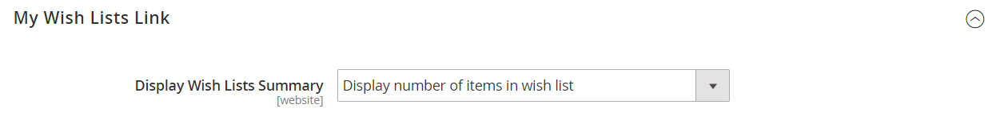

# Konfigurera önskelistor

Konfiguration av önskelista aktiverar önskelistor och fastställer e-postmallen och avsändaren av e-postmeddelanden som används när en önskelista delas.

## Aktivera önskelistefunktioner

1. Gå till **[!UICONTROL Stores]** > _[!UICONTROL Settings]_>**[!UICONTROL Configuration]**på sidofältet_ Admin _.

1. Expandera **[!UICONTROL Customers]** i den vänstra panelen och välj **[!UICONTROL Wish List]**.

1. Expandera  i avsnittet **[!UICONTROL General Options]** och gör följande:

   {width="600" zoomable="yes"}

   - Växla **[!UICONTROL Enabled]** till `Yes`, vilket aktiverar önskelistemodulen för butiken.

   -  (endast Adobe Commerce) Växla **[!UICONTROL Enable Multiple Wish Lists]** till `Yes` så att kunderna kan skapa och underhålla flera önskelistor.

   -  (endast Adobe Commerce) Ange ett värde för **[!UICONTROL Number of Multiple Wish Lists]** om du vill begränsa antalet önskelistor som kunder kan ha associerat med sitt konto.

   - Växla **[!UICONTROL Show in Sidebar]** till `Yes`, vilket visar önskelistorna i sidofältet.

1. Expandera  i avsnittet **[!UICONTROL Share Options]** och gör följande:

   {width="600" zoomable="yes"}

   - Ange **[!UICONTROL Email Sender]** till den butikskontakt som ska visas som meddelandets avsändare. Alternativ: Allmän kontakt, Säljare, Kundsupport, Anpassad e-post.

   - Ange att **[!UICONTROL Email Template]** ska användas när en kund delar en önskelista.

   - Ange ett värde på **[!UICONTROL Max Emails Allowed to be Sent]** om du vill begränsa det totala antalet e-postmeddelanden som en kund kan skicka. Standardvärdet är 10 och maxvärdet är 10 000.

   - Om du vill begränsa storleken på meddelandet anger du ett värde för **[!UICONTROL Email Text Length Limit]**. Standardvärdet är 255.

1. Expandera  i avsnittet **[!UICONTROL My Wish List Link]** och ange **[!UICONTROL Display Wish List Summary]** till något av följande:

   - `Display number of items in wish list`
   - `Display item quantities`

   {width="600" zoomable="yes"}

1. Klicka på **[!UICONTROL Save Config]** när du är klar.

## Lägg till sökning i önskelista

 (endast Adobe Commerce)

Alla offentliga önskelistor kan hittas med widgeten [Wish List Search](../content-design/widgets.md). Med widgeten kan kunden söka efter önskelistans namn eller e-postadress. Butikskunder kan hitta önskelistor som tillhör andra kunder, visa dem och beställa produkter från dem eller lägga till produkterna i sina egna önskelistor. Om en artikel köpts från en allmän önskelista av en annan kund tas den inte bort från den ursprungliga önskelistan. Widgeten _Önsklistesökning_ kan läggas till på alla sidor i din butik så att kunderna enkelt kan hitta önskelistor för vänner och familjemedlemmar.

{width="700" zoomable="yes"}

1. Gå till **[!UICONTROL Content]** > _[!UICONTROL Elements]_>**[!UICONTROL Widgets]**på sidofältet_ Admin _.

1. Klicka på **[!UICONTROL Add Widget]** i det övre högra hörnet.

1. Gör följande på fliken _[!UICONTROL Settings]_:

   - Ange **[!UICONTROL Type]** till `Wish List Search`.

   - Ange **[!UICONTROL Design Theme]** till temat för butiken där önskelistan läggs till.

   - Klicka på **[!UICONTROL Continue]**.

1. Slutför _[!UICONTROL Storefront Properties]_:

   - Ange **[!UICONTROL Widget Title]**.

   - Ange **[!UICONTROL Assign to Store Views]** till den vy eller webbplats där widgeten ska användas.

   - För **[!UICONTROL Sort Order]** anger du ett nummer som bestämmer placeringen av widgeten i dess behållare.

     `0` = first (standard), `1` = second, `2` = third och så vidare.

1. Klicka på **[!UICONTROL Add Layout Update]** i avsnittet _[!UICONTROL Layout Updates]_och ange **[!UICONTROL Display on]**till något av följande:

   - _[!UICONTROL Categories]_

      - `Anchor Categories`
      - `Non-Anchor Categories`

   - _[!UICONTROL Products]_

      - `All Product Type`
      - `Simple Product`
      - `Virtual Product`
      - `Bundle Product`
      - `Configurable Product`
      - `Downloadable Product`
      - `Gift Card`
      - `Grouped Product`

   - _[!UICONTROL Generic Page]_

      - `All Pages`
      - `Specified Page`
      - `Page Layouts`

1. I listan **[!UICONTROL Container]** väljer du det område i sidlayouten där den ska placeras.

   {width="700" zoomable="yes"}

1. Välj **[!UICONTROL Widget Options]** på den vänstra panelen.

1. Ange **[!UICONTROL Quick Search Form Types]** till något av följande:

   - `All Forms` - Kunder kan söka efter alla tillgängliga parametrar.
   - `Owner Name` - Kunder kan söka efter önskelistor efter ägarnamn.
   - `Owner Email` - Kunder kan söka efter önskelistor efter ägarens e-postadress.

   >[!NOTE]
   >
   >Leveransadresser ingår inte i önskelistor.

1. Konfigurera eventuella återstående widgegenskaper efter behov och följ [standardinstruktionerna](../content-design/widget-create.md).

1. Klicka på **[!UICONTROL Save]** när du är klar.

1. Uppdatera alla ogiltiga cacheminnen när du uppmanas till detta.
