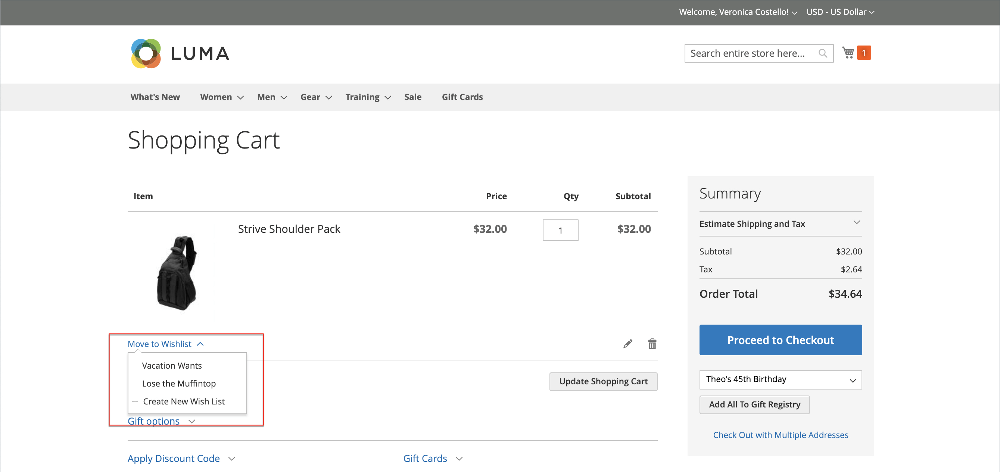

# Önska butiksupplevelsen

En önskelista är ett bekvämt sätt för kunderna att återkalla produkter som de gillar, men inte är redo att köpa. Artiklar från en önskelista kan delas med andra eller läggas till i kundvagnen. Om kunden har flera önskelistor visas namnet på den aktuella önskelistan överst på sidan. Kunderna kan hantera sina önskelistor från sin kontokontrollpanel. Butiksadministratörer kan även hjälpa kunderna att hantera sina önskelistor från administratören.

{width="700" zoomable="yes"}

 Adobe Commerce stöder användningen av flera önskelistor per kundkonto.

 Kodbasen Magento Open Source stöder användningen av en enda önskelista per kundkonto.

## Skapa en önskelista

 (endast Adobe Commerce)

I butiken kan kunden skapa en önskelista från sin kontopanel, en produktsida, en katalogsida och kundvagnen.

### Metod 1: Från ett kundkonto

1. I sidofältet på kontouppsättningen väljer kunden **[!UICONTROL My Wish List]**.

1. Klicka i det övre högra hörnet **[!UICONTROL Create New Wish List]**.

1. Ange önskelistans namn.

1. Om du vill att andra ska kunna se önskelistan väljer du **[!UICONTROL Public Wish List]** kryssrutan.

   >[!NOTE]
   >
   >Huvudskillnaden mellan `Public` och `Private` önskelistor är att privata önskelistor inte är [sökbar](wishlist-configuration.md#add-wish-list-search) genom önskelistor.

1. När du är klar klickar du på **[!UICONTROL Save]**.

   {width="700" zoomable="yes"}

### Metod 2: Från katalogsidan

1. Från butiken går kunden till katalogsidan som innehåller den produkt de vill lägga till i önskelistan.

1. Hovrar över produkten.

1. Kunden klickar på pilen bredvid _Lägg till i önskelista_ -ikonen och markerar **[!UICONTROL Create New Wish List]**.

1. Anger önskelistans namn.

1. Om du vill att andra ska kunna se önskelistan väljer du **[!UICONTROL Public Wish List]** kryssrutan.

1. När det är klart klickar du **[!UICONTROL Save]**.

### Metod 3: Från produktinformationssidan

1. Från butiken går kunden till detaljsidan för den produkt de vill lägga till i önskelistan.

1. Klicka på pilen bredvid **[!UICONTROL Add to Wish List]** och väljer **[!UICONTROL Create New Wish List]**.

1. Anger **[!UICONTROL Wish List Name]**.

1. Om du vill att andra ska kunna se önskelistan väljer du **[!UICONTROL Public Wish List]** kryssrutan.

1. När det är klart klickar du **[!UICONTROL Save]**.

   {width="700" zoomable="yes"}

### Metod 4: Från kundvagnen

1. Kunden öppnar **[!UICONTROL Shopping Cart]** sida.

1. Under objektet klickar du på pilen bredvid **[!UICONTROL Move to Wishlist]** och väljer **[!UICONTROL Create New Wish List]**.

1. Anger **[!UICONTROL Wish List Name]**.

1. Om du vill att andra ska kunna se önskelistan väljer du **[!UICONTROL Public Wish List]** kryssrutan.

1. När det är klart klickar du **[!UICONTROL Save]**.

{width="700" zoomable="yes"}

## Uppdatera produktlistan

1. I önskelistan pekar kunden på produkten för att visa alternativen.

1. Lägga till en **[!UICONTROL Comment]** om produkten, anger texten i rutan under priset.

   {width="700" zoomable="yes"}

1. Om du vill ändra urvalet av produktalternativ klickar du på **[!UICONTROL Edit]** och gör följande:

   - Uppdaterar alternativen på produktinformationssidan.
   - Klickningar **[!UICONTROL Update Wish List]**.

## Lägg en önskelisteprodukt i kundvagnen

1. I önskelistan pekar kunden på den produkt som du vill lägga till.

1. Uppdaterar **[!UICONTROL Qty]** och redigera de andra alternativen efter behov.

1. Klickningar **[!UICONTROL Add to Cart]**.

## Dela önskelistan

1. Kunden klickar **[!UICONTROL Share Wishlist]**.

1. Anger e-postadressen till varje person som ska ta emot önskelistan, åtskilda med kommatecken.

1. Lägger till en **[!UICONTROL Message]** som ska inkluderas i e-postmeddelandet.

1. Klickningar **[!UICONTROL Share Wish List]**.

   {width="700" zoomable="yes"}

   Meddelandet skickas från din primära [butikskontakt](../getting-started/store-details.md#store-email-addresses) och innehåller en miniatyrbild av varje produkt, med länkar till din butik.

   {width="500" zoomable="yes"}

## Redigera önskelistor

Kunderna kan ändra sin önskelista på flera sätt från sin kontokontrollpanel.

### Flytta objekt till en annan lista

 (endast Adobe Commerce)

1. Kunden markerar kryssrutan för varje objekt som ska flyttas.

1. Klickningar **[!UICONTROL Move Selected to Wish List]** och gör något av följande:

   - Väljer en befintlig önskelista.
   - Klickningar **[!UICONTROL Create New Wish List]**.

### Kopiera objekt till en annan lista

 (endast Adobe Commerce)

1. Markerar kryssrutan för varje objekt som ska flyttas.

1. Klickningar **[!UICONTROL Copy Selected to Wish List]** och gör något av följande:

   - Väljer en befintlig önskelista.
   - Klickningar **[!UICONTROL Create New Wish List]**.

## Ta bort en önskelista

 (endast Adobe Commerce)

1. Kunden öppnar önskelistan som ska tas bort.

1. Klickningar **[!UICONTROL Delete Wish List]**.

1. När du uppmanas att bekräfta klickar du **[!UICONTROL OK]**.

>[!IMPORTANT]
>
>Det går inte att ångra den här åtgärden.

## Överför önskelisteobjekt till kundvagnen

För att överföra alla önskelisteartiklar till kundvagnen klickar kunden **[!UICONTROL Add All to Cart]**.

Om du vill lägga till ett enstaka objekt gör kunden följande:

1. Hovrar över objektet och anger **[!UICONTROL Qty]** som de vill lägga i vagnen.

1. Klickningar **[!UICONTROL Add to Cart]**.

## Hitta en önskelista för kunden

Om [Widgeten Önska listsökning](wishlist-configuration.md#add-wish-list-search) som finns på dina butikssidor kan kunderna söka efter önskelistans namn eller e-postadress.

1. Från widgeten Söklista väljer kunden ett sökalternativ.

1. Anger önskelisteägarens namn eller e-postadress och klickar **[!UICONTROL Search]**.

   The _Önsklistesökning_ öppnas sidan och alla matchande önskelistor visas i sökresultatavsnittet.

   >[!NOTE]
   >
   >Endast offentliga önskelistor visas i sökresultaten - kundernas privata önskelistor kan inte visas offentligt.

1. Om du vill visa listan över önskelisteobjekt klickar du på **[!UICONTROL View]**.

   Ägarnamnet och datumet för den senaste uppdateringen visas för varje önskelista.

1. Kunden markerar kryssrutan nedanför produkten och klickar för att lägga till en produkt i kundvagnen **[!UICONTROL Add to Cart]**.

   Du kan också lägga till saker du gillar från en annan kunds önskelista till din egen.
