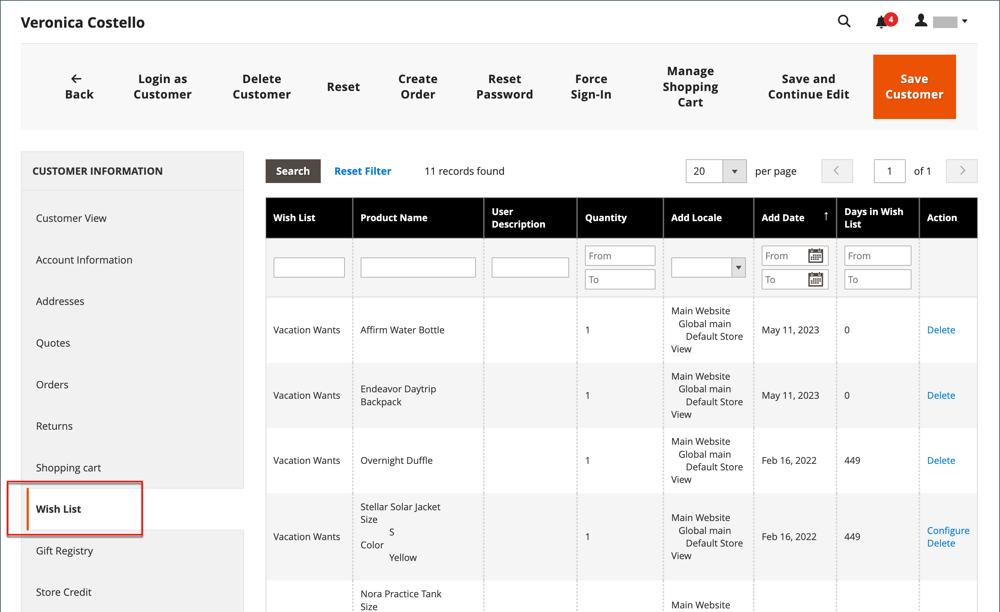

# Önsklistorna

En önskelista är en lista över produkter som en registrerad kund kan dela med vänner eller spara för att överföra till kundvagnen senare. När önskelistor är aktiverade visas länken Lägg till i önskelista på kategori- och produktsidorna för varje produkt i butiken. Beroende på temat kan det vara en textlänk eller en grafisk bild.

 Adobe Commerce stöder användningen av flera önskelistor per kundkonto.

 Magento Open Source stöder användningen av en enda önskelista per kundkonto.

Delade önskelistor skickas från en e-postadress i butik, men meddelandetexten innehåller en personlig anteckning från kunden. Du kan anpassa e-postmallen som används när önskelistor delas och välja den butikskontakt som visas som avsändare.

Önsklistorna kan uppdateras från kontrollpanelen i [kundkonto](../customers/account-dashboard.md). Artiklar kan läggas till eller överföras mellan önskelistan och vagnen av kunden eller butiksadministratören.

{width="700" zoomable="yes"}

När en produkt med flera alternativ läggs till i en önskelista inkluderas alla alternativ som kunden har valt i önskelisteobjektets beskrivning. Om kunden till exempel lägger till samma par skor i tre olika färger visas varje par som ett separat önskelisteobjekt. Men om kunden lägger till samma produkt i önskelistan flera gånger visas produkten bara en gång, men med en uppdaterad kvantitet som återspeglar antalet gånger som produkten lagts till.

## Önsklistehjälp i administratören

Kunderna kan [hantera sina önskelistor](wishlist-storefront.md) genom att logga in på sina konton i butiken. Som butiksadministratör kan du även hantera kundernas önskelistor från administratören.

**_Så här uppdaterar du önskelisteobjekt från administratören:_**

1. På _Administratör_ sidebar, gå till **[!UICONTROL Customers]** > **[!UICONTROL All Customers]**.

1. Hitta kunden i listan och klicka på **[!UICONTROL Edit]** i _[!UICONTROL Action]_kolumn.

1. Välj **[!UICONTROL Wish List]** och söker efter det objekt som ska redigeras i listan.

   Alla alternativ som har valts för produkten visas under produktnamnet.

   {width="600" zoomable="yes"}

1. Så här redigerar du produktalternativen:

   - I **[!UICONTROL Action]** kolumn, klicka **[!UICONTROL Configure]**.

   - Uppdatera alternativen och **[!UICONTROL Quantity]** efter behov.

   - Klicka på **[!UICONTROL OK]**.

1. När du är klar klickar du på **[!UICONTROL Save Customer]** eller **[!UICONTROL Save and Continue Edit]**.
