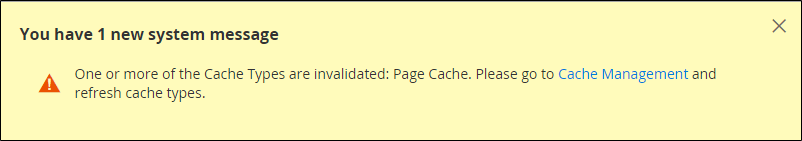

# Cachehantering

Cachehanteringssystemet Adobe Commerce och Magento Open Source är ett enkelt sätt att förbättra prestanda för din webbplats. När ett cacheminne kräver en uppdatering visas ett meddelande med en länk till sidan [!UICONTROL Cache Management] för att slutföra uppdateringen.

{width="500"}

Sidan _[!UICONTROL Cache Management]_&#x200B;visar status för varje primärt cacheminne och dess associerade tagg. De stora knapparna i det övre högra hörnet kan användas för att tömma cacheminnet, eller den kompletta cachelagringen. Längst ned på sidan kan du med ytterligare knappar tömma cacheminnet för katalogproduktbilder och JavaScript/CSS-cacheminnet.

>[!IMPORTANT]
>
>När katalogenheter ändras kan det påverka andra sidor och göra flera cacher ogiltiga samtidigt. När du granskar sidan för cachehantering kan du se ogiltiga objekt som behöver uppdateras när de _&#x200B;**inte redigerades direkt**&#x200B;_. Den här ogiltigförklaringen inträffar t.ex. när du redigerar en produkt i katalogen som är tilldelad en kategori eller när du ändrar en relaterad produktregel.

När du har rensat ett cacheminne bör du alltid uppdatera webbläsaren så att du ser de senaste filerna. När du rensar Commerce-cachen rensas inte webbläsarens cacheminne. Du kan behöva rensa webbläsarens cache för att se uppdaterat innehåll.

Mer teknisk information om Adobe Commerce-cachelagring finns i [Cacheöversikt](https://developer.adobe.com/commerce/frontend-core/guide/caching/){:target="_blank"} i _Commerce Fornend Development Guide_.

Gå till sidan _[!UICONTROL Cache Management]_&#x200B;genom att göra något av följande:

- Klicka på länken **[!UICONTROL Cache Management]** i meddelandet ovanför arbetsytan.
- Gå till **[!UICONTROL System]** > _[!UICONTROL Tools]_>**[!UICONTROL Cache Management]**&#x200B;på sidofältet_ Admin _.

{width="700" zoomable="yes"}

## Metodtips för cachelagring

Omindexering och cachelagring har olika syften i Commerce. [Index](index-management.md) spårar databasinformation för bättre sökprestanda, snabbare datahämtning för butiker med mera. Caches save loaded data, images, formats, and the like for enhanced performance loading and accessing the storefront.

- Töm alltid cacheminnet efter installation av tillägg/moduler. Du kan installera ett eller flera tillägg och sedan tömma cachen.
- Töm cacheminnet efter installation av Commerce. För nya installationer bör du även indexera om.
- Töm cacheminnet när du har uppgraderat från en version av Open Source eller Commerce till en annan.
- När du tömmer cacheminnen bör du tänka på vilken typ av cacheminne det är och schemalägga tömningen under icke-topptider. Välj t.ex. en tid då få kunder använder webbplatsen, som sen natt eller tidig morgon. Om du rensar cachetyper under maximal efterfrågan kan belastningen på Admin öka, vilket kan leda till att webbplatsen går ned tills åtgärden har slutförts.
- När [omindexerar](index-management.md) behöver du inte tömma cachen.

## Rollresurser för cachehantering

Du kan tilldela användare åtkomst till specifika cacheunderhållsåtgärder per roll, inklusive alternativ för att visa, växla och tömma cacheminnen. Adobe rekommenderar att du bara aktiverar rensningsåtgärder för användare på administratörsnivå. Om du får tillgång till alla funktioner för cachehantering kan det påverka butikens prestanda.

{width="600" zoomable="yes"}

Mer information om hur du tilldelar resurser för att bevilja åtkomst för administratörsanvändarkonton finns i [Rollresurser](permissions-user-roles.md#role-resources). Följande resurser styr åtkomsten till verktygen för cachehantering:

- [!UICONTROL Clean Cache Actions]

   - [!UICONTROL Flush Cache Storage]
   - [!UICONTROL Flush Magento Cache]

- [!UICONTROL Cache Type Management]

   - [!UICONTROL Toggle Cache Type]
   - [!UICONTROL Refresh Cache Type]

- [!UICONTROL Additional Cache Management]

   - [!UICONTROL Catalog Images Cache]
   - [!UICONTROL Flush Js/Css]
   - [!UICONTROL Flush Static Files]

## Uppdatera specifika cacheminnen

1. För varje cache som ska uppdateras markerar du kryssrutan i början av raden.

1. Ange **[!UICONTROL Actions]** till `Refresh` och klicka på **[!UICONTROL Submit]**.

## Uppdatera massåtgärd

1. Om du vill välja en grupp cacheminnen anger du **[!UICONTROL Mass Actions]** till något av följande:

   - `Select All`
   - `Select Visible`

1. Markera kryssrutan för varje cache som ska uppdateras.

1. Ange **[!UICONTROL Actions]** till `Refresh` och klicka på **[!UICONTROL Submit]**.

## Rensa produktbildcachen

1. Klicka på **[!UICONTROL Flush Catalog Images Cache]** under _[!UICONTROL Additional Cache Management]_&#x200B;för att rensa förgenererade produktbildfiler.

   Meddelandet `Image cache was cleaned` visas högst upp på arbetsytan.

1. Rensa cacheminnet i webbläsaren.

## Töm JavaScript/CSS-cachen

1. Under _[!UICONTROL Additional Cache Management]_&#x200B;rensar du JavaScript- och CSS-filer som har slagits samman till en enda fil genom att klicka på&#x200B;**[!UICONTROL Flush JavaScript/CSS Cache]**.

   Meddelandet `The JavaScript/CSS cache has been cleaned` visas högst upp på arbetsytan.

1. Rensa cacheminnet i webbläsaren.

## Töm med kommandoraden

Systemadministratörer och utvecklare med tillgång till Commerce programserver kan också hantera cache- och cachekonfigurationen från kommandoraden med Commerce CLI. Se [Hantera cachen](https://experienceleague.adobe.com/en/docs/commerce-operations/configuration-guide/cli/manage-cache#clean-and-flush-cache-types){:target="_blank"} i _Konfigurationshandboken_.

## Kontroller

| Kontroll | Beskrivning |
|---------------------------|------------------------------------------------------------------------------------------------------------------------------------------------------------------------------------------------------------------------------------------------------------------------------------------------------------------------------------------------------------|
| [!UICONTROL Mass Actions] | Markerar kryssrutan för flera cacher. Alternativ:  **[!UICONTROL Select All]**- Markerar kryssrutan för alla cacheminnen. **&#x200B; Avmarkera alla &#x200B;**- kryssrutan för alla cacheminnen rensas. **[!UICONTROL Select Visible]** - Markerar kryssrutan för alla synliga cacheminnen.  **[!UICONTROL Unselect Visible]**- Rensar kryssrutan för alla synliga cacher. |
| [!UICONTROL Actions] | Anger vilken åtgärd som ska tillämpas på alla markerade cacheminnen. Alternativ:  **[!UICONTROL Enable]**- Aktiverar alla markerade cacheminnen. **[!UICONTROL Disable]** - Inaktiverar alla markerade cacheminnen.  **[!UICONTROL Refresh]**- Uppdaterar alla markerade cacheminnen. |
| [!UICONTROL Submit] | Tillämpar åtgärden på alla markerade cacheminnen. |

{style="table-layout:auto"}

### Knappar

| Knapp | Beskrivning |
|-----------------------------------------|----------------------------------------------------------------------------------------------------------------------------------------------------------------------------------------------------------------------------------------|
| [!UICONTROL Flush Magento Cache] | Tar bort alla objekt i standardcachen för Commerce (`var/cache`) enligt deras associerade Commerce-taggar. |
| [!UICONTROL Flush Cache Storage] | Tar bort alla objekt från cachen, oavsett Commerce-tagg. Om systemet använder en alternativ cacheplats tas alla cachelagrade filer som används av andra program bort. |
| [!UICONTROL Flush Catalog Images Cache] | Tar bort alla automatiskt storleksändrade och vattenstämplade katalogbilder som lagras i `media/catalog/product/cache`. Om nyligen överförda bilder inte visas i katalogen kan du försöka tömma katalogen och uppdatera webbläsaren. |
| [!UICONTROL Flush JavaScript/CSS Cache] | Tar bort den sammanfogade kopian av JavaScript- och CSS-filer från cachen. Om de senaste ändringarna av formatmallen eller JavaScript inte visas i butiken kan du försöka tömma JavaScript/CSS-cachen och uppdatera webbläsaren. |
| [!UICONTROL Flush Static Files Cache] | Tar bort förbearbetade visningsfiler och statiska filer. |

{style="table-layout:auto"}

### Cacher

På sidan [!UICONTROL Cache Management] visas de cachetyper som du kan hantera från administratören med deras aktuella status. I det här avsnittet beskrivs de standardcachetyper som stöds av Adobe Commerce. Kolumnerna _Cache-tagg_ och _Cache-id_ beskriver de värden som används i Commerce-programkoden:

- `cache_type_id` definierar den unika identifieraren för en cachetyp.

- `%CACHE_TYPE_TAG%` definierar den unika tagg som ska användas i cachetypsomfång.

Utvecklare och systemintegratörer använder dessa värden för att konfigurera och hantera cachning när de anpassar eller integrerar med Adobe Commerce, till exempel för att utveckla integreringar med GraphQL API:er.

[!BADGE PaaS endast]{type=Informative url="https://experienceleague.adobe.com/en/docs/commerce/user-guides/product-solutions" tooltip="Gäller endast Adobe Commerce i molnprojekt (Adobe-hanterad PaaS-infrastruktur) och lokala projekt."} `cache_type_id` används även för cachehantering från programserverns kommandorad med Commerce CLI. ` bin/magento cache:status config` visar till exempel aktuell status för konfigurationscachen.

>[!NOTE]
>
>Utvecklare och systemintegratörer kan anpassa och utöka Commerce cachehanteringssystem för att stödja anpassade moduler och integreringar. Mer information finns i [Konfigurera cachelagring](https://experienceleague.adobe.com/en/docs/commerce-operations/configuration-guide/cache/caching-overview) i _Konfigurationshandboken för Adobe Commerce_.

<!-- prettier-ignore -->

#### Information om cachelista

| Cache | Beskrivning | Cache-tagg | Cache-id |
|-------|------------|----------|----------|
| [!UICONTROL Configuration] | Commerce samlar in XML-konfiguration från alla moduler, sammanfogar den och sparar det sammanfogade resultatet i cachen. **[!UICONTROL System]**- `config.xml`,`local.xml` **[!UICONTROL Module]** - `config.xml`  Cachen innehåller även lagringsinställningar som är lagrade i filsystemet och databasen. Rensa eller tömma den här cachetypen efter att konfigurationsfilerna har ändrats. | `CONFIG` | `config` |
| [!UICONTROL Layouts] | Kompilerade sidlayouter, det vill säga layoutkomponenter från alla komponenter. Rensa eller tömma den här cachetypen efter att du har ändrat layoutfiler. | `LAYOUT_GENERAL_CACHE_TAG` | `layout` |
| [!UICONTROL Blocks HTML output] | HTML sidfragment per block. Rengör eller tömma den här cachetypen efter att du har ändrat visningslagret. | `BLOCK_HTML` | `block_html` |
| [!UICONTROL Collections Data] | Samla in datafiler som lagrar resultatet av databasfrågor. Om det behövs rensar Commerce automatiskt cachen, men tredjepartsutvecklare kan placera alla data i valfritt segment i cachen. Rensa eller tömma den här cachetypen om den anpassade modulen använder logik som resulterar i cacheposter som inte kan rensas av Commerce. | `COLLECTION_DATA` | `collections` |
| [!UICONTROL Reflections] | Rensar API-gränssnittets reflektionsdata, som vanligtvis genereras under körning. | `REFLECTION` | `reflection` |
| `Database DDL operations` | Databasschema. Om det behövs rensar Commerce automatiskt cachen, men tredjepartsutvecklare kan placera alla data i valfritt segment i cachen. Rensa eller tömma den här cachetypen efter att du har gjort anpassade ändringar i databasschemat. (Detta är med andra ord uppdateringar som Commerce inte gör sig självt.) Ett sätt att uppdatera databasschemat automatiskt är att använda uppgraderingskommandot för magentalkonfigurationen :db-schema:. | `DB_DDL` | `db_ddl` |
| [!UICONTROL Compiled Config] | Resultat av kodkompilering. | `COMPILED_CONFIG` | `compiled_config` |
| [!UICONTROL Webhooks Response Cache] | Cachelagrar svar på webkrok-begäranden. Mer information finns i [Webhooks-guiden](https://developer.adobe.com/commerce/extensibility/webhooks/release-notes/#enhancements-2) i dokumentationen för Commerce-utvecklare. | `WEBHOOKS_RESPONSE` | `webhooks_response` |
| [!UICONTROL EAV types and attributes] | Cachelagrar entitetstypsdeklaration för metadata relaterade till attributen för entitetsattributvärde (EAV). Attributen omfattar butiksetiketter, länkar till relaterad PHP-kod, attributåtergivning, sökinställningar och så vidare. Du behöver vanligtvis inte rensa eller tömma den här cachetypen. | `EAV` | `eav` |
| [!UICONTROL Customer Notification] | Tillfälliga meddelanden som visas i användargränssnittet. | `CUSTOMER_NOTIFICATION` | `customer_notification` |
| [!UICONTROL GraphQL Query Resolver Results] | Caches the results from GraphQL query resolvers for customer, CMS page, CMS block, and product media gallery entities. Låt cachen vara aktiverad för att förbättra GraphQL prestanda. | `GRAPHQL_QUERY_RESOLVER_RESULT` | `graphql_query_resolver_result` |
| [!UICONTROL Integrations Configuration] | Konfigurationsfil för integrering. Rensa eller tömma det här cacheminnet när du har ändrat eller lagt till integreringar. | `INTEGRATION` | `config_integration` |
| [!UICONTROL Integrations API Configuration] | Kompilerade API:er för integrering av butiker. | `INTEGRATION_API_CONFIG` | `config_integration_api` |
| [!UICONTROL Admin UI SDK Cache] | Cachelagrar anpassningar av administratören. Se [Administratörskonfiguration och -testning](https://developer.adobe.com/commerce/extensibility/admin-ui-sdk/configuration/) i _Admin UI SDK Guide_. | `ADMIN_UI_SDK` | `admin_ui_sdk` |
| [!UICONTROL Page Cache] | Cachelagring av hela sidor. | `FPC` | `full_page` |
| [!UICONTROL Target Rule] | Index för målregel | `TARGET_RULE` | `target_rule` |
| [!UICONTROL Web Services Configuration] | Cachelagrar webb-API-strukturen. | `WEBSERVICE` | `config_webservice` |
| [!UICONTROL Translations] | Översättningsfiler. | `TRANSLATE` | `translate` |

{style="table-layout:auto"}

## Cachelagring

Adobe Commerce och Magento Open Source använder helsidescachning på servern för att snabbt visa kategori-, produkt- och CMS-sidor. Helsidescachning förbättrar svarstiden och minskar belastningen på servern. Utan cachelagring kan varje sida behöva köra kodblock och hämta information från databasen. Om cachelagring av hela sidor är aktiverad kan en helt genererad sida dock läsas direkt från cacheminnet.

>[!NOTE]
>
>Vi rekommenderar att [lack-cache](https://varnish-cache.org/){:target="_blank"} endast används i en produktionsmiljö.

Cachelagrat innehåll kan användas för att behandla begäranden från liknande typer av besök. Detta kan leda till att sidor som visas för en besökare av en viss person skiljer sig från sidor som visas för en kund. Vid cachelagring är varje besök en av tre typer:

- `Non-sessioned` - Under ett icke-sessionerat besök visar kunderna sidor, men interagerar inte med butiken. Systemet cachelagrar innehållet på varje sida som visas och skickar dem till andra kunder som inte sitter bredvid varandra.
- `Sessioned` - Under ett session-besök tilldelas de kunder som interagerar med butiken ett sessions-ID. Interaktionerna kan vara att jämföra produkter eller lägga till produkter i kundvagnen. Cachelagrade sidor som genereras under sessionen används endast av den användaren under sessionen.
- `Customer` - Kundsessioner skapas för kunder som loggar in och handlar med sitt registrerade konto. Under sessionen kan kunderna få specialerbjudanden, kampanjer och priser baserat på deras tilldelade kundgrupp.

Mer teknisk information finns i [Konfigurera och använda lack](https://experienceleague.adobe.com/docs/commerce-operations/configuration-guide/cache/varnish/config-varnish.html){:target="_blank"} och [Använd Redis för Commerce-sidan och standardcachen](https://experienceleague.adobe.com/docs/commerce-operations/configuration-guide/cache/redis/redis-pg-cache.html){:target="_blank"} i _konfigurationshandboken_.

**_Så här konfigurerar du helsidescachen:_**

1. Gå till **[!UICONTROL Stores]** > _[!UICONTROL Settings]_>**[!UICONTROL Configuration]**&#x200B;på sidofältet_ Admin _.

1. Expandera **[!UICONTROL Advanced]** i den vänstra panelen och välj **[!UICONTROL System]**.

1. Expandera  i avsnittet **[!UICONTROL Full Page Cache]**.

   {width="600" zoomable="yes"}

1. Ange **[!UICONTROL Caching Application]** till något av följande:

   - `Built-in Application`
   - `Varnish Caching`

1. Ange **[!UICONTROL TTL for public content]** om du vill ange timeout för sidcachen. (Standardvärdet är `86400`)

1. Ange **[!UICONTROL Handles param size]** om du vill ange det maximala antalet [layouthandtag](https://developer.adobe.com/commerce/frontend-core/guide/layouts/#layout-handles) som ska bearbetas på HTTP-slutpunkten [`{BASE-URL}/page_cache/block/esi`](https://experienceleague.adobe.com/docs/commerce-operations/configuration-guide/cache/use-varnish-esi.html). Genom att begränsa storleken kan du förbättra säkerheten och prestandan. (Standardvärdet är `100`)

1. Om du använder lack fyller du i avsnittet **[!UICONTROL Varnish Configuration]** enligt följande:

   - **[!UICONTROL Access list]** - Ange de IP-adresser som kan rensa Varnish-konfigurationen för att generera en konfigurationsfil. Avgränsa flera poster med komma. Standardvärdet är `localhost`.

   - **[!UICONTROL Backend host]** - Ange IP-adressen för den backend-värd som genererar konfigurationsfiler. Standardvärdet är `localhost`.

   - **[!UICONTROL Backend port]** - Identifiera den serverdelsport som används för att generera konfigurationsfiler. Standardvärdet är: `8080`.

   - **[!UICONTROL Grace period]** - Ange hur många sekunder som ska användas som respitperiod för att generera konfigurationsfiler. Se [Avancerad lack-konfiguration](https://experienceleague.adobe.com/docs/commerce-operations/configuration-guide/cache/config-varnish-advanced.html) i _Konfigurationshandboken_.

   - Om du vill exportera konfigurationen som en `varnish.vcl`-fil klickar du på knappen för den version av engelska som du använder.

   {width="600" zoomable="yes"}

1. Klicka på **[!UICONTROL Save Config]** när du är klar.
