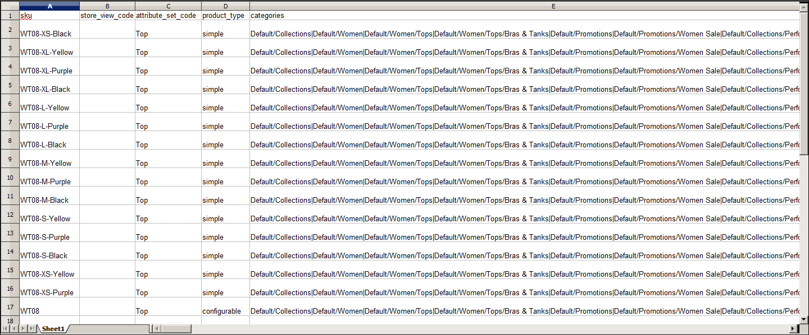

# Referens för produktdataattribut

I följande tabell visas attributen från en typisk produktexport i den standardordning som de visas. Varje attribut representeras i CSV-filen som en kolumn, och produktposterna representeras av rader. Kolumner som börjar med ett understreck innehåller tjänstdata som egenskaper eller alternativvärden för komplexa data. Du kan [exportera](data-export.md) en produkt från din katalog för att se hur varje attribut representeras i data.

Den installation som används för att exportera dessa data har exempeldata installerade och har två webbplatser och flera butiksvyer. Även om den här listan innehåller alla kolumner som vanligtvis exporteras är `sku` det enda obligatoriska värdet. Om du vill importera data kan du bara inkludera kolumner med ändringar. `sku` ska vara den första kolumnen, men ordningen för resten av attributen spelar ingen roll.

## Enkel CSV-filstruktur för produkter

| Attribut | Beskrivning |
|--- |--- |
| `sku` | (Obligatoriskt) Lagringsenheten är en unik alfanumerisk identifierare som används för att spåra lagret. En SKU kan innehålla upp till 64 tecken. Till exempel: `sku123` **_Obs!_**En SKU som är längre än 64 tecken gör att importen misslyckas. |
| `store_view_code` | Identifierar de specifika butiksvyer där produkten är tillgänglig. Om den är tom är produkten tillgänglig i standardbutiksvyn. Till exempel: `storeview1`, `english`, `spanish` |
| `attribute_set_code` | Tilldelar produkten till en specifik attributuppsättning eller produktmall, beroende på produkttyp. Till exempel: `default`  När produkten har skapats kan attributuppsättningen inte ändras med importfunktionen. Du kan dock ändra attributuppsättningen i Admin och exportera om produkten för att uppdatera CSV-filen. |
| `product_type` | Anger typen av produkt. Värden: `simple` - Materiella artiklar som vanligen säljs som enstaka enheter eller i fasta kvantiteter. `grouped` - En grupp separata produkter som säljs som en uppsättning. `configurable` - En produkt med flera alternativ som kunden måste välja innan han/hon kan göra ett köp. Inventering kan hanteras för varje uppsättning variationer eftersom de representerar en separat produkt med en distinkt SKU. En kombination av färg och storlek för en konfigurerbar produkt kopplas till exempel till en specifik SKU i katalogen. `virtual` - En icke-materiell produkt som inte kräver frakt och som inte finns i lager. Exempel är tjänster, medlemskap och prenumerationer. `bundle` - En anpassningsbar produktuppsättning med enkla produkter som säljs tillsammans. |
| `categories` | Anger varje kategori som har tilldelats produkten. Separata kategorier och underkategorier med ett snedstreck. Om du vill ange flera kategorisökvägar avgränsar du varje bana med ett rör \| symbol. Till exempel: `Default Category/Gear\|Default Category/Gear/Bags` |
| `product_websites` | Webbplatskoden för varje webbplats där produkten finns tillgänglig. En enskild produkt kan tilldelas flera webbplatser, eller begränsas till en. Om du anger flera webbplatser avgränsar du dem med kommatecken och utan mellanslag. Till exempel: `base` eller `base,website2` |
| `name` | Produktnamnet visas i alla produktlistor och är det namn som kunderna använder för att identifiera produkten. |
| `description` | Produktbeskrivningen innehåller detaljerad information om produkten och kan innehålla enkla HTML-taggar. |
| `short_description` | Användningen av den korta produktbeskrivningen beror på temat. Den kan visas i produktlistor och används ibland i RSS-flöden som skickas till shoppingwebbplatser. |
| `weight` | Den enskilda produktens vikt. Den faktiska produktvikten bestäms av transportföretaget vid tidpunkten för transporten. |
| product_online | Fastställer om produkten är tillgänglig för försäljning i butiken. Värden: `1` — (Ja) Produkten är aktiverad och tillgänglig för försäljning. `2` — (Nej) Produkten är inaktiverad och kan inte säljas. |
| `tax_class_name` | Namnet på den momsklass som är associerad med den här produkten. |
| `visibility` | Avgör om produkten är synlig i katalogen och tillgänglig för sökning. Värden: `Not Visible Individually` - Produkten ingår inte i produktlistor, men den kan finnas som en variant av en annan produkt. `Catalog` - Produkten visas i alla kataloglistor. `Search` - Produkten är tillgänglig för sökåtgärder. `Catalog, Search` - Produkten ingår i kataloglistorna och är även tillgänglig för sökning. |
| `price` | Det pris som produkten erbjuds till försäljning i din butik. |
| `special_price` | Det rabatterade priset för produkten under det angivna datumintervallet. |
| `special_price_from_date` | Startdatumet för tidsperioden när specialpriset gäller. |
| `special_price_to_date` | Det sista datumet i tidsperioden då specialpriset gäller. |
| `url_key` | Den del av URL:en som identifierar produkten. Standardvärdet baseras på produktnamnet. Till exempel: `product-name` |
| save_rewrites_history | När det anges med värdet `1` med en ny `url_key` genereras en ny 301-URL-omskrivning så att den gamla URL:en omdirigeras till den nya URL:en. |
| `meta_title` | Meta-titeln visas i namnlisten och på fliken i webbläsaren och i sökresultatlistorna. Meta-titeln ska vara unik för produkten, innehålla nyckelord med högt värde och vara kortare än 70 tecken. |
| `meta_keywords` | Meta-nyckelord är bara synliga för sökmotorer och ignoreras av vissa sökmotorer. Välj högvärdesnyckelord, avgränsade med kommatecken. Till exempel: `keyword1`, `keyword2`, `keyword3` |
| `meta_description` | Metabeskrivningar ger en kort översikt över produkten för sökresultatlistor. I idealfallet bör en metabeskrivning innehålla mellan 150 och 160 tecken, men fältet får innehålla upp till 255 tecken. |
| `base_image` | Den relativa sökvägen för huvudbilden på produktsidan. Commerce sparar filer internt i en alfabetisk mappstruktur. Du kan se den exakta placeringen av varje bild i de exporterade data. Exempel: `/sample_data/m/b/mb01-blue-0.jpg` Om du vill överföra en ny bild eller skriva över en befintlig bild anger du filnamnet, föregånget av ett snedstreck. Till exempel: `/image.jpg` |
| `base_image_label` | Etiketten som är associerad med basbilden. |
| `small_image` | Filnamnet på den lilla bilden som används på katalogsidor, föregånget av ett snedstreck. Till exempel: `/image.jpg` |
| `small_image_label` | Den etikett som är associerad med den lilla bilden. Till exempel: `Small Image 1`, `Small Image 2` |
| `thumbnail_image` | Filnamnen på miniatyrbilderna som ska visas i galleriet på produktsidan, föregånget av ett snedstreck. Till exempel: `/image.jpg` |
| `thumbnail_image_label` | Etiketten som är associerad med miniatyrbilder. Till exempel: `Thumbnail 1`, `Thumbnail 2` |
| `created_at` | Anger datumet då produkten skapades. Datumet genereras automatiskt när produkten skapas, men kan redigeras senare. |
| `updated_at` | Anger datumet då produkten senast uppdaterades. |
| `new_from_date` | Anger&quot;från&quot;-datumet för nya produktlistor och avgör om produkten är en ny produkt. |
| `new_to_date` | Anger&quot;till&quot;-datumet för nya produktlistor och avgör om produkten är en ny produkt. |
| `display_product_options_in` | Om produkten har flera alternativ, avgör var de visas på produktsidan. Värden: Kolumn för produktinformation/Block efter informationskolumn |
| `map_price` | Det lägsta annonserade priset för produkten. (Visas bara om MAP är aktiverat.) |
| `msrp_price` | Tillverkarens föreslagna detaljhandelspris för produkten. (Visas bara om MAP är aktiverat.) |
| `map_enabled` | Avgör om lägsta kampanjpris är aktiverat i konfigurationen. Värden: `1` — (Ja) MAP är aktiverat. `0` (eller tom) — (Nej) MAP är inte aktiverat. |
| `gift_message_available` | Avgör om ett presentmeddelande kan inkluderas i produktköpet. Värden: `1` — (Ja) Alternativet att inkludera ett presentationsmeddelande visas för kunden. `0` (eller tomt) — (Nej) Alternativet att inkludera ett presentationsmeddelande visas inte för kunden. |
| `custom_design` | Visar tillgängliga teman som kan användas på produktsidan. |
| `custom_design_from` | Anger startdatum när det valda temat används på produktsidan. |
| `custom_design_to` | Anger slutdatumet när det valda temat används på produktsidan. |
| `custom_layout_update` | Ytterligare XML-kod som används som layoutuppdatering på produktsidan. |
| `page_layout` | Bestämmer sidlayouten för produktsidan. Värden: `No layout updates` - Ingen ändring görs i sidlayouten. `1 column` - Använder en layout med en kolumn på produktsidan. `2 columns with left bar` - Använder en layout med två kolumner och vänster sidospalt på produktsidan. `2 columns with right bar` - Använder en layout med två kolumner och höger sidospalt på produktsidan. `3 columns` - En layout med tre kolumner används på produktsidan. `empty` - En tom layout används på produktsidan. |
| `product_options_container` | Om produkten har flera alternativ, avgör var de visas på produktsidan. Värden: Kolumn för produktinformation/Block efter informationskolumn |
| `msrp_display_actual_price_type` | Avgör var det faktiska priset på en produkt är synligt för kunden. Värden: `In Cart` - Visar det faktiska produktpriset i kundvagnen. `Before Order Confirmation` - Visar det faktiska produktpriset i slutet av utcheckningsprocessen, precis innan ordern har bekräftats. `On Gesture` - Visar det faktiska produktpriset i en popup när kunden klickar på _Klicka för pris_ eller _Vad är detta?_-länk. |
| `country_of_manufacture` | Ange det land där produkten tillverkades. |
| `additional_attributes` | Ytterligare attribut har skapats för produkten. Till exempel:  `has_options=0,required_options=0color=Black,has_options=0,required_options=0,size_general=XS` |
| `qty` | Den kvantitet av produkten som finns i lager. |
| `out_of_stock_qty` | Lagernivån som avgör att produkten är ur lager. |
| `use_config_min_qty` | Avgör om standardvärdet från konfigurationen används och motsvarar kryssrutan Använd konfigurationsinställningar. Värden: `1` — (Ja) Standardkonfigurationsinställningen används för attributets värde. `0` (eller tom) — (Nej) Standardkonfigurationen kan åsidosättas för värdet för det här attributet. |
| `is_qty_decimal` | Avgör om qty-attributet har ett decimalvärde. Värden: `1` — (Ja) Värdet för attributet qty är ett decimalvärde. `0` (eller tomt) — (Nej) Värdet för attributet qty är ett heltal (heltal). |
| `allow_backorders` | Avgör om din butik tillåter restorder och hur de hanteras. |
| `use_config_backorders` | Avgör om standardkonfigurationsinställningen för restorder används och motsvarar statusen i kryssrutan Använd konfigurationsinställningar. Värden: `1` — (Ja) Värdet för attributet qty är ett decimalvärde. `0` (eller tomt) — (Nej) Värdet för attributet qty är ett heltal (heltal). |
| `min_cart_qty` | Anger den minsta kvantiteten av artikeln som kan köpas i en enda order. |
| `use_config_min_sale_qty` | Avgör om standardkonfigurationsinställningen för minsta antal används och motsvarar läget i kryssrutan Använd konfigurationsinställningar. Värden: `1` — (Ja) `0` (eller tom) — (Nej) |
| `max_cart_qty` | Anger den maximala kvantiteten av produkten som kan köpas i en enda order. |
| `use_config_max_sale_qty` | Avgör om standardkonfigurationsinställningen för maximal kvantitet används och motsvarar statusen i kryssrutan Använd konfigurationsinställningar. Värden: `1` — (Ja) `0` (eller tom) — (Nej) |
| `is_in_stock` | Anger om produkten finns i lager. |
| `notify_on_stock_below` | Anger den lagernivå som utlöser ett _slut på Stock_-meddelande. |
| `use_config_notify_stock_qty` | Avgör om standardkonfigurationsinställningen används för att utlösa meddelanden på lagernivå och motsvarar statusen i kryssrutan Använd konfigurationsinställningar. Värden: `1` — (Ja) `0` (eller tom) — (Nej) |
| `manage_stock` | Fastställer om lagerkontroll används för att hantera produkten. Värden: `1` — (Ja) Aktiverar fullständig lagerkontroll för att hantera lagernivåer för produkten. `0` (eller tomt) — (Nej) Systemet spårar inte antalet objekt som för närvarande finns i lager. |
| `use_config_manage_stock` | Avgör om standardkonfigurationsinställningen för hantering av Stock används och motsvarar statusen i kryssrutan Använd konfigurationsinställningar. Värden: `1` — (Ja) `0` (eller tom) — (Nej) |
| `use_config_qty_increments` | Avgör om standardkonfigurationsinställningen för kvantitetssteg används och motsvarar läget i kryssrutan Använd konfigurationsinställningar. Värden: `1` — (Ja) `0` (eller tom) — (Nej) |
| `qty_increments` | Fastställer antalet produkter som utgör en kvantitetsökning. |
| `use_config_enable_qty_inc` | Avgör om standardkonfigurationsinställningen för att aktivera kvantitetsökningar används och motsvarar läget i kryssrutan Använd konfigurationsinställningar. Värden: `1` — (Ja) `0` (eller tom) — (Nej) |
| `enable_qty_increments` | Avgör om kvantitetsökningar är aktiverade för produkten. |
| `is_decimal_divided` | Anger om delar av produkten kan levereras separat. Alternativ: `Yes` / `No` |
| `website_id` | För installationer med flera webbplatser, identifierar en specifik webbplats där produkten finns tillgänglig. Om det är tomt är produkten tillgänglig på alla webbplatser. |
| `related_skus` | Visar SKU:n för varje produkt som har identifierats som en relaterad produkt. Till exempel: `24-WG080,24-UG03,24-UG01,24-UG02` |
| `related_position` | Bestämmer positionen (sorteringsordningen) för de SKU:er som är listade som relaterade produkter i kolumnen related_skus. Till exempel: `1,2,3,4` |
| `crosssell_skus` | Visar SKU:n för varje produkt som har identifierats som en korsförsäljning. |
| `crosssell_position` | Bestämmer positionen (sorteringsordningen) för de SKU:er som listas som korsförsäljningsprodukter i kolumnen `crosssell_skus`. |
| `upsell_skus` | Visar SKU:n för varje produkt som har identifierats som en merförsäljning. |
| `upsell_position` | Bestämmer positionen (sorteringsordningen) för de SKU:er som är listade som merförsäljningsprodukter i kolumnen `upsell_skus`. |
| `additional_images` | Filnamnen på eventuella ytterligare bilder som ska associeras med produkten, föregånget av ett snedstreck. Till exempel: `/image.jpg` |
| `additional_image_labels` | Etiketterna som är kopplade till eventuella ytterligare bilder. Till exempel: `Label 1`, `Label 2` |
| `custom_options` | Anger de egenskaper och värden som tilldelas varje anpassat alternativ. Till exempel:  `name=Color, type=drop_down, required=1, price= price_type=fixed, sku=, option_title=Black|name=Color, type=drop_down, required=1, price=, price_type=fixed, sku=, option_title=White` |

{style="table-layout:auto"}

## Servicedata för produktvariationer

| Attribut | Beskrivning | Gäller för |
|--- |--- | --- |
| `_super_products_sku` | Den SKU som genereras för en konfigurerbar produktvariation. Exempel: WB03-XS-Green | Konfigurerbara produkter |
| `_super_attribute_code` | Attributkoden för en konfigurerbar produktvariant. Till exempel: färg | Konfigurerbara produkter |
| `_super_attribute_option` | Värdet för en konfigurerbar produktvariation. Till exempel: grön | Konfigurerbara produkter |
| `_super_attribute_price_corr` | En prisjustering som är kopplad till en konfigurerbar produktvariation. | Konfigurerbara produkter |
| `_associated_sku` | SKU:n för en produkt som är associerad med en grupperad produkt. | Grupperade produkter  Paket |
| `_associated_default_qty` | Bestämmer kvantiteten för den associerade produkten som inkluderas. | Konfigurerbara produkter Grupperade produkter Paket med produkter |
| `_associated_position` | Bestämmer positionen för den associerade produkten när den listas med andra associerade produkter. | Konfigurerbara produkter Grupperade produkter Paket med produkter |

{style="table-layout:auto"}

## Komplexa produktdataattribut

Termen komplexa data avser data som är kopplade till flera produktalternativ. Följande produkttyper använder data från olika produkter för att skapa produktvariationer och olika alternativ.

- [Konfigurerbar](../catalog/product-create-configurable.md)
- [Grupperad](../catalog/product-create-grouped.md)
- [Paket](../catalog/product-create-bundle.md)

Om du exporterar en konfigurerbar produkt hittar du standardattributen som utgör en enkel produkt, plus de ytterligare attribut som behövs för att hantera komplexa data.

{width="600" zoomable="yes"}

### Konfigurerbara produkter

| Attribut | Beskrivning |
|--- |--- |
| `configurable_variation_labels` | Etiketter som identifierar produktvariationer. Till exempel: `Choose Color:` eller `Choose Size:` |
| `configurable_variations` | Beskriver värdena som är kopplade till en produktvariation. Till exempel: `sku=sku-red xs,color=red,size=xs,price=10.99,display=1,image=/pub/media/import/image1.png|sku=sku-red-m,color=red,size=m,price=20.88,display=1,image=/pub/media/import/image2.png` |

{style="table-layout:auto"}

### Grupperade produkter

| Attribut | Beskrivning |
|--- |--- |
| `associated_skus` | Identifierar SKU:er för de enskilda produkter som ingår i gruppen. |

{style="table-layout:auto"}

### Paketprodukter

| Attribut | Beskrivning |
|--- |--- |
| `bundle_price_type` | Avgör om priset på ett paketobjekt är fast eller dynamiskt. |
| `bundle_sku_type` | Avgör om varje objekt tilldelas en variabel, dynamisk SKU eller om en fast SKU används för paketet. Alternativ: Fast/dynamisk |
| `bundle_weight_type` | Avgör om vikten för ett paketobjekt är variabel eller fast. |
| `bundle_values` | Beskriver det undervisningsvärde som är kopplat till ett paketalternativ. Till exempel: `name=Bundle Option One,type=dropdown; required=1, sku=sku-option2,price=10, price_type=fixed` |

{style="table-layout:auto"}

## Avancerade prisattribut

Med avancerad import/export av pris kan du snabbt uppdatera prisinformation för produktgrupper och nivåpriser. Processen att [importera](data-import.md) och [exportera](data-export.md) avancerade prisdata är densamma som andra entitetstyper. CSV-exempelfilen innehåller skikt- och grupppriser för varje produkttyp som stöder avancerade priser. Om du ändrar avancerade priser påverkas inte resten av produktposten.

{width="600" zoomable="yes"}

| Attribut | Beskrivning |
|--- |--- |
| `sku` | (Obligatoriskt) Lagringsenheten är en unik alfanumerisk identifierare som används för att spåra lagret. En SKU kan innehålla upp till 64 tecken. Till exempel: `sku123` **_Obs!_**En SKU som är längre än 64 tecken gör att importen misslyckas. |
| `tier_price_website` | Webbplatskoden  identifierar varje webbplats där nivåpriser är tillgängliga. Till exempel: `-  website1 -  All Websites [USD]` |
| `tier_price_customer` | Identifierar de [kundgrupper](../customers/customer-groups.md) där nivåpriser är tillgängliga. Till exempel: `-  ALL GROUPS -  NOT LOGGED IN -  General -  Wholesale -  Retailer` |
| `tier_price_customer_group` | Identifierar de kundgrupper där nivåpriser är tillgängliga. Till exempel: `-  ALL GROUPS -  NOT LOGGED IN -  General -  Wholesale -  Retailer` |
| `tier_price_qty` | Den kvantitet av produkten som måste beställas för att erhålla rabatten på skiktpriset. |
| `tier_price` | Produktens rabatterade nivåpris. För [paketprodukter](../catalog/product-create-bundle.md) beräknas skiktpriset som en procentandel. |
| `group_price_website` | [webbplatskoden](../stores-purchase/stores.md#add-websites) för varje webbplats där grupppriser är tillgängliga. Om du anger flera webbplatser avgränsar du dem med kommatecken och utan mellanslag. Till exempel: `-  website1 -  All Websites [USD]` |
| `group_price_customer_group` | Identifierar kundgrupperna där grupppriser är tillgängliga. Till exempel: `-  NOT LOGGED IN -  General -  Wholesale -  Retailer` |
| `group_price` | Produktens diskonterade grupppris. För [paketprodukter](../catalog/product-create-bundle.md) beräknas grupppriset som en procentandel. |

{style="table-layout:auto"}
