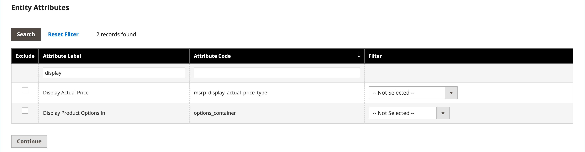

# Exportera data

Det bästa sättet att bli bekant med databasens struktur är att exportera data och öppna dem i ett kalkylblad. När du lärt dig processen kan du använda den som ett effektivt sätt att hantera stora mängder information.

Specialtecken - som likhetstecken, större och mindre än symboler, enkla och dubbla citattecken, omvänt snedstreck, vertikalstreck och et-tecken - kan orsaka problem vid dataöverföring. För att säkerställa att sådana specialtecken tolkas korrekt kan de markeras som en _escape-sekvens_. Om data t.ex. innehåller en textsträng som `code="str"`, `code="str2"`, kan du försäkra dig om att de ursprungliga dubbla citattecknen tolkas som en del av data genom att omsluta texten med citattecken: `"code="str""`. När systemet stöter på en dubbel uppsättning med dubbla citattecken är det förstått att den yttre uppsättningen med dubbla citattecken omsluter de faktiska data.

Dataexport är en asynkron åtgärd som körs i bakgrunden så att du kan fortsätta arbeta i administratören utan att vänta på att åtgärden ska slutföras. Ett meddelande visas när uppgiften är slutförd.

## Exportvillkor

Exportfilter används för att ange de data som du vill använda i exportfilen, baserat på attributvärde. Dessutom kan du ange vilka attributdata som du vill inkludera eller exkludera från exporten.

{width="600" zoomable="yes"}

### Exportfilter

Du kan använda filter för att avgöra vilka SKU:er som ska inkluderas i exportfilen. Om du t.ex. anger ett värde i filtret Tillverkningsland inkluderar den exporterade CSV-filen endast produkter som tillverkats i det landet.

Filtertypen motsvarar datatypen. För datumfält kan du välja datumet från kalenderikonen . Mer information finns i [Attributindatatyper](../catalog/attributes-input-types.md).

Datumformatet bestäms av [språkinställningen](../getting-started/store-details.md#locale-options).

Om du bara vill inkludera poster med ett visst värde, t.ex. en SKU, anger du värdet i fältet Filter. Vissa fält, till exempel Price, Weight och Set Product as New, har ett intervall av värden från/till.

### Uteslut attribut

Kryssrutan i den första kolumnen används för att exkludera attribut från exportfilen. Om ett attribut utelämnas inkluderas den associerade kolumnen i exportdata, men den är tom.

| Exkludera | Filter | Resultat |
|--- |--- |--- |
|  | Nej | Den exporterade filen innehåller alla attribut för alla befintliga poster. |
|  | Ja | Exportfilen innehåller varje attribut med endast de poster som tillåts av filtret. |
|  | Nej | Exportfilen innehåller inte kolumnen för attributet exclude, men innehåller alla befintliga poster. |
|  | Ja | Exportfilen innehåller inte kolumnen för det exkluderade attributet och innehåller bara de poster som tillåts av filtret. |

{style="table-layout:auto"}

## Exportera data

1. Gå till **[!UICONTROL System]** > _[!UICONTROL Data Transfer]_>**[!UICONTROL Export]**&#x200B;på sidofältet_ Admin _.

1. I avsnittet _Exportinställningar_ anger du **[!UICONTROL Entity Type]** till något av följande:

   - `Advanced Pricing`
   - `Products`
   - `Customer Finances`
   - `Customers Main File`
   - `Customer Addresses`
   - `Stock Sources`

   {width="600" zoomable="yes"}

1. Acceptera CSV-standardvärdet **[!UICONTROL Export File Format]**.

1. Om du vill omsluta specialtecken som kan finnas i data som en _escape-sekvens_ markerar du kryssrutan **[!UICONTROL Fields Enclosure]**.

1. Ändra visningen av entitetsattributen om det behövs.

   Som standard listas alla tillgängliga attribut i alfabetisk ordning i avsnittet Entitetsattribut. Du kan använda [listkontrollerna](../getting-started/admin-grid-controls.md) som standard för att söka efter specifika attribut och sortera listan. Filtret Sök och återställ styr visningen av listan, men påverkar inte urvalet av attribut som ska inkluderas i exportfilen.

   {width="600" zoomable="yes"}

1. Så här filtrerar du exporterade data baserat på attributvärde:

   - Om du bara vill exportera poster med specifika attributvärden anger du det obligatoriska värdet i kolumnen **[!UICONTROL Filter]**. I följande exempel exporteras endast en specifik SKU.

   - Om du vill utesluta ett attribut från exporten markerar du kryssrutan **[!UICONTROL Exclude]** i början av raden. Om du till exempel bara vill exportera kolumnerna `sku` och `image` markerar du kryssrutan för alla andra attribut. Kolumnen visas i exportfilen, men utan värden.

1. Bläddra nedåt och klicka på **[!UICONTROL Continue]** i det nedre högra hörnet på sidan.

   När uppgiften är slutförd bearbetas filen via en meddelandekö (kontrollera att ditt cron-jobb körs). Den exporterade filen sparas i `var/export/ folder`. Mer information om meddelandekön finns i [Hantera meddelandeköer](https://experienceleague.adobe.com/docs/commerce-operations/configuration-guide/message-queues/manage-message-queues.html) i _Konfigurationshandboken_.

   Du kan spara eller öppna den exporterade CSV-filen som ett kalkylblad, redigera data och sedan importera dem tillbaka till din butik.

   >[!NOTE]
   >
   >Som standard finns alla exporterade filer i mappen `<Magento-root-directory>/var/export`. Om fjärrlagringsmodulen är aktiverad finns alla exporterade filer i mappen `<remote-storage-root-directory>/import_export/export`.

## Felsökningsresurser

Hjälp med felsökning av dataexportproblem finns i följande artiklar i Commerce Support Knowledge Base:

- [CSV-filen för exporterade produkter visas inte](https://experienceleague.adobe.com/docs/commerce-knowledge-base/kb/troubleshooting/miscellaneous/exported-products-.csv-file-does-not-appear.html)
