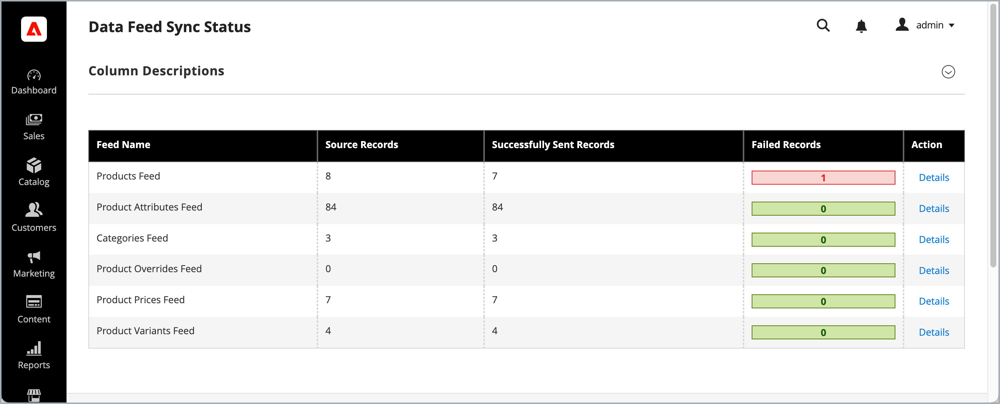

# Statusövervakning för synkronisering av datafeed

Adobe Commerce-administratörer kan övervaka synkroniseringsstatusen för data som exporteras från Adobe Commerce till anslutna Commerce-tjänster via sidan Synkroniseringsstatus för datafeed i Commerce Admin.



Den här sidan ger realtidsinsikter om hälsa och prestanda för dataexportflöden som överför produkt- och kategoridata från Commerce till externa tjänster som [!DNL Product Recommendations], [!DNL Live Search] och [!DNL Catalog Service].

Synkroniseringsstatussidan visar endast exportstatus. Statusen Slutfört anger att data har exporterats och att de till slut kommer att vara tillgängliga i anslutna Commerce-tjänster. Använd [Kontrollpanelen för datahantering](data-dashboard.md) för att se det aktuella tillståndet för entitetssynkronisering.

Övervakning av feeds status säkerställer att data är konsekventa och möjliggör snabb lösning av eventuella problem som uppstår under exportprocessen. Administratörer kan:

* **Visa synkroniseringsstatus** för alla dataflöden
* **Identifiera och felsök fel** i flödeshantering
* **Åtkomst till detaljerad statusinformation** för enskilda feed-objekt

Status spåras för följande feeds:

* Produktfeed
* Produktattribut, feed
* Kategoriflöde
* Feed för åsidosättande av produkt
* Produktprisfeed
* Produktvariantfeed

>[!TIP]
>
>Mer information om datasynkroniseringsprocessen finns i [Synkronisera data med SaaS-dataexport](https://experienceleague.adobe.com/en/docs/commerce/saas-data-export/data-synchronization) i *Exporthandboken för SaaS-data*.

## Installera tillägget

Statussidan för datafeeds är tillgänglig för alla Commerce-handlare med aktiva licenser för följande Commerce-tjänster:

* [[!DNL Product Recommendations v6.0.0+]](https://experienceleague.adobe.com/en/docs/commerce/product-recommendations/guide-overview)
* [[!DNL Live Search v4.1.0+]](https://experienceleague.adobe.com/en/docs/commerce/live-search/guide-overview)
* [[!DNL Catalog Service v1.17+]](https://experienceleague.adobe.com/en/docs/commerce/catalog-service/guide-overview) med en aktiv licens.

**Krav**

* PHP 8.1, 8.2, 8.3 eller 8.4
* Adobe Commerce 2.4.4+
* [Adobe Commerce Data Export Extension](https://experienceleague.adobe.com/en/docs/commerce/saas-data-export/manage-extension), version 103.4.15 eller senare
* Åtkomst till [repo.magento.com](https://repo.magento.com)

  Mer information om hur du skapar nycklar och får de nödvändiga rättigheterna finns i [Hämta dina autentiseringsnycklar](https://experienceleague.adobe.com/en/docs/commerce-operations/installation-guide/prerequisites/authentication-keys). Information om molninstallationer finns i [Commerce on Cloud Infrastructure Guide](https://experienceleague.adobe.com/en/docs/commerce-on-cloud/user-guide/develop/authentication-keys).

* Åtkomst till kommandoraden på Adobe Commerce-programservern.

### Installationssteg

Lägg till modulen `magento/module-data-exporter-status` med Composer:

```shell
composer require magento/module-data-exporter-status
```

Detaljerade installationssteg finns i följande handböcker:

* [Installera tillägg på Adobe Commerce i molninfrastrukturen](https://experienceleague.adobe.com/en/docs/commerce-on-cloud/user-guide/configure-store/extensions)

* [Installera tillägget Adobe Commerce lokalt](https://experienceleague.adobe.com/en/docs/commerce-operations/installation-guide/tutorials/extensions)

## Gå till statussidan för datafeed

Gå till statussidan för datafeeds från Commerce Admin från Commerce Admin på **[!DNL System]** > Dataöverföring > **[!DNL Data Feed Sync Status]**.


Övervakning av status för datafeed ger två gränssnitt:

* Sammanfattningssidan [Synkroniseringsstatus för datafeed](#data-feed-sync-status-summary) som visar tillgängliga feeds och det aktuella läget
* Synkroniseringsstatus för [datafeed - Information ](#data-feed-sync-status-details) som visar detaljerad information om en vald feed.

## Statussammanfattning för synkronisering av datafeed

På sidan Statussammanfattning för feedsynkronisering finns information om exportaktiviteter för dataflöden, inklusive följande information:

| Fält | Beskrivning |
|-------|-------------|
| **Feed-namn** | Namnet på den flödesindexerare som ansvarar för synkroniseringen av en specifik enhet eller dess del, till exempel produkt- eller produktpris. |
| **Source Records** | Antal poster som är tillgängliga för export från Commerce-databasen. Det här antalet kan vara större än antalet poster som visas i Commerce Admin eftersom varje flödesobjekt tillhör ett visst omfång, till exempel butiksvykod. |
| **Poster har skickats** | Antal poster som har överförts till Commerce SaaS för vidare bearbetning. Om fel uppstod under överföringen, antalet poster som överfördes till externa tjänster. |
| **Misslyckade poster** | Antal poster som inte exporterades och som kräver åtgärd. |
| **Åtgärd** | Välj **[!UICONTROL Details]** om du vill visa synkroniseringsaktiviteten för en feed. |

## Synkroniseringsstatusinformation för datafeed

Klicka på ett flödesnamn på sammanfattningssidan för dataflödesstatus eller använd åtgärden [!DNL View Details] för att få tillgång till detaljerad information om enskilda poster i en feed.

![[!UICONTROL Data Feed Sync Status - Details] sida med statusrapportering för feed-objekt ](assets/data-feed-sync-status-details.png)

I detaljvyn finns följande information för varje feed-objekt:

| Fält | Beskrivning |
|-------|-------------|
| **Feed-objekt-ID** | Intern identifierare för flödesposten |
| **Entitet-ID** | Källenhets-ID (produkt-ID, kategori-ID osv.) |
| **Exportstatus** | Feed-objektets [synkroniseringsstatus](#export-status-types). Aktuell status för exportförsöket med färgkodade indikatorer |
| **Senaste synkroniseringsdatum** | Tidsstämpel när posten senast skickades till Commerce Services |
| **Är entiteten borttagen?** | Anger om enheten eller dess del (produkt- eller produktpris till exempel) har tagits bort i Adobe Commerce. Objekten visas bara om ett fel uppstod under synkroniseringen. |
| **ID för förfrågan** | En unik identifierare för synkroniseringsbegäran. Ange detta ID till support vid felsökning av specifika entitetsuppdateringar. |
| **Fel** | Detaljerad felinformation om feed-objektet inte kunde synkroniseras. |

Du kan hantera vyn med följande kontroller:

* [!DNL Mass Action] om du vill schemalägga omsynkronisering för valda feed-objekt
* [!DNL Filters]
* [!DNL Default View] om du vill skapa och spara en filtrerad vy och växla mellan vyer
* [!DNL Columns] om du vill visa och dölja kolumner i tabellen.

### Hälsoindikatorer för foder

Högst upp på varje feed-detaljsida ger viktiga hälsoindikatorer systemstatus för varje feed:

#### Indexerarstatus

* **Giltig**: Data är synkroniserade. Ingen omindexering krävs.
* **Ogiltig**: Originaldata ändrades. Indexet bör uppdateras.
* **Bearbetar**: Indexering pågår.

>[!TIP]
>
>Mer information om indexbearbetning finns i avsnittet [Indexhantering](https://experienceleague.adobe.com/en/docs/commerce-admin/systems/tools/index-management).

#### Changelog-efterlogg

* **Alla synkroniserade**: Inga väntande ändringar att bearbeta
* **Objekt i eftersläpning**: Antal väntande ändringar som väntar på att bearbetas

### Exportera statustyper

Systemet tillhandahåller statusindikatorer som hjälper dig att snabbt identifiera problem:

#### Statuskategorier

| **Status** | **Beskrivning** | **Åtgärd krävs** |
|--------|-----------|-------------|
| **Skickat till tjänsten** | Feed-objektet har exporterats till tjänsten Commerce. | Ingen |
| **Misslyckades, försöker igen** | Tillfälligt fel. Systemet försöker automatiskt igen. | Bildskärm för upplösning |
| **Misslyckades, kräver åtgärd** | Misslyckades på grund av program- eller datafel. | Undersök och lös problemet i kolumnen [!DNL Error] |
| **Väntar på överföring** | Köad för export men ännu inte bearbetad. | Normalt bearbetningstillstånd |

## Övervaka datafeedstatus

När du uppdaterar produktrelaterade och kategorirelaterade enheter i Commerce-databasen överförs data till Commerce-tjänster enligt din flödeskonfiguration. Du kan övervaka den här processen i realtid från sammanfattningssidan Synkroniseringsstatus för datafeed.

>[!IMPORTANT]
>
>Hur lång tid det tar att slutföra datasynkroniseringen varierar beroende på katalogstorleken, volymen uppdaterade data och prestanda för externa tjänster.

När antalet poster som har skickats matchar antalet källposter visar det att synkroniseringen är slutförd och att alla data har överförts.

>[!NOTE]
>
>Adobe innehåller även kommandoradsverktyg och systemloggar som utvecklare och systemintegratörer kan använda för att hantera och spåra synkroniseringsåtgärder. Mer information finns i [Exportguiden för SaaS-data](https://experienceleague.adobe.com/en/docs/commerce-merchant-services/saas-data-export/overview).

### Hantera misslyckade exporter

Om du vill se information om misslyckade exporter och vidta korrigerande åtgärder:

1. På sidan Feed Sync Status söker du efter feeden med felaktiga poster.
1. Klicka på **[!DNL Details]**.

1. Granska felmeddelanden för specifika felorsaker.

1. Använd massåtgärder för att schemalägga omsynkroniseringsåtgärder för misslyckade objekt.

### Synkronisera om misslyckade data

Du kan synkronisera om misslyckade eller problematiska dataflöden manuellt med hjälp av menyn [!DNL Actions] på sidan [!DNL Data Feed Sync Status - Details].

Även om systemet automatiskt försöker utföra vissa typer av fel kan det behövas manuella åtgärder i följande scenarier:

* Du ser autentiserings- eller behörighetsfel (401, 403 statuskoder).
* Efter att dataformatsproblem som orsakade nyttolastfel har åtgärdats.
* Efter uppdateringar av externa tjänstkonfigurationer eller slutpunkter.
* Ni använder anpassningar som påverkar dataexportprocesserna.

Genom att proaktivt övervaka flödets status och snabbt åtgärda fel kan ni upprätthålla datakonsekvens och tillförlitlighet i hela Commerce ekosystem.

#### Synkronisera feed-objekt manuellt

Om du behöver synkronisera om specifika feed-objekt:

1. **Välj poster**: Använd kryssrutor för att markera misslyckade poster som behöver åtgärdas.
2. **Välj åtgärd**: Välj **[!DNL Schedule Resync]** i listrutan för massåtgärd.
3. **Bekräfta**: Klicka på **[!DNL Submit]** och bekräfta omsynkroniseringen.
4. **Övervaka resultat**: Kontrollera meddelandet och övervaka statusändringar.

## God praxis

### Regelbunden övervakning

1. **Dagliga kontroller**: Granska översiktssidan dagligen för alla feeds som har en hög felfrekvens
1. **Veckodjupdykning**: Undersök den detaljerade statusen för viktiga feeds (produkter, priser)
1. **Månadsanalys**: Spåra trender för exportresultat och prestanda

### Arbetsflöde för felsökning

1. **Identifiera problem**: Sök efter fel och antal fel
1. **Kontrollera indexerarhälsa**: Kontrollera att indexerare är giltiga och att det går att hantera eftersläpning
1. **Granska felinformation**: Klicka på misslyckade poster för att visa specifika felmeddelanden
1. **Schemalägg omsynkronisering**: Använd massåtgärder för att försöka utföra misslyckade exporter igen
1. **Bildskärmsupplösning**: Verifiera att omsynkroniserade objekt har status

### Åtgärda vanliga problem

#### Höga misslyckanden

**Symtomen**: Ett stort antal poster med statusen&quot;Misslyckades, kräver åtgärd&quot; visas

**Potentiella orsaker**:

* Konfigurationsändringar för extern tjänst
* Inkompatibla dataformat
* Autentiserings- eller behörighetsproblem

**Åtgärdssteg**:

1. Kontrollera extern tjänststatus och konfiguration
1. Granska felmeddelanden för mönster
1. Verifiera autentiseringsuppgifter
1. Kontakta extern support vid behov

#### Långsam export

**Symtomen**: Hög eftersläpning av ändringsloggar, långsamma statusuppdateringar

**Potentiella orsaker**:

* Indexerarens prestandaproblem
* Hög datavolym
* Begränsning av extern servicehastighet

**Upplösningssteg**:

1. Kontrollera indexerarens status och kör om den är ogiltig
2. Övervaka svarstider för externa tjänster
3. Överväg att schemalägga exporter under icke-topa timmar
4. Granska systemresurser och prestanda

#### Autentiseringsfel

**Symtomen**: 401 eller 403 statuskoder

**Upplösningssteg**:

1. Verifiera API-autentiseringsuppgifter och token
1. Kontrollera behörigheter för externt tjänstkonto
1. Förnya utgångna autentiseringstoken
1. Kontakta tjänsteleverantören om du har åtkomstproblem

>[!MORELIKETHIS]
>
>* [Instrumentpanel för datahantering](https://experienceleague.adobe.com/en/docs/commerce-admin/systems/data-transfer/data-dashboard)
>* [Handbok för export av SaaS-data](https://experienceleague.adobe.com/en/docs/commerce-merchant-services/saas-data-export/overview)
