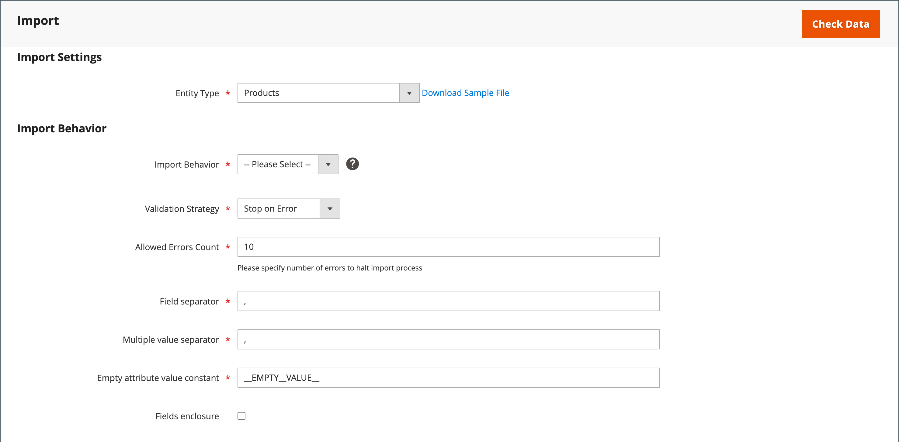
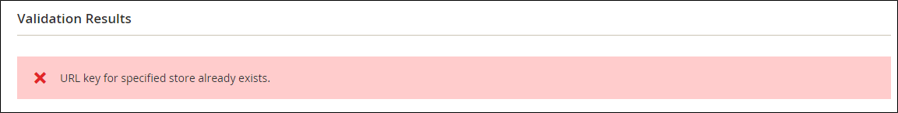

# Importera data

Data för alla produkttyper kan importeras till butiken. Dessutom kan du importera produkter, avancerade prisuppgifter, kunddata, kundadressdata och produktbilder. Import stöder följande åtgärder:

- Lägg till/uppdatera
- Ersätt
- Ta bort

## Importera riktlinjer

### Nya entiteter

- Entiteter läggs till med de attributvärden som anges i CSV-filen.
- För ett obligatoriskt attribut utan standardvärde kan entiteten (motsvarande rad eller rader) inte importeras om det inte finns något värde eller ett ogiltigt värde.
- För ett obligatoriskt attribut med ett standardvärde angivet importeras entiteten (motsvarande rad eller rader) och standardvärdet ställs in för attributet om det inte finns något värde eller ett ogiltigt värde.
- Om komplexa data inte är giltiga kan enheten (motsvarande rad eller rader) inte importeras.

### Befintliga enheter

- För attribut som inte är komplexa data ersätter värdena från importfilen, inklusive tomma värden för de attribut som inte behövs, de befintliga värdena.
- Om det inte finns något värde, eller om det finns ett ogiltigt värde, för ett obligatoriskt attribut ersätts inte det befintliga värdet.
- Om de komplexa data som finns för enheten är ogiltiga kan enheten (motsvarande rad eller rader) inte importeras, förutom i det här fallet när Ta bort enheter valdes i den nedrullningsbara menyn Importbeteende.

### Komplexa data

Om det finns ett attribut som anges i importfilen och dess värde härleds från en definierad uppsättning värden gäller följande:

- Om värdet inte redan finns med i den definierade uppsättningen värden kan raden importeras och ett standardvärde, om definierat, ställs in för attributet.
- Om värdet redan finns i den definierade uppsättningen kan motsvarande rad inte importeras.
- Om importfilen anger ett attributnamn som ännu inte är definierat i systemet skapas det inte och dess värden importeras inte.

### Ogiltiga filer

- En fil kan inte importeras om alla rader är ogiltiga.
- Ett icke-befintligt tjänstdata eller komplext datanamn anges i importfilen, till exempel en kolumn med en `_<non-existing name>` rubrik.

## Importera åtgärder

| Åtgärd | Beskrivning |
| --------- | ----------- |
| Lägg till/uppdatera | Nya produktdata läggs till i befintliga produktdata för de befintliga posterna i databasen. Alla fält utom `sku` kan uppdateras.  Nya momsklasser som anges i importdata skapas automatiskt.  Nya produktkategorier som anges i importfilen skapas automatiskt.  Nya SKU:er som anges i importfilen skapas automatiskt   **_Obs!_**För produkter kan du uppdatera alla fält utom SKU via import.  **_Viktigt:_** Det går inte att ta bort flera fältvärden, t.ex. webbplatser eller kategorier, med _Lägg till/uppdatera_ importbeteende. Dessa fält finns kvar i databasen efter importen om de inte finns med i CSV-filen. |
| Ersätt | Befintliga produktdata ersätts med nya data.  **_Viktigt:_**Var försiktig när du ersätter data eftersom befintliga produktdata rensas och alla referenser i systemet går förlorade.  Om en SKU i importdata matchar SKU:n för en befintlig enhet tas alla fält, inklusive SKU:n, bort och en ny post skapas med CSV-data. Ett fel uppstår om CSV-filen refererar till en SKU som inte finns i databasen. Du kan kontrollera data för att visa fel. |
| Ta bort | Alla entiteter i importdata som finns i databasen tas bort från databasen.  Om du tar bort ignoreras alla kolumner i importdata, förutom SKU. Du kan ignorera alla andra attribut i data.  Ett fel uppstår om CSV-filen refererar till en SKU som inte finns i databasen. Du kan kontrollera data för att visa fel. |

{style="table-layout:auto"}

## Importprocess

Importfilens storlek bestäms av inställningarna i dialogrutan `php.ini` på servern. Systemmeddelandet på _Importera_ sidan anger den aktuella storleksgränsen. Standardstorleken är 2 MB.

Specialtecken (som likhetstecken, större och mindre än symboler, enkla och dubbla citattecken, omvänt snedstreck, vertikalstreck och et-tecken) kan orsaka problem vid dataöverföring. För att säkerställa att sådana specialtecken tolkas korrekt kan de markeras som _escape-sekvens_. Om data till exempel innehåller en textsträng, som `code="str"`, `code="str2"`om du väljer att omsluta texten med dubbla citattecken ser du till att de ursprungliga dubbla citattecknen tolkas som en del av data. När systemet stöter på en dubbel uppsättning med dubbla citattecken är det förstått att den yttre uppsättningen med dubbla citattecken omsluter de faktiska data.

När produktdata importeras läggs nya produktdata till i befintliga produktdatainmatningar i databasen. Alla fält utom SKU kan uppdateras via import. Alla befintliga produktdata ersätts med importerade nya data. Var försiktig när du ersätter data. Alla befintliga produktdata rensas och alla referenser i systemet går förlorade.

{width="600" zoomable="yes"}

### Steg 1: Förbered data

1. På _Administratör_ sidebar, gå till **[!UICONTROL System]** > _[!UICONTROL Data Transfer]_>**[!UICONTROL Import]**.

1. Under _Importinställningar_, ange **[!UICONTROL Entity Type]** till något av följande:

   - `Advanced Pricing`
   - `Products`
   - `Customer Finances`
   - `Customers and Addresses`
   - `Customers Main File`
   - `Customer Addresses`
   - `Stock Sources`

1. Klicka på **[!UICONTROL Download Sample File]**.

1. Leta upp exportfilen på nedladdningsplatsen för webbläsaren och öppna filen.

   Exempelfilen innehåller kolumnrubriker med platshållardata för produkttyperna.

   {width="600" zoomable="yes"}

1. Undersök strukturen för exempelfilen och använd den för att förbereda CSV-importfilen och kontrollera att kolumnrubrikerna är rättstavade.

1. Kontrollera att importfilens storlek inte överstiger gränsen som visas i meddelandet.

   {width="600"}

1. Om importdata innehåller sökvägar till produktbilder kontrollerar du att bildfilerna har överförts till lämplig plats.

   Standardplatsen på Commerce-servern är: `pub/media/import`.

   Om bilderna finns på en extern server kontrollerar du att du har den fullständiga URL:en till katalogen som innehåller bilderna.

### Steg 2: Välj importbeteende

{width="600" zoomable="yes"}

1. Ange **[!UICONTROL Import Behavior]** till något av följande:

   - `Add/Update` (För produkter kan du uppdatera alla fält utom SKU via import.)
   - `Replace`
   - `Delete`

1. Om du vill ta reda på vad som händer när ett fel uppstår när du importerar data väljer du något av följande:

   - `Stop on Error`
   - `Skip error entries`

1. För **[!UICONTROL Allowed Errors Count]** anger du antalet fel som kan uppstå innan importen avbryts.

   Standardvärdet är 10.

1. Acceptera standardvärdet för ett komma (`,`) för **[!UICONTROL Field separator]**.

1. Acceptera standardvärdet för ett komma (`,`) för **[!UICONTROL Multiple value separator]**.

   I en CSV-fil är kommatecken standardavgränsare. Om du vill använda ett annat tecken kontrollerar du att data i CSV-filen matchar det tecken som du anger.

1. Acceptera standardvärdet `_EMPTY_VALUE_` for **[!UICONTROL Empty attribute value constant]**.

1. Om du vill omsluta specialtecken som finns i data som _escape-sekvens_ väljer du **[!UICONTROL Fields Enclosure]** kryssrutan.

### Steg 3: Identifiera importfilen

{width="600" zoomable="yes"}

1. Klicka **[!UICONTROL Choose File]** för att markera filen som ska importeras.

1. Leta reda på CSV-filen som du förberedde för import och klicka på **[!UICONTROL Open]**.

1. För **[!UICONTROL Images File Directory]** anger du den relativa sökvägen till den plats på Commerce-servern där överförda bilder lagras.

   Exempel: `product_images`.

   >[!NOTE]
   >
   >Från Adobe Commerce och Magento Open Source `2.3.2` release, den sökväg som anges i _[!UICONTROL Images File Directory]_sammanfogar för import till bildens baskatalog: `<Magento-root-folder>/var/import/images`. Du kan till exempel placera `product_images` filer i `<Magento-root-directory>/var/import/images/product_images` mapp. Baskatalogen för import av bilder kan konfigureras i `\Magento\ImportExport\etc\config.xml` -fil. Om fjärrlagringsmodulen är aktiverad kan du importera filer till `<remote-storage-root-directory>/var/import/images/product_images` mapp.

   Mer information om hur du importerar produktbilder finns i [Importera produktbilder](data-import-product-images.md).

### Steg 4: Kontrollera importdata

1. Klicka på i det övre högra hörnet **[!UICONTROL Check Data]**.

1. Vänta en stund tills valideringsprocessen har slutförts.

   Om importdata är giltiga visas följande meddelande:

   {width="600"}

1. Om filen är giltig klickar du på **[!UICONTROL Import]**.

   I annat fall åtgärdar du alla problem med de data som visas i meddelandet och försöker importera filen igen.

1. Importprocessen fortsätter till slutet av data, såvida inte ett fel påträffas.

   Om ett felmeddelande visas i valideringsresultaten rättar du till problemet i data och importerar filen igen.

   {width="600"}

   Ett meddelande visas när importen är klar.

## Importera historik

Commerce lagrar en datapost som har importerats till din butik, inklusive startdatum och -tid, användare, körningstid och en länk till den importerade filen. The _Körningstid_ är importprocessens längd.

**_Så här visar du importhistoriken:_**

På _Administratör_ sidebar, gå till **[!UICONTROL System]** > _[!UICONTROL Data Transfer]_>**[!UICONTROL Import History]**.

{width="600" zoomable="yes"}

>[!NOTE]
>
>Som standard finns importhistorikfiler i `<Magento-root-directory>/var/import_history` mapp. Om fjärrlagringsmodulen är aktiverad finns importhistorikfiler i `<remote-storage-root-directory>/import_export/import_history` mapp.

| Fält | Beskrivning |
|--- |--- |
| [!UICONTROL ID] | Ett internt nummer som används för att ange en överföring. |
| [!UICONTROL Start Date & Time] | Ett specifikt datum och en viss tidpunkt då överföringen ägde rum. |
| [!UICONTROL User] | Kunden som gjorde överföringen. |
| [!UICONTROL Imported file] | Länk för att hämta den importerade filen. |
| [!UICONTROL Error file] | Motsvarande felfil. |
| [!UICONTROL Execution Time] | Tidsintervall för importprocessen. |
| [!UICONTROL Summary] | Antalet objekt som har skapats, uppdaterats och tagits bort eller felmeddelandet. |

{style="table-layout:auto"}

Ladda ned _Importerat/fel_ fil, klicka på **[!UICONTROL Download]**.
