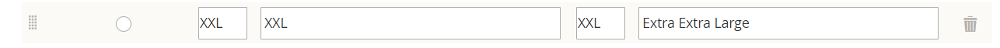
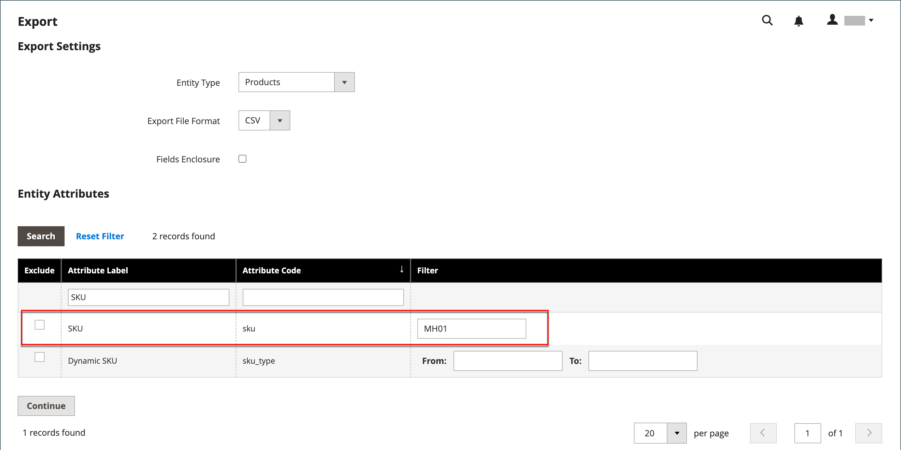

# Importera konfigurerbara produkter

Det bästa sättet att förstå hur konfigurerbara produktdata är strukturerade är att exportera en konfigurerbar produkt och dess varianter och att undersöka data i ett kalkylblad.

I följande exempel lägger du till en uppsättning produktvariationer för en ny storlek i varje färg. Först exporterar du den konfigurerbara produkten och undersöker datastrukturen. Därefter uppdaterar du data och importerar tillbaka dem till katalogen. Om du inte vill gå igenom exporten av data kan du hämta CSV-filen som används i exemplet.

{width="700" zoomable="yes"}

## Steg 1: Verifiera attributinställningar och värden

1. Innan du börjar kontrollerar du att attributen som används för produktvarianter har de egenskapsinställningar som krävs.

   - [**[!UICONTROL Scope]**](../getting-started/websites-stores-views.md#scope-settings) - `Global`
   - [**[!UICONTROL Catalog Input Type for Store Owner]**](data-attributes-product.md) - Indatatypen för alla attribut som används för en produktvariation måste vara något av följande:

      - `Dropdown`
      - `Visual Swatch`
      - `Text Swatch`
      - `Multi-Select`

   - **[!UICONTROL Values Required]** - `Yes`

1. Om du lägger till en storlek eller färg, eller gör andra ändringar i ett befintligt attribut, måste du uppdatera attributet med det nya värdet.

1. Gå till **[!UICONTROL Stores]** > _[!UICONTROL Attributes]_>**[!UICONTROL Product]**på sidofältet_ Admin _.

1. Leta reda på attributet i listan och öppna i redigeringsläge.

1. Lägg till det nya värdet i attributet.

   I följande exempel läggs en ny storlek till i en textruta.

   {width="500" zoomable="yes"}

1. Klicka på **[!UICONTROL Save Attribute]** när du är klar.

1. Om du lägger till ett attribut följer du instruktionerna för att [skapa attributet](../catalog/attribute-product-create.md) innan du börjar.

## Steg 2: Exportera den konfigurerbara produkten

1. Gå till **[!UICONTROL Catalog]** > **[!UICONTROL Products]** på sidofältet _Admin_.

1. Hitta den konfigurerbara produkt som ska exporteras:

   - Klicka på **[!UICONTROL Filters]**.
   - Ange **[!UICONTROL Type]** till `Configurable Product` och klicka på **[!UICONTROL Apply Filters]**.
   - Välj den konfigurerbara produkt som du vill använda för din testexport och notera **[!UICONTROL SKU]**.

1. Gå till **[!UICONTROL System]** > _[!UICONTROL Data Transfer]_>**[!UICONTROL Export]**på sidofältet_ Admin _.

   {width="600" zoomable="yes"}

1. Gör följande under _[!UICONTROL Export Setting]s_:

   - Ange **[!UICONTROL Entity Type]** till `Products`.

   - Ange **[!UICONTROL Export File Format]** till `CSV`.

1. Under _[!UICONTROL Entity Attributes]_bläddrar du nedåt eller använder attributetikettfiltret för att hitta attributet **[!UICONTROL SKU]**och gör följande:

   - Ange SKU för den konfigurerbara produkt som du har valt att exportera och klicka på **[!UICONTROL Continue]**.

     {width="600" zoomable="yes"}

   - Leta efter filen på hämtningsplatsen för webbläsaren och öppna den som ett kalkylblad.

     CSV-filen har en separat rad för varje enkel produktvariant och en rad för den konfigurerbara produkten. `product_type column` visar flera enkla produktvariationer som är kopplade till en konfigurerbar produkt.

     {width="600" zoomable="yes"}

   - Bläddra längst till höger i kalkylbladet för att hitta följande kolumner.

      - `configurable_variations` - Definierar en-till-många-relation mellan den konfigurerbara produktposten och varje variation.
      - `configurable_variation_labels` - Definierar etiketten som identifierar varje variation.

     I det här exemplet finns data i kolumnerna CG och CH. Beroende på antalet variationer kan datasträngen i kolumnen `configurable_variations` vara lång. Uppgifterna används som index för de tillhörande produktvariationerna och har följande struktur:

     ```text
     sku={{SKU_VALUE}},attribute1={{VALUE}},attribute2={{VALUE}}| sku={{SKU_VALUE}},attribute1={{VALUE}},attribute2={{VALUE}}
     ```

     Varje SKU avgränsas med en rörsymbol (|) och attributen avgränsas med kommatecken. Värdet för varje attribut representeras av attributkoden i stället för attributetiketten. Så här ser data ut:

     ```text
     sku=MH01-XS-Black,size=XS,color=Black|sku=MH01-XS-Gray,size=XS,color=Gray|sku=MH01-XS-Orange,size=XS,color=Orange</pre>
     ```

1. När du förstår strukturen för konfigurerbara produktdata kan du redigera data eller lägga till nya varianter direkt i CSV-filen.

   Mer information finns i [Komplexa data](data-attributes-product.md#complex-product-data-attributes).

## Steg 3: Redigera data

I följande exempel kopieras uppsättningen XL-storlekar och klistras in i kalkylbladet för att skapa en uppsättning produktvariationer för en ny storlek för varje färg.

1. Kopiera den uppsättning produktvarianter som du vill använda som mall för de nya produkterna.

   {width="600" zoomable="yes"}

1. Infoga de kopierade radposterna i kalkylbladet.

   Du har nu två identiska uppsättningar av de enkla produktvariationerna.

   {width="600" zoomable="yes"}

1. Uppdatera data i följande kolumner i de nya variationerna efter behov.

   - `sku`
   - `name`
   - `url_key`
   - `additional_attributes`

   I det här exemplet ändras alla `XL`-referenser till `XXL`.

1. Uppdatera informationen i kolumnen `product_variations` i den konfigurerbara produktposten, så att de nya varianterna inkluderas som en del av den konfigurerbara produkten.

   Klicka på cellen som innehåller `product_variations`-data på raden med den konfigurerbara produktposten. Kopiera sedan den sista uppsättningen parametrar i formelfältet, med början från rörsymbolen.

   {width="600" zoomable="yes"}

1. Klistra in parametrarna i slutet av data och redigera efter behov för de nya variationerna.

   I det här exemplet uppdateras parametrarna `sku` och `size` för den nya XXL-storleken.

1. Ta bort rader som inte har ändrats innan data importeras tillbaka till katalogen.

   I det här exemplet importeras endast de tre nya variationerna för den nya storleken och raden med den uppdaterade konfigurerbara produkten tillbaka till katalogen. De andra raderna kan tas bort från CSV-filen. Se dock till att du inte tar bort rubrikraden med kolumnrubriker.

   {width="600" zoomable="yes"}

1. **[!UICONTROL Save]** CSV-filen.

   Data kan importeras till katalogen.

   >[!NOTE]
   >
   >Importfilens storlek får inte vara större än 2 MB.

## Steg 4: Importera uppdaterade data

1. Gå till **[!UICONTROL System]** > _[!UICONTROL Data Transfer]_>**[!UICONTROL Import]**på sidofältet_ Admin _.

1. Under _[!UICONTROL Import Settings]_anger du **[!UICONTROL Entity Type]**till `Products`.

1. Under _[!UICONTROL Import Behavior]_anger du **[!UICONTROL Import Behavior]**till `Add/Update`.

   {width="600" zoomable="yes"}

1. Under _[!UICONTROL File to Import]_klickar du på&#x200B;**[!UICONTROL Choose File]**och navigerar till CSV-filen som du förberedde för import och väljer filen.

   {width="600" zoomable="yes"}

1. Klicka på **[!UICONTROL Check Data]** i det övre högra hörnet.

1. Om filen är giltig klickar du på **[!UICONTROL Import]**.

   I annat fall kan du åtgärda eventuella problem som hittats i data och försöka igen.

   {width="600" zoomable="yes"}

1. När importen är klar klickar du på **[!UICONTROL Cache Management]** i meddelandet längst upp på sidan och uppdaterar alla ogiltiga cacheminnen.

   De nya produktvariationerna finns nu i katalogen från Admin och i butiken. I det här exemplet är fotot nu tillgängligt i storleken XXL för alla färger.
