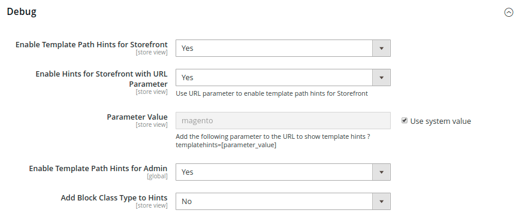

# Utvecklarverktyg

Använd de avancerade utvecklingsverktygen för att fastställa kompileringsläget under frontend-utvecklingen, skapa ett tillåtelselista med IP-adresser och visa sökvägstips för mallar. Det finns även verktyg för att enkelt göra dekorändringar i texten i butikens och administratörens gränssnitt.

- [Åtgärdsloggar](action-log.md)  (endast Adobe Commerce)
- [Frontend Development Workflow](#frontend-development-workflow)
- [Använda statiska filsignaturer](#static-file-signatures)
- [Optimering av resursfiler](#optimizing-resource-files)
- [Begränsningar för utvecklarklienter](#client-restrictions)
- [Tips för mallsökväg](#template-path-hints)
- [Översätt textbundet](#translate-inline)

## Åtgärdslägen

Din Adobe Commerce- eller Magento Open Source-instans kan distribueras för körning i antingen _produktion_ eller _utvecklarläge_. De verktyg och konfigurationsinställningar som är särskilt utformade för utvecklare är bara tillgängliga när butiken körs i _utvecklarläge_.

Åtgärdsläget kan bara ändras från serverns kommandorad av en användare med lämplig behörighet. Mer information finns i [Ange åtgärdsläge](https://experienceleague.adobe.com/docs/commerce-operations/configuration-guide/cli/set-mode.html?lang=sv-SE) i _konfigurationshandboken_.

De flesta avsnitten i dokumentationen för handlare gäller för en Commerce-instans som körs i produktionsläge. Följande konfigurationsinställningar och verktyg kan dock bara användas när installationen körs i utvecklarläge.

## Utvecklingsarbetsflöde

Frontend Development Workflow-typen avgör om mindre kompilering sker på klient- eller serversidan under utvecklingen. Less är ett tillägg till CSS som har ytterligare funktioner och konventioner och som skapar strömlinjeformad kod. Mindre kompilering på klientsidan rekommenderas för temautveckling. Kompilering på serversidan är standardläge. Alternativen för utvecklingsarbetsflöde är inte tillgängliga för butiker i produktionsläge.
Se [LESS-kompilering på klientsidan jämfört med serversidan](https://developer.adobe.com/commerce/frontend-core/guide/css/quickstart/compilation-mode/){:target="_blank"} i dokumentationen för Commerce-utvecklare.

>[!NOTE]
>
>Arbetsflödeskonfigurationen för frontend är endast tillgänglig i [utvecklarläget](../systems/developer-tools.md#operation-modes).

{width="600" zoomable="yes"}

1. Gå till **[!UICONTROL Stores]** > _[!UICONTROL Settings]_>**[!UICONTROL Configuration]**&#x200B;på sidofältet_ Admin _.

1. Expandera **[!UICONTROL Advanced]** i den vänstra panelen och välj **[!UICONTROL Developer]**.

1. Expandera  i avsnittet **[!UICONTROL Front-end Development Workflow]**.

1. Ange **[!UICONTROL Workflow Type]** till något av följande:

   - `Client side less compilation` - Kompileringen utförs i webbläsaren med det inbyggda `less.js`-biblioteket.
   - `Server side less compilation` - Kompilering utförs på servern med hjälp av Less PHP-biblioteket. Det här är standardläget för produktion.

1. Klicka på **[!UICONTROL Save Config]** när du är klar.

## Statiska filsignaturer

Genom att lägga till en digital signatur i URL:en för statiska filer kan webbläsarna identifiera när en nyare version av filen är tillgänglig. Statiska filer som kan spåras med digitala signaturer är JavaScript, CSS, bilder och teckensnitt. Signaturen läggs till i sökvägen direkt efter bas-URL:en. Om en fils signatur skiljer sig från vad som lagras i webbläsarens cache, används den nyare versionen av filen.

Se [Statisk innehållssignering](https://experienceleague.adobe.com/docs/commerce-operations/configuration-guide/cache/static-content-signing.html?lang=sv-SE){:target="_blank"} i dokumentationen för Commerce-utvecklare.

>[!NOTE]
>
>Konfigurationen för statiska filinställningar är bara tillgänglig när du arbetar i [utvecklarläge](../systems/developer-tools.md#operation-modes).

{width="600" zoomable="yes"}

En detaljerad lista över konfigurationsinställningarna finns i [_Statiska filinställningar_](../configuration-reference/advanced/developer.md) i _Konfigurationsreferens_.

**_Så här aktiverar du signerade statiska filer:_**

1. Gå till **[!UICONTROL Stores]** > _[!UICONTROL Settings]_>**[!UICONTROL Configuration]**&#x200B;på sidofältet_ Admin _.

1. Expandera **[!UICONTROL Advanced]** i den vänstra panelen och välj **[!UICONTROL Developer]**.

1. Expandera  i avsnittet **[!UICONTROL Static Files Settings]**.

1. Ange **[!UICONTROL Sign Static Files]** till `Yes`.

1. Klicka på **[!UICONTROL Save Config]** när du är klar.

## Optimering av resursfiler

Den tid det tar att läsa in resursfiler kan minskas genom att filer sammanfogas och paketeras, och genom att minimera koden.

- När du sammanfogar filer kombineras separata filer av samma typ till en enda fil.
- Paketering är en teknik som grupperar separata filer för att minska antalet HTTP-begäranden som krävs för att läsa in en sida.
- Med miniatyr tas blanksteg, radbrytningar och kommentarer bort, men kodens funktion påverkas inte. Eftersom minimerade filer inte kan redigeras bör processen endast användas när du är redo att börja producera.

Som standard sammanfogar, paketerar eller minimerar inte Adobe Commerce och Magento Open Source filer, och projektutvecklaren bör avgöra vilka filoptimeringsmetoder som ska användas.

Mer information finns i [Bästa praxis för prestanda](https://experienceleague.adobe.com/docs/commerce-operations/performance-best-practices/overview.html?lang=sv-SE).

>[!NOTE]
>
>CSS- och JavaScript-filer kan bara optimeras i [Utvecklarläge](../systems/developer-tools.md#operation-modes).

| Filtyp | Åtgärder som stöds |
| --------------- | -------------------- |
| CSS-filer | `MergeMinify` |
| JavaScript-filer | `MergeBundleMinify` |
| Mallfiler | `Minify` |

{style="table-layout:auto"}

**_Så här optimerar du resursfiler:_**

1. Gå till **[!UICONTROL Stores]** > _[!UICONTROL Settings]_>**[!UICONTROL Configuration]**&#x200B;på sidofältet_ Admin _.

1. Expandera **[!UICONTROL Advanced]** i den vänstra panelen och välj **[!UICONTROL Developer]**.

1. Om du vill optimera CSS-filer expanderar du  i avsnittet **[!UICONTROL CSS Settings]** och gör följande:

   - Ange **[!UICONTROL Merge CSS Files]** till `Yes`.
   - Ange **[!UICONTROL Minify CSS Files]** till `Yes`.

   {width="600" zoomable="yes"}

[_CSS-inställningar_](../configuration-reference/advanced/developer.md)

1. Om du vill optimera JavaScript-filer expanderar du  i avsnittet **[!UICONTROL JavaScript Settings]** och gör följande:

   - Ange **[!UICONTROL Merge JavaScript Files]** till `Yes`.
   - Ange **[!UICONTROL Minify JavaScript Files]** till `Yes`.

   {width="600" zoomable="yes"}

1. Expandera  i avsnittet **[!UICONTROL Template Settings]** och ange **[!UICONTROL Minify Html]** till `Yes` om du vill minimera PHTML-mallfiler.

   {width="600" zoomable="yes"}

1. Klicka på **[!UICONTROL Save Config]** när du är klar.

## Klientbegränsningar

Innan du använder ett verktyg som [mallsökvägstips](#template-path-hints) måste du lägga till din IP-adress i tillåtelselista för Developer Client Restrictions för att undvika att kundernas shoppingupplevelse i butiken störs. Om du inte känner till din IP-adress kan du söka efter den online.

>[!NOTE]
>
>Begränsningar för utvecklarklient kan endast anges i [utvecklarläge](../systems/developer-tools.md#operation-modes).

Mer teknisk information finns i [Anpassad VCL för att tillåta begäranden](https://experienceleague.adobe.com/docs/commerce-cloud-service/user-guide/cdn/custom-vcl-snippets/fastly-vcl-allowlist.html?lang=sv-SE) i _Commerce on Cloud Infrastructure Guide_.

**_Så här lägger du till din IP-adress till tillåtelselista:_**

1. Gå till **[!UICONTROL Stores]** > _[!UICONTROL Settings]_>**[!UICONTROL Configuration]**&#x200B;på sidofältet_ Admin _.

1. Expandera **[!UICONTROL Advanced]** i den vänstra panelen och välj **[!UICONTROL Developer]**.

1. Expandera  i avsnittet **[!UICONTROL Developer Client Restrictions]**.

   {width="600" zoomable="yes"}

1. Ange din IP-adress för **[!UICONTROL Allow IPs]**.

   Om åtkomst krävs från flera IP-adresser avgränsar du dem med kommatecken.

1. Klicka på **[!UICONTROL Save Config]** när du är klar.

1. Uppdatera ogiltiga cacheminnen när du uppmanas till detta.

## Tips för mallsökväg

Tips för mallsökvägar är ett diagnostiskt verktyg som lägger till anteckningar med sökvägen till varje mall som används på sidan. Tips för mallsökvägar kan aktiveras för antingen butiken eller administratören.

>[!NOTE]
>
>Tips för mallsökväg kan bara redigeras i [utvecklarläget](../systems/developer-tools.md#operation-modes).

Mer information finns i [Hitta mallar, layouter och format](https://developer.adobe.com/commerce/frontend-core/guide/themes/debug/){:target="_blank"} i dokumentationen för Commerce-utvecklare.

{width="700" zoomable="yes"}

### Steg 1: Lägg till din IP-adress i tillåtelselista

Innan du använder sökvägstips för mallar lägger du till din IP-adress i [tillåtelselista ](#client-restrictions) för att undvika störningar för kunder som handlar i butiken. När du är klar bör du rensa Commerce-cachen så att alla tips tas bort från butiken.

{width="600" zoomable="yes"}

### Steg 2: Aktivera tips för mallsökväg

1. Gå till **[!UICONTROL Stores]** > _[!UICONTROL Settings]_>**[!UICONTROL Configuration]**&#x200B;på sidofältet_ Admin _.

1. Expandera **[!UICONTROL Advanced]** i den vänstra panelen och välj **[!UICONTROL Developer]**.

1. Expandera  i avsnittet **[!UICONTROL Debug]** och gör följande:

   {width="600" zoomable="yes"}

   - Om du vill aktivera tips för mallsökväg för arkivet anger du **[!UICONTROL Enabled Template Path Hints for Storefront]** till `Yes`.

   - Om du bara vill aktivera sökvägstips för arkivet när URL:en innehåller parametern `templatehints` anger du **Aktivera tips för Storefront med URL-parametern** till `Yes`. Ange sedan ett värde för parametern om det behövs. Standardvärdet är `magento`, men du kan använda ett anpassat värde. Om du till exempel ändrar värdet till `lorem` använder du `mymagento.com?templatehints=lorem` för att visa malltips.

   - Om du vill aktivera tips för mallsökväg för administratören anger du **[!UICONTROL Enabled Template Path Hints for Admin]** till `Yes`.

   - Om du vill inkludera namnen på blocken anger du **[!UICONTROL Add Block Class Type to Hints]** till `Yes`.

1. Klicka på **[!UICONTROL Save Config]** när du är klar.

### Steg 3: Rensa cachen

1. Gå till **[!UICONTROL System]** > _[!UICONTROL Tools]_>**[!UICONTROL Cache Management]**&#x200B;på sidofältet_ Admin _.

1. Klicka på **[!UICONTROL Flush Magento Cache]** i det övre högra hörnet.

## Översätt textbundet

Du kan använda verktyget Översätt infogad i [utvecklarläget](../systems/developer-tools.md#operation-modes) för att redigera text i gränssnittet så att den återspeglar din röst och ditt varumärke. När läget Översätt infogad är aktiverat visas all text på sidan som kan redigeras med röda konturer. Det är enkelt att redigera fältetiketter, meddelanden och annan text som visas i butiken och i Admin. Många teman använder till exempel terminologi som _Mitt konto_, _Min önskelista_ och _Min instrumentpanel_ för att hjälpa kunderna att hitta rätt. Du kanske vill använda orden _Konto_, _Önsklista_ och _Kontrollpanel_.

>[!NOTE]
>
>Verktyget Översätt textbunden är bara tillgängligt när du arbetar i [utvecklarläge](../systems/developer-tools.md#operation-modes).

Se [Översikt över översättningar](https://developer.adobe.com/commerce/frontend-core/guide/translations/) i dokumentationen för Commerce-utvecklare.

{width="700" zoomable="yes"}

Om din butik finns på flera språk kan du göra finjusteringar i den översatta texten för den språkinställningen. På servern finns gränssnittstext i en separat CSV-fil för varje utdatablock och ordnas efter språkområde. Du kan även redigera CSV-filerna direkt på servern, i stället för att använda verktyget _Översätt textbundet_ . Översättningsfiler lagras i `app/code/Magento/<module_name>/i18n/<language_locale>.csv`.

>[!NOTE]
>
>Om du vill använda verktyget Översätt textbundet måste webbläsaren tillåta popup-fönster.

### Steg 1: Inaktivera utdatacache

1. Gå till **[!UICONTROL System]** > _[!UICONTROL Tools]_>**[!UICONTROL Cache Management]**&#x200B;på sidofältet_ Admin _.

1. Markera följande kryssrutor:

   - `Blocks HTML output`
   - `Page Cache`
   - `Translations`

1. Ställ in kontrollen **[!UICONTROL Actions]** på `Disable` och klicka på **[!UICONTROL Submit]**.

### Steg 2: Aktivera verktyget Översätt textbundet

1. Gå till **[!UICONTROL Stores]** > _[!UICONTROL Settings]_>**[!UICONTROL Configuration]**&#x200B;på sidofältet_ Admin _.

1. Om du vill arbeta med en viss butiksvy anger du att **[!UICONTROL Store View]** ska uppdateras.

1. Expandera **[!UICONTROL Advanced]** i den vänstra panelen och välj **[!UICONTROL Developer]**.

1. Expandera  i avsnittet **[!UICONTROL Translate Inline]**.

   Avmarkera kryssrutan **[!UICONTROL Use Website]** om det behövs för att ändra de här inställningarna.

   Alternativet _[!UICONTROL Enabled for Admin]_&#x200B;är inte tillgängligt när du redigerar en viss butiksvy.

   {width="600" zoomable="yes"}

1. Ange **[!UICONTROL Enabled for Storefront]** till `Yes`.

1. Klicka på **[!UICONTROL Save Config]** när du är klar.

1. Uppdatera ogiltiga cacheminnen när du uppmanas att göra det, men låt de inaktiverade cacherna vara som de är för tillfället.

### Steg 3: Uppdatera texten

1. Öppna butiken i en webbläsare och gå till sidan som du vill redigera.

   Använd vid behov språkväljaren för att ändra butiksvyn. Varje textsträng som kan översättas visas med röda konturer. När du hovrar över en textruta visas en bokikon (  ).

1. Klicka på bokikonen för att öppna fönstret _Översätt_ och gör följande:

   - Om ändringen gäller för den specifika butiksvyn markerar du kryssrutan **[!UICONTROL Store View Specific]**.

   - Ange den nya **[!UICONTROL Custom]**-texten.

1. Klicka på **[!UICONTROL Submit]** när du är klar.

   {width="700" zoomable="yes"}

1. Uppdatera webbläsaren om du vill se ändringarna i butiken.

1. Upprepa den här processen för alla element i butiken som ska ändras.

### Steg 4: Återställ de ursprungliga inställningarna

1. Återvänd till administratören för din butik.

1. Gå till **[!UICONTROL Stores]** > _[!UICONTROL Settings]_>**[!UICONTROL Configuration]**&#x200B;på sidofältet_ Admin _.

1. Ange **[!UICONTROL Store View]** till den specifika vy som redigerades.

1. Expandera **[!UICONTROL Advanced]** i den vänstra panelen och välj **[!UICONTROL Developer]**.

1. Expandera  i avsnittet **[!UICONTROL Translate Inline]**.

1. Ange **[!UICONTROL Enabled for Frontend]** till `No`.

1. Klicka på **[!UICONTROL Save Config]** när du är klar.

1. Gå till **[!UICONTROL System]** > _[!UICONTROL Tools]_>**[!UICONTROL Cache Management]**&#x200B;på sidofältet_ Admin _.

1. Markera kryssrutan för följande utdatacache som tidigare var inaktiverade:

   - `Blocks HTML output`
   - `Page Cache`
   - `Translations`

1. Ställ in kontrollen **[!UICONTROL Actions]** på `Enable` och klicka på **[!UICONTROL Submit]**.

1. Uppdatera ogiltiga cacheminnen när du uppmanas till detta.

### Steg 5: Verifiera ändringarna i din butik

Gå till butiken och granska varje sida som har uppdaterats för att se till att ändringarna är korrekta. I det här exemplet ändrades `Customer Login` till `Customer Sign In`. Om du har ändrat en viss vy använder du Språkväljaren för att växla till rätt vy.

{width="700" zoomable="yes"}
