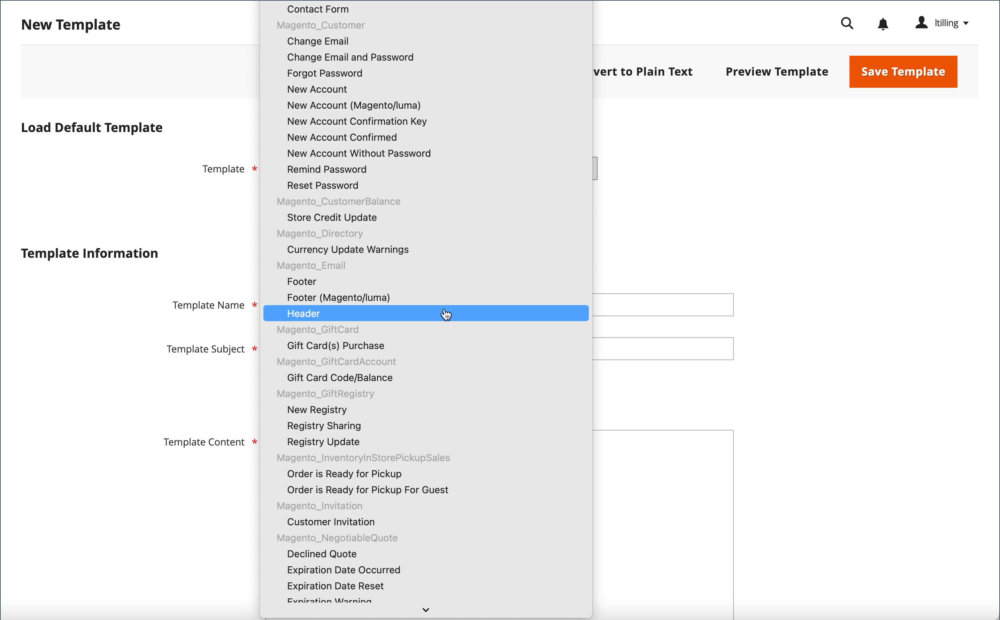

# Anpassa e-postmallar

I Commerce ingår en standardmall för e-post för brödavsnittet i varje meddelande som skickas av systemet. Mallen för brödtextinnehållet kombineras med sidhuvud- och sidfotsmallarna för att skapa det fullständiga meddelandet. Innehållet formateras med HTML och CSS, och kan enkelt redigeras, och anpassas genom att lägga till [variabler](variables-predefined.md) och [widgetar](../content-design/widgets.md). E-postmallar kan anpassas för varje webbplats, butik eller butiksvy. Om du använder egna mallar måste du uppdatera [systemkonfiguration](email-templates.md#configure-email-templates) för att säkerställa att rätt mall används.

{width="500" zoomable="yes"}

Standardmallarna innehåller din logotyp och din butiksinformation och kan användas utan ytterligare anpassningar. Som en god vana bör du dock visa varje mall och göra nödvändiga ändringar innan du skickar dem till kunderna.

- [Huvudmall](email-template-custom.md#header-template)
- [Sidfotsmall](email-template-custom.md#footer-template)
- [Meddelandemallar](email-template-custom.md#message-templates)

{width="700" zoomable="yes"}

## Mallinformation

| Fält | Beskrivning |
| ----- | ----------- |
| [!UICONTROL Template Name] | Namnet på den anpassade mallen. |
| [!UICONTROL Insert Variable] | Infogar en variabel i mallen vid markörens plats. |
| [!UICONTROL Template Subject] | Mallämne visas i kolumnen Ämne och kan användas för att sortera och filtrera mallarna i listan. |
| [!UICONTROL Template Content] | Innehållet i mallen i HTML. |
| [!UICONTROL Template Styles] | Alla CSS-formatdeklarationer som behövs för att formatera mallen kan anges i _[!UICONTROL Template Styles]_box. |

{style="table-layout:auto"}

## Huvudmall

När du är klar med [konfiguration](email-templates.md#configure-email-templates), innehåller e-postsidhuvudmallen din logotyp som är länkad till din butik. Om du har grundläggande kunskaper om HTML kan du enkelt använda [fördefinierade variabler](variables-predefined.md) för att lägga till butikskontaktinformation i huvudet.

### Steg 1. Läs in standardmallen

1. På _Administratör_ sidebar, gå till **[!UICONTROL Marketing]** > _[!UICONTROL Communications]_>**[!UICONTROL Email Templates]**.

1. Klicka på **[!UICONTROL Add New Template]**.

1. I **[!UICONTROL Load default template]** klickar du på **[!UICONTROL Template]** väljare och välj `Magento_Email` > `Header`.

   {width="600" zoomable="yes"}

1. Klicka på **[!UICONTROL Load Template]**.

   HTML-koden och -variablerna från mallen visas i formuläret.

### Steg 2. Anpassa mallen

1. Ange **[!UICONTROL Template Name]** för ditt anpassade sidhuvud.

1. Ange en **[!UICONTROL Template Subject]** för att ordna mallarna.

   I rutnätet kan listan med mallar sorteras och filtreras efter _[!UICONTROL Subject]_kolumn.

   {width="600" zoomable="yes"}

1. I **[!UICONTROL Template Content]** kan du ändra HTML efter behov.

   >[!NOTE]
   >
   >När du arbetar i mallkoden ska du se till att inte skriva över något som omges av dubbla klammerparenteser.

1. Infoga en [variabel](variables-reference.md)placerar du markören i koden där du vill placera variabeln och klickar **[!UICONTROL Insert Variable]**.

1. Välj den variabel som du vill infoga.

   {width="600" zoomable="yes"}

   När en variabel är markerad [markeringstagg](markup-tags.md) för variabeln infogas i koden.

   Även om variablerna för e-postadressen i butiken är de som oftast ingår i rubriken kan du ange koden för valfritt system eller [egen variabel](variables-custom.md) direkt in i mallen.

1. Om du behöver göra några CSS-deklarationer anger du formaten i **[!UICONTROL Template Styles]** box.

1. När du är redo att granska ditt arbete klickar du på **[!UICONTROL Preview Template]**.

   Gör de ändringar som behövs i mallen.

1. När du är klar klickar du på **[!UICONTROL Save Template]**.

   Din anpassade rubrik visas nu i listan över tillgängliga e-postmallar.

### Steg 3. Uppdatera konfigurationen

1. På _Administratör_ sidebar, gå till **[!UICONTROL Content]** > _[!UICONTROL Design]_>**[!UICONTROL Configuration]**.

1. Leta reda på butiksvyn som du vill konfigurera i rutnätet och klicka på **[!UICONTROL Edit]** i _[!UICONTROL Action]_kolumn.

1. Rulla ned och expandera  den **[!UICONTROL Transactional Emails]** -avsnitt.

1. Välj **[!UICONTROL Header Template]** som används som standard för e-postmeddelanden.

1. När du är klar klickar du på **[!UICONTROL Save Config]**.

{width="600" zoomable="yes"}

## Sidfotsmall

Sidfoten för e-postmallen innehåller e-postmeddelandets avslutande och signaturrad. Du kan ändra avslutningen så att den passar ditt format och lägga till ytterligare information, till exempel företagsnamnet och företagsadressen under ditt namn.

### Steg 1. Läs in standardmallen

1. På _Administratör_ sidebar, gå till **[!UICONTROL Marketing]** > _[!UICONTROL Communications]_>**[!UICONTROL Email Templates]**.

1. Klicka på **[!UICONTROL Add New Template]**.

1. I **[!UICONTROL Load default template]** klickar du på **[!UICONTROL Template]** väljare och välj `Magento_Email` > `Footer`.

1. Klicka på **[!UICONTROL Load Template]**.

   HTML-koden och -variablerna från mallen visas i formuläret.

### Steg 2. Anpassa och förhandsgranska mallen

1. Ange **[!UICONTROL Template Name]** för din egen sidfot.

1. Ange en **[!UICONTROL Template Subject]** för att ordna mallarna.

   I rutnätet kan mallarna sorteras och filtreras efter _[!UICONTROL Subject]_kolumn.

   {width="600" zoomable="yes"}

1. I **[!UICONTROL Template Content]** kan du ändra HTML efter behov.

   >[!NOTE]
   >
   >När du arbetar i mallkoden ska du se till att inte skriva över något som omges av dubbla klammerparenteser.

1. Infoga en [variabel](variables-reference.md)placerar du markören i koden där du vill placera variabeln och klickar **[!UICONTROL Insert Variable]**.

1. Välj den variabel som du vill infoga.

   När en variabel är markerad [markeringstagg](markup-tags.md) för variabeln infogas i koden.

   Även om variablerna för lagringskontakten är de som oftast finns i sidfoten, kan du ange koden för alla system eller [egen variabel](variables-custom.md) direkt in i mallen.

1. Om du behöver göra några CSS-deklarationer anger du formaten i **[!UICONTROL Template Styles]** box.

### Steg 3. Uppdatera konfigurationen

1. På _Administratör_ sidebar, gå till **[!UICONTROL Content]** > _[!UICONTROL Design]_>**[!UICONTROL Configuration]**.

1. Leta reda på butiksvyn som du vill konfigurera i rutnätet och klicka på **[!UICONTROL Edit]** i _[!UICONTROL Action]_kolumn.

1. Rulla ned och expandera  den **[!UICONTROL Transactional Emails]** -avsnitt.

1. Välj **[!UICONTROL Footer Template]** som används som standardsidfot i e-postmeddelanden.

1. När du är klar klickar du på **[!UICONTROL Save Config]**.

{width="600" zoomable="yes"}

## Meddelandemallar

Att anpassa brödtexten i varje meddelande är detsamma som att anpassa sidhuvudet eller sidfoten. Den enda skillnaden är meddelandemallen för varje aktivitet eller händelse som utlöser ett meddelande. Du kan använda mallarna som de är, eller anpassa dem så att de matchar din röst och ditt varumärke. Förutom malltexten finns det ett stort urval tillåtna [fördefinierad](variables-predefined.md) variabler och [anpassad](variables-custom.md) variabler som du kan skapa och lägga in i mallen.

### Steg 1. Läs in standardmallen

1. På _Administratör_ sidebar, gå till **[!UICONTROL Marketing]** > _[!UICONTROL Communications]_>**[!UICONTROL Email Templates]**.

1. Klicka på **[!UICONTROL Add New Template]**.

   {width="600" zoomable="yes"}

1. Gör följande:

   - Under **[!UICONTROL Load default template]** väljer du **[!UICONTROL Template]** som du vill anpassa.

   - Klicka på **[!UICONTROL Load Template]**.

### Steg 2. Anpassa mallen

1. För **[!UICONTROL Template Name]** anger du ett namn för den anpassade mallen.

1. Ändra **[!UICONTROL Template Subject]**.

   Detta är den första raden i meddelandet, som är hälsningsfrasen som standard. Du kan lämna det som det är eller ange något mer beskrivande.

1. Observera **[!UICONTROL Currently Used For]** sökväg till mallen, som är sökvägen som används för att uppdatera konfigurationen.

   {width="600" zoomable="yes"}

1. I **[!UICONTROL Template Content]** kan du ändra HTML efter behov.

   Innehållet består av en kombination av HTML-taggar, CSS-direktiv, variabler och text.

   >[!NOTE]
   >
   >När du arbetar i mallkoden ska du se till att inte oavsiktligt skriva över koden som omges av dubbla klammerparenteser.

1. Om du vill infoga en variabel placerar du markören i koden där du vill att variabeln ska visas.

   Valet av variabler varierar beroende på mall och inkluderar tillåtna [fördefinierad](variables-predefined.md) och [anpassad](variables-custom.md) variabler, om sådana finns.

1. Klicka **[!UICONTROL Insert Variable]** och väljer variabeln som du vill infoga.

   Ett kommando som infogar variabeln omges av klammerparenteser och läggs till i koden vid markörens plats. Exempel:

   `customVar code=my_custom_variable`

1. Ange formaten i för att göra CSS-deklarationer **[!UICONTROL Template Styles]**.

   {width="600" zoomable="yes"}

   >[!NOTE]
   >
   >Anpassade format används bara i e-postmeddelandet om `{{template config_path="design/email/header_template"}}` finns i _[!UICONTROL Template Styles]_. Om du vill använda anpassad CSS utan någon standardhuvudmall måste du ange dem här i `<style>` HTML-tagg.

### Steg 3. Uppdatera konfigurationen

The _[!UICONTROL Currently Used For]_Breadcrumb trail visar var mallen används. I det här exemplet finns mallkonfigurationen på_[!UICONTROL Customer Configuration]_ sida, på _[!UICONTROL Create New Account Options]_och i_[!UICONTROL Default Welcome Email]_ fält.

- Sida - [!UICONTROL Customer Configuration]
- Avsnitt - [!UICONTROL Create New Account Options]
- Fält - [!UICONTROL Default Welcome Email]

1. I **[!UICONTROL Currently Used For]** spårningsinformation för att öppna mallkonfigurationssidan genom att klicka på länken.

   {width="600" zoomable="yes"}

1. Expandera  och hitta fältet för den e-postmall som du har anpassat.

1. Rensa **[!UICONTROL Use system value]** och klicka på namnet på den anpassade mallen.

   {width="600" zoomable="yes"}

1. När du är klar klickar du på **[!UICONTROL Save Config]**.

1. Klicka på i meddelandet längst upp på arbetsytan **[!UICONTROL Cache Management]** och rensa all ogiltig cache.

### Steg 4. Förhandsgranska och spara mallen

1. När du är redo att granska ditt arbete klickar du på **[!UICONTROL Preview Template]**.

1. Uppdatera mallen efter behov.

1. När du är klar klickar du på **[!UICONTROL Save Template]**.

   Din anpassade mall är nu tillgänglig i listan över e-postmallar.
