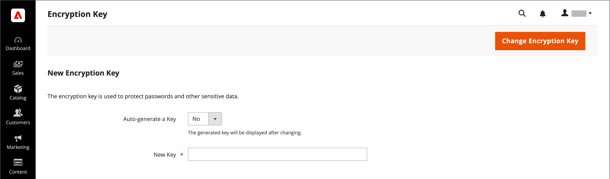

# Krypteringsnyckel

>[!NOTE]
>
>Om du har försökt slutföra de här stegen och har problem kan du läsa artikeln [Troubleshooting Encryption Key Rotation (Felsökning av krypteringsnyckelrotation): CVE-2024-34102](https://experienceleague.adobe.com/en/docs/commerce-knowledge-base/kb/troubleshooting/known-issues-patches-attached/troubleshooting-encryption-key-rotation-cve-2024-34102) i kunskapsbasen.

Adobe Commerce och Magento Open Source använder en krypteringsnyckel för att skydda lösenord och andra känsliga data. En [!DNL ChaCha20-Poly1305]-algoritm som är branschstandard används med en 256-bitars nyckel för att kryptera alla data som kräver kryptering. Detta inkluderar kreditkortsdata och integreringslösenord (betalnings- och leveransmodul). Dessutom används en stark Secure Hash-algoritm (SHA-256) för att hash-koda alla data som inte kräver dekryptering.

Under den första installationen uppmanas du att antingen låta Commerce generera en krypteringsnyckel eller ange en egen. Med krypteringsnyckelverktyget kan du ändra nyckeln efter behov. Krypteringsnyckeln bör ändras regelbundet för att förbättra säkerheten, och när som helst kan originalnyckeln bli komprometterad. När nyckeln ändras kodas alla äldre data om med den nya nyckeln.

Mer teknisk information finns i [Avancerad lokal installation](https://experienceleague.adobe.com/docs/commerce-operations/installation-guide/advanced.html) i _installationshandboken_.

>[!IMPORTANT]
>
>Kontrollera att följande fil är skrivbar innan du följer instruktionerna för att ändra krypteringsnyckeln: `[your store]/app/etc/env.php`

**Så här ändrar du en krypteringsnyckel:**

Följande instruktioner kräver åtkomst till en terminal.

1. Aktivera [underhållsläge](https://experienceleague.adobe.com/en/docs/commerce-operations/configuration-guide/setup/application-modes#maintenance-mode).

   ```bash
   bin/magento maintenance:enable
   ```

1. Inaktivera cron-jobb.

   _Cloud-infrastrukturprojekt:_

   ```bash
   ./vendor/bin/ece-tools cron:disable
   ```

   _Lokala projekt_

   ```bash
   crontab -e
   ```

1. Gå till **[!UICONTROL System]** > _[!UICONTROL Other Settings]_>**[!UICONTROL Manage Encryption Key]**på sidofältet_ Admin _.

   {width="700" zoomable="yes"}

1. Gör något av följande:

   - Om du vill generera en ny nyckel anger du **[!UICONTROL Auto-generate Key]** till `Yes`.
   - Om du vill använda en annan nyckel anger du **[!UICONTROL Auto-generate Key]** till `No`. I fältet **[!UICONTROL New Key]** anger eller klistrar du sedan in den nyckel som du vill använda.

1. Klicka på **[!UICONTROL Change Encryption Key]**.

   >[!NOTE]
   >
   >Registrera den nya nyckeln på en säker plats. Du måste dekryptera data om det uppstår problem med filerna.

1. Töm cacheminnet.

   _Cloud-infrastrukturprojekt:_

   ```bash
   magento-cloud cc
   ```

   _Lokala projekt:_

   ```bash
   bin/magento cache:flush
   ```

1. Aktivera cron-jobb.

   _Cloud-infrastrukturprojekt:_

   ```bash
   ./vendor/bin/ece-tools cron:enable
   ```

   _Lokala projekt:_

   ```bash
   crontab -e
   ```

1. Inaktivera underhållsläge.

   ```bash
   bin/magento maintenance:disable
   ```
