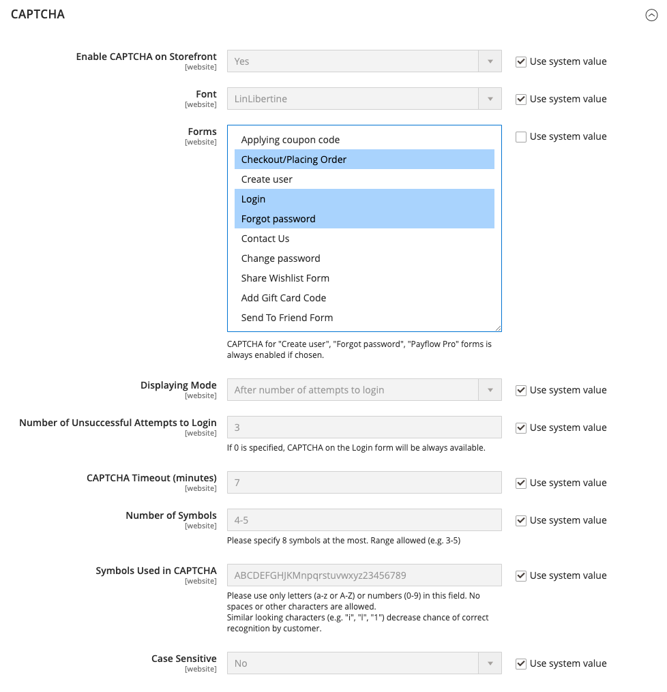

# CAPTCHA

En CAPTCHA är en visuell enhet som ser till att en människa i stället för en dator (eller robot) interagerar med webbplatsen. CAPTCHA är en akronym för _Helt automatiserat Public Turing-test för att skilja datorer och människor åt_. Den kan användas både för administratörsåtkomst och för olika butiksåtgärder som initierats av registrerade kunder. Adobe Commerce och Magento Open Source stöder CAPTCHA-standarden som beskrivs i det här avsnittet och [Google reCAPTCHA](security-google-recaptcha.md).

Du kan läsa in CAPTCHA igen så många gånger som behövs genom att klicka på ikonen Läs in igen i bildens övre högra hörn. CAPTCHA är helt konfigurerbart och kan anges varje gång, eller endast efter ett definierat antal misslyckade inloggningsförsök.

{width="700" zoomable="yes"}

## Konfigurera CAPTCHA för administratören

För en extra säkerhetsnivå kan du lägga till en CAPTCHA på sidan Administrera inloggning och Glömt lösenord. Administratörsanvändare kan läsa in den visade CAPTCHA-filen igen genom att klicka på ikonen _Läs in igen_  i bildens övre högra hörn. Antalet omladdningar är obegränsat.

{width="300"}

1. Gå till **[!UICONTROL Stores]** > _[!UICONTROL Settings]_>**[!UICONTROL Configuration]**&#x200B;på sidofältet_ Admin _.

1. Expandera **[!UICONTROL Advanced]** i den vänstra panelen och välj **[!UICONTROL Admin]**.

1. I det övre högra hörnet anger du **[!UICONTROL Store View]** till `Default`.

   Om [scopet](../getting-started/websites-stores-views.md#scope-settings) för din Commerce-installation innehåller flera webbplatser väljer du de webbplatser där du vill att CAPTCHA-konfigurationen ska användas.

1. Expandera  i avsnittet **[!UICONTROL CAPTCHA]**.

1. Ange **[!UICONTROL Enable CAPTCHA in Admin]** till `Yes`. Fyll sedan i de återstående alternativen enligt följande:

   {width="600" zoomable="yes"}

   - Ange namnet på **[!UICONTROL Font]** som ska användas för CAPTCHA-symboler (standard: `LinLibertine`).

     Om du vill lägga till ett eget teckensnitt måste teckensnittsfilen finnas i samma katalog som din Commerce-installation och måste deklareras i filen `config.xml` i Captcha-modulen på `app/code/Magento/Captcha/etc`.

   - Välj någon av följande **[!UICONTROL Forms]** där CAPTCHA ska användas. Om du vill välja flera formulär håller du ned Ctrl (PC) eller Kommando (Mac).

      - `Admin Login`
      - `Admin Forgot Password`

   - Ange **[!UICONTROL Displaying Modes]** till något av följande:

      - `Always` - CAPTCHA krävs alltid för att logga in i administratören.
      - `After number of attempts to login` - Det här alternativet gäller endast för formuläret Administratörsinloggning. När du väljer det här alternativet visas fältet _[!UICONTROL Number of Unsuccessful Attempts to Login]_. Ange antalet inloggningsförsök som du vill tillåta. Värdet 0 (noll) liknar inställningen för visningsläge till `Always`.

     För att spåra antalet misslyckade inloggningsförsök räknas varje försök att logga in under en e-postadress och från en IP-adress. Det maximala antalet inloggningsförsök från samma IP-adress är 1 000. Den här begränsningen gäller bara när CAPTCHA är aktiverat.

   - För **[!UICONTROL Number of Unsuccessful Attempts to Login]** anger du antalet gånger som administratören kan försöka logga in innan CAPTCHA visas. Om värdet är noll (`0`) krävs alltid CAPTCHA.

   - För **[!UICONTROL CAPTCHA Timeout (minutes)]** anger du antalet minuter innan CAPTCHA förfaller. När CAPTCHA förfaller måste administratören läsa in sidan igen.

   - Ange **[!UICONTROL Number of Symbols]** som ska visas i CAPTCHA. Upp till åtta (`8`) symboler kan användas. Ange ett intervall (till exempel `5-8`) för ett variabelt antal symboler som ändras för varje CAPTCHA.

   - I **[!UICONTROL Symbols Used in CAPTCHA]** anger du de bokstäver (a-z och A-Z) och siffror (0-9) som du vill ska visas slumpmässigt i CAPTCHA. Symboler som är svåra att skilja från andra symboler, som `i`, `l` eller `1`, ingår inte i standarduppsättningen med CAPTCHA-symboler.

   - Ange **[!UICONTROL Case Sensitive]** till `Yes` om du vill att administratörer ska ange tecknen med versaler eller gemener exakt så som visas i CAPTCHA.

1. Klicka på **[!UICONTROL Save Config]** när du är klar.

## Konfigurera CAPTCHA för butiken

Kunder kan behöva ange en CAPTCHA varje gång de loggar in på sina konton, eller efter flera misslyckade inloggningsförsök. Dessutom kan många formulär som används i hela butiken konfigureras så att CAPTCHA måste verifiera dem.

{width="700" zoomable="yes"}

1. Gå till **[!UICONTROL Stores]** > _[!UICONTROL Settings]_>**[!UICONTROL Configuration]**&#x200B;på sidofältet_ Admin _.

1. Expandera **[!UICONTROL Customers]** i den vänstra panelen och välj **[!UICONTROL Customer Configuration]**.

1. Expandera  i avsnittet **[!UICONTROL CAPTCHA]**.

{width="600" zoomable="yes"}

1. Ange **[!UICONTROL Enable CAPTCHA on Storefront]** till `Yes`. Fyll sedan i de återstående alternativen enligt följande:

   - Ange namnet på **[!UICONTROL Font]** som ska användas för CAPTCHA-symbolerna (standard: `LinLibertine`).

     Om du vill lägga till ett eget teckensnitt måste teckensnittsfilen finnas i samma katalog som din Commerce-installation och måste deklareras i filen `config.xml` i CAPTCHA-modulen.

   - Välj någon av följande **[!UICONTROL Forms]** där CAPTCHA ska användas. Om du vill välja flera formulär håller du ned Ctrl (PC) eller Kommando (Mac).

      - `Applying coupon code`
      - `Checkout/Placing Order`
      - `Create user`
      - `Login`
      - `Forgot password`
      - `Contact Us`
      - `Change password`
      - `Share Wishlist Form`
      - `Payflow Pro` (se artikeln [säkerhetspatch](https://experienceleague.adobe.com/docs/commerce-knowledge-base/kb/troubleshooting/payments/paypal-payflow-pro-active-carding-activity.html?lang=sv-SE) _Knowledge Base_)
      - `Send to Friend Form`  (endast Magento Open Source)
      - `Add Gift Card Code`  (endast Adobe Commerce)
      - `Create company`  (endast tillgängligt med Adobe Commerce B2B)

   - Ange **[!UICONTROL Displaying Mode]** till något av följande:

      - `Always` - CAPTCHA krävs alltid för att komma åt de markerade formulären.
      - `After number of attempts to login` - Ange antalet inloggningsförsök innan CAPTCHA visas. Värdet 0 (noll) liknar Alltid. När du väljer det här alternativet visas antalet misslyckade inloggningsförsök. Det här alternativet gäller inte för formuläret Glömt lösenord, som om det är aktiverat alltid visar CAPTCHA.

   - För **[!UICONTROL Number of Unsuccessful Attempts to Login]** anger du antalet gånger som en kund inte kan logga in innan CAPTCHA visas. Om värdet är noll (`0`) används alltid CAPTCHA.

   - För **[!UICONTROL CAPTCHA Timeout (minutes)]** anger du antalet minuter innan CAPTCHA förfaller. När CAPTCHA förfaller måste kunden läsa in sidan igen för att generera en ny CAPTCHA.

   - Ange **[!UICONTROL Number of Symbols]** som ska visas i CAPTCHA. Upp till åtta (`8`) symboler kan användas. Ange ett intervall (till exempel `5-8`) för ett variabelt antal symboler som ändras för varje CAPTCHA.

   - I **[!UICONTROL Symbols Used in CAPTCHA]** anger du de bokstäver (a-z och A-Z) och siffror (0-9) som du vill ska visas slumpmässigt i CAPTCHA. Standardteckenuppsättningen innehåller inte liknande symboler som `I` eller `1`. För bästa resultat bör du använda symboler som användarna lätt kan identifiera.

   - Ange **[!UICONTROL Case Sensitive]** till `Yes` om du vill att kunderna ska ange tecknen med versaler eller gemener exakt så som visas i CAPTCHA.

1. Klicka på **[!UICONTROL Save Config]** när du är klar.
