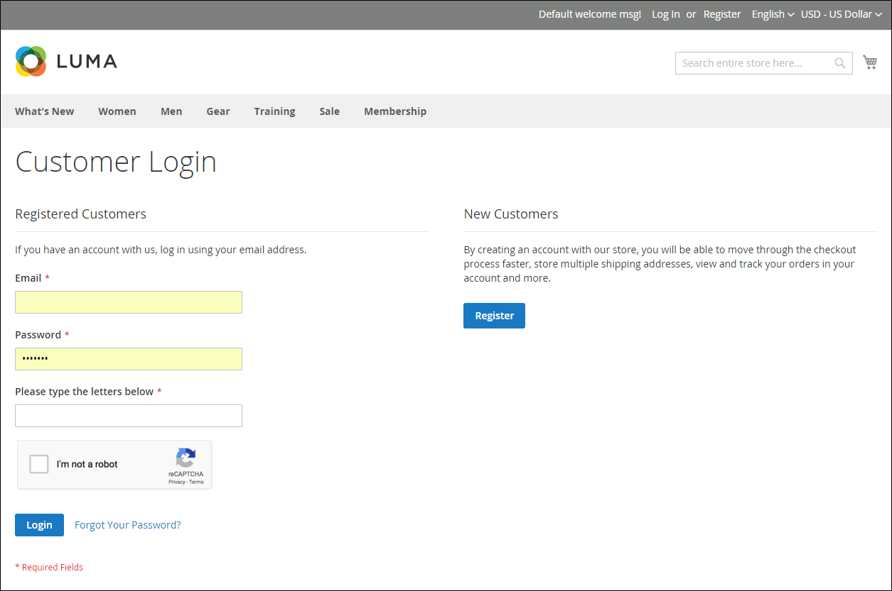

# Google reCAPTCHA

[Google reCAPTCHA](https://developers.google.com/recaptcha) ser till att en människa interagerar med webbplatsen i stället för en dator (eller robot). Till skillnad från Adobe Commerce och Magento Open Source [CAPTCHA](security-captcha.md)ger Google reCAPTCHA bättre säkerhet med ett urval av olika visningsalternativ och -metoder. Ytterligare trafikinformation finns på kontrollpanelen för ditt Google reCAPTCHA-konto.

Google reCAPTCHA konfigureras separat för Admin och storefront.

- För administratören kan Google reCAPTCHA användas på [Logga in](../getting-started/admin-signin.md) och när en användare begär en lösenordsåterställning. Om Commerce [CAPTCHA](security-captcha.md) är aktiverat kan Google reCAPTCHA användas samtidigt utan problem.

- Google reCAPTCHA kan användas för att logga in på en [kundkonto](../customers/customer-sign-in.md), skicka ett meddelande från [Kontakta oss](../getting-started/store-details.md#contact-us-form) och på många andra platser i butiken.

  {width="700" zoomable="yes"}

Google reCAPTCHA kan implementeras på flera sätt:

- _reCAPTCHA v3 osynlig_ — Använder en algoritm för att betygsätta användarinteraktioner och fastställer sannolikheten för att användaren är mänsklig baserat på ett poängvärde.

- _reCAPTCHA v2 osynlig_ — Utför bakgrundsverifiering utan användarinteraktion. Användare och kunder verifieras automatiskt, men de kan behöva välja ut specifika bilder för att klara en utmaning.

- _reCAPTCHA v2 (&quot;Jag är inte en robot&quot;)_ — Validerar begäranden med _&quot;Jag är ingen robot&quot;_ kryssrutan.

>[!IMPORTANT]
>
>Innan Google reCAPTCHA kan konfigureras bör du kontrollera att `PHP.ini` filen innehåller följande inställning: `allow_url_fopen = 1`. Detta kan kräva hjälp av utvecklare. Se [Nödvändiga PHP-inställningar](https://experienceleague.adobe.com/docs/commerce-operations/installation-guide/prerequisites/php-settings.html){:target=&quot;_blank&quot;} i installationsguiden.

## Steg 1: Generera Google reCAPTCHA-nycklar

Google reCAPTCHA kräver ett par API-nycklar för att kunna aktiveras. Du kan få dessa nycklar kostnadsfritt via reCAPTCHA-webbplatsen. Innan du genererar nycklarna måste du känna till vilken typ av reCAPTCHA du vill använda.

1. Öppna Google reCAPTCHA-sidan och logga in på ditt konto.

1. För **[!UICONTROL Label]**, anger du ett namn som identifierar nycklarna för intern referens.

   Du behöver en uppsättning nycklar för varje reCAPTCHA-typ som används i din Adobe Commerce- eller Magento Open Source-installation. Till exempel: `Commerce Invisible`

1. För **[!UICONTROL reCAPTCHA type]** väljer du den metod som du vill använda.

   - _reCAPTCHA v3 osynlig_
   - _reCAPTCHA v2 osynlig_
   - _reCAPTCHA v2 (&quot;Jag är inte en robot&quot;)_

1. För **[!UICONTROL Domain]** anger du din butiks domän. Till exempel: mystore.com

   Om du har flera arkiv med olika domäner anger du varje domän på en separat rad.

   - Lägg till din butiksdomän och eventuella underdomäner.
   - Du kan lägga till `localhost`, andra lokala VM-domäner och mellanlagringsdomäner efter behov för testning.

1. Markera kryssrutan till **[!UICONTROL Accept the reCAPTCHA Terms of Service]**.

1. (Valfritt) Välj **[!UICONTROL Send alerts to owners]** om Google upptäcker problem eller misstänkt trafik.

1. Klicka **[!UICONTROL Submit]** för att slutföra registrering och ta emot nycklar.

   >[!IMPORTANT]
   >
   >Alla nycklar gäller inte för alla typer av reCAPTCHA, och om du använder dem fel kan det leda till oväntat beteende. Google reCAPTCHA-nycklar som genererats för reCAPTCHA v2 &quot;Jag är inte en robot&quot; fungerar inte med _reCAPTCHA v2 osynlig_ och skulle kunna blockera funktioner där reCAPTCHA är aktiverat.

## Steg 2: Konfigurera Google reCAPTCHA för administratören

1. Logga in på ditt Admin-konto.

1. Gå till sidlisten Admin **[!UICONTROL Stores]** > _[!UICONTROL Settings]_>**[!UICONTROL Configuration]**.

1. I det övre högra hörnet anger du **[!UICONTROL Store View]** till `Default Config`.

1. Expandera på den vänstra panelen **[!UICONTROL Security]** och klicka **[!UICONTROL Google reCAPTCHA Admin Panel]**.

   >[!NOTE]
   >
   >Rensa **[!UICONTROL Use system value]** för varje fält som du vill konfigurera.

1. Används _[!DNL reCAPTCHA v2 ("I am not a robot")]_, expandera **[!UICONTROL reCAPTCHA v2 ("I am not a robot")]**och gör följande:

   - För **[!UICONTROL Google API Website Key]** anger du webbplatsnyckeln som skapades för den här reCAPTCHA-typen när du registrerade ditt Google reCAPTCHA-konto.

   - För **[!UICONTROL Google API Secret Key]** anger du den hemliga nyckel som är kopplad till ditt Google reCAPTCHA-konto.

   - För **[!UICONTROL Size]** väljer du storleken på den Google reCAPTCHA-ruta som du vill ska visas. Alternativ: `Normal (default)` / `Compact`

   - För **[!UICONTROL Theme]** väljer du det tema som du vill använda för att formatera rutan Google reCAPTCHA. Alternativ: `Light Theme (default)` / `Dark Theme`

   - För **[!UICONTROL Language Code]** anger du koden med två tecken för att ange [språk som används för Google reCAPTCHA-text och -meddelanden](https://developers.google.com/recaptcha/docs/language).

   {width="600" zoomable="yes"}

1. Används _[!DNL reCAPTCHA v2 Invisible]_, expandera **[!UICONTROL reCAPTCHA v2 Invisible]**och gör följande:

   - För **[!UICONTROL Google API Website Key]** anger du webbplatsnyckeln som skapades för den här reCAPTCHA-typen när du registrerade ditt Google reCAPTCHA-konto.

   - För **[!UICONTROL Google API Secret Key]** anger du den hemliga nyckel som är kopplad till ditt Google reCAPTCHA-konto.

   - För **[!UICONTROL Invisible Badge Position]** väljer du den plats på märket som ska användas på varje sida. Alternativ: `Inline` / `Bottom Right` / `Bottom Left`

   - För **[!UICONTROL Theme]** väljer du det tema som ska användas för att formatera rutan Google reCAPTCHA. Alternativ: `Light Theme (default)` / `Dark Theme`

   - För **[!UICONTROL Language Code]** anger du en kod med två tecken som anger [språk som används för Google reCAPTCHA-text och -meddelanden](https://developers.google.com/recaptcha/docs/language).

   {width="600" zoomable="yes"}

1. Används _[!DNL reCAPTCHA v3 Invisible]_, expandera **[!UICONTROL reCAPTCHA v3 Invisible]**och gör följande:

   - För **[!UICONTROL Google API Website Key]** anger du webbplatsnyckeln som skapades för den här reCAPTCHA-typen när du registrerade ditt Google reCAPTCHA-konto.

   - För **[!UICONTROL Google API Secret Key]** anger du den hemliga nyckel som är kopplad till ditt Google reCAPTCHA-konto.

   - Ange **[!UICONTROL Minimum Score Threshold]** för att identifiera när en användarinteraktion markeras som en potentiell risk, där 1.0 är en typisk användarinteraktion och 0.0 troligtvis är en robot. Standard: `0.5`

   - För **[!UICONTROL Invisible Badge Position]** väljer du den position som ska användas på varje sida. Alternativ: `Inline` / `Bottom Right` / `Bottom Left`

   - För **[!UICONTROL Theme]** väljer du det tema som ska användas för att formatera rutan Google reCAPTCHA. Alternativ: `Light Theme (default)` / `Dark Theme`

   - För **[!UICONTROL Language Code]** anger du en kod med två tecken som anger [språk som används för Google reCAPTCHA-text och -meddelanden](https://developers.google.com/recaptcha/docs/language).

   {width="600" zoomable="yes"}

1. Expandera **[!UICONTROL reCAPTCHA Validation Failure Messages]** och ange de meddelanden som visas i Admin om valideringen misslyckas eller inte kan slutföras.

   {width="600" zoomable="yes"}

1. Expandera **[!UICONTROL Admin Panel]** och konfigurera följande efter behov:

   - Ange **[!UICONTROL Enable for Login]** till den reCAPTCHA-typ som du vill använda för inloggningssidan för Admin.

   - Ange **[!UICONTROL Enable for Forgot Password]** till den reCAPTCHA-typ som du vill använda för begäranden om återställning av lösenord.

   {width="600" zoomable="yes"}

## Steg 3: Konfigurera Google reCAPTCHA för butiken

1. I den vänstra panelen under _[!UICONTROL Security]_, välja **[!UICONTROL Google reCAPTCHA Storefront]**.

1. Fyll i avsnittet för varje reCAPTCHA-typ som du vill använda i butiken.

   Se informationen i _Steg 2: Konfigurera Google reCAPTCHA för administratören_ om du vill ha information om alternativen för varje reCAPTCHA-typ.

1. Expandera **[!UICONTROL reCAPTCHA Validation Failure Messages]** och ange de meddelanden som visas i butiken om valideringen misslyckas eller inte kan slutföras.

1. Expandera avsnittet **[!UICONTROL Storefront]**.

   >[!NOTE]
   >
   >Rensa **[!UICONTROL Use system value]** för varje fält som du vill konfigurera.

1. Ställ in varje butiksplatsfält på den typ av reCAPTCHA som du har konfigurerat att använda.

   - [!UICONTROL Enable for Customer Login]
   - [!UICONTROL Enable for Forgot Password]
   - [!UICONTROL Enable for Create New Customer Account]
   - [!UICONTROL Enable for Edit Customer Account]
   - [!UICONTROL Enable for Create New Company Account]  (Endast för Adobe Commerce B2B)
   - [!UICONTROL Enable for Contact Us]
   - [!UICONTROL Enable for Product Review]
   - [!UICONTROL Enable for Newsletter Subscription]
   - [!UICONTROL Enable for Gift Card]  (endast Adobe Commerce)
   - [!UICONTROL Enable for Invitation Create Account]
   - [!UICONTROL Enable for Send To Friend]
   - [!UICONTROL Enable for Checkout/Placing Order]
   - [!UICONTROL Enable for Wishlist Sharing]
   - [!UICONTROL Enable for Coupon Codes]
   - [!UICONTROL Enable for PayPal PayflowPro payment form]

   {width="600" zoomable="yes"}

## Steg 4: Spara konfigurationen

1. När konfigurationsinställningarna är klara klickar du **[!UICONTROL Save Config]**.

1. Klicka på i meddelandet längst upp på arbetsytan **[!UICONTROL Cache Management]** och uppdatera varje ogiltig cache.
