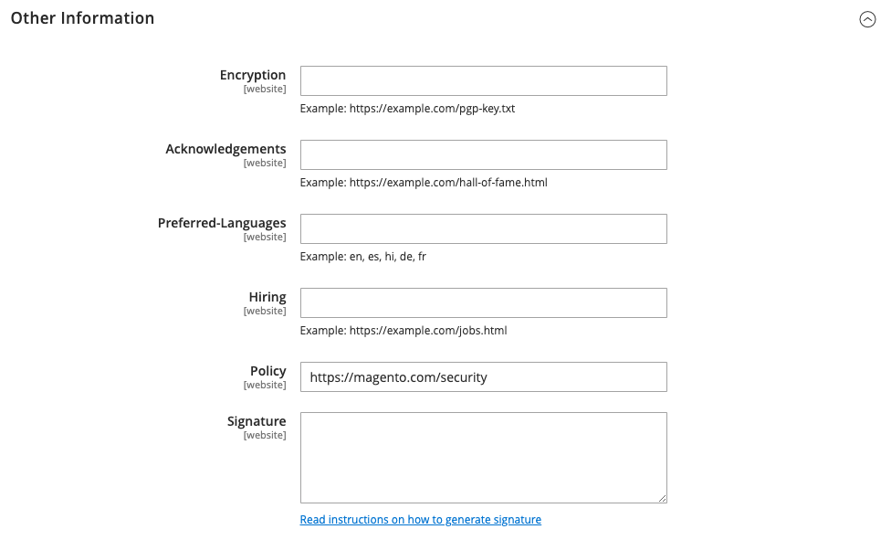

# Rapportering av säkerhetsproblem

Filen `security.txt` innehåller kontaktinformation och säkerhetsrelaterade länkar som kan användas av säkerhetsforskare för att rapportera säkerhetsproblem om din webbplats. Om din säkerhetsinformation ändras över tid kontrollerar du att informationen i filen `security.txt` är aktuell.

**_Så här konfigurerar du security.txt:_**

1. Gå till **[!UICONTROL Stores]** > _[!UICONTROL Settings]_>**[!UICONTROL Configuration]**&#x200B;på sidofältet_ Admin _.

1. Klicka på **[!UICONTROL Security.txt]** i den vänstra panelen under _[!UICONTROL Security]_.

1. I avsnittet _[!UICONTROL General]_&#x200B;anger du **[!UICONTROL Enable]**&#x200B;till `Yes`.

   {width="600" zoomable="yes"}

1. Ange följande under _[!UICONTROL Contact Information]_:

   - E-postadress och telefonnummer till den person som hanterar säkerhetsfrågor för din butik.

   - URL:en till din butiks **[!UICONTROL Contact Page]**. Den här sidan kan antingen vara en lista över butikssäkerhetskontakter eller din _Kontakta oss_-sida.

   {width="600" zoomable="yes"}

1. Ange följande under _[!UICONTROL Other Information]_:

   - URL:en för den offentliga **[!UICONTROL Encryption]**-nyckeln. Till exempel: `https://example.com/pgp-key.txt`

   - URL-adressen till en **[!UICONTROL Acknowledgments]**-sida där säkerhetsforskare identifieras för sina insatser för din butik.

   - Din **[!UICONTROL Preferred Languages]** för säkerhetsrelaterad kommunikation. Ange [språkkoden](https://en.wikipedia.org/wiki/List_of_ISO_639-1_codes) med två tecken som standard för varje språk som stöds, avgränsat med kommatecken. Om du till exempel vill ange engelska, spanska och franska anger du `en, es, fr`. Alla angivna språk har samma prioritet, oavsett vilken ordning de visas i.

   - URL:en för en **[!UICONTROL Hiring]**-sida som visar säkerhetsrelaterade anställningsmöjligheter hos din butik.

   - URL-adressen till din säkerhetssida **[!UICONTROL Policy]**.

   - URL:en för en digital **[!UICONTROL Signature]**-fil som sparas på servern. Till exempel: `https://mystore.com/.well-known/security.txt.sig`

   Den digitala signaturen måste skapas från serverns CLI (kommandoradsgränssnitt). Mer information finns i [Security.txt](https://github.com/magento/security-package/blob/1.0-develop/Securitytxt/README.md) på GitHub.

   {width="600" zoomable="yes"}

1. Klicka på **[!UICONTROL Save Config]** när du är klar.
