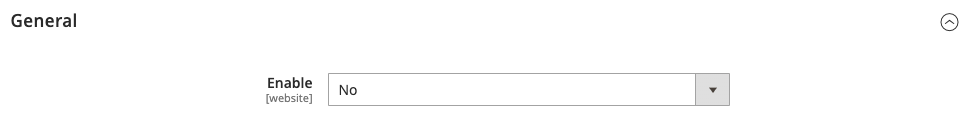

# Rapportering av säkerhetsproblem

The `security.txt` filen innehåller kontaktinformation och säkerhetsrelaterade länkar som kan användas av säkerhetsforskare för att rapportera säkerhetsproblem om din webbplats. Om din säkerhetsinformation ändras över tid bör du kontrollera att informationen i `security.txt` filen är uppdaterad.

**_Konfigurera security.txt:_**

1. På _Administratör_ sidebar, gå till **[!UICONTROL Stores]** > _[!UICONTROL Settings]_>**[!UICONTROL Configuration]**.

1. I den vänstra panelen under _[!UICONTROL Security]_, klicka **[!UICONTROL Security.txt]**.

1. I _[!UICONTROL General]_avsnitt, ange **[!UICONTROL Enable]**till `Yes`.

   {width="600" zoomable="yes"}

1. Under _[!UICONTROL Contact Information]_anger du följande:

   - E-postadress och telefonnummer till den person som hanterar säkerhetsfrågor för din butik.

   - URL:en till butikens **[!UICONTROL Contact Page]**. Den här sidan kan antingen vara en lista över säkerhetskontakter för butik eller din _Kontakta oss_ sida.

   {width="600" zoomable="yes"}

1. Under _[!UICONTROL Other Information]_anger du följande:

   - URL:en till din publik **[!UICONTROL Encryption]** -tangenten. Exempel: `https://example.com/pgp-key.txt`

   - URL:en för en **[!UICONTROL Acknowledgments]** sida där säkerhetsforskare är erkända för sina insatser för din butik.

   - Dina **[!UICONTROL Preferred Languages]** för säkerhetsrelaterad kommunikation. Ange standardvärdet för två tecken [språkkod](https://en.wikipedia.org/wiki/List_of_ISO_639-1_codes) för varje språk som stöds, avgränsade med kommatecken. Om du till exempel vill ange engelska, spanska och franska anger du `en, es, fr`. Alla angivna språk har samma prioritet, oavsett vilken ordning de visas i.

   - URL:en för en **[!UICONTROL Hiring]** sida som listar säkerhetsrelaterade anställningsmöjligheter hos din butik.

   - URL:en till din säkerhet **[!UICONTROL Policy]** sida.

   - URL:en för ett digitalt **[!UICONTROL Signature]** som sparas på servern. Exempel: `https://mystore.com/.well-known/security.txt.sig`

   Den digitala signaturen måste skapas från serverns CLI (kommandoradsgränssnitt). Mer information finns på [Security.txt](https://github.com/magento/security-package/blob/1.0-develop/Securitytxt/README.md) på GitHub.

   {width="600" zoomable="yes"}

1. När du är klar klickar du på **[!UICONTROL Save Config]**.
