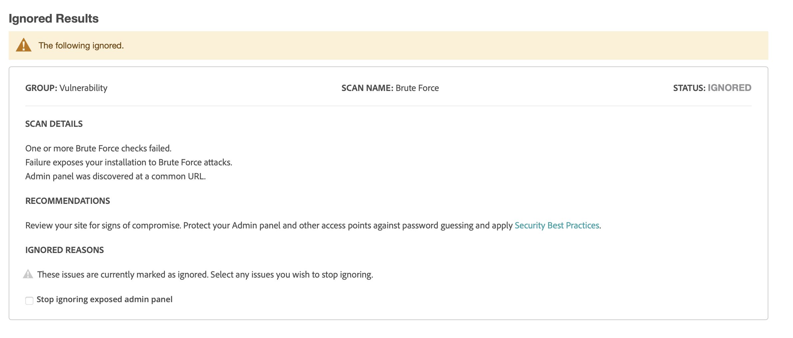

# Säkerhetssökning

Övervaka dina Adobe Commerce- och Magento Open Source-sajter för att se om det finns säkerhetsrisker och skadlig kod, och få säkerhetsuppdateringar och meddelanden.

- Få insikt i butikens säkerhetsstatus i realtid.
- Få förslag baserat på bästa praxis för att lösa problem.
- Schemalägg en säkerhetsgenomsökning så att den körs varje vecka, dag eller on demand.
- Kör över 21 000 säkerhetstester för att identifiera potentiell skadlig kod.
- Få tillgång till historiska säkerhetsrapporter som spårar och övervakar webbplatsernas förlopp.
- Få åtkomst till den inskannade rapporten som visar lyckade och misslyckade kontroller, med rekommenderade åtgärder.

Verktyget för säkerhetsgenomsökning är tillgängligt utan kostnad från instrumentpanelen för ditt [Commerce/Magento-konto](../getting-started/commerce-account-create.md). Mer teknisk information finns i [Konfigurera verktyget för säkerhetsgenomsökning](https://experienceleague.adobe.com/en/docs/commerce-on-cloud/user-guide/launch/overview#set-up-the-security-scan-tool) i _Commerce on Cloud Infrastructure Guide_.

{width="600" zoomable="yes"}

## Kör en säkerhetssökning

1. Logga in på ditt [Commerce/Magento-konto](../getting-started/commerce-account-create.md) från Commerce hemsida.

1. Granska och godkänn villkoren för användning av verktyget för säkerhetsgenomsökning.

   1. Välj **[!UICONTROL Security Scan]** på den vänstra panelen.
   1. Klicka på **[!UICONTROL Go to Security Scan]**.
   1. Läs **[!UICONTROL Terms and Conditions]**.
   1. Klicka på **[!UICONTROL Agree]** för att fortsätta.

1. Klicka på _[!UICONTROL Monitored Websites]_&#x200B;på sidan **[!UICONTROL +Add Site]**.

   Om du har flera platser med olika domäner, konfigurerar du en separat sökning för varje domän.

   {width="600" zoomable="yes"}

1. Gör något av följande om du vill verifiera ditt ägarskap av webbplatsdomänen genom att lägga till en bekräftelsekod:

   **Commerce storefront**:

   1. Ange **[!UICONTROL Site URL]** och **[!UICONTROL Site Name]**.
   1. Klicka på **[!UICONTROL Generate Confirmation Code]**.
   1. Klicka på **Kopiera** om du vill kopiera bekräftelsekoden till Urklipp.

      {width="400" zoomable="yes"}

   1. Logga in på administratören för din butik som användare med fullständig administratörsbehörighet och gör följande:

      1. Gå till _>_ > **[!UICONTROL Content]** på sidofältet _[!UICONTROL Design]_&#x200B;Admin **[!UICONTROL Configuration]**.
      1. Hitta din webbplats i listan och klicka på **[!UICONTROL Edit]**.
      1. Expandera  i avsnittet **[!UICONTROL HTML Head]**.
      1. Bläddra ned till **[!UICONTROL Scripts and Style Sheets]** och klicka i textrutan i slutet av eventuell befintlig kod. Klistra in bekräftelsekoden i textrutan.

         {width="600" zoomable="yes"}

      1. Klicka på **[!UICONTROL Save Configuration]** när du är klar.

   **PWA storefront**:

   1. Ange **[!UICONTROL Site URL]** och **[!UICONTROL Site Name]**.

   1. För **[!UICONTROL Confirmation Code]** väljer du alternativet `META Tag` och klickar sedan på **[!UICONTROL Generate Code]**.

   1. Klicka på **[!UICONTROL Copy]** för att kopiera den genererade META-taggen för bekräftelsekoden till Urklipp.

      {width="400" zoomable="yes"}

   1. Gå till projektkatalogen för PWA Studio storefront och gör följande:

      1. Gå till `packages > venia-concept > template.html` under PWA Studio projektkatalog.
      1. Lägg till den kopierade bekräftelsekoden (den genererade META-taggen) i HTML head och spara ändringarna.

         {width="600" zoomable="yes"}

      1. Gå tillbaka till PWA Studio CLI och använd garn för att installera projektberoenden och köra projektbyggkommandot.

         ```sh
         yarn install &&
         yarn build
         ```

      1. *I ditt molnprojekt* skapar du en `pwa`-mapp och kopierar innehållet i ditt storefront-projekts `dist`-mapp.

         ```sh
         mkdir pwa && cp -r <path to your storefront project>/dist/* pwa
         ```

      1. Använd Git CLI-verktyget för att mellanlagra, genomföra och överföra dessa ändringar till ditt Cloud-projekt.

         ```sh
         git add . &&
         git commit -m "Added storefront file bundles" &&
         git push origin
         ```

         När byggprocessen är klar kommer ändringarna att distribueras till din PWA-butik.

1. Gå tillbaka till sidan _[!UICONTROL Security Scan]_&#x200B;i ditt Commerce-konto och klicka på&#x200B;**[!UICONTROL Verify Confirmation Code]**&#x200B;för att etablera ägarskap för domänen.

1. Konfigurera alternativen för **[!UICONTROL Set Automatic Security Scan]** för någon av följande typer efter att du har bekräftat att åtgärden lyckades:

   **Sök igenom varje vecka (rekommenderas)**:

   Välj **[!UICONTROL Week Day]**, **[!UICONTROL Time]** och **[!UICONTROL Time Zone]** som genomsökningen ska utföras varje vecka.

   Som standard är genomsökningen schemalagd att börja varje vecka vid midnatt lördag, UTC och fortsätta till början av söndagen.

   {width="500" zoomable="yes"}

   **Sök dagligen**:

   Välj **[!UICONTROL Time]** och **[!UICONTROL Time Zone]** som genomsökningen ska utföras varje dag.

   Som standard är genomsökningen schemalagd att börja varje dag vid midnatt, UTC.

   {width="500" zoomable="yes"}

1. Ange **[!UICONTROL Email Address]** där du vill få meddelanden om slutförda sökningar och säkerhetsuppdateringar.

   {width="400" zoomable="yes"}

1. Klicka på **[!UICONTROL Submit]** när du är klar.

   När ägarskapet för domänen har verifierats visas webbplatsen i listan Övervakade webbplatser i ditt Commerce-konto.

1. Om du har flera webbplatser med olika domäner upprepar du den här processen för att konfigurera en säkerhetsgenomsökning för varje.

## Hantera skanningsfel

Med verktyget för säkerhetsgenomsökning kan du hantera genomsökningsfel direkt från rapportvyn. Du kan markera specifika skanningsfel som falska positiva och utesluta dem från riskpoängen.

### Fördelar med att hantera misslyckade sökningar

Genom att hantera skanningsfel kan du få en mer korrekt säkerhetsöversikt över din butik:

- Minska antalet falska positiv i säkerhetsrapporterna.
- Fokusera på relevanta säkerhetsfrågor som behöver åtgärdas.
- Få en tydligare bild av butikens verkliga säkerhetsstatus.
- Eliminera behovet av att kontakta support för kända, falska positiva motiv.
- Spara tid genom att självhantera skanningsfel som du redan har utrett.

Vanliga scenarier där du kan markera ett skanningsfel som falskt positivt är:

- När du redan har tillämpat en säkerhetskorrigering som inte har identifierats av skanningsverktyget.
- När ett identifierat problem inte kan tillämpas på din specifika lagringskonfiguration.
- När du har implementerat en alternativ säkerhetsåtgärd som åtgärdar problemet.
- När genomsökningsfelet baseras på en konfiguration som du avsiktligt har ställt in för ditt företags behov.

### Ignorera sökningsfel

Följ de här stegen för att hantera sökningsfel som du har identifierat som falska positiva:

1. På sidan _[!UICONTROL Monitored Websites]_&#x200B;klickar du på&#x200B;**[!UICONTROL View Report]**&#x200B;för den webbplats du vill hantera.

1. Leta reda på den misslyckade sökning som du vill markera som falskt positiv i rapportvyn.

1. Klicka på **[!UICONTROL Ignore]** om du vill se det specifika genomsökningsfelet.

   {width="600" zoomable="yes"}

1. Klicka på **[!UICONTROL Apply Changes]** för att spara markeringen.

Det ignorerade genomsökningsfelet flyttas till avsnittet _[!UICONTROL Ignored Results]_&#x200B;och tas inte med i riskpoängen.

### Sluta ignorera sökningsfel

Om du behöver återställa ett tidigare ignorerat skanningsfel till den aktiva övervakningen gör du så här:

1. Bläddra till avsnittet _[!UICONTROL Ignored Results]_&#x200B;i rapportvyn.

1. Klicka på **[!UICONTROL Stop Ignoring]** för det genomsökningsfel som du vill återställa.

   {width="600" zoomable="yes"}

1. Klicka på **[!UICONTROL Apply Changes]** för att spara markeringen.

Skanningsfelet återgår till avsnittet _[!UICONTROL Failed Scans]_&#x200B;och ingår i riskpoängen.

### Visa ignorerade skanningsfel

Ignorerade resultat visas i ett separat avsnitt i rapporten och riskpoängen uppdateras automatiskt så att endast aktiva skanningsfel visas. Du kan hantera flera skanningsfel samtidigt genom att markera flera objekt innan du tillämpar ändringarna.

{width="600" zoomable="yes"}
