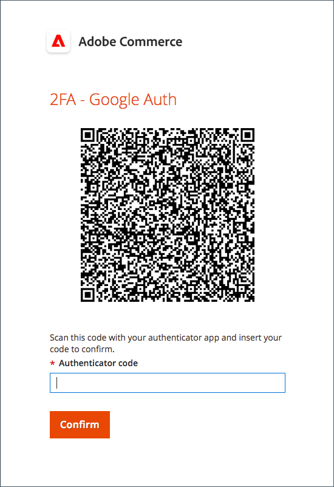
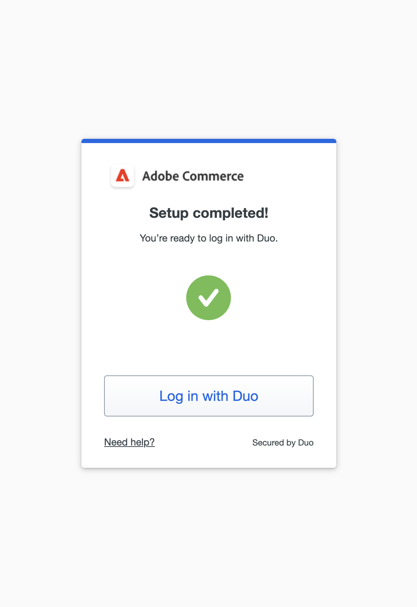

# Inställning av tvåfaktorsautentisering för användarkonton

Dessa instruktioner visar hur du ställer in tvåfaktorsautentisering under din första inloggning på Adobe Commerce eller Magento Open Source och hur du autentiserar din identitet med följande program och enheter.

Fullständiga anvisningar finns i [Administratörsinloggning](../getting-started/admin-signin.md).

>[!NOTE]
>
>Lager som har aktiverat [!DNL Adobe Identity Management Services] (IMS)-autentisering har inbyggda Adobe Commerce och Magento Open Source 2FA inaktiverade. Administratörsanvändare som är inloggade på sin Commerce-instans med sina Adobe-inloggningsuppgifter behöver inte autentisera igen för många administratörsuppgifter. Autentisering hanteras av Adobe IMS när administratörsanvändaren loggar in på sin aktuella session. Se [[!DNL Adobe Identity Management Service] (IMS)-integreringsöversikt](../getting-started/adobe-ims-integration-overview.md).

## [!DNL Google Authenticator]

### Steg 1: Konfigurera [!DNL Google Authenticator]

1. Ange dina kontoinloggningsuppgifter och logga in på _Admin_. En ny autentiseringsskärm visas med en QR-kod.

1. Öppna appen **[!UICONTROL Google Authenticator]** på din mobila enhet.

1. Klicka på plustecknet ( **+** ) för att lägga till en post och justera den röda rutan med QR-koden för att skanna med kameran på smarttelefonen.

1. När telefonen känner igen QR-koden och lägger till en post anger du den 6-siffriga koden i fältet _Admin_ **[!UICONTROL Authenticator code]**.

1. Klicka på **[!UICONTROL Confirm]** när du är klar.

   {width="300"}

### Steg 2: Logga in med [!DNL Google Authenticator]

1. Ange dina kontoinloggningsuppgifter och logga in på Commerce _Admin_.

   {width="300"}

1. Öppna [!DNL Google Authenticator] på din mobila enhet.

1. Ange den sexsiffriga autentiseringskoden när du uppmanas att göra det.

1. Om du vill spara autentiseringen för framtida inloggningar markerar du kryssrutan **[!UICONTROL Trust this device, do not ask again]**.

1. Klicka på **[!UICONTROL Confirm]** när du är klar.

## [!DNL Duo Security]

[!DNL Duo] erbjuder en kostnadsfri provperiod och avgifter baserat på antalet användare som är associerade med kontot. Följ deras [instruktioner för att konfigurera ditt konto och hämta appen](https://duo.com/product/multi-factor-authentication-mfa/duo-mobile-app).

### Steg 1: Konfigurera [!DNL Duo Security]

1. Ange dina kontoinloggningsuppgifter och logga in på _Admin_.

1. När sidan [!DNL Duo] Setup (Konfigurera) visas klickar du på **[!UICONTROL Get Started]** och gör följande:

   {width="300"}

1. Välj alternativ. Du kan välja Touch ID, Duo Mobile, Security Key eller Phone Number. I det här exemplet visas alternativet Duo Mobile eller Telefonnummer.

1. Ange ditt telefonnummer och klicka på **[!UICONTROL Continue]** när du uppmanas till detta.

   Bekräfta ägarskapet genom att skicka och verifiera lösenordet på telefonnumret.

1. När du uppmanas att installera [!DNL Duo Mobile] för telefontypen klickar du på **[!UICONTROL I have Duo Mobile]**.

1. Öppna [!DNL Duo Mobile] och skanna QR-koden för att synkronisera autentiseraren med Adobe Commerce. En bock visas när aktiveringen är klar.

1. Du kan lägga till fler enheter (om det behövs) eller hoppa över. Installationen är klar och du kan logga in med Duo.

   {width="300"}

### Steg 2: Logga in med [!DNL Duo Security]

I följande exempel visas alternativen för `Ask me to choose an authenticator method`:

1. Ange dina _Admin_-inloggningsuppgifter när du uppmanas att göra det.

   {width="300"}

1. Välj Logga in med Duo för att få ett push-meddelande för Duo-mobilappen, logga in med Touch ID eller fortsätt med ett annat alternativ som du konfigurerade under installationen.

1. Godkänn begäran från Duo-programmet/Touch ID/Text-meddelandet så loggas du in.

   {width="300"}

## [!DNL Authy]

[!DNL Authy] erbjuder sina appar och tjänster utan kostnad för användarna. Följ instruktionerna för att hämta och konfigurera programmet för din enhet eller webbläsare. Mer information finns i [[!DNL Authy] dokumentationen](https://authy.com/features/setup/).

### Steg 1: Konfigurera auktorisering

1. Ange dina kontoinloggningsuppgifter och logga in på _Admin_.

   ![[!DNL Authy] registrering](./assets/storefront-2fa-authy-auth.png){width="300"}

1. Gör följande när du uppmanas att registrera dig hos Authy:

   - Välj land.

   - Ange ditt telefonnummer.

   - Välj **[!UICONTROL Verification method]**: `SMS` eller `Call Me`

   Klicka på **[!UICONTROL Continue]**. Ett meddelande skickas till telefonen via SMS eller ett samtal.

1. Ange den verifieringskod som du får och klicka på **[!UICONTROL Verify]**.

1. Klicka på **[!UICONTROL Confirm]** när du är klar.

   ![[!DNL Authy] verifieringskod ](./assets/storefront-2fa-authy-verify.png){width="300"}

### Steg 2: Logga in med [!DNL Authy]

1. Ange dina kontoinloggningsuppgifter och logga in på _Admin_.

   ![[!DNL Authy] - inloggning](./assets/storefront-2fa-authy-access.png){width="300"}

1. Välj en av följande metoder för autentisering:

   - `Use one touch` - Skickar en avisering till din [!DNL Authy]-app. Acceptera åtkomsten i appen.
   - `Use authy token` - Uppmanar dig att ange en kod från din [!DNL Authy]-app.

1. Om du har problem med att logga in väljer du den metod som du vill använda för att ta emot koden. Ange sedan koden som du får för att komma åt _Admin_.

   Appen innehåller dessa ytterligare nödmetoder.

   - `Send me a code via SMS` - Ett SMS-SMS-meddelande skickas till den konfigurerade mobila enheten.
   - `Send me a code via phone call` - Användaren får ett telefonsamtal med en kod.

   Ditt konto har verifierats och öppnas.

## U2F ([!DNL Yubikey] och andra enheter)

Följ instruktionerna från lösningsleverantören för att konfigurera U2F-enheten. Mer information finns i leverantörens dokumentation, till exempel [[!DNL YubiKey]](https://support.yubico.com/hc/en-us/articles/360013790339-Getting-Started-with-Your-YubiKey) av [!UICONTROL Yubico].

1. Ange dina kontoinloggningsuppgifter och logga in på _Admin_.

   {width="300"}

1. Tryck på knappen.

   Autentiseringen utlöser omedelbart och öppnar _Admin_.

1. Sätt in **[!UICONTROL U2F key]** i en USB-port på datorn.
