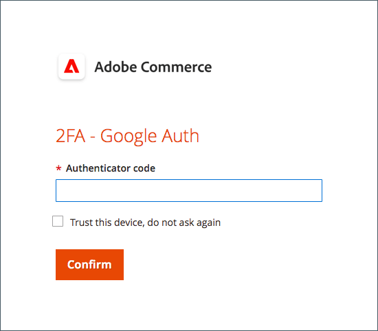

# Inställning av tvåfaktorsautentisering för användarkonton

Dessa instruktioner visar hur du ställer in tvåfaktorsautentisering under din första inloggning på Adobe Commerce eller Magento Open Source och hur du autentiserar din identitet med följande program och enheter.

Fullständiga anvisningar finns i [Administratörsinloggning](../getting-started/admin-signin.md).

>[!NOTE]
>
>Lager som har aktiverats [!DNL Adobe Identity Management Services] (IMS)-autentisering har inbyggda Adobe Commerce och Magento Open Source 2FA inaktiverat. Administratörsanvändare som är inloggade på sin Commerce-instans med sina inloggningsuppgifter för Adobe behöver inte autentisera igen för många administratörsuppgifter. Autentisering hanteras av Adobe IMS när administratörsanvändaren loggar in på sin aktuella session. Se [[!DNL Adobe Identity Management Service] (IMS) Integreringsöversikt](../getting-started/adobe-ims-integration-overview.md).

## [!DNL Google Authenticator]

### Steg 1: Konfigurera [!DNL Google Authenticator]

1. Ange dina kontouppgifter och logga in på _Administratör_. En ny autentiseringsskärm visas med en QR-kod.

1. Öppna **[!UICONTROL Google Authenticator]** på din mobila enhet.

1. Klicka på plustecknet ( **+** ) för att lägga till en post och justera den röda rutan med QR-koden för att skanna med kameran på smarttelefonen.

1. När telefonen känner igen QR-koden och lägger till en post anger du den 6-siffriga koden i _Administratör_ **[!UICONTROL Authenticator code]** fält.

1. När du är klar klickar du på **[!UICONTROL Confirm]**.

   {width="300"}

### Steg 2: Logga in med [!DNL Google Authenticator]

1. Ange dina kontouppgifter och logga in i Commerce _Administratör_.

   {width="300"}

1. Öppna [!DNL Google Authenticator] på din mobila enhet.

1. Ange den sexsiffriga autentiseringskoden när du uppmanas att göra det.

1. Välj alternativet **[!UICONTROL Trust this device, do not ask again]** kryssrutan.

1. När du är klar klickar du på **[!UICONTROL Confirm]**.

## [!DNL Duo Security]

[!DNL Duo] erbjuder en kostnadsfri provperiod och avgifter baserat på antalet användare som är kopplade till kontot. Följ deras [anvisningar för att konfigurera ditt konto och hämta appen](https://duo.com/product/multi-factor-authentication-mfa/duo-mobile-app).

### Steg 1: Konfigurera [!DNL Duo Security]

1. Ange dina kontouppgifter och logga in på _Administratör_.

1. När [!DNL Duo] Utskriftssidan visas. Klicka på **[!UICONTROL Start setup]** och gör följande:

   {width="300"}

1. Välj enhet.

1. Ange ditt telefonnummer och klicka på **[!UICONTROL Continue]**.

   I det här exemplet efterfrågas ditt telefonnummer eftersom vi använder en mobil enhet.

1. När du uppmanas att installera [!DNL Duo Mobile] för telefontyp klickar du på **[!UICONTROL I have Duo Mobile]**.

1. Öppna [!DNL Duo Mobile] och skanna QR-koden för att synkronisera autentiseraren med Adobe Commerce. En bock visas när aktiveringen är klar.

1. Om du vill konfigurera inställningarna för enheten väljer du den åtgärd som du vill ska utföras när du loggar in.

   - `Ask me to choose an authenticator method` — Låter användaren välja vid inloggning och autentisering i _Administratör_.
   - `Automatically send this device a Duo Push` — Skickar ett meddelande till din enhet för att godkänna eller neka åtkomst.
   - `Automatically call this device` — Anropar och anger ett lösenord för åtkomst.

   {width="300"}

### Steg 2: Logga in med [!DNL Duo Security]

I följande exempel visas alternativen för `Ask me to choose an authenticator method`:

1. Ange _Administratör_ inloggningsuppgifter.

   {width="300"}

1. Välj den metod som du vill använda för att autentisera:

   - `Send Me a Push` — Klicka för att få ett push-meddelande till [!DNL Duo Mobile]. Godkänn autentisering.
   - `Call Me` — Klicka här, ta emot ett samtal med en kod och ange lösenordskoden.
   - `Enter a Passcode` — Klicka på det här alternativet om du vill få och ange en lösenordskod.

1. Fyll i push-koden för att logga in på _Administratör_.

## [!DNL Authy]

[!DNL Authy] erbjuder sina appar och tjänster utan kostnad för användarna. Följ instruktionerna för att hämta och konfigurera programmet för din enhet eller webbläsare. Mer information finns i [[!DNL Authy] dokumentation](https://authy.com/features/setup/).

### Steg 1: Konfigurera auktorisering

1. Ange dina kontouppgifter och logga in på _Administratör_.

   ![[!DNL Authy] registrering](./assets/storefront-2fa-authy-auth.png){width="300"}

1. Gör följande när du uppmanas att registrera dig hos Authy:

   - Välj land.

   - Ange ditt telefonnummer.

   - Välj **[!UICONTROL Verification method]**: `SMS` eller `Call Me`

   Klicka på **[!UICONTROL Continue]**. Ett meddelande skickas till telefonen via SMS eller ett samtal.

1. Ange den verifieringskod som du får och klicka på **[!UICONTROL Verify]**.

1. När du är klar klickar du på **[!UICONTROL Confirm]**.

   ![[!DNL Authy] verifieringskod](./assets/storefront-2fa-authy-verify.png){width="300"}

### Steg 2: Logga in med [!DNL Authy]

1. Ange dina kontouppgifter och logga in på _Administratör_.

   ![[!DNL Authy] - inloggning](./assets/storefront-2fa-authy-access.png){width="300"}

1. Välj en av följande metoder för autentisering:

   - `Use one touch` - Skickar en avisering till din [!DNL Authy] app. Acceptera åtkomsten i appen.
   - `Use authy token` — Uppmanar dig att ange en kod från [!DNL Authy] app.

1. Om du har problem med att logga in väljer du den metod som du vill använda för att ta emot koden. Ange sedan koden som du får för att få tillgång till _Administratör_.

   Appen innehåller dessa ytterligare nödmetoder.

   - `Send me a code via SMS` — Ett SMS-SMS-meddelande skickas till den konfigurerade mobila enheten.
   - `Send me a code via phone call` — Användaren får ett telefonsamtal med kod.

   Ditt konto har verifierats och öppnas.

## U2F ([!DNL Yubikey] och andra enheter)

Följ instruktionerna från lösningsleverantören för att konfigurera U2F-enheten. Mer information finns i leverantörens dokumentation, som [[!DNL YubiKey]](https://support.yubico.com/hc/en-us/articles/360013790339-Getting-Started-with-Your-YubiKey) av [!UICONTROL Yubico].

1. Ange dina kontouppgifter och logga in på _Administratör_.

   {width="300"}

1. Tryck på knappen.

   Autentiseringen startar omedelbart och öppnar _Administratör_.

1. Infoga **[!UICONTROL U2F key]** till en USB-port på datorn.
