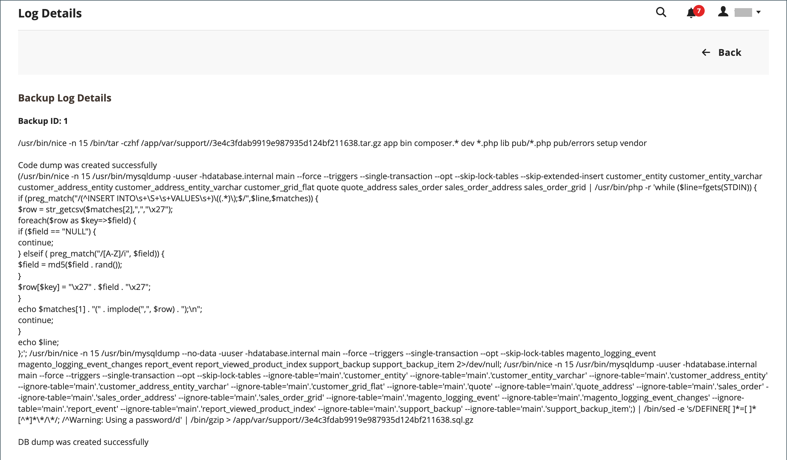

# Supportverktyg

{{ee-feature}}

Supportverktygen är utformade för att identifiera kända fel i systemet. De kan användas som en resurs under utvecklings- och optimeringsprocesserna och som ett diagnostiskt verktyg som hjälper vårt supportteam att identifiera och lösa problem.

## Datainsamlare

Datainsamlaren samlar in den information om ditt system som vårt supportteam behöver för att felsöka problem med din Adobe Commerce-installation. Säkerhetskopian som skapas tar flera minuter att slutföra och innehåller både kod och databasdump. Data kan exporteras till en CSV- eller Excel XML-fil.

{width="600" zoomable="yes"}

### Kör datainsamlaren

1. På _Administratör_ sidebar, gå till **[!UICONTROL System]** > _[!UICONTROL Support]_>**[!UICONTROL Data Collector]**.

1. Klicka på i det övre högra hörnet **[!UICONTROL New Backup]**.

   Det tar några minuter att generera säkerhetskopian. Du kan övervaka resultatet av bearbetningen genom att klicka **[!UICONTROL Refresh Status]**. När du är klar visas säkerhetskopian i _[!UICONTROL Data Collector]_rutnät.

1. Så här visar du en logg med säkerhetskopieringsinformation:

   - I _[!UICONTROL Action]_kolumn, markera **[!UICONTROL Show Log]**.

   - Klicka **[!UICONTROL Back]** för att gå tillbaka till rutnätet.

   {width="600" zoomable="yes"}

### Exportera säkerhetskopieringsdata

1. I den första kolumnen markerar du kryssrutan för den säkerhetskopia som ska exporteras.

1. Använd **[!UICONTROL Export]** för att välja exportdatas format.

   {width="600" zoomable="yes"}

1. Få åtkomst till filen via webbläsarens nedladdningsplats och **[!UICONTROL Save]** den.

### Hämta säkerhetskopieringsdata

När säkerhetskopieringen har skapats kan du hämta en kopia av kod- och databasdata.

1. Hitta den säkerhetskopieringsenhet som behövs i rutnätet.

1. Se till att den har en `Complete` status.

1. Klicka på enhetsnamnet i _[!UICONTROL Code Dump]_eller_[!UICONTROL DB Dump]_ kolumner.

Hämtningsprocessen bör starta automatiskt.

## Ta bort säkerhetskopieringsdata

1. På _Administratör_ sidebar, gå till **[!UICONTROL System]** > _[!UICONTROL Support]_>**[!UICONTROL Data Collector]**.

1. Sök efter och markera de säkerhetskopierade data som ska tas bort.

1. I _[!UICONTROL Action]_kolumn, klicka **[!UICONTROL Delete]**.

1. Bekräfta åtgärden genom att klicka **[!UICONTROL OK]**.

## Systemrapporter

Systemrapporteringsverktyget ger dig möjlighet att ta regelbundna, fullständiga eller delvisa ögonblicksbilder av systemet och spara dem för framtida referens. Du kan jämföra prestandainställningar före och efter kodutvecklingscykler eller ändringar av serverinställningarna. Systemrapporteringsverktyget kan dramatiskt minska tiden för förberedelse och inlämning av den information som supporten behöver för att inleda en utredning.

I stödrastret Systemrapporter kan du visa och hämta befintliga rapporter, ta bort rapporter och skapa rapporter.

### Åtkomst till systemrapporter

På _Administratör_ sidebar, gå till **[!UICONTROL System]** > _[!UICONTROL Support]_>**[!UICONTROL System Report]**.

{width="600" zoomable="yes"}

### Generera en rapport

1. Klicka på **[!UICONTROL New Report]**.

1. I **[!UICONTROL Groups]** väljer du varje uppsättning med information som du vill ta med i rapporten. Som standard är alla grupper markerade.

   {width="600" zoomable="yes"}

1. Klicka på i det övre högra hörnet **[!UICONTROL Create]**.

   Det kan ta några minuter innan rapporten genereras, beroende på hur många rapporttyper som har valts. När rapporten är klar visas den högst upp i rutnätet med genererat datum och genererad tid.

### Visa modulinformation

Du hittar användbar information om installerade moduler.

**_Så här visar du rapportinformation för varje installerad modul:_**

1. På _Administratör_ sidebar, gå till **[!UICONTROL System]** > _[!UICONTROL Support]_>**[!UICONTROL System Report]**.
1. Klicka på **[!UICONTROL New Report]**.
1. Välj `Modules` från **[!UICONTROL Groups]** lista.
1. Klicka på **[!UICONTROL Create]**.
1. När rapporten har skapats klickar du på **[!UICONTROL Select]** och sedan **[!UICONTROL View]** om du vill se alla modulversioner.
1. Klicka **[!UICONTROL Download]** för att ladda ned rapporten.

### Hantera systemrapporter

I **[!UICONTROL Action]** markerar du något av följande i rutnätskolumnen:

- `View` - Använd den här funktionen om du vill visa information om rapporten.
- `Delete` - Använd den här funktionen om du vill ta bort den genererade rapporten från listan.
- `Download` - Med den här funktionen sparar du rapporten som en HTML-fil.

### Visa systemrapportinformation

1. För rapporten du behöver väljer du **[!UICONTROL View]** i _[!UICONTROL Actions]_kolumn.

1. Expandera på den vänstra panelen  varje avsnitt i rapporten för att visa detaljerna.

   {width="600" zoomable="yes"}

### Tillgängliga systemrapporter

| Rapportgrupp | Information ingår |
| ------------ | -------------------- |
| [!UICONTROL General] | Adobe Commerce Version Antal data Cachestatus Indexstatus |
| [!UICONTROL Environment] | Miljöinformation MySQL-status |
| [!UICONTROL Data] | Duplicera kategorier efter URL-nyckel Duplicera produkter efter URL-nyckel Duplicera produkter efter SKU Duplicera order med öknings-ID Duplicera användare via e-post Skadade kategoridata |
| [!UICONTROL Modules] | Lista med anpassade moduler Lista över inaktiverade moduler Alla modullistor |
| [!UICONTROL Configuration] | Konfiguration Data från `app/etc/env.php` Leveransmetoder Betalningsmetoder Betalningsfunktionalitetsmatris |
| [!UICONTROL Logs] | Loggfiler Viktiga systemmeddelanden Dagens populäraste systemmeddelanden Vanliga felsökningsmeddelanden Dagens populäraste felsökningsmeddelanden De vanligaste undantagsmeddelandena Dagens viktigaste undantagsmeddelanden |
| [!UICONTROL Attributes] | Användardefinierade EAV-attribut Nya EAV-attribut Enhetstyper Alla EAV-attribut EAV-attribut för kategori EAV-attribut för produkt EAV-attribut för kund EAV-attribut för kundadress EAV-attribut för RMA-objekt |
| [!UICONTROL Events] | Anpassade globala händelser Anpassade administrationshändelser Anpassade frontend-händelser Anpassade dokumenthändelser Anpassade Crontab-händelser Anpassade REST-händelser Anpassade SOAP-händelser Globala händelser Core Admin Events Core FrontEnd-händelser Core Doc Events Core Crontab Events Core REST Events Core SOAP Events Alla globala händelser Alla administrationshändelser Alla frontend-händelser Alla dokumenthändelser Alla REST-händelser Alla SOAP-händelser Alla Crontab-händelser |
| [!UICONTROL Cron] | Cron Schedules efter statuskod Cron Schedules per jobbkod Fel i Cron Schedules-kö Cron Schedules List Anpassade globala kundprojekt Anpassade konfigurerbara kron-jobb Core Global Cron Jobs Core Configurable Cron Jobs Alla globala kreditjobb Alla konfigurerbara kronijobb |
| [!UICONTROL Design] | Lista med administrationsteman Lista med färdiga teman |
| [!UICONTROL Stores] | Webbplatsträd Webbplatslista Lagringslista Lista över butiksvyer |
| OMS-anslutning  _(synlig med OMS-integrering)_ | Kopplingsversion Anslutningsövervakning Resultat av meddelandebearbetning |

{style="table-layout:auto"}
