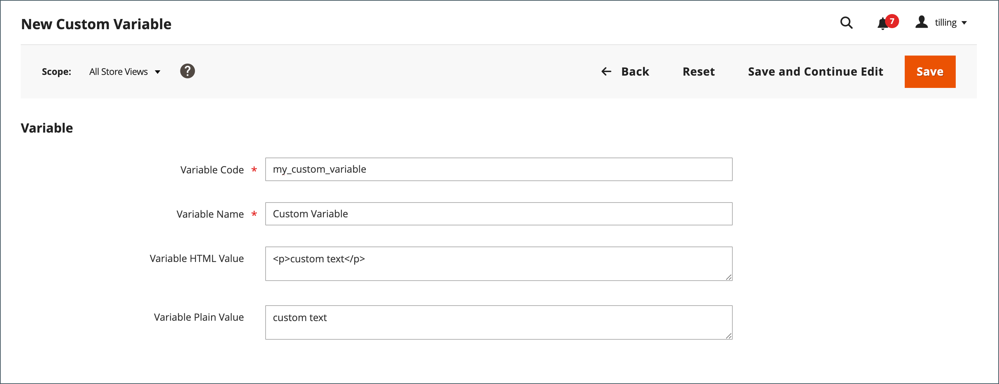

# Lägg till anpassade variabler

För att uppfylla ditt företags specifika behov kan du skapa anpassade variabler och infoga dem i [sidor](../content-design/pages.md), [block](../content-design/blocks.md)och [e-postmallar](email-templates.md). Listan över tillåtna variabler som visas när du klickar på _Infoga variabel_ knappen innehåller båda [fördefinierad](variables-predefined.md) och anpassade variabler. Listan med tillgängliga variabler för en viss e-postmall bestäms av de data som är kopplade till mallen. Se [Variabelreferens](variables-reference.md) för en lista över e-postmallar som används ofta och tillhörande variabler.

{width="600" zoomable="yes"}

>[!NOTE]
>
>Endast tillåtna fördefinierade eller anpassade variabler kan användas i mallar för e-post och nyhetsbrev.

## Steg 1: Skapa en egen variabel

1. På _Administratör_ sidebar, gå till **[!UICONTROL System]** > _[!UICONTROL Other Settings]_>**[!UICONTROL Custom Variables]**.

1. Klicka på **[!UICONTROL Add New Variable]**.

1. Ange en identifierare för **[!UICONTROL Variable Code]**, med alla gemener utan mellanslag.

   Om det behövs kan du använda ett understreck eller ett bindestreck för att representera ett mellanslag. Exempel: `my_custom_variable`

1. Ange en **[!UICONTROL Variable Name]**, som används för intern referens. Exempel: `My Custom Variable`

1. Om du vill ange värdet som är associerat med variabeln gör du något av följande:

   - För **[!UICONTROL Variable HTML Value]** anger du variabelvärdet formaterat med enkla HTML-taggar. Exempel:

     `<b>This formatted content appears in place of the variable.</b>`

   - För **[!UICONTROL Variable Plain Value]** anger du variabelvärdet som oformaterad text utan formatering. Exempel:

     `This unformatted content appears in place of the variable.`

   >[!TIP]
   >
   >Om du behöver mer utrymme drar du i textrutans nedre högra hörn.

   {width="600" zoomable="yes"}

1. När du är klar klickar du på **[!UICONTROL Save]**.

## Steg 2: Infoga den anpassade variabeln i ditt innehåll

Använd [!DNL Page Builder] om du vill infoga en anpassad variabel.

1. Öppna sidan, blocket, kategorin eller produkten där du vill lägga till variabeln i innehållet.

1. Expandera  den **[!UICONTROL Content]** -avsnitt.

1. Klicka på **[!UICONTROL Edit with Page Builder]**.

1. Klicka på i den vänstra panelen **[!UICONTROL Elements]** och gör något av följande:

   - Klicka i ett textområde där du vill infoga variabeln.

   - Dra en ny **[!UICONTROL Text]** objekt till scenen.

1. Klicka på (  ) för att infoga en variabel.

   ![[!DNL Page Builder] scen och panel](./assets/variable-custom-pagebuilder-stage.png){width="600" zoomable="yes"}

1. I listan väljer du den anpassade variabel som du vill infoga och klickar på **[!UICONTROL Insert Variable]**.

   {width="600" zoomable="yes"}

   Variabelidentifieraren visas som en platshållare i redigeraren.

   ![[!DNL Page Builder] stage - variabelplatshållare](./assets/pagebuilder-variable-inserted.png){width="600" zoomable="yes"}

1. När du är klar klickar du på **[!UICONTROL Save]**.
