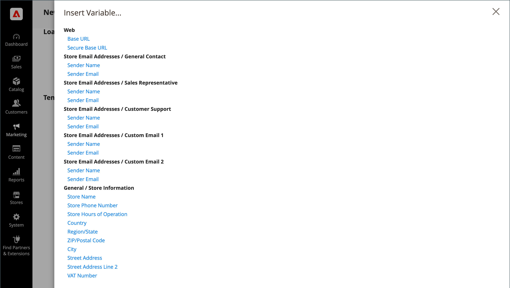

# Använd fördefinierade variabler

[Fördefinierade ](variables-predefined.md)-variabler gör det enkelt att anpassa mallar för [e-post](email-templates.md), [nyhetsbrev](../merchandising-promotions/newsletters.md) och andra typer av innehåll. Listan med tillåtna [fördefinierade](variables-predefined.md) variabler visas när du klickar på knappen Infoga variabel. Som framgår av bilden nedan bestäms listan med tillgängliga variabler för en viss e-postmall av de data som är kopplade till mallen. I [Variabelreferens](variables-reference.md) finns en lista över e-postmallar som används ofta och tillhörande variabler.

{width="700" zoomable="yes"}

## Lägga till en variabel i en e-postmall

1. Gå till **[!UICONTROL Marketing]** > _[!UICONTROL Communications]_>**[!UICONTROL Email Templates]**på sidofältet_ Admin _.

1. Gör något av följande:

   - Om du vill lägga till variabeln i en befintlig mall klickar du på mallen i listan för att öppna den i redigeringsläge.

   - Om du vill använda variabeln i en ny mall klickar du på **[!UICONTROL Add New Template]** och anpassar standardmallkoden. Se [Meddelandemallar](email-template-custom.md#message-templates).

1. Under _[!UICONTROL Load default template]_väljer du den **[!UICONTROL Template]**som du vill anpassa.

1. Klicka på **[!UICONTROL Load Template]** om du vill använda en mall.

   Fältet _[!UICONTROL Currently used for]_visar mallens konfigurationssökväg._[!UICONTROL Template Subject]_ och _[!UICONTROL Template Content]_genereras automatiskt i förhållande till den valda mallen.

   - **[!UICONTROL Template Subject]** - Den här texten visas på ämnesraden i ett e-postmeddelande.

   - **[!UICONTROL Template Content]** - Den här texten visas i det fullständiga innehållet i det skickade e-postmeddelandet.

   {width="600" zoomable="yes"}

1. Ange **[!UICONTROL Template Name]**.

1. Klicka på **[!UICONTROL Insert Variable]** om du vill se en lista över de [fördefinierade](variables-predefined.md) variabler som kan användas med den här e-postmallen.

   Avgör vilken variabel du vill infoga i mallen. Klicka sedan på _Stäng_ (X) i det övre högra hörnet. (Du återgår till det här senare.)

1. Om du vill visa en dummy av mallen klickar du på **[!UICONTROL Preview Template]** i knappfältet.

   När förhandsvisningen öppnas på en ny flik bestämmer du var du vill placera variabeln i förhållande till det andra innehållet. Gå sedan tillbaka till den ursprungliga fliken för att fortsätta.

   {width="600" zoomable="yes"}

1. Placera insättningspunkten där du vill att variabeln ska visas i rutan **[!UICONTROL Template Content]** och klicka sedan på **[!UICONTROL Insert Variable...]**.

1. I listan med tillgängliga variabler klickar du på den som du vill infoga i mallen.

1. Klicka på **[!UICONTROL Save Template]** när du är klar.

## Konvertera mallen till vanlig text

1. Öppna en mall i redigeringsläge.

1. Klicka på **[!UICONTROL Convert to Plain Text]** överst på sidan.

1. När du uppmanas att ta bort taggar klickar du på **[!UICONTROL OK]**.

1. Spara den oformaterade textversionen genom att klicka på **[!UICONTROL Save Template]**.

## Återställ HTML-versionen

1. Klicka på **[!UICONTROL Return HTML Version]** överst på sidan.

1. Klicka på **[!UICONTROL Save Template]** om du vill spara mallversionen för HTML.
